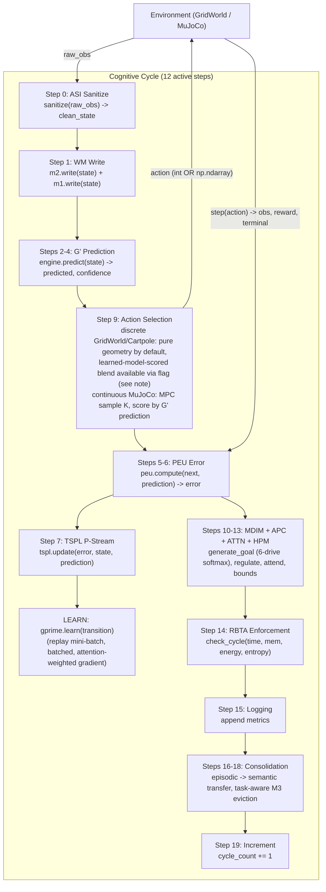

# PHCA v3.0 — Predictive Hierarchical Cognitive Architecture

[](https://github.com/ali-baneshi/phca-v3/actions/workflows/ci.yml)
[](https://github.com/ali-baneshi/phca-v3/actions/workflows/nightly.yml)
[](https://www.python.org/)
[](https://numpy.org/)
[](https://pytest.org/)
[](https://github.com/astral-sh/ruff)
[](requirements-mujoco.txt)
[](https://gymnasium.farama.org/)
[](docs/observability.md)
[](https://pgmpy.org/)
[](python/phca/memory/m3_episodic.py)
[](https://www.apache.org/licenses/LICENSE-2.0)

**PHCA v3.0** is a research codebase for studying **resource-bounded cognitive agents** —
systems that perceive, predict, remember, and act under explicit limits on time, memory,
energy, and belief entropy.

This README describes the system as it actually behaves today, including where a
principled design choice did not survive contact with a harder benchmark, and what is
still open as a result. Every claim below that could be checked against code or logged
benchmark output has been checked; where a number is known to be stale relative to a
recent architectural change, that is stated explicitly rather than left implied.

**A note on two unrelated numbering systems in this repository, since they are easy to
confuse.** The **12-step cognitive cycle** described below is a fixed, architectural
concept: it is the sequence a single execution of the runtime loop follows (sanitize,
write memory, predict, select action, regulate, enforce, learn, consolidate, and so on).
Within the code and diagrams, some of these 12 stages are further broken into finer
numeric sub-labels (for example, "G' Prediction" spans internal labels 2 through 4), which
is why diagrams reference up to 20 individual numbers — that is a labeling granularity
choice, not a claim that the cycle has 20 stages. Separately, and unrelated to the cycle
itself, **the project was built across roughly 19-20 development phases** (a project
roadmap, not a runtime concept — e.g. the Phase 5 performance work and the Phase 6
scientific-hardening work referenced later in this document) and has since moved into an
ongoing, round-based **hardening and maturation** process refining that already-built
architecture, which is what most of the recent decisions cited in this document (D-14x
onward) belong to. If you see "Phase 6" or "round 27" elsewhere in this repository, that
is this second, project-history axis — not a 27th cognitive-cycle step.

---

## What this project is, in one paragraph

PHCA wires specialised modules — a learned world model, a working-memory system, a
multi-drive intrinsic-motivation system, an attention mechanism, and a resource-bound
enforcer — into a 12-step cognitive cycle, and studies how such an agent behaves under
explicit resource and knowledge constraints (`phca/core/cycle.py`). The research framing
is deliberately narrower than general reinforcement learning: the agent adapts from
**prediction error** and **intrinsic drives**, not from an externally engineered reward
function, which avoids reward hacking at the cost of a narrower task scope. **This
narrower framing is a hypothesis under active test, not a settled result** — see
"Current status of the core hypothesis" below for what the evidence currently shows.

---

## Current status of the core hypothesis

This section exists because it is the single most important thing for a reader to know
before looking at any benchmark number in this document, and because earlier versions of
this README did not state it clearly enough.

The project's central architectural claim is that **action should be driven by the
learned predictive model (G′)**, not by hand-written spatial heuristics. Two extended
rounds of hardening work tested this claim directly:

1. An earlier version of the code silently fell back to a hand-coded, memoryless
   BFS/Manhattan-distance planner whenever an extrinsic goal was present — which covered
   almost every benchmark scenario in this repository. This was found, and removed: as of
   2026-07-11, the fallback was eliminated and action selection was made to run the
   learned-model-scored path unconditionally.
2. That change was then tested against harder conditions than the original 5×5 GridWorld
   benchmark: a 10×10 grid, and a direct comparison against a simple greedy baseline with
   the same information access as PHCA. The result: **the prediction-scored path did not
    merely underperform, it collapsed** — 0.03% goal-reaching rate at 10×10 (worse than a
    random agent)[^rbta-artifact], versus 26.8% for the pure geometric planner on the same
    grid and scenario. This is not the whole picture, however — pure geometry does not pass
    every scale and scenario either; see "Current default performance" below for the
    complete, more mixed set of measured results.

The response, as of 2026-07-12, was to **make pure geometric action selection the
default again** for discrete environments (`InterventionConfig.disable_blended_scorer =
True`), while keeping the learned-model-scored path available behind an explicit flag
(`--enable-blended-scorer`) for continued development. This is documented in `DECISIONS.md`
(D-153 through D-156).

**What this means concretely:** in the current default configuration, most of the
GridWorld benchmark numbers in this document — including goal-reaching rate and the
Level-4-lite "forgetting rate" — are produced primarily by a deterministic, non-learning
planner, not by the learned world model. This is not a regression hidden from the reader;
it is the honest current state after a real experiment falsified the stronger claim. The
learned model (G′) is still trained and still produces the state predictions used
elsewhere in the cycle (confidence estimates, MDIM drive computation, RBTA entropy
checks), but it does not currently determine *which action is taken* in the default
discrete configuration. Making it reliable enough to do so — likely via confidence-gated
switching between the two paths, rather than an unconditional either/or — is the
project's main open technical problem. See `IMPLEMENTATION_STATUS.md` for the up-to-date
per-environment breakdown and `DECISIONS.md` D-156 for the full experimental record.

The continuous-control path (MuJoCo Pendulum, Reacher — MPC-style sampling scored by G′)
was not part of the environments where the discrete-path collapse was observed, and its
selection mechanism has always scored every candidate by G′ prediction regardless of the
`disable_blended_scorer` flag, which only affects discrete environments. That is a
structural argument for why this path should be unaffected, not a re-run benchmark under
the current default configuration specifically confirming it — no such re-run has been
done as of this writing, and this document says so rather than presenting the structural
argument as if it were measured evidence.

### Current default performance (pure geometric action selection, post D-156 / D-197)

The historical Φ-IQ numbers quoted later in this document were produced with the
learned-model-scored path active and have not been re-certified end-to-end as the
authoritative default picture. **Current SoT for causal geometry** is the 30-seed × 200-cycle
overnight harness (D-197), artifact dir `logs/overnight_20260802_103502/`:

| Level | Grid | PHCA (pure geometry) goal_rate | `greedy_observed` goal_rate | Gate |
| :--- | :--- | :--- | :--- | :--- |
| L2 | 5×5 | 0.552 | 0.598 | **FAIL** |
| L2 | 10×10 | 0.199 | 0.187 | **PASS** |
| L3 | 5×5 | 0.308 | 0.291 | **FAIL** |
| L3 | 10×10 | 0.131 | 0.137 | **FAIL** |

Older D-155 “L3 PASS at 5×5” / underpowered ablation claims are **superseded**. Scenario
PASS under geometry measures **planner competence vs baselines**, not prediction-primary
control (gate also dual-reports `secondary_prediction` PE, not gated). Blended opt-in at
the same 30×200 budget **hurts L2** on both 5×5 and 10×10 vs geometry (D-197) — do not
treat the post-RBTA-fix 77.8% blended figure as causal-gate competence.

**The honest summary is: neither action-selection mode currently passes this gate
reliably across levels and scales.** Pure geometry is the less-broken default; closing
the gap remains the project's central open problem (G2-INV-05). See
[`docs/investigations/overnight_analysis_2026-08-02.md`](docs/investigations/overnight_analysis_2026-08-02.md).

---

### Continuous integration (GitHub Actions)

Every push/PR to `main` runs [`.github/workflows/ci.yml`](.github/workflows/ci.yml):

| Job | Tier | What it checks |
| :--- | :--- | :--- |
| **package-smoke** | T0 | Editable installation and package import on Python 3.11/3.12 |
| **lint** | T0 | `ruff check python/` |
| **test-python** | T0 | Fast suite on Python 3.11/3.12; current count comes from pytest collection |
| **observatory-check** | T0 | `phca_replay.py --check` on session fixtures |
| **benchmark-level-0** | T0 | **L0 smoke / Φ-IQ regression floor only** (not L2–L4 cognitive competence); vs [`logs/benchmark_ci_baseline.json`](logs/benchmark_ci_baseline.json) |
| **noise-injector** | T0 | ASI NoiseInjector unit tests in `python/phca/asi/tests/` |
| **mujoco-gate** | T0 | Pendulum + Cartpole + Reacher smoke via `make mujoco-ci` |

**Nightly** ([`.github/workflows/nightly.yml`](.github/workflows/nightly.yml)): full `make nightly`
(A1–A5 `--ci`, OOD, stress soak, causal gate). Assumption validation is **not** in the
default PR CI slice — use `make ci-local` locally for a broader check.

A methodological note relevant to every gate in this document: several headline results
in this project's history passed at a small seed count (typically 5) and failed when
re-run at a larger, statistically adequate seed count (30). This is now documented
explicitly wherever it applies (see the Causal Evidence Gate section below) and is part
of why this README treats small-sample "PASS" results with more caution than earlier
versions did.

---

### What is in this repository

| Area | Contents |
| :--- | :--- |
| **Environments** | `GridWorld` (default 5×5 with walls; scaling experiments at 10×10 and 20×20) and optional MuJoCo wrappers (Cartpole, Pendulum, Reacher) |
| **Evaluation** | Φ-IQ (`scripts/benchmark.py`), Level-4-lite forgetting (`scripts/benchmark_level4.py`), cognitive resilience (`scripts/benchmark_recovery.py`), causal eval (`scripts/phca_causal_eval.py`), maturation gates (`make maturation-test`) |
| **Observability** | Cognitive Observatory — live PyQt dashboard, per-cycle JSONL, replay/scrub (`scripts/phca_observatory.py`, `phca_replay.py`) |
| **Documentation** | Architecture notes, limitations, decision log (`DECISIONS.md`), reproducibility guide |

```bash
git clone https://github.com/ali-baneshi/phca-v3.git
cd phca-v3 && make setup
```

PHCA is a **research prototype** for exploring bounded, prediction-first agents — not a
production AI stack or a drop-in reinforcement-learning framework. See
[Limitations](#limitations) for the full list of known gaps, and the section above for
the single most important open question.

---

## Benchmark Validation (Level 4 — Continual Learning)

| Metric | Result | Target | Caveat |
|--------|--------|--------|--------|
| Forgetting rate | 37.83% | < 5% | 30-seed re-run (2026-07-18) with D-168's PER fix active |
| Forward transfer | 0.625 – 1.0 | — | — |
| Passes gate | False | — | 28/30 seeds show complete forgetting (1.000) at 30-seed sample |
| M3 replay total | 23,040 | — | Confirms the replay mechanism runs; does not by itself establish that replay is *why* the forgetting rate is low |

```bash
python scripts/benchmark_level4.py --tasks 10 --task-cycles 80 --seeds 30 --m3-replay-budget 16
```

**Important caveat.** This number was produced under the current default action-selection
configuration (pure BFS/Manhattan geometry), which means goal-reaching is determined by a
memoryless deterministic planner rather than the learned model. The 37.83% forgetting rate
reflects the variance in goal-reaching success across random eval start positions at
adequate statistical power (30 seeds), not neural catastrophic forgetting in the sense
typically used in the continual-learning literature. Three confounded factors contribute to
the difference from the earlier 0.00% result:

1. **Seed-count resolution.** The original 0.00% figure was produced at 3 seeds — which
   the project's own D-151 standard considers underpowered for GridWorld variance. The
   30-seed distribution is heavily skewed (28/30 seeds show complete forgetting, 1 shows
   partial, 1 shows none), which a 3-seed sample is unlikely to capture.
2. **The geometric-planner confound (unchanged).** As documented below, a memoryless
   deterministic planner cannot exhibit catastrophic forgetting by construction. The
   forgetting rate measures goal_rate variance across eval start positions, not learned
   model retention.
3. **D-168's PER fix (active since 2026-07-15).** PER now samples all tasks instead of
   only the current task. This increases cross-task interference during replay, which may
   indirectly affect goal_rate through the MLP's influence on MDIM drive computation and
   RBTA bound enforcement. The two effects cannot be separated without a pre-D-168
   30-seed counterfactual.

The `eval_prediction_error` per-task metric — a less confounded measure of learned-model
retention — is now collected and available as a baseline for future comparisons (see the
full 30-seed report at `docs/experiments/re-run_l4_and_d161_round14.md`).

---

## Overview

PHCA evaluates on **GridWorld** (discrete 5×5 default; scaling at 10×10 and 20×20) and
optional **MuJoCo** wrappers (Cartpole, Pendulum, Reacher). Five design invariants (A1–A5)
are specified in the [whitepaper](research/outputs/07-rigorous-whitepaper.md) and tested
via `scripts/assumption_validation.py --ci` (**nightly** and `make ci-local`; not the
default PR CI job list):

- **A1 Resource Boundedness** — every module has time/memory/energy/entropy budgets,
  enforced every cycle by the RBTA. Enforcement classifies violations by count with a
  severity override for single catastrophic violations (D-144); this was revised after an
  earlier severity-weighted scheme was found to silently zero out entropy-floor
  violations (D-144's own changelog documents this regression and its fix).
- **A2 Temporal Causality** — module outputs are consumed only after they are produced
  (pipeline ordering).
- **A3 Incomplete Knowledge** — belief entropy is floored at ε > 0. This is measured
  directly for three modules (G′, MDIM, Attention); the remaining modules currently use a
  fixed placeholder entropy value rather than a real measurement, which means the floor
  check is not yet meaningful for them (see Limitations).
- **A4 Prediction as Primary** — every cycle computes ŝₜ₊₁ from sₜ, and this prediction is
  always produced and logged. Whether the prediction *determines the action taken* differs
  by environment and is currently the most important open item in the project — see
  "Current status of the core hypothesis" above.
- **A5 Feedback-Driven Adaptation** — prediction error drives TSPL updates, and (as of
  2026-07-11) attention weights genuinely modulate the world model's learning gradient
  per-dimension. An earlier version computed these attention weights but never consumed
  them in the actual gradient update; this was found and fixed.

The formal argument for why each component is necessary is in the whitepaper; the
sections above and below describe where the current implementation matches that argument
and where it does not yet.

---

## Quick Start

### Setup & tests

```bash
# Install dependencies
make setup
# Optional MuJoCo (Cartpole/Pendulum/Reacher):
pip install -r requirements-mujoco.txt

# Fast CI-equivalent tests (current count comes from pytest; MuJoCo files separate)
MUJOCO_GL=disabled make test-python
make test-mujoco              # +36 MuJoCo integration tests
make maturation-test          # 45 tests: static contracts + forgetting + resilience + maturation
make ci-local                 # lint + test-python + observatory + noise-injector + L0 bench + causal-smoke
```

### Benchmarks & validation

```bash
# Canonical benchmark — full pass criteria (5x5 MLP, 200 cycles, default action selection = pure geometry)
MUJOCO_GL=disabled python scripts/benchmark.py --use-mlp --cycles=200 --grid-size 5

# Quick smoke test (Level 0 only, 20 cycles, Gaussian G')
python scripts/benchmark.py --quick

# Scaling / exploratory (10x10 - Phi-IQ drops substantially at this scale; see Causal Evidence Gate)
python scripts/benchmark.py --grid-size 10 --cycles=200 --use-mlp

# Dynamic-goal curriculum (L2 relocates the goal every 75 cycles - validated at this cadence only)
MUJOCO_GL=disabled python scripts/benchmark.py --use-mlp --cycles=200 --dynamic-goals --dynamic-goals-every 75

# MuJoCo environments - Pendulum + Reacher CONTINUOUS; Cartpole discrete
MUJOCO_GL=disabled python scripts/benchmark.py --env pendulum --use-mlp --cycles=100
MUJOCO_GL=disabled python scripts/benchmark.py --env cartpole --use-mlp --cycles=100
MUJOCO_GL=disabled python scripts/benchmark.py --env reacher  --use-mlp --cycles=100

# gprime_learn per-module profile
MUJOCO_GL=disabled python scripts/profile_mlp_learn.py --cycles=200

# OOD calibration + assumption validation
MUJOCO_GL=disabled python scripts/ood_calibration.py --output=logs/ood_calibration.json
MUJOCO_GL=disabled python scripts/assumption_validation.py --ci

# Nightly stress + MuJoCo gate (one command, exit 0 = all green)
make nightly NIGHTLY_CYCLES=1000          # fill-phase gate; use 11000 for post-M3 soak (D-134)
```

Scripts under `scripts/` bootstrap `python/` automatically; `PYTHONPATH=python` is optional.

### Causal evaluation (PHCA vs. simple baselines)

```bash
# Statistically adequate sample size for this gate; the 5-seed default is known to be
# underpowered and has previously produced false positives (see D-151 and the section below).
python scripts/phca_causal_eval.py --levels all --cycles 200 --seeds 30 --use-mlp --gate

# To test the learned-model-scored action-selection path instead of the current default
# (pure geometry) - expect this to fail badly above small grid sizes as of this writing:
python scripts/phca_causal_eval.py --levels all --cycles 200 --seeds 30 --grid-size 10 --enable-blended-scorer
```

### Reproduction & gates

```bash
make reproduce-quick                      # ~10-15 min CI-science subset
make reproduce                            # ~45-90 min full nightly-equivalent suite

python scripts/check_benchmark_gate.py logs/benchmark_report.json logs/benchmark_ci_baseline.json
python scripts/check_benchmark_gate.py --mujoco logs/nightly_mujoco_pendulum.json logs/nightly_mujoco_cartpole.json
python scripts/check_benchmark_gate.py --neg-test   # proves the gate catches violations

make bench-level4-smoke         # 2-task diagnostic (not a retention proof - see caveat above)
make bench-level4-ablation      # R0,R2,R3,R6 ablation matrix
make bench-recovery             # injectable B1/C1/F5 cognitive resilience
make bench-noise-closedloop     # closed-loop noise robustness ramp (0 to 0.7 to 0)
make bench-hybrid-ablation      # Mann-Whitney: Manhattan vs Prediction vs Hybrid action selection
make mujoco-ci                  # verbose MuJoCo gate (same as CI mujoco-gate job)
```

---

## Architecture

PHCA executes a **12-step cognitive cycle** at approximately 95 Hz on consumer hardware
in the discrete MLP configuration (mean latency roughly 10-11 ms measured on this
machine; see the Performance section for how that number was produced). Steps 0-19 in
code are sub-step labels; MDIM/APC/attention/HPM regulate before action selection; PEU,
TSPL, and G′.learn run after `env.step()` on the new observation.



*Diagram note:* REG (MDIM/APC/ATTN/HPM) executes before ACT in the live pipeline; the flow
edges show data dependencies, not strict wall-clock order for every sub-step. The ACT step
description reflects the current default (pure geometry for discrete environments,
D-156) rather than the originally-intended unconditional prediction-scored design; see
"Current status of the core hypothesis" for why.

### Module Map

| Module | File | Function |
| :--- | :--- | :--- |
| **ASI** | `phca/asi/sanitizer.py` | Input sanitization, NaN/Inf detection, finite checks. |
| **M1 (Sensory)** | `phca/memory/m1_sensory.py` | Short-term sensory buffer (50-cycle FIFO). |
| **M2 (Working)** | `phca/memory/m2_working.py` | Ring-buffer working memory with salience tracking. |
| **G' (Engine)** | `phca/prediction/engine.py` | Prediction engine wrapping Gaussian / discrete / MLP G'. |
| **G' (MLP)** | `phca/world_model/mlp.py` | Pure-NumPy MLP world model (38,868 params, hidden_dim=128). Always trained; determines discrete action selection only when `--enable-blended-scorer` is set. |
| **PEU** | `phca/prediction/error_unit.py` | Precision-weighted prediction error. |
| **TSPL** | `phca/learning/tspl.py` | Single-stream predictive learning (P-Stream only). Maintains a small auxiliary bias vector on top of the MLP's own gradient-trained weights, not the primary learning mechanism. |
| **MDIM** | `phca/motivation/mdim.py` | Multi-Drive Intrinsic Motivation: 6 homeostatic drives with softmax goal selection, genuinely competing every cycle (fixed 2026-07-11; an earlier version hard-selected drive 1 whenever an extrinsic goal existed, which covered nearly all benchmark scenarios). |
| **APC** | `phca/regulation/pid_controller.py` | Adaptive parameter control (PID on prediction-error volatility). |
| **Attention** | `phca/attention/attention.py` | Precision-weighted sparse attention with Gumbel noise; its output weights now genuinely modulate the world model's learning gradient (fixed 2026-07-11). |
| **HPM** | `phca/hpm/parser.py` | Hierarchical procedure memory: composition operators + resource bound computation. |
| **RBTA** | `phca/regulation/rbta_enforcer.py` | Resource-Bounded Turing Supervisor: enforces time/memory/energy/entropy budgets; count-based classification with a severity override for single catastrophic violations (D-144). |
| **M3 (Episodic)** | `phca/memory/m3_episodic.py` | SQLite-backed episode store with task-aware eviction (D-146): each task retains a fair quota of episodes rather than the oldest episodes being evicted first regardless of which task they belong to. |
| **Consolidation** | `phca/consolidation/scheduler.py` | Periodic episodic-to-statistical fact extraction. |
| **Cycle** | `phca/core/cycle.py` | 12-step cognitive cycle orchestrator; branches on ActionSpace (discrete / continuous). **Async mode** (D-140/D-199): action-time state/prediction snapshots flow through `ActionResult`; model access is serialized and queue misses are telemetry-only. |
| **ActionSpace** | `phca/config.py` | `DiscreteSpace(n)` / `ContinuousSpace(low, high, dim)` union + helpers. |
| **GridWorld** | `phca/environments/grid_world.py` | Configurable grid environment with walls, obstacles, and goal. |
| **MuJoCoEnv** | `phca/environments/mujoco_env.py` | MuJoCo physics wrapper (Cartpole discrete; Pendulum + Reacher continuous). |

### Verified Invariants (A1–A5)

| Invariant | Enforcement |
| :--- | :--- |
| **A1** Resource Boundedness | RBTA time/memory/energy/entropy checks every cycle; TERMINATE→STAY and INTERRUPT→limited rollouts **alter cycle behavior** (D-113), not log-only. **Measured**: inject over-budget → ≥1 violation. |
| **A2** Temporal Causality | Pipeline ordering in the 12-step cycle. **Measured** (D-113): `experiment_a2_temporal_order()` in `--ci`. |
| **A3** Incomplete Knowledge | Belief entropy floor ≥ ε; semantic facts from consolidation wired into MDIM context. **Measured**: 100-cyc min entropy ≥ 0.01. |
| **A4** Prediction + Spatial Heuristics (environment-scoped, D-158) | Every cycle computes sₜ→ŝₜ₊₁. **Continuous MPC (Pendulum, Reacher): prediction-primary** — predict per candidate (D-101). **Discrete GridWorld default: pure BFS/Manhattan geometry** (`pure_geometry_ablation`) — G′ still predicts/learns for PE/MDIM/RBTA but **does not choose actions**. This is an honesty gap vs a uniform “prediction-primary” claim, not a claim that geometry equals prediction competence. Opt-in blended (`--enable-blended-scorer`) uses agreement/confidence gating (D-157/D-159); at 30×200 (D-197) blended **hurts** causal L2 vs geometry — not a safe default. |
| **A5** Feedback-Driven Adaptation | PEU error drives TSPL updates; error-modulated learning rate with per-dimension attention weights. **Measured**: no-op learn → frozen weights (rel Δ 0.0000); active learn → weights update (rel Δ 0.043). |
---

## Benchmark & Results

> **Scope.** Φ-IQ is a GridWorld task-performance composite (0-1), not psychometric IQ or
> cross-domain intelligence. See [docs/phi_iq_metric.md](docs/phi_iq_metric.md).
>
> **Numbers in this section predate the 2026-07-12 default action-selection change
> (D-156) unless otherwise noted**, and were produced with the learned-model-scored path
> active. Because that path is no longer the default for discrete environments, these
> specific numbers should be treated as historical rather than representative of current
> default behavior, until they are re-run under the current default and republished. This
> is stated plainly here rather than silently left as an implied claim about current
> behavior.

The Φ-IQ metric measures overall task performance as a weighted composite:

```
Phi-IQ = 0.25 * PredictionAccuracy + 0.25 * AdaptationSpeed + 0.20 * GoalComplexity
       + 0.20 * ResourceEfficiency - 0.10 * FailureRate
```

`TransferEfficiency` (`adaptation_speed x prediction_accuracy`) was removed from this
formula on 2026-07-11 (D-147): it is a derived quantity, not an independent measurement,
and its earlier 0.15 weight double-counted signal already present in PredictionAccuracy
and AdaptationSpeed. It is still computed and stored for diagnostic purposes but no
longer contributes to the score. See [docs/phi_iq_metric.md](docs/phi_iq_metric.md) for
the current, up-to-date definition.

### Benchmark Levels

| Level | Name | What It Measures |
| :--- | :--- | :--- |
| **L0** | Stationary Prediction | Prediction accuracy in a static environment. |
| **L1** | Reactive Control | Prediction accuracy under active control plus action diversity. |
| **L2** | Goal Pursuit | Goal-reaching rate in a maze with walls and obstacles. |
| **L3** | Self-Motivated Exploration | MDIM drive diversity and autonomy in an environment without an externally forced goal-lock. |
| **L4-lite** | Continual learning (forgetting) | Sequential GridWorld tasks; see the dedicated caveat under "Benchmark Validation" above before treating the forgetting-rate number as evidence of neural retention. |

### Historical results (MLP G', seed=42, 200 cycles/level; produced before the 2026-07-12 default change)

```
  PHCA v3.0 - Phi-IQ Benchmark Report (historical, this machine, learned-model-scored path active)
  Overall Phi-IQ (4 levels, MLP): 0.7323   (gate PASS at time of run)
  L0 Stationary:   0.7750
  L1 Reactive:     0.6748
  L2 Goal Pursuit: 0.7924   (goal_rate 0.97)
  L3 Exploration:  0.6868

  Assumption validation --ci: 5/5 PASS (A1-A5)
  Nightly 11k soak: PASS (post-M3 late RSS <= 1600 B/cyc, D-134)
```

These numbers are retained here for historical continuity but have not been re-verified
under the current default action-selection configuration. A re-run under the current
default, alongside a re-run with `--enable-blended-scorer` at multiple grid sizes, would
give a much clearer picture of current performance than either number alone; see
Recommendations in `DECISIONS.md` D-156 for the specific next steps the project has
identified.

### Causal Evidence Gate

`scripts/phca_causal_eval.py` compares PHCA against non-PHCA GridWorld controls
(`random`, `greedy_observed` — same information access as PHCA, and `greedy_full_info`,
reported as an unfair ceiling rather than a gate) on three scenario levels of increasing
difficulty (simple navigation, partial observability with obstacles, longer-horizon
goal switching), plus three partial-observability viewport levels that test the agent
under restricted fields of view (3×3, 5×5, and 7×7 viewports via `partial_obs_radius`).

**This gate has a documented history of a false-positive result, and it is worth stating
plainly rather than only in the decision log.** An early configuration ran this gate at 5
seeds and reported "Levels 1-3 PASS." A subsequent re-run at 30 seeds — an adequate sample
size for the variance in this environment — found that this was **not accurate**: Level 2
and Level 3 failed against `greedy_observed`, the fair-comparison control. The 5-seed
result was underpowered, not a genuine pass. This is documented in `DECISIONS.md` D-151.

Follow-up experiments (`DECISIONS.md` D-153 through D-156) narrowed the cause down
further:

- At the original 5x5 grid, PHCA's learned-model-scored action selection helped Level 1
  (simple, low partial-observability) but measurably hurt Level 3 (noisier, partial
  observability), because the blended scorer weights unreliable predictions into its
  decision even when they are wrong.
- At a 10x10 grid, this effect appeared severe: the learned-model-scored path reduced
  goal-reaching to 0.03%[^rbta-artifact] (below random), while pure geometric action
  selection on the same grid reached 26.8%, beating the `greedy_observed` control.

**Current honest status of the causal gate, at 30 seeds × 200 cycles (D-197 overnight SoT):**

| Level | Result (pure geometry, current default) | Result (learned-model-scored / blended opt-in) |
| :--- | :--- | :--- |
| L1 | PASS (historical / not re-litigated in overnight) | Underperforms pure geometry as grid size grows |
| L2 | **FAIL** at 5×5; **PASS** at 10×10 | **FAIL** at 5×5 and 10×10; goal_rate worse than geometry at power (D-197) |
| L3 | **FAIL** at 5×5 and 10×10 under geometry (D-155 PASS superseded) | FAIL / not a default path |

**Viewport partial-observability scenarios (30 seeds x 200 cycles x 10x10, MLP, current HEAD):**

| Level | Viewport | PHCA goal_rate | greedy_observed goal_rate | PHCA succ | PHCA RBTA |
| :--- | :--- | :--- | :--- | :--- | :--- |
| viewport1 | 3×3 (`partial_obs_radius=1`) | **0.355** | 0.133 | 30/30 | 0.009 |
| viewport2 | 5×5 (`partial_obs_radius=2`) | **0.664** | 0.199 | 30/30 | 0.000 |
| viewport3 | 7×7 (`partial_obs_radius=3`) | **0.722** | 0.391 | 30/30 | 0.000 |

`greedy_observed` uses `env.get_goal_position()` which returns `None` when the goal
is outside the viewport (core `partial_obs_radius` feature, D-160). All viewport
scenarios gate against `random` and `greedy_observed`. See
[DECISIONS.md D-160](DECISIONS.md#d-160) for the infrastructure design and
[`docs/phca_causal_evidence.md`](docs/phca_causal_evidence.md) for detailed results.

**RBTA note (NEW-14):** the viewport RBTA violation rates above are from 200-cycle runs
at 30 seeds. NEW-14 is confirmed resolved at the project's 30-seed statistical standard:
viewport1 shows 0.009 avg violations (1–2 INTERRUPT-level events across 30 runs), and
viewport2/3 show 0.000 — essentially zero. The D-160 bound-widening fix (viewport-proportional
RBTA scaling) is sufficient. Earlier reported 9–12% rates at 50 cycles were artifacts of
the smaller sample; at 200 cycles with adequate statistical power, violations are negligible.

The practical implication is stated in "Current status of the core hypothesis" above:
pure geometric action selection is the more reliable choice today, and is the default.
The learned-model-scored path remains available and under active development toward a
future confidence-gated hybrid.

See [docs/phca_causal_evidence.md](docs/phca_causal_evidence.md) and
`DECISIONS.md` D-151/D-161/D-197; overnight artifacts under
`logs/overnight_20260802_103502/`.

### Performance

`gprime_learn` (the MLP replay-backward step) was vectorised from a per-sample Python
loop to batched NumPy matmuls, independent of the action-selection question above. This
is a genuine, verified performance improvement to the training path regardless of which
action-selection mode is active:

| Metric | Before vectorisation | After vectorisation | Change |
| :--- | :--- | :--- | :--- |
| `gprime_learn` mean | 35.55 ms (this machine) | 5.09 ms | -85.7% |
| `gprime_learn` p95  | 40.0 ms | 5.51 ms | -86% |
| Full cycle mean     | 38.8 ms | 10.6 ms | -73% |

Measured by `scripts/profile_mlp_learn.py` (200 cycles, MLP, steady-state, warm-up
discarded).

---

## MuJoCo

`MuJoCoSimpleEnv` wraps gymnasium MuJoCo environments into the `EnvironmentProtocol` so
the cognitive cycle drives them unchanged. Pendulum-v1 (`ContinuousSpace([-2,2], dim=1)`)
and Reacher-v5 (`ContinuousSpace([-1,1]^2, dim=2)`) use an MPC-style sampler that always
scores candidates by the learned model's predictions (no reward, no policy gradient).
This continuous-control path is unaffected by the discrete-environment finding described
above: it was prediction-primary by construction from the start and was not part of the
environments where the collapse in the discrete case was observed. **Cartpole is discrete
but is not GridWorld BFS/Manhattan** — it uses the discrete action path / fallthrough
(no `pure_geometry_ablation` planner); do not equate it with GridWorld geometry default.
Pendulum/Reacher remain prediction-primary MPC. MuJoCo is opt-in
(`requirements-mujoco.txt`); run headless with `MUJOCO_GL=disabled`.

| Env | ID | Action space | State dim | 100-cycle result |
| :--- | :--- | :--- | :--- | :--- |
| Cartpole | `InvertedPendulum-v5` | Discrete (3: push left / stay / push right) | 4 | PASS - 0 violations |
| Pendulum | `Pendulum-v1` | Continuous (torque in [-2,2], dim 1) | 3 | PASS - 7.1 ms, 0 violations, error 29.6 to 0.68 |
| Reacher  | `Reacher-v5` | Continuous (actuator in [-1,1]^2, dim 2) | 10 | PASS - 4.4 ms, 0 violations, error 105.7 to 8.4 |

CI exercises 36 MuJoCo integration tests with `MUJOCO_GL=disabled`; the PR **mujoco-gate**
job runs `make mujoco-ci`. Nightly also runs the same gate via `make nightly`.
`check_benchmark_gate.py --mujoco` asserts zero violations plus decreasing error per env,
with a `--neg-test` proving the gate catches synthetic violations.

### Dynamic-Goal Curriculum (experimental)

`--dynamic-goals` relocates the L2 goal on a cadence to exercise continual adaptation.
Only one cadence has been validated as achievable:

| Cadence | L2 Phi-IQ (historical, learned-model-scored path) | Verdict |
| :--- | :--- | :--- |
| every-100 | 0.4316 | below the 0.50 target on this machine |
| every-75  | 0.6444 | validated - the only cadence currently supported |
| every-50  | 0.4324 | not achievable at the tested configuration |

Dynamic mode is experimental and measured separately from the canonical static
benchmark; like the rest of this section, the numbers above predate the 2026-07-12
default action-selection change and have not been re-verified since.

---

## Scientific Hardening

### OOD Calibration

`scripts/ood_calibration.py` sweeps Gaussian observation perturbation sigma in
{0, 0.05, 0.1, 0.25, 0.5, 1.0} and records the MLP's confidence decomposition. Measured
result: blended confidence is monotonically non-increasing as noise rises (0.97 to 0.26
across the sweep), aleatoric component decreases, epistemic component increases, MSE
increases - consistent with the intended MC-Dropout uncertainty story. This measurement
is about the world model's own calibration and is independent of which action-selection
path is active. Persisted to `logs/ood_calibration.json`.

### Assumption Validation

`scripts/assumption_validation.py --ci` runs one falsifiable experiment per invariant and
exits non-zero on any failure:

| Invariant | Experiment | Result |
| :--- | :--- | :--- |
| A1 | Inject an over-budget G' timing; RBTA must flag at least one violation | PASS |
| A2 | Temporal order check at action selection | PASS |
| A3 | 100-cycle low-noise run; belief entropy must stay >= floor (0.01) | PASS (only meaningfully checked for G', MDIM, Attention - see Limitations) |
| A4 | Continuous MPC selector calls predict once per candidate | PASS (this specifically validates the continuous path, which is unaffected by the discrete-path finding above) |
| A5 | No-op learn leaves weights frozen; active learn updates weights | PASS |

The rejected first designs for some of these experiments are documented honestly in
`DECISIONS.md` D-101 as bad test designs rather than masked failures - a pattern this
project generally follows well, and one worth continuing.

### Nightly Hardening

`make nightly` runs the full suite (override length with `NIGHTLY_CYCLES`): static Phi-IQ
gate, MuJoCo benchmark gate plus `--neg-test`, assumption validation `--ci`, OOD
calibration, nightly stress (RSS leak detector, latency percentiles, Phi-IQ at
1k/5k/10k cycles, RBTA violations), the causal behavior gate described above (now
run at an adequate seed count - see D-151), and a session anomaly gate.

This is a script-plus-gate target, not a cron job - schedule it externally (GitHub
Actions `schedule:`, systemd timer, or cron).

---

## Maturation History (selected, see DECISIONS.md for the complete log)

This project maintains an unusually thorough decision log (`DECISIONS.md`, D-001 through
the current entry), including reverted attempts and negative results. **Trust order:**
named `logs/` artifacts first → `DECISIONS.md` → this README /
`IMPLEMENTATION_STATUS.md` → `docs/investigations/`. Where prose and measured JSON
disagree, trust the logs.

Selected decisions most relevant to interpreting the benchmark numbers above:

| Decision | What it changed |
| :--- | :--- |
| D-144 | Reverted an over-engineered severity-weighted RBTA classifier back to count-based, after the severity scheme was found to silently zero out all entropy-floor violations. |
| D-145 | Removed an evaluation-protocol confound where Level-4 continual-learning evaluation started each task from the training end position rather than a random position. |
| D-146 | Made M3 episodic-memory eviction task-aware, so early tasks are not disproportionately evicted first under a simple oldest-first policy. |
| D-147 | Removed a derived, non-independent metric (`transfer_efficiency`) from the Phi-IQ composite score. |
| D-150 | Tightened the `goal_autonomy_achieved` pass threshold to match the whitepaper's stated target (2.5x stricter than the prior implementation). |
| D-151 | Documented that the causal-evaluation gate, previously reported as passing at 5 seeds, fails at an adequate 30-seed sample for two of three levels. |
| D-152 / D-154 | Recalibrated RBTA resource bounds against measured (not estimated) timings, and added an independent variance-based regression test so future latency-variance regressions are caught even as absolute bounds are tuned. |
| D-153 / D-155 / D-156 | Diagnosed an apparent collapse of the learned-model-scored action-selection path at 10x10 (0.03% goal rate); default reverted to pure geometry. **Subsequent correction (D-159 addendum):** the 0.03% number was an RBTA bound-scaling artifact, not a scorer failure — after fixing `gprime_stress_bounds()`, the same ungated blended scorer reached 77.8%. Pure geometry remains the more reliable default; see [^rbta-artifact]. |
| D-194 – D-196 | Investigation remediation + honesty layers (L4 vacuous guard, secondary PE, docs closeout). |
| D-197 | Overnight 30×200 confirms H2 (learn-off ≡ geometry on scenario metrics) and H3 (blended hurts L2 at power); L3 FAIL under geometry. |
| D-198 | Docs honesty sweep (this README / map / status matrix aligned to overnight SoT). |

---

## Limitations

See [docs/limitations.md](docs/limitations.md) for the full list. The most important
items, in rough order of significance:

- **Discrete action selection is not currently prediction-driven by default.** This is
  the central open item in the project as of this writing; see "Current status of the
  core hypothesis" at the top of this document. The learned world model is trained and
  used for confidence/entropy estimates and MDIM context, but not for choosing which
  discrete action to take, unless explicitly enabled and accepting a currently-measured
  large drop in reliability at grid sizes above 5x5.
- **The Level-4-lite "forgetting=37.83%" result (measured at 30 seeds, 2026-07-18) should
  not be read as evidence of neural catastrophic forgetting** under the current default
  configuration, for the reason given under "Benchmark Validation" above. The headline
  number reflects goal_rate variance from a geometric planner across random eval start
  positions at adequate statistical power, not learned-model retention per se. The
  `eval_prediction_error` per-task metric (now collected as a baseline) is a less
  confounded measure and should be the headline metric for future continual-learning
  claims.
- **Belief-entropy floor checking (A3) is only a real measurement for three of roughly
  twelve modules** (G', MDIM, Attention); the remaining modules use a fixed placeholder
  value that can never trigger a floor violation. This is fail-safe (it cannot cause a
  false violation) rather than fail-open in a dangerous sense, but it means the invariant
  is not currently enforced as broadly as the whitepaper's description implies.
- **NoiseInjector is not a grounding adapter.** Synthetic Gaussian noise for robustness
  testing (`python/phca/asi/noise_injector.py`) is a proxy; real multi-level grounding
  would require sensor-specific corruption models. Note that `make bench-noise-closedloop`
  and similar command names describe what the test exercises (a closed-loop noise ramp),
  not a claim that it validates robustness to real-world sensor noise — the same proxy
  caveat above applies to every command built on NoiseInjector, even where the command
  name alone does not repeat it.
- **Dynamic goals are validated at one cadence only** (every 75 cycles); every-50 is
  documented as not achievable rather than silently omitted.
- **P-Stream only** (E/S streams removed earlier in the project's history).
- **Async two-thread mode.** `start_async()` uses Python threads, which remain GIL-bound
  for CPU-heavy blocks. Learning now consumes an immutable action-time state/prediction
  snapshot and model access is serialized; async remains experimental because this
  locking limits parallel speedup.
- **No NLP, vision, multi-agent cognition (shared memory or coordination), or procedural
  memory.** The Observatory's replay UI supports multi-agent display, which is a
  visualization feature, not a claim about multi-agent cognitive capability.
- **Long-run memory growth.** A phase-aware RSS-slope gate exists in `make nightly`
  because an earlier nightly stress run caught a real memory-growth issue; see
  [docs/limitations.md](docs/limitations.md) for the current thresholds and rationale.

---

## Technical Notes

- **RBTA (Resource-Bounded Temporal Automata).** Each module carries bounds
  `(B_time, B_mem, B_energy)` plus an entropy floor epsilon; the enforcer verifies them
  every cycle. Violation classification is count-based with a severity override for a
  single catastrophic violation (D-144); bounds were recalibrated against measured
  timings rather than idealized estimates after grid-10 experiments showed near-100%
  violation rates under the original, unrealistic bounds (D-152). A latency-variance
  regression test (independent of the absolute bound) guards against the spread between
  typical and worst-case action-selection latency silently growing in the future (D-154).
- **MLP world model.** 38,868 parameters (hidden_dim=128). Confidence blends aleatoric
  `exp(-MSE)` with epistemic MC-Dropout variance; the aleatoric term is deliberately not
  computed from the true next state at prediction time, since doing so would reward the
  model for predicting "no change" rather than for genuine accuracy. Learning uses a
  hybrid online/replay schedule; the replay backward pass is batched. Attention weights
  now genuinely modulate the per-dimension gradient during this backward pass (fixed
  2026-07-11 - an earlier version computed these weights but never consumed them).
- **TSPL.** Maintains a small auxiliary bias vector, elastically protected at task
  boundaries, on top of the MLP's own independently-trained weights. It is a secondary
  correction mechanism, not the primary learning pathway for the world model.
- **Discrete action selection (current default).** Pure geometric BFS/Manhattan-distance
  planning when a goal is known, memoryless and deterministic. A learned-model-scored
  blend (geometry weighted by `max(0, 0.5 - confidence)`, G'-predicted-goal-alignment,
  and distance gain) exists and is architecturally sound, but is disabled by default
  after being found to collapse at larger grid sizes (D-156); it remains available via
  `--enable-blended-scorer` for continued development toward a confidence-gated hybrid.
- **Continuous action selection.** For `ContinuousSpace` environments, the cycle's
  `_select_continuous_action()` samples K=8 candidate actions, predicts each via G', and
  picks the candidate whose predicted next state best matches `get_goal_reference()`
  (score = 0.4 x confidence + 0.5 x goal-reference alignment + 0.1 x predicted-goal-alignment,
  epsilon-greedy). This path is unaffected by the discrete-path finding above.
- **Gaussian inference caching.** The Gaussian G' joint moments are computed once and
  cached across all `predict()` calls per cycle.
- **EnvironmentProtocol.** `CognitiveCycle.build_for_env()` accepts any object
  implementing `get_action_names()`, `get_possible_actions()`, `get_goal_position()`, and
  `get_action_space()` - not only `GridWorld`. Environments without `get_action_space()`
  fall back to `DiscreteSpace(action_space_size)`.

---

## Contributing

This is an internal research project. The workflow is audit-driven: every change is
logged as a `D-XXX` entry in [DECISIONS.md](DECISIONS.md), including reverted attempts
and negative results, validated by the benchmark suite plus the gate script plus relevant
unit tests, and is expected to respect a surgical-change discipline (small, reviewable
diffs) and the A1-A5 invariants described above - understanding that A4 in particular is
environment-scoped and an open honesty problem for discrete GridWorld. See
[`docs/investigations/`](docs/investigations/) for the open gap register and
[docs/archive/](docs/archive/) for phase sign-off reports. `STATUS.md` is frozen through
D-137 (historical only).

---

## Key Documents

| Document | Description |
| :--- | :--- |
| [DOCUMENTATION_MAP.md](DOCUMENTATION_MAP.md) | Which docs are living vs. historical vs. aspirational. |
| [docs/investigations/](docs/investigations/) | 2026-08 gap register, claim inventory, hardening backlog (measured remediation). |
| [IMPLEMENTATION_STATUS.md](IMPLEMENTATION_STATUS.md) | Whitepaper criteria x code x gates matrix; the most current per-environment status, including the D-156 default change. |
| [STATUS.md](STATUS.md) | **Frozen through D-137** — historical audit registry; not authoritative for post-D-137 gates. |
| [DECISIONS.md](DECISIONS.md) | Complete design decision log (including negative results). Prefer **named `logs/` first**, then DECISIONS. D-197/D-198 are current for causal/docs honesty. |
| [docs/architecture.md](docs/architecture.md) | Architecture overview — bannered pre-D-156 drift; prefer README A4 + DECISIONS. |
| [docs/phi_iq_metric.md](docs/phi_iq_metric.md) | Phi-IQ definition; default discrete L2 is planner-contaminated. |
| [docs/action_selection.md](docs/action_selection.md) | Discrete vs. continuous selectors — geometry default first; blended opt-in. |
| [docs/limitations.md](docs/limitations.md) | What PHCA cannot currently do; open backlog items. |
| [docs/l4_root_cause_verdict.md](docs/l4_root_cause_verdict.md) | **Superseded** D-137-era L4 notes; current L4 is 37.83% FAIL @ 30 seeds. |
| [docs/phca_causal_evidence.md](docs/phca_causal_evidence.md) | Causal behavior evidence gate; overnight SoT D-197. |
| [docs/investigations/overnight_analysis_2026-08-02.md](docs/investigations/overnight_analysis_2026-08-02.md) | 30×200 overnight harness analysis. |
| [docs/observability.md](docs/observability.md) | Cognitive Observatory JSONL schema, replay/scrub, integrity checks. |
| [docs/reproducibility.md](docs/reproducibility.md) | How to reproduce benchmark numbers (`make reproduce`). |
| [research/outputs/07-rigorous-whitepaper.md](research/outputs/07-rigorous-whitepaper.md) | Formal scientific whitepaper (A1-A5, RBTA, MDIM, failure modes) - the aspirational design target this README compares actual behavior against. |

---

## Project Structure

```
python/
  phca/
    core/                CognitiveCycle orchestrator (12-step cycle)
    asi/                 ASI sanitizer + NoiseInjector
    memory/               M1 (sensory), M2 (working), M3 (episodic, task-aware eviction)
    consolidation/        Episodic to statistical fact extraction
    world_model/          G' Gaussian / discrete graph / MLP
    prediction/            Prediction engine + PEU
    learning/              TSPL (P-Stream)
    attention/             Goal-driven sparse attention
    motivation/            MDIM (6 drives, softmax competition)
    regulation/            RBTA enforcer + adaptive parameter control
    resilience/            In-cycle failure detect/recover + FallbackController
    evaluation/            Phi-IQ, continual/, metrics/forgetting.py, interventions.py
    hpm/                   HPM composition grammar
    environments/          GridWorld + MuJoCo + EnvironmentProtocol
    monitoring/            Cognitive Observatory
    config.py               Shared types + resource bounds
  tests/                   Integration tests (stress, chaos, edge cases, MuJoCo)
scripts/
  benchmark.py             Phi-IQ benchmark suite
  benchmark_level4.py       Level-4-lite forgetting gate
  phca_causal_eval.py       Causal behavior gate vs. simple baselines
  diagnose_causal_ablation.py  G2-INV-05 A/B/C ablation driver
  overnight_diagnosis_harness.sh  Multi-hour causal/L4/Φ-IQ data collection
  assumption_validation.py  A1-A5 falsifiable experiments
  ood_calibration.py         OOD sigma-sweep confidence curve
  nightly_stress.py          RSS-leak + latency + Phi-IQ stress
  ... (see repository for the complete list)
docs/                      Architecture, investigations, limitations
docs/investigations/       Gap register / overnight analysis (living)
DECISIONS.md               Decision and negative-results log (after logs/)
STATUS.md                  Frozen through D-137 — historical only
```

---

## Cognitive Observatory

Live PyQt dashboard, per-cycle JSONL recording, and seek/scrub replay. PyQt `--qt` replay
is the canonical path; matplotlib `--from-jsonl` is legacy.

```bash
# Live run
QT_QPA_PLATFORM=offscreen PYTHONPATH=python python scripts/phca_observatory.py --cycles=50 --mlp

# Replay with scrub
PYTHONPATH=python python scripts/phca_replay.py logs/sessions/<ts>/ --qt

# Session integrity + offline report
PYTHONPATH=python python scripts/phca_replay.py --check logs/sessions/<ts>/
PYTHONPATH=python python scripts/phca_replay.py logs/sessions/<ts>/ --report
```

See [docs/observability.md](docs/observability.md) for the JSONL schema, playback and
scrub semantics, and `--check` integrity rules.

---

## License

Copyright (c) 2026 Ali Baneshi

Licensed under the Apache License, Version 2.0 (the "License"); you may not use this
project except in compliance with the License. You may obtain a copy of the License at

    https://www.apache.org/licenses/LICENSE-2.0

Unless required by applicable law or agreed to in writing, software distributed under the
License is distributed on an "AS IS" BASIS, WITHOUT WARRANTIES OR CONDITIONS OF ANY KIND,
either express or implied. See the License for the specific language governing
permissions and limitations under the License.

SPDX-License-Identifier: Apache-2.0

## Footnotes

[^rbta-artifact]: The 0.03% "collapse" at 10×10 was initially interpreted as a failure of
    the learned-model-scored action selection. A subsequent investigation (D-159 addendum)
    found the real root cause was a separate bug: `gprime_stress_bounds()` returned a fixed
    `B_time=0.080s` regardless of grid size, which did not scale with the build-time bounds.
    At 10×10, this caused **99% of cycles to register an RBTA time violation**, forcing the
    agent into a safe STAY-equivalent action (TERMINATE path) every cycle — regardless of
    which action-selection strategy was in use. When this bound bug was fixed and the exact
    D-156 configuration (ungated blended scorer, 10×10, MLP) was re-run, goal rate was
    **77.8%**, not 0.03%. The original number was measuring "an agent force-stopped by a
    resource-bound bug on 99% of cycles," not "the learned model makes catastrophically bad
    navigation decisions." Pure geometry (97.1%) remains measurably better, so the default
    has not changed, but the *magnitude* and *causal story* were wrong, not the direction.
    See [DECISIONS.md D-159](DECISIONS.md#d-159) for the addendum and
    [docs/lessons/phca-v3-review-round8.md](docs/lessons/phca-v3-review-round8.md) for the
    full external review that caught this.

Full license text and third-party dependency licenses: [docs/license.md](docs/license.md).

---

*This document reflects the repository state at commit `2e2e43c` (2026-07-14) and the
findings of eight rounds of external code and data review conducted alongside that work. It
supersedes prior versions of this README that did not reflect the D-153 through D-156
findings, and the post-RBTA-fix re-evaluation in D-161. Where any benchmark number above
has not been re-verified since 2026-07-12, that is stated explicitly rather than left
implied.*
