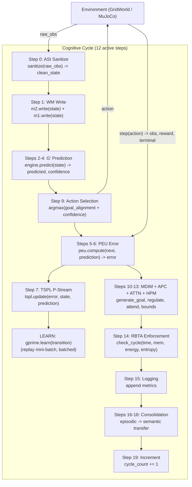

# PHCA v3.0 — Predictive Hierarchical Cognitive Architecture

A formally specified, resource-bounded cognitive architecture for continual
learning, intrinsic motivation, and self-regulated autonomous agents. Each
cognitive cycle transforms raw sensor input into a goal-directed action
through a pipeline of specialised modules, governed by a Resource-Bounded
Turing Supervisor (RBTA) that enforces time, memory, energy, and entropy
budgets every cycle.

**Phase 5 hardened.** 325 tests passing (299 core + 26 MuJoCo), 0 errors.
Overall Φ-IQ **0.7419** (4-level MLP, 200 cyc). `gprime_learn` **5.09 ms**
mean (−85.7% vs Phase 4). Cartpole, Pendulum, and Reacher all run green in CI.

---

## Overview

PHCA (Predictive Hierarchical Cognitive Architecture) is a research
architecture built around five verified invariants (A1–A5, see
[research/outputs/07-rigorous-whitepaper.md](research/outputs/07-rigorous-whitepaper.md)):

- **A1 Resource Boundedness** — every module has time/memory/energy/entropy
  budgets, enforced every cycle by the RBTA.
- **A2 Temporal Causality** — module outputs are consumed only after they
  are produced (pipeline ordering).
- **A3 Incomplete Knowledge** — belief entropy is floored at ε > 0.
- **A4 Prediction as Primary** — every cycle computes ŝₜ₊₁ from sₜ.
- **A5 Feedback-Driven Adaptation** — prediction error drives TSPL learning.

The agent runs in a GridWorld (discrete, 5×5 with walls) or a MuJoCo physics
environment (Cartpole, Pendulum, Reacher), perceives its state, predicts the
next state, selects a goal-directed action, learns from the prediction error,
and self-regulates its exploration/criticality via a PID controller and six
homeostatic intrinsic drives (MDIM).

It exists to study bounded, autonomous, prediction-first agents that learn
continually without reward hacking — the formal argument for why each
component is necessary is in the whitepaper.

---

## Quick Start

```bash
# Install dependencies
make setup
# Optional MuJoCo (Cartpole/Pendulum/Reacher):
pip install -r requirements-mujoco.txt

# Run all tests (325 = 299 core + 26 MuJoCo; set MUJOCO_GL=disabled for headless)
MUJOCO_GL=disabled make test-all
# plus the MuJoCo tests (make test-all ignores them by default):
MUJOCO_GL=disabled PYTHONPATH=python python -m pytest python/tests/test_mujoco_env.py python/tests/test_cycle_with_mujoco.py -q

# Canonical benchmark (4 levels, 200 cycles each, MLP mode)
MUJOCO_GL=disabled PYTHONPATH=python python scripts/benchmark.py --use-mlp --cycles=200

# Quick smoke test (Level 0 only, 20 cycles)
PYTHONPATH=python python scripts/benchmark.py --quick

# Dynamic-goal curriculum (L2 relocates the goal every 75 cycles — validated)
MUJOCO_GL=disabled PYTHONPATH=python python scripts/benchmark.py --use-mlp --cycles=200 --dynamic-goals --dynamic-goals-every 75

# MuJoCo environments (Cartpole / Pendulum / Reacher)
MUJOCO_GL=disabled PYTHONPATH=python python scripts/benchmark.py --env reacher  --use-mlp --cycles=100
MUJOCO_GL=disabled PYTHONPATH=python python scripts/benchmark.py --env cartpole --use-mlp --cycles=100
MUJOCO_GL=disabled PYTHONPATH=python python scripts/benchmark.py --env pendulum --use-mlp --cycles=100

# gprime_learn per-module profile (Phase 5 perf target)
MUJOCO_GL=disabled PYTHONPATH=python python scripts/profile_mlp_learn.py --cycles=200

# Long-duration stability probe (1000 cycles, latency creep + RSS)
MUJOCO_GL=disabled PYTHONPATH=python python scripts/longrun_probe.py --cycles=1000

# CI Φ-IQ regression gate
python scripts/check_benchmark_gate.py logs/benchmark_report.json logs/benchmark_ci_baseline.json
```

---

## Architecture

PHCA executes a **12-step cognitive cycle** at ~95 Hz on consumer hardware
(~10.6 ms mean latency, MLP path, post-Phase-5). The cycle connects ASI
(input sanitisation) → working memory → world-model prediction → prediction
error → learning → action selection → intrinsic motivation → regulation →
attention → RBTA enforcement → consolidation.

### Cognitive Cycle (12 active steps)



### Module Map

| Module | File | Function |
| :--- | :--- | :--- |
| **ASI** | `phca/asi/sanitizer.py` | Input sanitization, NaN/Inf detection, finite checks. |
| **M1 (Sensory)** | `phca/memory/m1_sensory.py` | Short-term sensory buffer (50-cycle FIFO). |
| **M2 (Working)** | `phca/memory/m2_working.py` | Ring-buffer working memory with salience tracking. |
| **G' (Engine)** | `phca/prediction/engine.py` | Prediction engine wrapping Gaussian / discrete / MLP G'. |
| **G' (MLP)** | `phca/world_model/mlp.py` | Pure-NumPy MLP world model (38,868 params, hidden_dim=128). |
| **PEU** | `phca/prediction/error_unit.py` | Precision-weighted prediction error. |
| **TSPL** | `phca/learning/tspl.py` | Single-stream predictive learning (P-Stream only). |
| **MDIM** | `phca/motivation/mdim.py` | Multi-Drive Intrinsic Motivation: 6 homeostatic drives with softmax goal selection. |
| **APC** | `phca/regulation/pid_controller.py` | Adaptive parameter control (PID on prediction-error volatility). |
| **Attention** | `phca/attention/attention.py` | Precision-weighted sparse attention with Gumbel noise. |
| **HPM** | `phca/hpm/parser.py` | Hierarchical procedure memory: composition operators + resource bound computation. |
| **RBTA** | `phca/regulation/rbta_enforcer.py` | Resource-Bounded Turing Supervisor: enforces time/memory/energy/entropy budgets. |
| **M3 (Episodic)** | `phca/memory/m3_episodic.py` | SQLite-backed episode store. |
| **Consolidation** | `phca/consolidation/scheduler.py` | Periodic episodic→statistical fact extraction. |
| **Cycle** | `phca/core/cycle.py` | 12-step cognitive cycle orchestrator. |
| **GridWorld** | `phca/environments/grid_world.py` | Configurable grid environment with walls, obstacles, and goal. |
| **MuJoCoEnv** | `phca/environments/mujoco_env.py` | MuJoCo physics wrapper (Cartpole/Pendulum/Reacher). |

### Verified Invariants (A1–A5)

| Invariant | Enforcement |
| :--- | :--- |
| **A1** Resource Boundedness | RBTA time/memory/energy/entropy checks every cycle (composition tree reads energy from `energy_log`). |
| **A2** Temporal Causality | Pipeline ordering in the 12-step cycle. |
| **A3** Incomplete Knowledge | Belief entropy floor ≥ ε; semantic facts from consolidation wired into MDIM context. |
| **A4** Prediction as Primary | Every cycle computes sₜ→ŝₜ₊₁; MLP hidden_dim=128 (38,868 params). |
| **A5** Feedback-Driven Adaptation | PEU error drives TSPL updates; error-modulated learning rate with per-dimension attention weights. |

---

## Benchmark & Results

The Φ-IQ metric measures overall cognitive performance as a weighted composite:

```
Φ-IQ = 0.20·PredictionAccuracy + 0.20·AdaptationSpeed + 0.15·GoalComplexity
     + 0.15·TransferEfficiency + 0.20·ResourceEfficiency - 0.10·FailureRate
```

### Benchmark Levels

| Level | Name | What It Measures |
| :--- | :--- | :--- |
| **L0** | Stationary Prediction | Prediction accuracy in a static environment. |
| **L1** | Reactive Control | Prediction accuracy under active control + action diversity. |
| **L2** | Goal Pursuit | Goal reaching rate in a maze with walls + obstacles. |
| **L3** | Self-Motivated Exploration | MDIM drive diversity + autonomy in an empty environment. |

### Latest Results (MLP G', 200 cycles/level, Phase 5 final)

```
  PHCA v3.0 — Φ-IQ Benchmark Report (Phase 5)
  Overall Φ-IQ (4 levels, MLP): 0.7419   (gate PASS, ≥ 0.5486 floor)
  L0 Stationary:   0.7073
  L1 Reactive:     0.7138
  L2 Goal Pursuit: 0.7782   (goal_rate 0.95)
  L3 Exploration:  0.7684

  Pass Criteria:
    [✓] Cycle latency < 500 ms        (mean 10.6 ms, p95 ~12 ms)
    [✓] Failure rate < 10%            (0 violations)
    [✓] Overall Φ-IQ > 0.5
    [✓] L2 Φ-IQ ≥ 0.5
```

### Performance (Phase 5, Workstream A — D-092)

`gprime_learn` (the MLP replay-backward step, ~95% of cycle time in Phase 4)
was vectorised from a per-sample Python loop (512 forward+backward passes/cycle)
to batched NumPy matmuls. Measured by `scripts/profile_mlp_learn.py`
(200 cyc, MLP, steady-state, warm-up discarded):

| Metric | Phase 4 | Phase 5 | Change |
| :--- | :--- | :--- | :--- |
| `gprime_learn` mean | 35.55 ms (this machine) | **5.09 ms** | **−85.7%** |
| `gprime_learn` p95  | 40.0 ms | 5.51 ms | −86% |
| Full cycle mean     | 38.8 ms | 10.6 ms | −73% |
| Overall Φ-IQ        | 0.7328 | 0.7419 | +1.2% (resource_efficiency up) |

Target was ≥20% reduction (≤25.4 ms) with Φ-IQ ≥0.73 — far exceeded with no
regression. A zero-trust check confirmed the dynamic-goal L2 is unchanged by
the vectorisation (see Limitations / D-092).

---

## MuJoCo

`MuJoCoSimpleEnv` wraps gymnasium MuJoCo environments into the
`EnvironmentProtocol` so the cognitive cycle drives them unchanged. Continuous
action spaces are discretised into ≤5 bins. MuJoCo is opt-in
(`requirements-mujoco.txt`); run headless with `MUJOCO_GL=disabled`.

| Env | ID | Actions | State dim | 100-cyc result (Phase 5) |
| :--- | :--- | :--- | :--- | :--- |
| Cartpole | `InvertedPendulum-v5` | 3 (push L / stay / push R) | 4 | PASS — 0 violations, error ↓ |
| Pendulum | `Pendulum-v1` | 3 (torque L / stay / torque R) | 3 | PASS — 0 violations, error ↓ |
| Reacher  | `Reacher-v5` | 5 (2D grid: SW/NW/stay/NE/SE) | 10 | PASS — 4.0 ms mean, 0 violations, error 512→91.7 |

CI exercises all 26 MuJoCo tests with `MUJOCO_GL=disabled` (D-089, D-093).

### Dynamic-Goal Curriculum (experimental)

`--dynamic-goals` relocates the L2 goal on a cadence to exercise continual
adaptation. `--dynamic-goals-every N` controls the cadence (Phase 5 / D-094).
Graduated curriculum results (200 cyc, MLP, this machine):

| Cadence | L2 Φ-IQ | Verdict |
| :--- | :--- | :--- |
| every-100 | 0.4316 | below 0.50 on this machine (D-090's 0.573 was machine-specific) |
| **every-75**  | **0.6444** | **validated** — L2 ≥ 0.50, L0/L1/L3 within noise of static |
| every-50 | 0.4324 | not achievable (consistent with D-087's rejection) |

**every-75 is the supported dynamic cadence.** every-50 is honestly documented
as not achievable. Dynamic mode is experimental and measured separately from
the canonical static benchmark.

---

## Limitations

- **Discrete actions only.** MuJoCo continuous action spaces are discretised
  into ≤5 bins; PHCA does not learn continuous control policies.
- **Reacher is basic.** Validated for 100 cycles with no errors and 0 RBTA
  violations, but no goal-reaching Φ-IQ composite (Reacher has no grid goal);
  the benchmark reports latency + prediction-error trend + violations.
- **Dynamic goals are experimental at the validated cadence (every-75).**
  every-50 is not achievable (L2 collapses to ~0.43); every-100 is below 0.50
  on this machine. Dynamic L2 is SGD-trajectory-sensitive and varies by
  machine/numpy build (D-092 zero-trust finding).
- **`gprime_learn` remains the known perf bound** even after the Phase-5
  85.7% cut — it is still the largest per-cycle cost; further gains would need
  `train_steps`/`batch_size` changes that touch learning dynamics.
- **P-Stream only.** E-Stream and S-Stream were removed in Phase 3.3 (D-020);
  consolidation runs on a fixed 10-cycle timer.

---

## Contributing

This is an internal research project. The workflow is audit-driven: every
change is logged as a `D-XXX` entry in [DECISIONS.md](DECISIONS.md) (kept AND
reverted attempts), validated by the benchmark suite + gate script + relevant
unit tests, and must respect the surgical-change mandate (≤50 lines/change,
≤3 files/change) and the A1–A5 invariants. See `STATUS.md` for the open issue
registry and `docs/phase4_readiness_report.md` / `docs/phase5_completion_report.md`
for phase sign-offs.

```bash
# Run tests before any change
MUJOCO_GL=disabled make test-all
MUJOCO_GL=disabled PYTHONPATH=python python -m pytest python/tests/test_mujoco_env.py python/tests/test_cycle_with_mujoco.py -q

# Validate with the canonical benchmark + gate
MUJOCO_GL=disabled PYTHONPATH=python python scripts/benchmark.py --use-mlp --cycles=200 --output=logs/benchmark_report.json
python scripts/check_benchmark_gate.py logs/benchmark_report.json logs/benchmark_ci_baseline.json
```

---

## Key Documents

| Document | Description |
| :--- | :--- |
| [docs/architecture.md](docs/architecture.md) | Architecture overview — 12-step cycle, module map, invariants. |
| [docs/phase5_completion_report.md](docs/phase5_completion_report.md) | Phase 5 sign-off: metrics, decisions D-092–D-094, limitations. |
| [docs/phase4_readiness_report.md](docs/phase4_readiness_report.md) | Phase 4 sign-off. |
| [STATUS.md](STATUS.md) | Audit progress, issue registry, test/benchmark status. |
| [DECISIONS.md](DECISIONS.md) | Complete design decision log (D-001 through D-094). |
| [docs/phase3.3_full_completion_report.md](docs/phase3.3_full_completion_report.md) | Phase 3.3 gap-closure completion report. |
| [docs/architectural_audit_report.md](docs/architectural_audit_report.md) | Full audit of 28 issues with resolution status. |
| [research/outputs/07-rigorous-whitepaper.md](research/outputs/07-rigorous-whitepaper.md) | Formal scientific whitepaper (A1–A5, RBTA, MDIM, failure modes). |
| [research/glossary.md](research/glossary.md) | Terminology reference. |

---

## Project Structure

```
├── python/
│   ├── phca/                    # Core cognitive architecture
│   │   ├── core/                # CognitiveCycle orchestrator (12-step cycle)
│   │   ├── asi/                 # ASI sanitizer
│   │   ├── memory/              # M1 (sensory), M2 (working), M3 (episodic)
│   │   ├── consolidation/       # Episodic → statistical fact extraction
│   │   ├── world_model/         # G' Gaussian / discrete graph / MLP
│   │   ├── prediction/          # Prediction engine + PEU
│   │   ├── learning/            # TSPL (P-Stream)
│   │   ├── attention/           # Goal-driven sparse attention
│   │   ├── motivation/          # MDIM (6 drives)
│   │   ├── regulation/          # RBTA enforcer + adaptive parameter control
│   │   ├── hpm/                 # HPM composition grammar
│   │   ├── environments/        # GridWorld + MuJoCo + EnvironmentProtocol
│   │   └── config.py            # Shared types + resource bounds
│   ├── tests/                   # Integration tests (stress, chaos, edge cases, MuJoCo)
│   └── benchmarks/              # Package benchmark runner (scripts/benchmark.py preferred)
├── scripts/
│   ├── benchmark.py             # Φ-IQ benchmark suite (primary; --env gridworld/cartpole/pendulum/reacher)
│   ├── check_benchmark_gate.py  # CI Φ-IQ regression gate
│   ├── profile_mlp_learn.py     # gprime_learn per-module profile (Phase 5 perf target)
│   ├── longrun_probe.py         # 1000-cycle stability probe (latency creep + RSS)
│   ├── phca-monitor.py          # Live terminal dashboard
│   ├── phca-logs.py             # Structured log viewer
│   └── profile_cycle.py         # Per-cycle profiling (Gaussian path)
├── docs/                        # Architecture, decisions, completion reports
├── logs/                        # Benchmark reports + phca.log + CI baseline
├── STATUS.md                    # Audit progress and issue registry
├── Makefile                     # setup, test-all, bench-* targets
└── README.md
```

---

## Technical Notes

- **MLP world model.** 38,868 params (hidden_dim=128). Confidence blends
  aleatoric `exp(-MSE)` with epistemic MC-Dropout variance (D-080); empowerment
  `I(s';a|s)` is estimated via MC-Dropout mutual information (D-077, samples=4
  per D-091). Learning uses a hybrid online/replay schedule with a unified
  `lr*0.5` rate (D-081); the steady-state replay backward pass is batched
  (Phase 5 / D-092, 85.7% faster).
- **Goal-directed action selection.** Goal alignment blends geometric Manhattan
  distance gain with a predicted-goal-alignment (PGA) term that ramps in over
  cycles 50–150 so the learned model drives action selection during measurement
  (D-087).
- **L2 benchmark metric.** `adaptation_speed` for Goal Pursuit uses
  `max(improvement, maintenance)` aligned with L0/L1 (D-086).
- **Gaussian inference caching.** The Gaussian G' joint moments are computed
  once and cached across all `predict()` calls per cycle (~1000× speedup).
- **EnvironmentProtocol.** `CognitiveCycle.build_for_env()` accepts any object
  implementing `get_action_names()`, `get_possible_actions()`, and
  `get_goal_position()` — not just `GridWorld`.

---

## License

Internal research project. All rights reserved.
