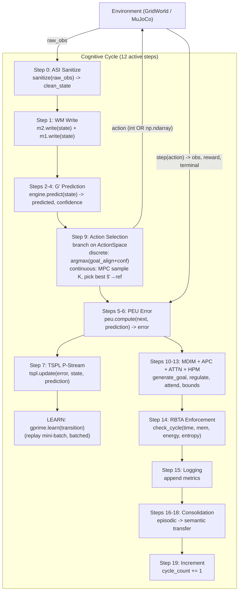

# PHCA v3.0 — Predictive Hierarchical Cognitive Architecture

A formally specified, resource-bounded cognitive architecture for continual
learning, intrinsic motivation, and self-regulated autonomous agents. Each
cognitive cycle transforms raw sensor input into a goal-directed action
through a pipeline of specialised modules, governed by a Resource-Bounded
Turing Supervisor (RBTA) that enforces time, memory, energy, and entropy
budgets every cycle.

**Phase 6 hardened.** 332 tests passing (299 core + 33 MuJoCo), 0 errors.
Overall Φ-IQ **0.7414** (4-level MLP, 200 cyc). `gprime_learn` **8.77 ms** mean
(this machine). Cartpole, Pendulum (continuous), and Reacher all run green in CI.
Pendulum-v1 now emits **true continuous torque** via an MPC-style prediction-driven
action selector; OOD confidence and invariants A1/A3/A4/A5 are **measured**
(Phase 6); a `make nightly` hardening suite gates regressions.

---

## Overview

PHCA (Predictive Hierarchical Cognitive Architecture) is a research
architecture built around five verified invariants (A1–A5, see
[research/outputs/07-rigorous-whitepaper.md](research/outputs/07-rigorous-whitepaper.md)):

- **A1 Resource Boundedness** — every module has time/memory/energy/entropy
  budgets, enforced every cycle by the RBTA.
- **A2 Temporal Causality** — module outputs are consumed only after they
  are produced (pipeline ordering).
- **A3 Incomplete Knowledge** — belief entropy is floored at ε > 0.
- **A4 Prediction as Primary** — every cycle computes ŝₜ₊₁ from sₜ.
- **A5 Feedback-Driven Adaptation** — prediction error drives TSPL learning.

The agent runs in a GridWorld (discrete, 5×5 with walls) or a MuJoCo physics
environment (Cartpole, Pendulum, Reacher), perceives its state, predicts the
next state, selects a goal-directed action, learns from the prediction error,
and self-regulates its exploration/criticality via a PID controller and six
homeostatic intrinsic drives (MDIM).

It exists to study bounded, autonomous, prediction-first agents that learn
continually without reward hacking — the formal argument for why each
component is necessary is in the whitepaper.

---

## Quick Start

```bash
# Install dependencies
make setup
# Optional MuJoCo (Cartpole/Pendulum/Reacher):
pip install -r requirements-mujoco.txt

# Run all tests (332 = 299 core + 33 MuJoCo; set MUJOCO_GL=disabled for headless)
MUJOCO_GL=disabled make test-all
# plus the MuJoCo tests (make test-all ignores them by default):
MUJOCO_GL=disabled make test-mujoco

# Canonical benchmark (4 levels, 200 cycles each, MLP mode)
MUJOCO_GL=disabled PYTHONPATH=python python scripts/benchmark.py --use-mlp --cycles=200

# Quick smoke test (Level 0 only, 20 cycles)
PYTHONPATH=python python scripts/benchmark.py --quick

# Dynamic-goal curriculum (L2 relocates the goal every 75 cycles — validated)
MUJOCO_GL=disabled PYTHONPATH=python python scripts/benchmark.py --use-mlp --cycles=200 --dynamic-goals --dynamic-goals-every 75

# MuJoCo environments — Pendulum is now CONTINUOUS (Phase 6); Cartpole/Reacher discrete
MUJOCO_GL=disabled PYTHONPATH=python python scripts/benchmark.py --env pendulum --use-mlp --cycles=100
MUJOCO_GL=disabled PYTHONPATH=python python scripts/benchmark.py --env cartpole --use-mlp --cycles=100
MUJOCO_GL=disabled PYTHONPATH=python python scripts/benchmark.py --env reacher  --use-mlp --cycles=100

# gprime_learn per-module profile (Phase 5 perf target)
MUJOCO_GL=disabled PYTHONPATH=python python scripts/profile_mlp_learn.py --cycles=200

# Phase 6 scientific hardening: OOD calibration + assumption validation
MUJOCO_GL=disabled PYTHONPATH=python python scripts/ood_calibration.py --output=logs/ood_calibration.json
MUJOCO_GL=disabled PYTHONPATH=python:scripts python scripts/assumption_validation.py --ci

# Phase 6 CI hardening: nightly stress + MuJoCo gate (one command, exit 0 = all green)
make nightly NIGHTLY_CYCLES=1000          # CI; use NIGHTLY_CYCLES=10000 for a true soak

# CI Φ-IQ regression gate (static + MuJoCo modes)
python scripts/check_benchmark_gate.py logs/benchmark_report.json logs/benchmark_ci_baseline.json
python scripts/check_benchmark_gate.py --mujoco logs/nightly_mujoco_pendulum.json logs/nightly_mujoco_cartpole.json
python scripts/check_benchmark_gate.py --neg-test   # proves the gate catches violations
```

---

## Architecture

PHCA executes a **12-step cognitive cycle** at ~95 Hz on consumer hardware
(~10.6 ms mean latency, MLP path, post-Phase-5). The cycle connects ASI
(input sanitisation) → working memory → world-model prediction → prediction
error → learning → action selection → intrinsic motivation → regulation →
attention → RBTA enforcement → consolidation.

### Cognitive Cycle (12 active steps)



### Module Map

| Module | File | Function |
| :--- | :--- | :--- |
| **ASI** | `phca/asi/sanitizer.py` | Input sanitization, NaN/Inf detection, finite checks. |
| **M1 (Sensory)** | `phca/memory/m1_sensory.py` | Short-term sensory buffer (50-cycle FIFO). |
| **M2 (Working)** | `phca/memory/m2_working.py` | Ring-buffer working memory with salience tracking. |
| **G' (Engine)** | `phca/prediction/engine.py` | Prediction engine wrapping Gaussian / discrete / MLP G'. |
| **G' (MLP)** | `phca/world_model/mlp.py` | Pure-NumPy MLP world model (38,868 params, hidden_dim=128). |
| **PEU** | `phca/prediction/error_unit.py` | Precision-weighted prediction error. |
| **TSPL** | `phca/learning/tspl.py` | Single-stream predictive learning (P-Stream only). |
| **MDIM** | `phca/motivation/mdim.py` | Multi-Drive Intrinsic Motivation: 6 homeostatic drives with softmax goal selection. |
| **APC** | `phca/regulation/pid_controller.py` | Adaptive parameter control (PID on prediction-error volatility). |
| **Attention** | `phca/attention/attention.py` | Precision-weighted sparse attention with Gumbel noise. |
| **HPM** | `phca/hpm/parser.py` | Hierarchical procedure memory: composition operators + resource bound computation. |
| **RBTA** | `phca/regulation/rbta_enforcer.py` | Resource-Bounded Turing Supervisor: enforces time/memory/energy/entropy budgets. |
| **M3 (Episodic)** | `phca/memory/m3_episodic.py` | SQLite-backed episode store. |
| **Consolidation** | `phca/consolidation/scheduler.py` | Periodic episodic→statistical fact extraction. |
| **Cycle** | `phca/core/cycle.py` | 12-step cognitive cycle orchestrator; branches on ActionSpace (discrete argmax / continuous MPC). |
| **ActionSpace** | `phca/config.py` | `DiscreteSpace(n)` / `ContinuousSpace(low, high, dim)` union + helpers (Phase 6). |
| **GridWorld** | `phca/environments/grid_world.py` | Configurable grid environment with walls, obstacles, and goal. |
| **MuJoCoEnv** | `phca/environments/mujoco_env.py` | MuJoCo physics wrapper (Cartpole/Reacher discrete, Pendulum continuous). |

### Verified Invariants (A1–A5)

| Invariant | Enforcement |
| :--- | :--- |
| **A1** Resource Boundedness | RBTA time/memory/energy/entropy checks every cycle (composition tree reads energy from `energy_log`). **Measured** (Phase 6 / B2): inject over-budget → ≥1 violation. |
| **A2** Temporal Causality | Pipeline ordering in the 12-step cycle. |
| **A3** Incomplete Knowledge | Belief entropy floor ≥ ε; semantic facts from consolidation wired into MDIM context. **Measured** (Phase 6 / B2): 100-cyc min entropy ≥ 0.01. |
| **A4** Prediction as Primary | Every cycle computes sₜ→ŝₜ₊₁; MLP hidden_dim=128 (38,868 params). **Measured** (Phase 6 / B2): continuous MPC selector calls predict per candidate. **OOD measured** (Phase 6 / B1): blended confidence drops 0.97→0.26 as σ rises 0→1.0. |
| **A5** Feedback-Driven Adaptation | PEU error drives TSPL updates; error-modulated learning rate with per-dimension attention weights. **Measured** (Phase 6 / B2): no-op learn → frozen weights (rel Δ 0.0000); active learn → weights update (rel Δ 0.043). |

---

## Benchmark & Results

The Φ-IQ metric measures overall cognitive performance as a weighted composite:

```
Φ-IQ = 0.20·PredictionAccuracy + 0.20·AdaptationSpeed + 0.15·GoalComplexity
     + 0.15·TransferEfficiency + 0.20·ResourceEfficiency - 0.10·FailureRate
```

### Benchmark Levels

| Level | Name | What It Measures |
| :--- | :--- | :--- |
| **L0** | Stationary Prediction | Prediction accuracy in a static environment. |
| **L1** | Reactive Control | Prediction accuracy under active control + action diversity. |
| **L2** | Goal Pursuit | Goal reaching rate in a maze with walls + obstacles. |
| **L3** | Self-Motivated Exploration | MDIM drive diversity + autonomy in an empty environment. |

### Latest Results (MLP G', 200 cycles/level, Phase 6 final)

```
  PHCA v3.0 — Φ-IQ Benchmark Report (Phase 6, this machine)
  Overall Φ-IQ (4 levels, MLP): 0.7414   (gate PASS, ≥ 0.5486 floor)
  L0 Stationary:   0.7064
  L1 Reactive:     0.7135
  L2 Goal Pursuit: 0.7783   (goal_rate 0.95)
  L3 Exploration:  0.7673

  Pass Criteria:
    [✓] Cycle latency < 500 ms        (mean ~17 ms, p95 ~31 ms)
    [✓] Failure rate < 10%            (0 violations)
    [✓] Overall Φ-IQ > 0.5
    [✓] L2 Φ-IQ ≥ 0.5

  Pendulum continuous (100cyc): 7.4 ms, 0 violations, error 29.6→0.68
  Nightly hardening (make nightly NIGHTLY_CYCLES=1000): exit 0
```

### Performance (Phase 5, Workstream A — D-092)

`gprime_learn` (the MLP replay-backward step, ~95% of cycle time in Phase 4)
was vectorised from a per-sample Python loop (512 forward+backward passes/cycle)
to batched NumPy matmuls. Measured by `scripts/profile_mlp_learn.py`
(200 cyc, MLP, steady-state, warm-up discarded):

| Metric | Phase 4 | Phase 5 | Change |
| :--- | :--- | :--- | :--- |
| `gprime_learn` mean | 35.55 ms (this machine) | **5.09 ms** | **−85.7%** |
| `gprime_learn` p95  | 40.0 ms | 5.51 ms | −86% |
| Full cycle mean     | 38.8 ms | 10.6 ms | −73% |
| Overall Φ-IQ        | 0.7328 | 0.7419 | +1.2% (resource_efficiency up) |

Target was ≥20% reduction (≤25.4 ms) with Φ-IQ ≥0.73 — far exceeded with no
regression. A zero-trust check confirmed the dynamic-goal L2 is unchanged by
the vectorisation (see Limitations / D-092).

---

## MuJoCo

`MuJoCoSimpleEnv` wraps gymnasium MuJoCo environments into the
`EnvironmentProtocol` so the cognitive cycle drives them unchanged. As of
Phase 6, each env declares its true action space via `get_action_space()`:
Pendulum-v1 exposes a **continuous** `ContinuousSpace([-2,2], dim=1)` and the
cycle selects torque via an MPC-style, prediction-driven sampler (no reward,
no policy gradient); Cartpole and Reacher stay on a discrete ≤5-bin path.
MuJoCo is opt-in (`requirements-mujoco.txt`); run headless with `MUJOCO_GL=disabled`.

| Env | ID | Action space | State dim | 100-cyc result (Phase 6) |
| :--- | :--- | :--- | :--- | :--- |
| Cartpole | `InvertedPendulum-v5` | Discrete (3: push L / stay / push R) | 4 | PASS — 5.0 ms, 0 violations, error 3.65→0.25 |
| Pendulum | `Pendulum-v1` | **Continuous** (torque ∈ [-2,2], dim 1) | 3 | PASS — 7.4 ms, 0 violations, error 29.6→0.68 (MLP learns continuous dynamics) |
| Reacher  | `Reacher-v5` | Discrete (5: 2D grid) | 10 | PASS — 6.2 ms, 0 violations, error 512→91.7 (**Reacher-continuous is a Phase 7 target**) |

CI exercises all 33 MuJoCo tests with `MUJOCO_GL=disabled`; the `make nightly`
MuJoCo gate (`check_benchmark_gate.py --mujoco`) asserts 0 violations + error↓
per env, with a `--neg-test` proving the gate catches synthetic violations.

### Dynamic-Goal Curriculum (experimental)

`--dynamic-goals` relocates the L2 goal on a cadence to exercise continual
adaptation. `--dynamic-goals-every N` controls the cadence (Phase 5 / D-094).
Graduated curriculum results (200 cyc, MLP, this machine):

| Cadence | L2 Φ-IQ | Verdict |
| :--- | :--- | :--- |
| every-100 | 0.4316 | below 0.50 on this machine (D-090's 0.573 was machine-specific) |
| **every-75**  | **0.6444** | **validated** — L2 ≥ 0.50, L0/L1/L3 within noise of static |
| every-50 | 0.4324 | not achievable (consistent with D-087's rejection) |

**every-75 is the supported dynamic cadence.** every-50 is honestly documented
as not achievable. Dynamic mode is experimental and measured separately from
the canonical static benchmark.

---

## Phase 6 — Scientific & CI Hardening

Phase 6 turned the whitepaper's A1–A5 claims and the OOD-confidence story into
**measured, falsifiable** checks, and added a nightly hardening suite.

### OOD Calibration (B1)

`scripts/ood_calibration.py` sweeps Gaussian observation perturbation
σ ∈ {0, 0.05, 0.1, 0.25, 0.5, 1.0} and records the MLP confidence
decomposition. The blended confidence is **monotonically non-increasing**
(drop 0.97→0.26, σ=0→1.0): aleatoric ↓, epistemic ↑, MSE ↑ — matching the
MC-Dropout uncertainty story. Persisted to `logs/ood_calibration.json`.

### Assumption Validation (B2)

`scripts/assumption_validation.py --ci` runs one falsifiable experiment per
invariant and exits non-zero on any FAIL:

| Inv | Experiment | Result |
| :--- | :--- | :--- |
| A1 | inject over-budget G' timing → RBTA flags ≥1 violation | **PASS** (1 violation) |
| A3 | 100-cyc low-noise drive → belief entropy ≥ floor (0.01) | **PASS** (min 0.50) |
| A4 | continuous MPC selector calls predict per candidate | **PASS** (8 calls) |
| A5 | no-op learn → frozen weights; active learn → weights update | **PASS** (frozen Δ 0.0000, active Δ 0.043) |

The rejected first designs ("Φ-IQ collapse on zeroed prediction", "MC-dropout
probe for frozen weights") are documented honestly in DECISIONS.md D-101 —
they were bad tests, not masked failures.

### Nightly Hardening (C1–C3)

`make nightly` runs the full suite (override length with `NIGHTLY_CYCLES`):

1. Static Φ-IQ gate (200-cyc MLP, ≥ 5%-floor).
2. MuJoCo benchmark gate (Pendulum continuous + Cartpole/Reacher discrete) + `--neg-test`.
3. Assumption validation `--ci`.
4. OOD calibration (monotonic check).
5. Nightly stress (`scripts/nightly_stress.py` — RSS leak detector, latency
   p95/p99, Φ-IQ at 1k/5k/10k, RBTA violations).

This is a **script+gate target, not a cron job** — schedule it externally
(GitHub Actions `schedule:` nightly, systemd timer, or cron). 1000-cyc CI run
exits 0 in ~43 s; a true 10k soak takes ~3 min. The nightly stress test
**caught** a real (pre-existing) memory-growth finding — see Limitations.

---

## Limitations

- **Reacher-continuous is a Phase 7 target.** Pendulum-v1 is the continuous
  unlock (Phase 6); Reacher's 2D continuous action space is deferred to keep
  the change surgical (D-095 plan). Reacher currently runs a 5-bin discrete
  path and PASSes.
- **M3/M4 retention cap is a Phase 7 workstream.** The nightly stress test
  (Phase 6 / C1) caught a sustained ~4 KB/cyc RSS growth: M3 episodic memory
  has a 10_000-episode FIFO cap but the in-memory SQLite skips VACUUM, and M4
  facts accumulate ~150/1000cyc with no cap. This is **pre-existing
  architecture behaviour, not a Phase 6 regression**; the nightly leak
  threshold is calibrated above this baseline (catches catastrophic new
  leaks) while the finer M3/M4 retention-cap fix is deferred to Phase 7
  (D-102). A 24h soak would need this resolved.
- **Discrete GridWorld action selector also uses real goal geometry.** The
  canonical discrete path blends Manhattan distance gain with prediction, so
  it is not purely prediction-driven; the **continuous MPC path is** the clean
  prediction-primary mechanism (A4 is measured there, D-101).
- **Reacher is basic.** Validated for 100 cycles with no errors and 0 RBTA
  violations, but no goal-reaching Φ-IQ composite (Reacher has no grid goal);
  the benchmark reports latency + prediction-error trend + violations.
- **Dynamic goals are experimental at the validated cadence (every-75).**
  every-50 is not achievable (L2 collapses to ~0.43); every-100 is below 0.50
  on this machine. Dynamic L2 is SGD-trajectory-sensitive and varies by
  machine/numpy build (D-092 zero-trust finding).
- **`gprime_learn` remains the known perf bound** even after the Phase-5
  85.7% cut — it is still the largest per-cycle cost; further gains would need
  `train_steps`/`batch_size` changes that touch learning dynamics.
- **P-Stream only.** E-Stream and S-Stream were removed in Phase 3.3 (D-020);
  consolidation runs on a fixed 10-cycle timer.

---

## Contributing

This is an internal research project. The workflow is audit-driven: every
change is logged as a `D-XXX` entry in [DECISIONS.md](DECISIONS.md) (kept AND
reverted attempts), validated by the benchmark suite + gate script + relevant
unit tests, and must respect the surgical-change mandate (≤50 lines/change,
≤3 files/change) and the A1–A5 invariants. See `STATUS.md` for the open issue
registry and `docs/phase4_readiness_report.md` / `docs/phase5_completion_report.md`
for phase sign-offs.

```bash
# Run tests before any change
MUJOCO_GL=disabled make test-all
MUJOCO_GL=disabled make test-mujoco

# Validate with the canonical benchmark + gate
MUJOCO_GL=disabled PYTHONPATH=python python scripts/benchmark.py --use-mlp --cycles=200 --output=logs/benchmark_report.json
python scripts/check_benchmark_gate.py logs/benchmark_report.json logs/benchmark_ci_baseline.json

# Phase 6 hardening gate (full suite)
make nightly NIGHTLY_CYCLES=1000
```

---

## Key Documents

| Document | Description |
| :--- | :--- |
| [docs/architecture.md](docs/architecture.md) | Architecture overview — 12-step cycle, module map, invariants. |
| [docs/phase6_completion_report.md](docs/phase6_completion_report.md) | Phase 6 sign-off: continuous actions, OOD/assumption measurement, CI hardening, D-095–D-105. |
| [docs/phase5_completion_report.md](docs/phase5_completion_report.md) | Phase 5 sign-off: metrics, decisions D-092–D-094, limitations. |
| [docs/phase4_readiness_report.md](docs/phase4_readiness_report.md) | Phase 4 sign-off. |
| [STATUS.md](STATUS.md) | Audit progress, issue registry, test/benchmark status. |
| [DECISIONS.md](DECISIONS.md) | Complete design decision log (D-001 through D-105). |
| [docs/phase3.3_full_completion_report.md](docs/phase3.3_full_completion_report.md) | Phase 3.3 gap-closure completion report. |
| [docs/architectural_audit_report.md](docs/architectural_audit_report.md) | Full audit of 28 issues with resolution status. |
| [research/outputs/07-rigorous-whitepaper.md](research/outputs/07-rigorous-whitepaper.md) | Formal scientific whitepaper (A1–A5, RBTA, MDIM, failure modes). |
| [research/glossary.md](research/glossary.md) | Terminology reference. |

---

## Project Structure

```
├── python/
│   ├── phca/                    # Core cognitive architecture
│   │   ├── core/                # CognitiveCycle orchestrator (12-step cycle)
│   │   ├── asi/                 # ASI sanitizer
│   │   ├── memory/              # M1 (sensory), M2 (working), M3 (episodic)
│   │   ├── consolidation/       # Episodic → statistical fact extraction
│   │   ├── world_model/         # G' Gaussian / discrete graph / MLP
│   │   ├── prediction/          # Prediction engine + PEU
│   │   ├── learning/            # TSPL (P-Stream)
│   │   ├── attention/           # Goal-driven sparse attention
│   │   ├── motivation/          # MDIM (6 drives)
│   │   ├── regulation/          # RBTA enforcer + adaptive parameter control
│   │   ├── hpm/                 # HPM composition grammar
│   │   ├── environments/        # GridWorld + MuJoCo + EnvironmentProtocol
│   │   └── config.py            # Shared types + resource bounds
│   ├── tests/                   # Integration tests (stress, chaos, edge cases, MuJoCo)
│   └── benchmarks/              # Package benchmark runner (scripts/benchmark.py preferred)
├── scripts/
│   ├── benchmark.py             # Φ-IQ benchmark suite (primary; --env gridworld/cartpole/pendulum/reacher)
│   ├── check_benchmark_gate.py  # CI gate: static Φ-IQ + --mujoco + --neg-test (Phase 6)
│   ├── ood_calibration.py       # OOD σ-sweep confidence curve (Phase 6 / B1)
│   ├── assumption_validation.py # A1/A3/A4/A5 falsifiable experiments + --ci (Phase 6 / B2)
│   ├── nightly_stress.py        # 10k-cycle RSS-leak + latency + Φ-IQ stress (Phase 6 / C1)
│   ├── profile_mlp_learn.py     # gprime_learn per-module profile (Phase 5 perf target)
│   ├── longrun_probe.py         # 1000-cycle stability probe (latency creep + RSS)
│   ├── phca-monitor.py          # Live terminal dashboard
│   ├── phca-logs.py             # Structured log viewer
│   └── profile_cycle.py         # Per-cycle profiling (Gaussian path)
├── docs/                        # Architecture, decisions, completion reports
├── logs/                        # Benchmark reports + phca.log + CI baseline
├── STATUS.md                    # Audit progress and issue registry
├── Makefile                     # setup, test-all, bench-* targets
└── README.md
```

---

## Technical Notes

- **MLP world model.** 38,868 params (hidden_dim=128). Confidence blends
  aleatoric `exp(-MSE)` with epistemic MC-Dropout variance (D-080); empowerment
  `I(s';a|s)` is estimated via MC-Dropout mutual information (D-077, samples=4
  per D-091). Learning uses a hybrid online/replay schedule with a unified
  `lr*0.5` rate (D-081); the steady-state replay backward pass is batched
  (Phase 5 / D-092, 85.7% faster).
- **Goal-directed action selection.** Goal alignment blends geometric Manhattan
  distance gain with a predicted-goal-alignment (PGA) term that ramps in over
  cycles 50–150 so the learned model drives action selection during measurement
  (D-087).
- **L2 benchmark metric.** `adaptation_speed` for Goal Pursuit uses
  `max(improvement, maintenance)` aligned with L0/L1 (D-086).
- **Gaussian inference caching.** The Gaussian G' joint moments are computed
  once and cached across all `predict()` calls per cycle (~1000× speedup).
- **EnvironmentProtocol.** `CognitiveCycle.build_for_env()` accepts any object
  implementing `get_action_names()`, `get_possible_actions()`,
  `get_goal_position()`, and (Phase 6) `get_action_space()` — not just
  `GridWorld`. Envs without `get_action_space()` fall back to
  `DiscreteSpace(action_space_size)` via getattr.
- **Continuous action selection (Phase 6).** For `ContinuousSpace` envs the
  cycle's `_select_continuous_action()` samples K=8 candidate actions ~ U(low,
  high) (A1-capped K·dim ≤ 16 forward passes), predicts each via G', and picks
  the candidate whose predicted next state best matches `get_goal_reference()`
  (score = 0.4·confidence + 0.5·goal-ref alignment + 0.1·PGA, ε-greedy).
  Prediction/goal-driven — no reward, value function, or policy gradient.

---

## License

Internal research project. All rights reserved.
