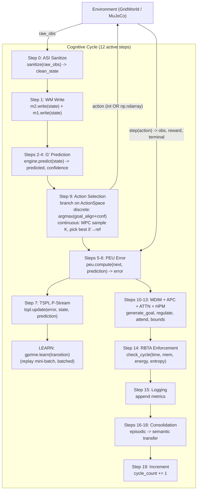

# PHCA v3.0 — Predictive Hierarchical Cognitive Architecture

[](https://github.com/ali-baneshi/phca-v3/actions/workflows/ci.yml)
[](https://github.com/ali-baneshi/phca-v3/actions/workflows/nightly.yml)
[](https://www.python.org/)
[](https://numpy.org/)
[](https://pytest.org/)
[](https://github.com/astral-sh/ruff)
[](requirements-mujoco.txt)
[](https://gymnasium.farama.org/)
[](docs/observability.md)
[](https://pgmpy.org/)
[](python/phca/memory/m3_episodic.py)
[](https://www.apache.org/licenses/LICENSE-2.0)

**PHCA v3.0** is a research codebase for studying **resource-bounded cognitive agents** — systems that perceive, predict, remember, and act under explicit limits on time, memory, energy, and belief entropy.

Rather than collapsing cognition into a single learner, the implementation wires specialised modules into a **12-step cognitive cycle** orchestrated by [`phca/core/cycle.py`](python/phca/core/cycle.py). Each cycle follows: sanitise (ASI) → working memory (M1/M2) → G′ predict → MDIM/APC/attention regulate → action (discrete geometry on GridWorld, or MPC on continuous MuJoCo) → `env.step` → PEU error → TSPL + G′.learn → RBTA enforce → consolidate (M3) → advance. Temporal order and discrete vs continuous paths are documented in [docs/action_selection.md](docs/action_selection.md). The Resource-Bounded Turing Supervisor ([`phca/regulation/rbta_enforcer.py`](python/phca/regulation/rbta_enforcer.py)) checks per-module time, memory, energy, and entropy-floor bounds each cycle; on violation it can interrupt rollouts or terminate to a safe action (D-113), not merely log.

**Research framing.** PHCA studies agents that adapt from **prediction error** and intrinsic MDIM drives, not from an external reward function optimised by RL — avoiding reward hacking at the cost of narrower task scope. The method is a modular cycle plus **falsifiable invariants A1–A5** (`scripts/assumption_validation.py --ci`, run on **nightly** / extended local CI — not every PR job). Evidence in this repo: Φ-IQ GridWorld composite, causal GridWorld gate, MuJoCo smoke benchmarks, Level-4-lite continual metrics, cognitive resilience injectables, and nightly hardening gates. See [IMPLEMENTATION_STATUS.md](IMPLEMENTATION_STATUS.md) and [docs/maturity_audit_2026-07-07.md](docs/maturity_audit_2026-07-07.md) for honest gate status.

### Continuous integration (GitHub Actions)

Every push/PR to `main` runs [`.github/workflows/ci.yml`](.github/workflows/ci.yml):

| Job | Tier | What it checks |
| :--- | :--- | :--- |
| **lint** | T0 | `ruff check python/` |
| **test-python** | T0 | ~792 tests (fast path; MuJoCo integration files excluded) |
| **observatory-check** | T0 | `phca_replay.py --check` on session fixtures |
| **benchmark-level-0** | T0 | Φ-IQ quick regression vs [`logs/benchmark_ci_baseline.json`](logs/benchmark_ci_baseline.json) |
| **mujoco-gate** | T0 | Pendulum + Cartpole + Reacher smoke via `make mujoco-ci` |

**Nightly** ([`.github/workflows/nightly.yml`](.github/workflows/nightly.yml)): full `make nightly` (A1–A5 `--ci`, OOD, stress soak, causal gate). Assumption validation is **not** in the default PR CI slice — use `make ci-local` locally for a broader check.

### What is in this repository

| Area | Contents |
| :--- | :--- |
| **Environments** | `GridWorld` (default 5×5 with walls; scaling experiments at 10×10 and 20×20) and optional MuJoCo wrappers (Cartpole, Pendulum, Reacher) |
| **Evaluation** | Φ-IQ (`scripts/benchmark.py`), Level-4-lite forgetting (`scripts/benchmark_level4.py`), cognitive resilience (`scripts/benchmark_recovery.py`), causal eval, maturation gates (`make maturation-test`) |
| **Observability** | Cognitive Observatory — live PyQt dashboard, per-cycle JSONL, replay/scrub (`scripts/phca_observatory.py`, `phca_replay.py`) |
| **Documentation** | Architecture notes, limitations, decision log (`DECISIONS.md`), reproducibility guide |

```bash
git clone https://github.com/ali-baneshi/phca-v3.git
cd phca-v3 && make setup
```

PHCA is a **research prototype** for exploring bounded, prediction-first agents — not a production AI stack or a drop-in reinforcement-learning framework. See [Limitations](#limitations) for known gaps.

---

## Overview

PHCA evaluates on **GridWorld** (discrete 5×5 default; scaling at 10×10 and 20×20) and optional **MuJoCo** wrappers (Cartpole, Pendulum, Reacher). Five design invariants (A1–A5) are specified in the [whitepaper](research/outputs/07-rigorous-whitepaper.md) and falsified via `scripts/assumption_validation.py --ci` (**nightly** and `make ci-local`; not the default PR CI job list):

- **A1 Resource Boundedness** — every module has time/memory/energy/entropy
  budgets, enforced every cycle by the RBTA.
- **A2 Temporal Causality** — module outputs are consumed only after they
  are produced (pipeline ordering).
- **A3 Incomplete Knowledge** — belief entropy is floored at ε > 0.
- **A4 Prediction as Primary** — every cycle computes ŝₜ₊₁ from sₜ.
- **A5 Feedback-Driven Adaptation** — prediction error drives TSPL learning.

The formal argument for why each component is necessary is in the whitepaper.

---

## Quick Start

### Setup & tests

```bash
# Install dependencies
make setup
# Optional MuJoCo (Cartpole/Pendulum/Reacher):
pip install -r requirements-mujoco.txt

# Fast CI-equivalent tests (~792 collected; MuJoCo integration tests separate)
MUJOCO_GL=disabled make test-python
make test-mujoco              # +36 MuJoCo integration tests
make maturation-test          # 45 tests: static contracts + forgetting + resilience + maturation
make ci-local                 # lint + test-python + observatory + L0 bench + causal-smoke
```

### Benchmarks & validation

```bash
# Canonical benchmark — full pass criteria (5×5 MLP, 200 cycles)
MUJOCO_GL=disabled python scripts/benchmark.py --use-mlp --cycles=200 --grid-size 5

# Quick smoke test (Level 0 only, 20 cycles, Gaussian G')
python scripts/benchmark.py --quick

# Scaling / exploratory (10×10 — lower Φ-IQ; violation gate may still fail)
python scripts/benchmark.py --grid-size 10 --cycles=200 --use-mlp

# Dynamic-goal curriculum (L2 relocates the goal every 75 cycles — validated)
MUJOCO_GL=disabled python scripts/benchmark.py --use-mlp --cycles=200 --dynamic-goals --dynamic-goals-every 75

# MuJoCo environments — Pendulum + Reacher CONTINUOUS (Phase 6/7); Cartpole discrete
MUJOCO_GL=disabled python scripts/benchmark.py --env pendulum --use-mlp --cycles=100
MUJOCO_GL=disabled python scripts/benchmark.py --env cartpole --use-mlp --cycles=100
MUJOCO_GL=disabled python scripts/benchmark.py --env reacher  --use-mlp --cycles=100

# gprime_learn per-module profile (Phase 5 perf target)
MUJOCO_GL=disabled python scripts/profile_mlp_learn.py --cycles=200

# Phase 6 scientific hardening: OOD calibration + assumption validation
MUJOCO_GL=disabled python scripts/ood_calibration.py --output=logs/ood_calibration.json
MUJOCO_GL=disabled python scripts/assumption_validation.py --ci

# Phase 6 CI hardening: nightly stress + MuJoCo gate (one command, exit 0 = all green)
make nightly NIGHTLY_CYCLES=1000          # fill-phase gate; use 11000 for post-M3 soak (D-134)
```

Scripts under `scripts/` bootstrap `python/` automatically; `PYTHONPATH=python` is optional.

### Reproduction & gates

```bash
# Phase 19: one-command scientific reproduction (see docs/reproducibility.md)
make reproduce-quick                      # ~10-15 min CI-science subset
make reproduce                            # ~45-90 min full nightly-equivalent suite

# CI Φ-IQ regression gate (static + MuJoCo modes)
python scripts/check_benchmark_gate.py logs/benchmark_report.json logs/benchmark_ci_baseline.json
python scripts/check_benchmark_gate.py --mujoco logs/nightly_mujoco_pendulum.json logs/nightly_mujoco_cartpole.json
python scripts/check_benchmark_gate.py --neg-test   # proves the gate catches violations

# Causal behavior gate: PHCA vs non-PHCA GridWorld controls, levels 1-3
python scripts/phca_causal_eval.py --levels all --cycles 200 --seeds 5 --output .tmp/phca_causal_eval_levels_200x5.json

# Maturation / continual learning (T3 local — not PR CI)
make bench-level4-smoke         # 2-task diagnostic (not retention proof)
make bench-level4-ablation    # R0,R2,R3,R6 ablation matrix
make bench-recovery             # injectable B1/C1/F5 cognitive resilience
make mujoco-ci                  # verbose MuJoCo gate (same as CI mujoco-gate job)
```

---

## Architecture

PHCA executes a **12-step cognitive cycle** at ~95 Hz on consumer hardware
(~10.6 ms mean latency, MLP path, post-Phase-5). Steps 0–19 are sub-step labels
in code; **MDIM/APC/attention/HPM regulate before action**; PEU, TSPL, and
G′.learn run **after** `env.step()` on the new observation. See
[docs/action_selection.md](docs/action_selection.md) for the temporal sequence diagram.

### Cognitive Cycle (12 active steps)



*Diagram note:* REG (MDIM/APC/ATTN/HPM) executes before ACT in the live pipeline;
the flow edges show data dependencies, not strict wall-clock order for every sub-step.

### Module Map

| Module | File | Function |
| :--- | :--- | :--- |
| **ASI** | `phca/asi/sanitizer.py` | Input sanitization, NaN/Inf detection, finite checks. |
| **M1 (Sensory)** | `phca/memory/m1_sensory.py` | Short-term sensory buffer (50-cycle FIFO). |
| **M2 (Working)** | `phca/memory/m2_working.py` | Ring-buffer working memory with salience tracking. |
| **G' (Engine)** | `phca/prediction/engine.py` | Prediction engine wrapping Gaussian / discrete / MLP G'. |
| **G' (MLP)** | `phca/world_model/mlp.py` | Pure-NumPy MLP world model (38,868 params, hidden_dim=128). |
| **PEU** | `phca/prediction/error_unit.py` | Precision-weighted prediction error. |
| **TSPL** | `phca/learning/tspl.py` | Single-stream predictive learning (P-Stream only). |
| **MDIM** | `phca/motivation/mdim.py` | Multi-Drive Intrinsic Motivation: 6 homeostatic drives with softmax goal selection. |
| **APC** | `phca/regulation/pid_controller.py` | Adaptive parameter control (PID on prediction-error volatility). |
| **Attention** | `phca/attention/attention.py` | Precision-weighted sparse attention with Gumbel noise. |
| **HPM** | `phca/hpm/parser.py` | Hierarchical procedure memory: composition operators + resource bound computation. |
| **RBTA** | `phca/regulation/rbta_enforcer.py` | Resource-Bounded Turing Supervisor: enforces time/memory/energy/entropy budgets. |
| **M3 (Episodic)** | `phca/memory/m3_episodic.py` | SQLite-backed episode store. |
| **Consolidation** | `phca/consolidation/scheduler.py` | Periodic episodic→statistical fact extraction. |
| **Cycle** | `phca/core/cycle.py` | 12-step cognitive cycle orchestrator; branches on ActionSpace (discrete argmax / continuous MPC). |
| **ActionSpace** | `phca/config.py` | `DiscreteSpace(n)` / `ContinuousSpace(low, high, dim)` union + helpers (Phase 6). |
| **GridWorld** | `phca/environments/grid_world.py` | Configurable grid environment with walls, obstacles, and goal. |
| **MuJoCoEnv** | `phca/environments/mujoco_env.py` | MuJoCo physics wrapper (Cartpole discrete; Pendulum + Reacher continuous). |

### Verified Invariants (A1–A5)

| Invariant | Enforcement |
| :--- | :--- |
| **A1** Resource Boundedness | RBTA time/memory/energy/entropy checks every cycle; TERMINATE→STAY and INTERRUPT→limited rollouts **alter cycle behavior** (D-113), not log-only. **Measured**: inject over-budget → ≥1 violation. |
| **A2** Temporal Causality | Pipeline ordering in the 12-step cycle. **Measured** (D-113): `experiment_a2_temporal_order()` in `--ci`. |
| **A3** Incomplete Knowledge | Belief entropy floor ≥ ε; semantic facts from consolidation wired into MDIM context. **Measured**: 100-cyc min entropy ≥ 0.01. |
| **A4** Prediction + Spatial Heuristics as Hybrid Cognitive Map | Every cycle computes sₜ→ŝₜ₊₁. **Continuous MPC (Pendulum, Reacher): prediction-primary** — predict per candidate (D-101). **Discrete GridWorld: hybrid cognitive map** — confidence-gated Manhattan/BFS geometry + G′ blended scorer (D-136). **OOD measured**: blended confidence drops 0.97→0.26 as σ rises 0→1.0. |
| **A5** Feedback-Driven Adaptation | PEU error drives TSPL updates; error-modulated learning rate with per-dimension attention weights. **Measured**: no-op learn → frozen weights (rel Δ 0.0000); active learn → weights update (rel Δ 0.043). |

---

## Benchmark & Results

> **Scope:** Φ-IQ is a GridWorld task-performance composite (0–1), not psychometric
> IQ or cross-domain intelligence. See [docs/phi_iq_metric.md](docs/phi_iq_metric.md).

The Φ-IQ metric measures overall cognitive performance as a weighted composite:

```
Φ-IQ = 0.20·PredictionAccuracy + 0.20·AdaptationSpeed + 0.15·GoalComplexity
     + 0.15·TransferEfficiency + 0.20·ResourceEfficiency - 0.10·FailureRate
```

`TransferEfficiency` is computed as `adaptation_speed × prediction_accuracy` — a
within-run proxy, **not** cross-task transfer (see [docs/phi_iq_metric.md](docs/phi_iq_metric.md)).

### Measured gates vs whitepaper targets

| Category | Examples | Status |
| :--- | :--- | :--- |
| **Measured PASS (CI/nightly)** | L0 Φ-IQ, MuJoCo smoke, Observatory replay, A1–A5 `--ci` (nightly) | green |
| **Measured FAIL (documented)** | Level-4-lite L4b forgetting @ 10 tasks | red — [docs/l4_root_cause_verdict.md](docs/l4_root_cause_verdict.md) |
| **Partial MVP** | Cognitive resilience injectables; GridWorld A4 | see [docs/limitations.md](docs/limitations.md) |
| **Not implemented** | 100-task AT-2, criticality Φ band, M5 procedural memory | backlog — [IMPLEMENTATION_STATUS.md](IMPLEMENTATION_STATUS.md) §1.3 |

### Benchmark Levels

| Level | Name | What It Measures |
| :--- | :--- | :--- |
| **L0** | Stationary Prediction | Prediction accuracy in a static environment. |
| **L1** | Reactive Control | Prediction accuracy under active control + action diversity. |
| **L2** | Goal Pursuit | Goal reaching rate in a maze with walls + obstacles. |
| **L3** | Self-Motivated Exploration | MDIM drive diversity + autonomy in an empty environment. |
| **L4-lite** | Continual learning (forgetting) | Sequential GridWorld tasks; `forgetting_rate` gate &lt;5% (10-task L4b **FAIL** as of 2026-07-07). |

### Latest Results (MLP G', seed=42, 200 cycles/level, 2026-07-05, this machine)

```
  PHCA v3.0 — Φ-IQ Benchmark Report (this machine)
  Overall Φ-IQ (4 levels, MLP): 0.7323   (gate PASS, ≥ 0.5486 floor)
  L0 Stationary:   0.7750
  L1 Reactive:     0.6748
  L2 Goal Pursuit: 0.7924   (goal_rate 0.97)
  L3 Exploration:  0.6868

  Pass Criteria:
    [✓] Cycle latency < 500 ms        (mean ~17 ms, p95 ~31 ms)
    [✓] Failure rate < 10%            (0 violations)
    [✓] Overall Φ-IQ > 0.5
    [✓] L2 Φ-IQ ≥ 0.5

  Causal gate L1/L2/L3: PASS (200 cyc × 5 seeds)
  Assumption validation --ci: 5/5 PASS (A1–A5)
  Nightly 11k soak: PASS (post-M3 late RSS ≤ 1600 B/cyc, D-134)

  Scientific validation (30 seeds, grid 5/10/20 scaling):
    full_system Φ-IQ:     0.631 ± 0.029
    scaling overall Φ-IQ: 0.700 ± 0.046 (5×5) | 0.325 ± 0.042 (10×10) | 0.147 ± 0.042 (20×20)
    Φ-IQ predictive r:    0.992 (H006 Validated)
    Hypotheses (30-seed full run): H006 Validated; H001–H003,H005 Refuted;
    H004 from interaction_test (see hypothesis_verdicts.json). Smoke (3 seeds) may differ.
```

### Causal Evidence Gate

`scripts/phca_causal_eval.py` compares PHCA against non-PHCA GridWorld controls
on three scenario levels: simple navigation, constrained partial observation,
and long-horizon goal switching/interruption. Current 200-cycle × 5-seed result:
Levels 1–3 **pass** versus gated controls (`random`; L2/L3 also vs `greedy_observed`).
Greedy full-info remains a ceiling on all levels. PHCA GridWorld policy uses
task-lock observed-greedy navigation with sparse L3 coverage probes; it does not
yet exploit memory/consolidation for action selection on grid tasks.

See [docs/phca_causal_evidence.md](docs/phca_causal_evidence.md).

### Performance (Phase 5, Workstream A — D-092)

`gprime_learn` (the MLP replay-backward step, ~95% of cycle time in Phase 4)
was vectorised from a per-sample Python loop (512 forward+backward passes/cycle)
to batched NumPy matmuls. Measured by `scripts/profile_mlp_learn.py`
(200 cyc, MLP, steady-state, warm-up discarded):

| Metric | Phase 4 | Phase 5 | Change |
| :--- | :--- | :--- | :--- |
| `gprime_learn` mean | 35.55 ms (this machine) | **5.09 ms** | **−85.7%** |
| `gprime_learn` p95  | 40.0 ms | 5.51 ms | −86% |
| Full cycle mean     | 38.8 ms | 10.6 ms | −73% |
| Overall Φ-IQ        | 0.7328 | 0.7419 | +1.2% (resource_efficiency up) |

Target was ≥20% reduction (≤25.4 ms) with Φ-IQ ≥0.73 — far exceeded with no
regression. A zero-trust check confirmed the dynamic-goal L2 is unchanged by
the vectorisation (see Limitations / D-092).

---

## MuJoCo

`MuJoCoSimpleEnv` wraps gymnasium MuJoCo environments into the
`EnvironmentProtocol` so the cognitive cycle drives them unchanged. As of
Phase 6/7, each env declares its true action space via `get_action_space()`:
Pendulum-v1 (`ContinuousSpace([-2,2], dim=1)`) and Reacher-v5 (`ContinuousSpace([-1,1]², dim=2)`)
use an MPC-style, prediction-driven sampler (no reward, no policy gradient).
Cartpole stays on a discrete 3-bin path — the **clean A4 prediction-primary path**
is the continuous MPC selector (Pendulum, Reacher). MuJoCo is opt-in
(`requirements-mujoco.txt`); run headless with `MUJOCO_GL=disabled`.

**MuJoCo RBTA bounds** (D-128, D-131, `build_for_mujoco` only): G′ time **0.120 s**;
ACTION time **0.080 s** (MPC only); ENV time **0.250 s** (`env.step()` physics);
ACTION energy **4.0**, ENV energy **12.5**
(`runtime × 50`). GridWorld bounds unchanged.

| Env | ID | Action space | State dim | 100-cyc result (D-107) |
| :--- | :--- | :--- | :--- | :--- |
| Cartpole | `InvertedPendulum-v5` | Discrete (3: push L / stay / push R) | 4 | PASS — discrete, 0 violations |
| Pendulum | `Pendulum-v1` | **Continuous** (torque ∈ [-2,2], dim 1) | 3 | PASS — 7.1 ms, 0 violations, error 29.6→0.68 |
| Reacher  | `Reacher-v5` | **Continuous** (actuator ∈ [-1,1]², dim 2) | 10 | PASS — 4.4 ms, 0 violations, error 105.7→8.4 |

CI exercises 36 MuJoCo integration tests with `MUJOCO_GL=disabled`; the PR
**mujoco-gate** job runs `make mujoco-ci` (verbose, pinned deps in
`requirements-mujoco.txt`). Nightly also runs the same gate via `make nightly`.
`check_benchmark_gate.py --mujoco` asserts 0 violations + error↓ per env, with
a `--neg-test` proving the gate catches synthetic violations.

### Dynamic-Goal Curriculum (experimental)

`--dynamic-goals` relocates the L2 goal on a cadence to exercise continual
adaptation. `--dynamic-goals-every N` controls the cadence (Phase 5 / D-094).
Graduated curriculum results (200 cyc, MLP, this machine):

| Cadence | L2 Φ-IQ | Verdict |
| :--- | :--- | :--- |
| every-100 | 0.4316 | below 0.50 on this machine (D-090's 0.573 was machine-specific) |
| **every-75**  | **0.6444** | **validated** — L2 ≥ 0.50, L0/L1/L3 within noise of static |
| every-50 | 0.4324 | not achievable (consistent with D-087's rejection) |

**every-75 is the supported dynamic cadence.** every-50 is honestly documented
as not achievable. Dynamic mode is experimental and measured separately from
the canonical static benchmark.

---

## Phase 6 — Scientific & CI Hardening

Phase 6 turned the whitepaper's A1–A5 claims and the OOD-confidence story into
**measured, falsifiable** checks, and added a nightly hardening suite.

### OOD Calibration (B1)

`scripts/ood_calibration.py` sweeps Gaussian observation perturbation
σ ∈ {0, 0.05, 0.1, 0.25, 0.5, 1.0} and records the MLP confidence
decomposition. The blended confidence is **monotonically non-increasing**
(drop 0.97→0.26, σ=0→1.0): aleatoric ↓, epistemic ↑, MSE ↑ — matching the
MC-Dropout uncertainty story. Persisted to `logs/ood_calibration.json`.

### Assumption Validation (B2)

`scripts/assumption_validation.py --ci` runs one falsifiable experiment per
invariant and exits non-zero on any FAIL:

| Inv | Experiment | Result |
| :--- | :--- | :--- |
| A1 | inject over-budget G' timing → RBTA flags ≥1 violation | **PASS** (1 violation) |
| A2 | temporal order at action selection | **PASS** (D-113) |
| A3 | 100-cyc low-noise drive → belief entropy ≥ floor (0.01) | **PASS** (min 0.50) |
| A4 | continuous MPC selector calls predict per candidate | **PASS** (8 calls) |
| A5 | no-op learn → frozen weights; active learn → weights update | **PASS** (frozen Δ 0.0000, active Δ 0.043) |

The rejected first designs ("Φ-IQ collapse on zeroed prediction", "MC-dropout
probe for frozen weights") are documented honestly in DECISIONS.md D-101 —
they were bad tests, not masked failures.

### Nightly Hardening (C1–C3)

`make nightly` runs the full suite (override length with `NIGHTLY_CYCLES`):

1. Static Φ-IQ gate (200-cyc MLP, ≥ 5%-floor).
2. MuJoCo benchmark gate (Pendulum + Reacher continuous, Cartpole discrete) + `--neg-test`.
3. Assumption validation `--ci`.
4. OOD calibration (monotonic check).
5. Nightly stress (`scripts/nightly_stress.py` — RSS leak detector, latency
   p95/p99, Φ-IQ at 1k/5k/10k, RBTA violations).
6. Causal behavior gate (`phca_causal_eval.py --gate` on L2+L3 in nightly).
7. Session anomaly gate (`scripts/nightly_anomaly_gate.py` — synthetic fixtures).

This is a **script+gate target, not a cron job** — schedule it externally
(GitHub Actions `schedule:` nightly, systemd timer, or cron). 1000-cyc CI run
exits 0 in ~43 s; a true 10k soak takes ~3 min. The nightly stress test
**caught** a real (pre-existing) memory-growth finding — see Limitations.

---

## Maturation v2 (2026-07-07)

Maturation work added **honest claim tracking**, static contract tests, Level-4-lite
continual-learning benchmarks, and in-cycle cognitive resilience injectables.
It does **not** change the L4b forgetting gate outcome — measured **FAIL**
(`forgetting_rate=1.0` on 10-task L4b; ablation R0–R6 unchanged).

| Artifact | Purpose |
| :--- | :--- |
| [docs/maturity_audit_2026-07-07.md](docs/maturity_audit_2026-07-07.md) | 59-row claim matrix (PASS/FAIL/PARTIAL/BACKLOG) |
| [docs/static_audit_2026-07-07.md](docs/static_audit_2026-07-07.md) | Contract map + G5 hook inventory |
| [docs/maturation_signoff.md](docs/maturation_signoff.md) | Sign-off checklist for maturation tracks |
| [docs/maturation_bisection.md](docs/maturation_bisection.md) | L4 bisection methodology |
| [docs/l4_root_cause_verdict.md](docs/l4_root_cause_verdict.md) | Root-cause verdict (B+C); L4b still FAIL |
| [docs/resilience.md](docs/resilience.md) | Cognitive vs Observatory session recovery |

**Commands:** `make maturation-test` (45 tests), `make bench-level4-smoke`,
`make bench-level4-ablation`, `make bench-recovery`.

---

## Phase 9–12 — Cognitive Observatory Completion

Observatory Phases 9–12 delivered schema versioning (v1), offline report parity,
large-session scrub budgets (≤2s live / ≤4s review @ 3000+ cycles), and
multi-session `--compare`. Full detail:
[docs/observability.md](docs/observability.md) and
[docs/PHCA_Cognitive_Observatory_Architecture.md](docs/PHCA_Cognitive_Observatory_Architecture.md).

---

## Limitations

See [docs/limitations.md](docs/limitations.md) for the full list. Highlights:

- **Continual learning (L4-lite).** 10-task sequential GridWorld forgetting is
  **benchmarked** (`scripts/benchmark_level4.py`); L4b gate **FAIL** as of
  2026-07-07 — see [docs/l4_root_cause_verdict.md](docs/l4_root_cause_verdict.md)
  and [docs/limitations.md](docs/limitations.md).
- **Action-selection split (A4).** Continuous MuJoCo (Pendulum, Reacher) uses
  prediction-primary MPC; discrete GridWorld with an extrinsic goal uses hybrid
  task-lock observed-greedy geometry (D-112, D-101).
- **Long-run memory growth (Phase 7 retention).** `make nightly` uses a
  **phase-aware** late-half RSS slope gate (D-112, D-113): ≤5000 B/cyc for runs under
  7000 cycles (M3 fill phase) and ≤1600 B/cyc for post-cap soaks (default
  `NIGHTLY_CYCLES=11000`; post-M3 window after cycle 10k, D-134). See
  [docs/limitations.md](docs/limitations.md) and [STATUS.md](STATUS.md).
- **Observatory Phases 7–20 complete:** live PyQt dashboard, JSONL recording, seek/scrub replay, schema governance, report parity, scrub performance, multi-session `--compare`, anomaly detection, action explainability, stable API, supervisor/recovery, multi-agent timelines, cognitive-moment query, and scientific reproduction — see [docs/observability.md](docs/observability.md).
- **No NLP, vision, multi-agent cognition (shared memory / coordination), or M5 procedural memory.**
  Observatory **display** supports multi-agent replay and per-agent scrub (Phase 17).
- **Dynamic goals** are experimental at every-75 only.
- **P-Stream only** (E/S streams removed D-020).

---

## Contributing

This is an internal research project. The workflow is audit-driven: every
change is logged as a `D-XXX` entry in [DECISIONS.md](DECISIONS.md) (kept AND
reverted attempts), validated by the benchmark suite + gate script + relevant
unit tests, and must respect the surgical-change mandate (≤50 lines/change,
≤3 files/change) and the A1–A5 invariants. See `STATUS.md` for the open issue
registry and [docs/archive/](docs/archive/) phase sign-offs. Validation commands:
see [Quick Start](#quick-start) (tests, benchmarks, `make nightly`).

---

## Key Documents

| Document | Description |
| :--- | :--- |
| [DOCUMENTATION_MAP.md](DOCUMENTATION_MAP.md) | Which docs are living vs historical vs aspirational. |
| [IMPLEMENTATION_STATUS.md](IMPLEMENTATION_STATUS.md) | Whitepaper criteria × code × gates matrix. |
| [STATUS.md](STATUS.md) | Audit progress, issue registry, test/benchmark status. |
| [DECISIONS.md](DECISIONS.md) | Complete design decision log (D-001 through latest). |
| [docs/architecture.md](docs/architecture.md) | Architecture overview — 12-step cycle, module map, invariants. |
| [docs/phi_iq_metric.md](docs/phi_iq_metric.md) | Φ-IQ definition, levels, interpretation caveats. |
| [docs/action_selection.md](docs/action_selection.md) | Discrete vs continuous selectors; temporal cycle order. |
| [docs/limitations.md](docs/limitations.md) | What PHCA cannot do; open backlog items. |
| [docs/maturity_audit_2026-07-07.md](docs/maturity_audit_2026-07-07.md) | Maturation claim matrix (PASS/FAIL/PARTIAL). |
| [docs/static_audit_2026-07-07.md](docs/static_audit_2026-07-07.md) | Static contract map (maturation Track A). |
| [docs/maturation_signoff.md](docs/maturation_signoff.md) | Maturation sign-off checklist. |
| [docs/l4_root_cause_verdict.md](docs/l4_root_cause_verdict.md) | L4 forgetting root-cause verdict (B+C). |
| [docs/maturation_bisection.md](docs/maturation_bisection.md) | L4 bisection / ablation methodology. |
| [docs/resilience.md](docs/resilience.md) | Cognitive resilience vs Observatory recovery. |
| [docs/phca_causal_evidence.md](docs/phca_causal_evidence.md) | Three-level causal behavior evidence gate (L1–L3). |
| [docs/observability.md](docs/observability.md) | Cognitive Observatory JSONL, replay/scrub, integrity checks. |
| [docs/PHCA_Cognitive_Observatory_Architecture.md](docs/PHCA_Cognitive_Observatory_Architecture.md) | Full Observatory architecture and 20-phase roadmap. |
| [docs/reproducibility.md](docs/reproducibility.md) | How to reproduce benchmark numbers (`make reproduce`). |
| [docs/archive/](docs/archive/) | Phase sign-off reports (historical snapshots; cross-check STATUS.md). |
| [research/outputs/07-rigorous-whitepaper.md](research/outputs/07-rigorous-whitepaper.md) | Formal scientific whitepaper (A1–A5, RBTA, MDIM, failure modes). |
| [research/glossary.md](research/glossary.md) | Terminology reference. |

---

## Project Structure

```
├── python/
│   ├── phca/                    # Core cognitive architecture
│   │   ├── core/                # CognitiveCycle orchestrator (12-step cycle)
│   │   ├── asi/                 # ASI sanitizer
│   │   ├── memory/              # M1 (sensory), M2 (working), M3 (episodic)
│   │   ├── consolidation/       # Episodic → statistical fact extraction
│   │   ├── world_model/         # G' Gaussian / discrete graph / MLP
│   │   ├── prediction/          # Prediction engine + PEU
│   │   ├── learning/            # TSPL (P-Stream)
│   │   ├── attention/           # Goal-driven sparse attention
│   │   ├── motivation/          # MDIM (6 drives)
│   │   ├── regulation/          # RBTA enforcer + adaptive parameter control
│   │   ├── resilience/          # In-cycle failure detect/recover (B1,B4,B5,C1,F5)
│   │   ├── evaluation/          # Φ-IQ, continual/, metrics/forgetting.py
│   │   ├── hpm/                 # HPM composition grammar
│   │   ├── environments/        # GridWorld + MuJoCo + EnvironmentProtocol
│   │   ├── monitoring/          # Cognitive Observatory (ObservabilityFrame, Qt dashboard)
│   │   └── config.py            # Shared types + resource bounds
│   ├── tests/                   # Integration tests (stress, chaos, edge cases, MuJoCo)
│   └── benchmarks/              # Legacy runner (use scripts/benchmark.py)
├── scripts/
│   ├── benchmark.py             # Φ-IQ benchmark suite (primary; --env gridworld/cartpole/pendulum/reacher)
│   ├── benchmark_level4.py      # Level-4-lite forgetting gate
│   ├── benchmark_recovery.py    # Cognitive resilience injectables
│   ├── run_l4_ablation.py       # Ablation matrix R0–R6
│   ├── check_benchmark_gate.py  # CI gate: static Φ-IQ + --mujoco + --neg-test (Phase 6)
│   ├── ood_calibration.py       # OOD σ-sweep confidence curve (Phase 6 / B1)
│   ├── assumption_validation.py # A1–A5 falsifiable experiments + --ci (Phase 6 / D-113)
│   ├── nightly_stress.py        # RSS-leak + latency + Φ-IQ stress (Phase 6 / C1)
│   ├── profile_mlp_learn.py     # gprime_learn per-module profile (Phase 5 perf target)
│   ├── longrun_probe.py         # 1000-cycle stability probe (latency creep + RSS)
│   ├── phca-logs.py             # Structured log viewer
│   ├── phca_observatory.py      # PyQt Cognitive Observatory (live + JSONL) — canonical UI
│   ├── phca_observatory_supervisor.py  # Subprocess wrapper + crash recovery (Phase 16)
│   ├── phca_multi_observatory.py       # Multi-agent aligned runner wrapper
│   ├── phca_query.py            # Cognitive-moment query CLI (Phase 18)
│   ├── phca_replay.py           # Session replay + --check integrity gate
│   ├── reproduce.py             # One-command scientific reproduction (Phase 19)
│   ├── nightly_anomaly_gate.py  # Nightly session anomaly gate (Phase 13)
│   ├── phca_visualise.py        # Matplotlib legacy dashboard (deprecated for full review)
│   └── profile_cycle.py         # Per-cycle profiling (Gaussian path)
├── docs/                        # Architecture, decisions, completion reports
│   └── observability.md         # Observatory JSONL schema, replay, --check rules
├── logs/                        # Benchmark reports + phca.log + CI baseline
├── STATUS.md                    # Audit progress and issue registry
├── Makefile                     # setup, test-all, bench-* targets
└── README.md
```

---

## Cognitive Observatory

Phases 9–12 added schema v1, report parity, scrub performance budgets, and
multi-session `--compare` on top of live PyQt dashboard, per-cycle JSONL
recording, and seek/scrub replay (Phases 7–20). PyQt `--qt` replay is the
canonical path; matplotlib `--from-jsonl` is legacy.

See **[docs/observability.md](docs/observability.md)** for JSONL schema, playback/scrub
semantics, transport controls, replay banners, and `--check` integrity rules.
See **[docs/PHCA_Cognitive_Observatory_Architecture.md](docs/PHCA_Cognitive_Observatory_Architecture.md)**
for the full Observatory architecture and roadmap.

```bash
# Live run
QT_QPA_PLATFORM=offscreen PYTHONPATH=python python scripts/phca_observatory.py --cycles=50 --mlp

# Replay with scrub (canonical Observatory path)
PYTHONPATH=python python scripts/phca_replay.py logs/sessions/<ts>/ --qt

# Session integrity + offline report
PYTHONPATH=python python scripts/phca_replay.py --check logs/sessions/<ts>/
PYTHONPATH=python python scripts/phca_replay.py logs/sessions/<ts>/ --report
```

---

## Technical Notes

- **RBTA (Resource-Bounded Temporal Automata).** Each module carries bounds
  `(B_time, B_mem, B_energy)` plus an entropy floor ε; the enforcer verifies
  them every cycle (whitepaper §2.1). MuJoCo builds use widened G′/ACTION bounds
  for CI runner variance (D-128, D-131). ACTION times MPC only; ENV times
  `env.step()` physics separately.
- **MLP world model.** 38,868 params (hidden_dim=128). Confidence blends
  aleatoric `exp(-MSE)` with epistemic MC-Dropout variance (D-080); empowerment
  `I(s';a|s)` is estimated via MC-Dropout mutual information (D-077, samples=4
  per D-091). Learning uses a hybrid online/replay schedule with a unified
  `lr*0.5` rate (D-081); the steady-state replay backward pass is batched
  (Phase 5 / D-092, 85.7% faster).
- **Goal-directed action selection.** Goal alignment blends geometric Manhattan
  distance gain with a predicted-goal-alignment (PGA) term that ramps in over
  cycles 50–150 so the learned model drives action selection during measurement
  (D-087).
- **L2 benchmark metric.** `adaptation_speed` for Goal Pursuit uses
  `max(improvement, maintenance)` aligned with L0/L1 (D-086).
- **Gaussian inference caching.** The Gaussian G' joint moments are computed
  once and cached across all `predict()` calls per cycle (~1000× speedup).
- **EnvironmentProtocol.** `CognitiveCycle.build_for_env()` accepts any object
  implementing `get_action_names()`, `get_possible_actions()`,
  `get_goal_position()`, and (Phase 6) `get_action_space()` — not just
  `GridWorld`. Envs without `get_action_space()` fall back to
  `DiscreteSpace(action_space_size)` via getattr.
- **Continuous action selection (Phase 6).** For `ContinuousSpace` envs the
  cycle's `_select_continuous_action()` samples K=8 candidate actions ~ U(low,
  high) (A1-capped K·dim ≤ 16 forward passes), predicts each via G', and picks
  the candidate whose predicted next state best matches `get_goal_reference()`
  (score = 0.4·confidence + 0.5·goal-ref alignment + 0.1·PGA, ε-greedy).
  Prediction/goal-driven — no reward, value function, or policy gradient.

---

## License

Copyright © 2026 Ali Baneshi

Licensed under the Apache License, Version 2.0 (the "License");
you may not use this project except in compliance with the License.
You may obtain a copy of the License at

    https://www.apache.org/licenses/LICENSE-2.0

Unless required by applicable law or agreed to in writing, software
distributed under the License is distributed on an "AS IS" BASIS,
WITHOUT WARRANTIES OR CONDITIONS OF ANY KIND, either express or implied.
See the License for the specific language governing permissions and
limitations under the License.

SPDX-License-Identifier: Apache-2.0

Full license text and third-party dependency licenses: [docs/license.md](docs/license.md).

---

*Last verified: 2026-07-07 — CI jobs lint, test-python, observatory-check, benchmark-level-0, mujoco-gate.*
