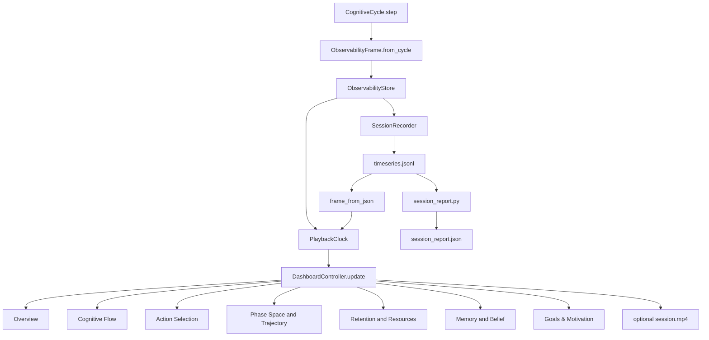

# PHCA Cognitive Observatory — Architecture Document (English)

## Purpose of This Document

This document is written for someone with no prior background in the project who wants to quickly and deeply understand what PHCA Cognitive Observatory is, why it was built, what scientific and engineering foundations it rests on, where it sits within a 20-phase roadmap (Observatory **Phases 7–20 complete**, 2026-07), what its limitations are, what use cases it suits, and what the correct development path should be.

The perspective of this document is that of a senior architect of complex systems: it is not merely an explanation of files or a few components; it attempts to clarify data ownership boundaries, architectural contracts, system risks, technical debt, observability requirements, and the future of development.

---

## Executive Summary

PHCA Cognitive Observatory is an observability, replay, and reporting layer for the PHCA cognitive architecture. The system converts each cognitive cycle of the agent into a structured frame, displays it live in a PyQt5 dashboard, records it as JSONL, enables replay and scrub on past sessions, and builds offline reports from the same data.

Observatory **Phases 7–20 are complete** (2026-07). Phase 7 established the cognitive observability foundation; Phases 8–12 added replay/scrub, schema governance, report parity, performance, and multi-session compare; Phases 13–19 added anomalies, explainability, API, production hardening, multi-agent, query, and reproduction; Phase 20 is the research maturity sign-off ([phase20_completion_report.md](archive/phase20_completion_report.md)).

The highest architectural risks at this stage are:

- Showing incorrect data to the user due to unit mismatch, schema drift, or replay/live mismatch.
- Incomplete JSONL storage or reconstruction that causes replay to differ from live execution.
- Fragile local state in dashboard panels that does not rebuild correctly during seek, scrub, or replay.
- Excessive growth of `qt_dashboard.py` and scattered shared logic between dashboard, report, and replay.
- Legacy paths such as render/static replay that may not stay in sync with the PyQt dashboard.

The correct development strategy in the current phase is: correctness, honesty, and reproducibility first; aesthetics and visual richness second. No panel should confidently display something that does not exist in live data or JSONL. If data is live-only, it must be clearly labeled. If replay is incomplete, that must be stated honestly. If an offline report lacks something from the dashboard, either it must be completed or the limitation must be documented.

---

## What Is PHCA?

PHCA can be understood as a multi-layer cognitive architecture that attempts to build agent behavior not merely from policy or reward, but from a cycle of perception, prediction, error, motivation, attention, memory, action selection, and resource constraints.

In this architecture, in each cognitive cycle the agent:

1. Receives environmental observation.
2. Sanitizes or cleans it.
3. Writes the current state to working memory.
4. Predicts the future state.
5. Computes prediction error.
6. Decides based on error, confidence, drives, and goals.
7. Selects an action.
8. Checks resources and constraints with RBTA.
9. Updates memory and beliefs.
10. Produces an observable snapshot for humans.

PHCA Cognitive Observatory is the layer that turns this cycle into visual, analytical, and replayable form.

---

## Why Is Observatory Necessary?

In complex cognitive systems, knowing the output alone is not enough. We must know:

- What did the agent see?
- How did it interpret the current state?
- What did it predict?
- How accurate was the prediction?
- Why was this action chosen?
- Did the action come from an exploit or explore path?
- Which drive was active?
- What role did episodic and semantic memory play?
- Did RBTA see a constraint violation or not?
- What were latency and resource consumption?
- Does replay show the same live behavior, or only an incomplete simulation?

Without Observatory, the system becomes a black box. With Observatory, the system approaches a glass box: still complex, but inspectable, criticizable, replayable, and reportable.

---

## Place of Phase 7 in the 20-Phase Path

This project’s Observatory roadmap spans 20 phases; **Phases 7–20 are complete** (2026-07). Phase 20 sign-off: [phase20_completion_report.md](archive/phase20_completion_report.md).

### Early Phases

Early phases are usually for building foundational components:

- Defining environment and observation.
- Building the basic cognitive cycle.
- Connecting prediction, error, and action selection.
- Creating initial memory.
- Adding drives and goals.
- Introducing resource and safety constraints.

### Phase 7

> **Status: Complete (2026-07).** Frame schema, JSONL recording, 7-tab PyQt dashboard,
> `session_report.py`, shared `cognitive_panels.py` helpers, RBTA unit normalization,
> and `--check` integrity gate are shipped. **360 monitoring tests** (715 total with MuJoCo).

Phase 7 means the system must show itself. This phase is the transition from “merely running” to “being understandable.”

In Phase 7 we expect:

- Every cycle to become a recordable frame.
- Frame schema to stabilize.
- A multi-panel dashboard to explain agent behavior.
- Replay from JSONL to be possible.
- Offline reports to be built.
- Live and replay to be separated and honestly labeled.
- Heavy data such as images or bulky rollouts not to inflate JSONL without reason.

### What shipped in Phases 8–12

- **Phase 8:** `PlaybackClock` seek/scrub, rolling-window `rebuild_histories()`, transport bar, replay banners.
- **Phase 9:** `schema_version: 1`, legacy v0 normalization, mixed-version `--check` failures.
- **Phase 10:** `session_report.json` parity with Overview via shared helpers.
- **Phase 11:** Decimated rolling rebuild + lazy per-tab rebuild; scrub budget ≤2s/≤4s at 3000+ cycles.
- **Phase 12:** `phca_replay.py --compare` multi-session report comparison (D-115).

### Phases 13–20 (complete)

- **Phase 13:** Anomaly detection (spike, drift, resource leak, unstable goals).
- **Phase 14:** Action explainability and causal chains.
- **Phase 15:** Stable observability API for external tools.
- **Phase 16:** Production hardening (crash isolation, session integrity).
- **Phase 17:** Multi-agent Observatory with synchronized timelines.
- **Phase 18:** Interactive analysis (query, filter cognitive moments).
- **Phase 19:** Scientific validation and one-command reproducibility.
- **Phase 20:** Research/product maturity sign-off — [phase20_completion_report.md](archive/phase20_completion_report.md).

See [STATUS.md](../STATUS.md) for the Observatory Phases 7–20 completion table.

---

## Architecture Overview

The main data flow in the system is as follows:

This diagram shows that the heart of Observatory is a simple principle: every cycle must become a frame, and all views, replays, and reports must be fed either from that frame or from JSONL reconstructed from that frame.

---

## Data Ownership Boundaries

One of the most important architectural principles in this system is clear data ownership.

### 1. Runtime / CognitiveCycle

The cognitive cycle is the owner of live truth. Only this part may read from live components such as environment, prediction model, memory, RBTA, and drives.

Responsibilities:

- Executing step.
- Producing observation and action.
- Updating state, prediction, memory, and metrics.
- Building snapshot via `ObservabilityFrame.from_cycle()`.

Critical risk:

- If dashboard or report connect directly to live objects, thread-safety and reproducibility are lost.

### 2. Frame Schema

`ObservabilityFrame` is the central observability contract. This frame must be a snapshot, not a live view of mutating objects.

Responsibilities:

- Holding data for one cycle.
- Separating lightweight recordable data from live-only data.
- Maintaining compatibility with older schemas.

Important principle:

- Dashboard and report must not mutate the frame.

### 3. Store / Recorder

`ObservabilityStore` is the live buffer. `SessionRecorder` converts frames to JSONL.

Responsibilities:

- Holding recent frames.
- Draining new frames.
- Writing exactly one JSONL line per complete cycle.

Critical risk:

- If line count does not match meta cycles, the session is incomplete and the checker must fail.

### 4. Replay Loader

`frame_from_json()` is responsible for converting JSONL back to `ObservabilityFrame`.

Responsibilities:

- Reconstructing arrays with appropriate types.
- Tolerating older schemas.
- Not fabricating data except with clear labeling.

Critical risk:

- If a field is stored in `to_json()` but not correctly restored in `frame_from_json()`, replay becomes incorrect.

### 5. Dashboard Controller

`DashboardController.update()` distributes the frame to all panels.

Responsibilities:

- Detecting live or replay.
- Rebuilding history on seek or jump.
- Preventing double append.
- Maintaining coordination across seven panels.

Critical risk:

- If one panel appends history but another rebuilds, scrub desync occurs.

### 6. Tab-local State

Each dashboard panel has its own local state: history, smoother, cache, projection, layout, etc.

Responsibilities:

- Fast, low-jitter display.
- Accurate rebuild on replay seek.
- Not mutating the frame.

Critical risk:

- If local state is not aligned with cycle_id or rebuild, the panel shows stale data.

### 7. Report Generation

`session_report.py` must build reports from JSONL, not from live state.

Responsibilities:

- Building a repeatable session summary.
- Aligning with dashboard logic.
- Reporting live-only gaps.

Critical risk:

- If report imports helpers from dashboard and dashboard changes, hidden coupling arises.

---

## Scientific and Conceptual Foundations

PHCA Cognitive Observatory is not just a UI. Several scientific and architectural ideas sit behind it.

### Predictive Processing

The agent constantly predicts the future. If prediction differs from the next observation, prediction error is produced. This error is not merely a metric; it is fuel for learning and behavior regulation.

In the dashboard:

- Prediction is seen in Phase Space.
- Prediction error is shown in Overview and Cognitive Flow.
- Per-dim PEU, if available, shows which state dimension is problematic.

### Active Inference / Error Minimization

The agent does not merely predict passively; it selects actions to bring the future state closer to a desired goal or belief. This view resembles active inference: action is chosen to reduce uncertainty, reduce error, or reach a drive target.

In the dashboard:

- Action Selection shows whether action came from explore or exploit.
- candidate_scores shows how options were ranked.
- continuous_action or last_action_vector shows what the final action vector was.

### Bounded Rationality

The agent does not have unlimited resources. Time, memory, energy, and latency are bounded. RBTA introduces this constraint into the system.

In the dashboard:

- Cognitive Flow shows time per module.
- Retention shows resources and envelope.
- RBTA violations show which constraint was violated.

### Memory Systems

The system distinguishes between different memories:

- M1: sensory buffer.
- M2: working memory.
- M3: episodic memory.
- M4: semantic/consolidated facts.

In Memory & Belief:

- M3 and M4 are shown if live or compactly recorded.
- If live-only, replay must honestly say unavailable.

### Attention

Attention determines which parts of state or memory are more salient. attention_indices and attention_saliences are important for understanding agent focus.

In the dashboard:

- Attention salience can be shown in Overview and Flow.
- If attention_weights are not in JSONL, replay must not pretend they exist.

### Goal / Motivation

MDIM and drives determine what the agent pursues. drive_levels, drive_targets, drive_deficits, goal_stack, and pareto_front are important for understanding motivation.

In Goals & Motivation:

- Tanks show drive level.
- Deficits show distance from setpoint.
- Goal stack shows the motivational decision path.

---

## Main System Components

### ObservabilityFrame

This frame is a snapshot of one cycle.

Important properties:

- Must have copy or independent value.
- Must not give live reference to mutating objects.
- Must be lightweight for JSONL.
- Must remain backward-compatible.

Field categories:

- Core fields: cycle_id, env_kind, latency, prediction_error.
- Environment fields: grid, agent_pos, goal_pos, obs_vector, env_frame.
- Cognitive fields: predicted_state, gprime_uncertainty, drive_levels, goal_stack.
- Action fields: candidate_scores, continuous_action, last_action_vector.
- Resource fields: module_timings, runtime_log, memory_log, energy_log, rbta_bounds.
- Memory fields: m3_recent, m3_top_error, m4_relevant, m4_top.

### JSONL

JSONL must be lean. That is, one line per cycle, with enough data for replay and report, but without very heavy payloads.

Important principle:

- If something is critical for replay and small in volume, store it.
- If something is heavy, keep it live-only but with a banner.
- If something can be synthesized from other fields, build it cautiously and with labeling.

### PlaybackClock

PlaybackClock is the cursor over frames.

In live:

- Frames are added to the buffer.
- Cursor usually follows the tail.
- Pause and scrub must not corrupt history.

In replay:

- Frame list is fixed.
- Seek must trigger history rebuild.
- Sequential tick must not cause full rebuild without reason.

### DashboardController

Controller coordinates panels.

Main role:

- Give frame to all tabs.
- Give rolling history to all tabs on seek or jump.
- Set replay flag.
- Prevent redundant repaint.

This part must remain small and reliable. If too much logic accumulates here, the whole UI becomes fragile.

---

## Seven Dashboard Panels

### 1. Overview

Overview is the managerial view of the system. Its goal is for a human to understand in a few seconds:

- Where is the agent?
- What is the goal?
- Has prediction error risen or fallen?
- Is RBTA in a normal state or not?
- What was the recent action?
- Which drive is active?

Complexity:

- Must work for grid and MuJoCo/continuous.
- Must honestly show live camera or schematic fallback.
- Must not confuse replay with live camera.

Risk:

- If camera frame is not aligned with cycle_id, UI may show image from one cycle and cognition from another.

### 2. Cognitive Flow

This panel shows the cognitive pipeline:

- sanitize
- memory_write
- prediction
- PEU
- TSPL
- action_selection
- RBTA
- side modules such as MDIM, attention, HPM, consolidation

Goal:

- Understand bottleneck.
- Understand near-bound.
- See learning burst.
- Understand which module has higher time cost.

Complexity:

- `module_timings` is in milliseconds.
- `rbta_bounds.time` in core is in seconds.
- If unit normalization is wrong, the panel lies.

Architectural principle:

- All alias and unit logic must be shared, not scattered across Flow, Retention, and Report.

### 3. Action Selection

This panel explains why an action was chosen.

Displays:

- explore vs exploit.
- epsilon.
- candidate_scores.
- chosen index.
- continuous action vector.
- rollout cloud if available.

Complexity:

- In explore, score table may not exist.
- In replay, candidate_rollouts may be live-only.
- Continuous and discrete action must be interpreted separately.

Risk:

- Showing stale score in a new cycle is a P0 error because it misexplains the decision.

### 4. Phase Space & Trajectory

This panel shows belief/state space.

Modes:

- For grid: agent path and error map.
- For continuous/MuJoCo: projection, uncertainty ellipse, predicted vs reference, per-dim error.

Complexity:

- Projection may need warm-up.
- per_dim_peu may have different length than predicted_state.
- Paging in high-dimensional state must be safe.

Risk:

- Index mismatch in PEU layer can cause paint crash.

### 5. Retention & Resources

This panel shows resources and memory.

Displays:

- M3 count.
- M4 count.
- RSS.
- latency.
- RBTA bounds.
- violation table.

Complexity:

- Time bound must be compared with correct unit.
- Memory and energy log may be estimated.
- Prune events must align correctly with history.

### 6. Memory & Belief

This panel shows memory and belief.

Displays:

- belief entropy.
- gprime uncertainty.
- M3 episodic items.
- M4 facts.
- sanitized/raw diff if available.

Complexity:

- Many M3/M4 lists may be live-only.
- Replay must not pretend to have full M3/M4.
- m3_top_error compact can be useful for replay, but bulk memory must not weigh down JSONL.

### 7. Goals & Motivation

This panel shows what the agent wants.

Displays:

- drive levels.
- drive targets.
- deficits.
- goal stack.
- goal history.
- pareto front.
- empowerment and temperature.

Complexity:

- goal_stack may be nested and variable.
- drive_goals may be live-only.
- Replay must distinguish recorded history from unavailable live vectors.

---

## Live vs Replay

One of the most important principles of Observatory is:

> Replay must not claim to have the same data as live unless it was actually recorded in JSONL.

### Data Suitable for JSONL

- Scalars.
- Small vectors.
- Short, downsampled histories.
- Labels.
- Module timings.
- Compact summaries.

### Live-only Data

- env/camera frames.
- Bulky rollouts.
- Bulk M3/M4 lists.
- Live objects.
- Data with high serialization cost.

### Correct Banner Policy

Each replay panel must clearly indicate one of these states:

- This data was reconstructed from JSONL.
- This data is live-only and not available in replay.
- This data was synthesized from available fields.
- This subview is intentionally disabled in replay.

Vague phrases like “may differ” are insufficient if a field is actually recorded or unavailable.

---

## Current Limitations

Observatory Phases 7–20 are complete; remaining limits are whole-PHCA blueprint backlog, not undelivered Observatory work.

### Resolved in Phases 7–12

| Area | Resolution |
|------|------------|
| Schema versioning | Phase 9 — `schema_version: 1`, v0 normalization, `--check` fail-closed |
| Replay/scrub desync | Phase 8 — `PlaybackClock`, `rebuild_histories()`, transport controls |
| Summary report parity | Phase 10 — shared `format_session_results_lines()` with Overview |
| Large-session scrub lag | Phase 11 — decimated rebuild; budget ≤2s/≤4s at 3000+ cycles |
| Multi-session compare | Phase 12 — `phca_replay.py --compare` (D-115) |

### Remaining limitations

**Live-only JSONL fields.** Camera frames, full rollouts, bulk M3/M4 lists, and `drive_goals` are not persisted. Replay panels must show explicit banners; vague “may differ” wording is insufficient.

**Legacy matplotlib/static replay.** The PyQt `--qt` path is canonical; legacy render paths are not full-fidelity.

**Whole-PHCA blueprint backlog.** Observatory is complete; M5 procedural memory, Φ-IQ L4–L5, grounding adapter, and failure-recovery matrix remain outside Observatory scope — see [IMPLEMENTATION_STATUS.md](../IMPLEMENTATION_STATUS.md).

**Residual performance.** Phase 11 mitigates scrub cost for 3000+ cycles; paint-heavy panels may still cost CPU on very long live runs.

**Report subview gaps.** Offline `session_report.json` covers key summaries aligned with Overview; it does not replicate every live-only subview (camera, full rollouts) by design.

---

## Potential Use Cases

### 1. Cognitive Research

A researcher can see how the agent involves error, memory, attention, and drive in decision-making.

Complexity:

- Need comparable sessions.
- Need accurate metadata.
- Need valid statistical reports.

### 2. Debugging Agent Systems

When the agent behaves strangely, Observatory shows whether the problem is in prediction, action selection, memory, attention, or RBTA.

Complexity:

- UI must not lie.
- Replay must be trustworthy.

### 3. Safety and Resource Auditing

RBTA can show which module exceeded a bound.

Complexity:

- Units must be precise.
- near-bound and violation must not have false positives.

### 4. Education and Demo

The dashboard can be used to explain cognitive architecture to humans.

Complexity:

- UI must be readable and narrative.
- Jargon must be explained with caption and narrative.

### 5. Benchmarking

Different sessions can be compared:

- Which model predicts better?
- Which environment is harder?
- Which drive is more active?
- How does latency change?

Complexity:

- Need stable schema.
- Need machine-readable report.

### 6. Behavior Analysis in Continuous Environments

In MuJoCo/Reacher/Pendulum, action and state are multi-dimensional and need projection and per-dim diagnostics.

Complexity:

- PCA/projection must be interpreted cautiously.
- Uncertainty must be shown at correct scale.

---

## Development Principles from Phase 7 Onward

### Principle 1: Correctness Before Beauty

If the UI is beautiful but shows wrong data, the system is dangerous.

### Principle 2: JSONL Is the Replay Source

Everything replay shows must either be in JSONL or be honestly synthesized.

### Principle 3: Frame Ground Truth Must Not Be Mutated

Dashboard and report are consumers only.

### Principle 4: Shared Helpers Must Be Source of Truth

Logic such as:

- RBTA alias.
- unit normalization.
- cognitive moments.
- action status.
- flow status.
- phase status.

Must not be duplicated across multiple files.

### Principle 5: Behavioral Tests Beat Pixel-perfect

In PyQt, pixel-perfect tests are fragile. Behavior should be tested:

- history length.
- no double append.
- replay flag.
- no crash in paint.
- correct label/caption.
- correct normalized ratio.

### Principle 6: Legacy Must Be Limited or Removed

Legacy paths are not bad, but if users think they are on par with the new path, problems arise.

---

## Suggested Development Path from Phase 7 to 20

### Phase 7: Observability Stabilization

> **Status: Complete (2026-07).** See operational docs: [observability.md](observability.md).

Goal:

- Reliable frame schema.
- Understandable live dashboard.
- Replay from JSONL.
- Basic report.

Critical work:

- Fix unit mismatch.
- Fix replay checker.
- Fix draw crashes.
- Document live-only fields.

### Phase 8: Replay and Scrub Hardening

> **Status: Complete (2026-07).** `PlaybackClock` seek/scrub, rolling-window
> `rebuild_histories()` on all 10 canvas views (7 tabs), `_TransportBar` + keyboard transport,
> autoscale freeze on scrub, replay banners for live-only fields, and 500-frame scrub
> immutability tests are shipped.

Goal:

- seek/jump without desync.
- Correct history rebuild in all panels.
- Accurate replay banner.

### Phase 9: Schema Governance

> **Status: Complete (2026-07).** `OBSERVABILITY_SCHEMA_VERSION = 1`, legacy v0
> normalization, unknown/mixed schema `--check` failures (D-110).

Goal:

- schema_version.
- migration policy.
- compatibility tests.

### Phase 10: Report Parity

> **Status: Complete (2026-07).** `session_report.json` shares
> `format_session_results_lines()` with Overview panel; parity test in
> `test_session_report.py`.

Goal:

- Offline report on par with dashboard in key summaries.
- JSON output for benchmark.

### Phase 11: Performance for Large Sessions

> **Status: Complete (2026-07).** Decimated rolling rebuild + lazy per-tab rebuild;
> scrub budget tests ≤2s (live) / ≤4s (review) at 3000+ cycles.

Goal:

- 3000+ cycles without severe slowdown.
- Correct cache invalidation.
- Lazy rendering.

### Phase 12: Multi-session Comparison

> **Status: Complete (2026-07).** `phca_replay.py --compare` + `compare_session_reports()`
> with structured deltas and `--compare-output` JSON export (D-115).

Goal:

- Compare multiple sessions.
- Trend charts across runs *(deferred — structured JSON deltas shipped via `--compare`)*.
- Regression detection.

### Phase 13: Anomaly Detection

> **Status: Complete (2026-07).** `detect_session_anomalies()` + `session_report.anomalies`;
> `phca_replay.py --check` anomaly summary; `--anomaly-strict` for critical leak;
> `scripts/nightly_anomaly_gate.py` as `make nightly` step 7 (D-116).

Goal:

- Automatic detection of spike, drift, resource leak, unstable goals.

### Phase 14: Action Explainability

> **Status: Complete (2026-07).** `_finalize_action_rationale()` + `action_explain.py`;
> Action tab explain band; `session_report.action_metrics.explain_metrics`;
> `phca_replay.py --check` explain PASS/WARN (D-117).

Goal:

- Better explanation of action choice.
- Causal chain from drive to action.

### Phase 15: Observability API

> **Status: Complete (2026-07).** `phca.monitoring` `__all__`, `session_io.py`, CSV export,
> `docs/observability_api.md`, Qt-free narrative helpers (D-118).

Goal:

- Stable API for external tools.
- Export to analytical formats.

### Phase 16: Production Hardening

> **Status: Complete (2026-07).** `phca_observatory_supervisor.py`, `session_recovery.py`,
> meta lifecycle, `.latest` pointer, `phca_replay --recover` (D-119).

Goal:

- crash isolation.
- session integrity.
- diagnostic logs.

### Phase 17: Distributed / Multi-agent Observatory

> **Status: Complete (2026-07).** `agent_id` on frames, interleaved JSONL, `--agents`
> aligned runner, dashboard agent selector (D-120).

Goal:

- Observe multiple agents.
- Synchronize timelines.

### Phase 18: Interactive Analysis

> **Status: Complete (2026-07).** `session_query.py`, `phca_query.py`, transport-bar
> moment filter + prev/next nav in replay/review (D-121).

Goal:

- Query on session.
- Filter cognitive moments.
- Select important frames.

### Phase 19: Scientific Validation

> **Status: Complete (2026-07).** `reproduce_manifest.json`, `make reproduce` /
> `make reproduce-quick`, `scripts/reproduce.py` (D-122).

Goal:

- Validate cognitive hypotheses.
- Formal benchmark.
- Reproducibility package.

### Phase 20: Product/Research Maturity

> **Status: Complete (2026-07).** Zero-trust audit, cross-doc sync, architecture
> checklist verification, [phase20_completion_report.md](archive/phase20_completion_report.md) (D-123).

Goal:

- Stable architecture.
- Complete documentation.
- Comprehensive tests.
- Trustworthy UI.
- Citable reports.

---

## Architecture Checklist for Continued Work

Before every important change, ask:

- Is this data the same in live and replay?
- If not, does it have a banner?
- Is this logic also needed in report?
- Does it have a shared helper?
- Does JSONL become heavy without reason?
- Is the frame mutated?
- Does seek/scrub rebuild history correctly?
- Does incomplete session fail?
- Is there a behavioral test?
- Is documentation updated?

---

## Conclusion

PHCA Cognitive Observatory (Phases 7–20 complete) is not a decorative tool; it is part of the system trust architecture. This layer determines whether a human can understand agent behavior, replay it, report on it, and find cognitive or resource errors.

If this layer is built correctly, PHCA turns from an obscure complex system into one that is observable, criticizable, and extensible. If this layer is built incorrectly, even if the agent itself works well, the human may have a wrong understanding.

The correct path from here is clear:

- First correctness.
- Then replay honesty.
- Then report parity.
- Then performance.
- Then richer storytelling.
- And throughout, documentation and behavioral tests must grow alongside the code.

This perspective must be maintained beyond Phase 20: a large cognitive system is not built only with a strong algorithm; it is built with precise observability, clear data contracts, trustworthy tests, and an honest UI.
