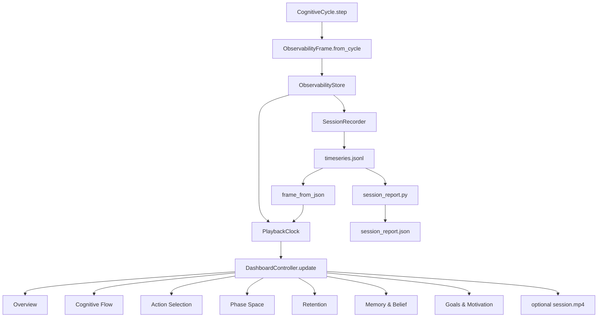

# سند معماری فارسی PHCA Cognitive Observatory

## هدف سند

این سند برای کسی نوشته شده است که هیچ پیش‌زمینه‌ای از پروژه ندارد، اما می‌خواهد سریع و عمیق بفهمد PHCA Cognitive Observatory چیست، چرا ساخته شده، روی چه پایه‌های علمی و مهندسی ایستاده، در مسیر ۲۰ فازی Observatory (**فازهای ۷–۱۲ تکمیل‌شده**، فازهای ۱۳–۲۰ backlog) چه جایگاهی دارد، چه محدودیت‌هایی دارد، برای چه کاربردهایی مناسب است، و مسیر توسعه‌ی درست آن باید چگونه باشد.

نگاه این سند، نگاه یک معمار ارشد سیستم‌های پیچیده است: یعنی فقط توضیح فایل‌ها یا چند کامپوننت نیست؛ بلکه تلاش می‌کند مرزهای مالکیت داده، قراردادهای معماری، ریسک‌های سیستم، بدهی فنی، الزامات مشاهده‌پذیری، و آینده‌ی توسعه را روشن کند.

---

## خلاصه اجرایی

PHCA Cognitive Observatory یک لایه‌ی مشاهده‌پذیری، بازپخش و گزارش‌گیری برای معماری شناختی PHCA است. این سیستم هر چرخه‌ی شناختی عامل را به یک فریم ساخت‌یافته تبدیل می‌کند، آن را به صورت زنده در داشبورد PyQt5 نمایش می‌دهد، در قالب JSONL ضبط می‌کند، امکان replay و scrub روی جلسات گذشته را می‌دهد، و از روی همان داده‌ها گزارش آفلاین می‌سازد.

**فازهای ۷–۱۲ Observatory تکمیل شده‌اند** (۲۰۲۶-۰۷). فاز ۷ پایه‌ی مشاهده‌پذیری شناختی را ساخت؛ فازهای ۸–۱۲ replay/scrub، schema governance، report parity، performance برای sessionهای بزرگ، و `--compare` چند session را اضافه کردند. فازهای ۱۳–۲۰ backlog هستند — [STATUS.md](../STATUS.md).

بالاترین ریسک‌های معماری در این مرحله عبارت‌اند از:

- نمایش اشتباه داده به کاربر به دلیل اختلاف واحدها، schema drift یا replay/live mismatch.
- ذخیره یا بازسازی ناقص JSONL که باعث شود replay با اجرای زنده یکی نباشد.
- state محلی شکننده در پنل‌های داشبورد که هنگام seek، scrub یا replay به‌درستی بازسازی نشود.
- بزرگ شدن بیش از حد `qt_dashboard.py` و پراکندگی منطق مشترک بین dashboard، report و replay.
- وجود مسیرهای legacy مثل render/static replay که ممکن است با داشبورد PyQt همگام نباشند.

استراتژی درست توسعه در فاز فعلی این است: اول درستی، صداقت و تکرارپذیری؛ سپس زیبایی و غنای بصری. هیچ پنلی نباید چیزی را با اطمینان نمایش دهد که در داده‌ی live یا JSONL وجود ندارد. اگر داده live-only است باید واضح برچسب بخورد. اگر replay ناقص است باید صادقانه اعلام شود. اگر گزارش آفلاین چیزی را از داشبورد کم دارد، باید یا تکمیل شود یا محدودیت آن مستند شود.

---

## PHCA چیست؟

PHCA را می‌توان یک معماری شناختی چندلایه دانست که تلاش می‌کند رفتار یک عامل را نه صرفاً بر اساس policy یا reward، بلکه بر اساس چرخه‌ای از ادراک، پیش‌بینی، خطا، انگیزش، توجه، حافظه، انتخاب عمل و محدودیت منابع بسازد.

در این معماری، عامل در هر چرخه‌ی شناختی:

1. مشاهده‌ی محیط را دریافت می‌کند.
2. آن را پاک‌سازی یا sanitize می‌کند.
3. وضعیت فعلی را در حافظه‌ی کاری می‌نویسد.
4. وضعیت آینده را پیش‌بینی می‌کند.
5. خطای پیش‌بینی را محاسبه می‌کند.
6. بر اساس خطا، اطمینان، driveها و هدف‌ها تصمیم می‌گیرد.
7. عمل را انتخاب می‌کند.
8. منابع و محدودیت‌ها را با RBTA بررسی می‌کند.
9. حافظه و باورهای خود را به‌روزرسانی می‌کند.
10. یک snapshot قابل مشاهده برای انسان تولید می‌کند.

PHCA Cognitive Observatory لایه‌ای است که این چرخه را به زبان دیداری، تحلیلی و قابل replay تبدیل می‌کند.

---

## چرا Observatory لازم است؟

در سیستم‌های شناختی پیچیده، فقط دانستن خروجی کافی نیست. باید بدانیم:

- عامل چه چیزی را دیده است؟
- وضعیت فعلی را چگونه تفسیر کرده است؟
- چه چیزی را پیش‌بینی کرده است؟
- پیش‌بینی چقدر دقیق بوده است؟
- چرا این action انتخاب شده است؟
- آیا action از مسیر exploit آمده یا explore؟
- کدام drive فعال بوده است؟
- حافظه‌ی episodic و semantic چه نقشی داشته‌اند؟
- RBTA آیا محدودیتی را دیده یا نه؟
- latency و مصرف منابع چقدر بوده است؟
- replay همان رفتار live را نشان می‌دهد یا فقط شبیه‌سازی ناقص است؟

بدون Observatory، سیستم شبیه یک جعبه‌سیاه می‌شود. با Observatory، سیستم به یک جعبه‌شیشه‌ای نزدیک می‌شود: هنوز پیچیده است، اما قابل بررسی، قابل نقد، قابل replay و قابل گزارش‌گیری می‌شود.

---

## جایگاه فاز ۷ در مسیر ۲۰ فازی

مسیر ۲۰ فازی Observatory: **فازهای ۷–۱۲ تکمیل‌شده**. نباید انتظارات فاز ۱۵ یا ۲۰ را به آنچه هنوز backlog است تحمیل کرد، و نباید کارهای تحویل‌شده در فازهای ۸–۱۲ را «باز» توصیف کرد.

### فازهای اولیه

فازهای اولیه معمولاً برای ساخت اجزای بنیادین هستند:

- تعریف محیط و observation.
- ساخت چرخه‌ی شناختی پایه.
- اتصال پیش‌بینی، خطا و انتخاب عمل.
- ایجاد حافظه‌ی اولیه.
- اضافه کردن driveها و goalها.
- ایجاد محدودیت‌های resource و safety.

### فاز ۷

> **وضعیت: تکمیل (۲۰۲۶-۰۷).** frame schema، ضبط JSONL، داشبورد ۷ تب PyQt،
> `session_report.py`، helperهای مشترک `cognitive_panels.py`، نرمال‌سازی واحد RBTA،
> و دروازه‌ی `--check`. **۲۷۸ تست monitoring** (۶۲۳ کل با MuJoCo).

فاز ۷ یعنی سیستم باید خودش را نشان دهد. این فاز نقطه‌ی گذار از «فقط اجرا شدن» به «قابل فهم بودن» است.

در فاز ۷ انتظار داریم:

- هر cycle به یک frame قابل ضبط تبدیل شود.
- frame schema پایدار شود.
- dashboard چندپنلی رفتار عامل را توضیح دهد.
- replay از JSONL ممکن شود.
- گزارش آفلاین ساخته شود.
- live و replay از هم جدا و صادقانه برچسب بخورند.
- داده‌های heavy مثل تصویر یا rolloutهای حجیم، بی‌دلیل JSONL را بزرگ نکنند.

### آنچه در فازهای ۸–۱۲ تحویل شد

- **فاز ۸:** seek/scrub با `PlaybackClock`، `rebuild_histories()`، transport bar، bannerهای replay.
- **فاز ۹:** `schema_version: 1`، نرمال‌سازی v0، شکست `--check` برای schema مختلط.
- **فاز ۱۰:** parity گزارش آفلاین با Overview از helperهای مشترک.
- **فاز ۱۱:** rebuild decimated؛ بودجه‌ی scrub ≤۲s/≤۴s در ۳۰۰۰+ cycle.
- **فاز ۱۲:** `--compare` چند session (D-115).

### فازهای آینده (۱۳–۲۰ backlog)

از فاز ۱۳ تا ۲۰، انتظار بلوغ بیشتر است:

- تشخیص anomaly (spike، drift، leak، ناپایداری goal).
- توضیح‌پذیری عمیق‌تر action.
- API پایدار observability.
- production hardening.
- Observatory چند عاملی.
- تحلیل تعاملی روی session.
- اعتبارسنجی علمی و reproducibility یک‌دست.
- sign-off بلوغ فاز ۲۰.

---

## نمای کلی معماری

جریان اصلی داده در سیستم چنین است:

این نمودار نشان می‌دهد که قلب Observatory یک اصل ساده است: هر cycle باید به یک frame تبدیل شود، و تمام viewها، replayها و reportها باید یا از همان frame یا از JSONL بازسازی‌شده‌ی همان frame تغذیه شوند.

---

## مرزهای مالکیت داده

یکی از مهم‌ترین اصول معماری در این سیستم، مالکیت روشن داده است.

### ۱. Runtime / CognitiveCycle

چرخه‌ی شناختی مالک حقیقت زنده است. فقط این بخش حق دارد از اجزای زنده مثل محیط، مدل پیش‌بینی، حافظه، RBTA و driveها بخواند.

مسئولیت‌ها:

- اجرای step.
- تولید observation و action.
- به‌روزرسانی state، prediction، memory و metrics.
- ساخت snapshot از طریق `ObservabilityFrame.from_cycle()`.

خطر مهم:

- اگر dashboard یا report مستقیماً به objectهای زنده وصل شوند، thread-safety و reproducibility از بین می‌رود.

### ۲. Frame Schema

`ObservabilityFrame` قرارداد مرکزی مشاهده‌پذیری است. این frame باید snapshot باشد، نه view زنده از objectهای mutating.

مسئولیت‌ها:

- نگهداری داده‌ی یک cycle.
- تفکیک داده‌های سبک و قابل ضبط از داده‌های live-only.
- حفظ سازگاری با schemaهای قدیمی.

اصل مهم:

- dashboard و report نباید frame را mutate کنند.

### ۳. Store / Recorder

`ObservabilityStore` buffer زنده است. `SessionRecorder` frameها را به JSONL تبدیل می‌کند.

مسئولیت‌ها:

- نگهداری frameهای اخیر.
- drain کردن frameهای جدید.
- نوشتن دقیق یک خط JSONL برای هر cycle کامل.

خطر مهم:

- اگر line count با meta cycles نخواند، session ناقص است و checker باید fail کند.

### ۴. Replay Loader

`frame_from_json()` وظیفه دارد JSONL را دوباره به `ObservabilityFrame` تبدیل کند.

مسئولیت‌ها:

- بازسازی arrayها با نوع مناسب.
- تحمل schemaهای قدیمی.
- عدم ساخت داده‌ی جعلی مگر با برچسب روشن.

خطر مهم:

- اگر فیلدی در `to_json()` ذخیره شود ولی در `frame_from_json()` درست restore نشود، replay نادرست می‌شود.

### ۵. Dashboard Controller

`DashboardController.update()` frame را به همه‌ی پنل‌ها توزیع می‌کند.

مسئولیت‌ها:

- تشخیص live یا replay.
- rebuild history هنگام seek یا jump.
- جلوگیری از double append.
- حفظ هماهنگی هفت پنل.

خطر مهم:

- اگر یک پنل history را append کند ولی پنل دیگر rebuild کند، scrub desync رخ می‌دهد.

### ۶. Tab-local State

هر پنل داشبورد state محلی خودش را دارد: history، smoother، cache، projection، layout و غیره.

مسئولیت‌ها:

- نمایش سریع و کم‌لرزش.
- بازسازی دقیق هنگام replay seek.
- عدم تغییر frame.

خطر مهم:

- state محلی اگر با cycle_id یا rebuild هماهنگ نباشد، پنل داده‌ی قدیمی نشان می‌دهد.

### ۷. Report Generation

`session_report.py` باید از JSONL، نه از state زنده، گزارش بسازد.

مسئولیت‌ها:

- ساخت خلاصه‌ی قابل تکرار از session.
- هم‌راستا بودن با منطق dashboard.
- گزارش شکاف‌های live-only.

خطر مهم:

- اگر report helperها را از dashboard import کند ولی dashboard تغییر کند، coupling پنهان ایجاد می‌شود.

---

## پایه‌های علمی و مفهومی

PHCA Cognitive Observatory فقط یک UI نیست. پشت آن چند ایده‌ی علمی و معماری قرار دارد.

### Predictive Processing

عامل دائماً آینده را پیش‌بینی می‌کند. اگر پیش‌بینی با مشاهده‌ی بعدی فرق داشته باشد، prediction error تولید می‌شود. این خطا فقط یک metric نیست؛ سوخت یادگیری و تنظیم رفتار است.

در dashboard:

- prediction در Phase Space دیده می‌شود.
- prediction error در Overview و Cognitive Flow نمایش داده می‌شود.
- per-dim PEU اگر موجود باشد، نشان می‌دهد کدام بعد state مشکل‌ساز است.

### Active Inference / Error Minimization

عامل فقط منفعلانه پیش‌بینی نمی‌کند؛ action انتخاب می‌کند تا وضعیت آینده را به هدف یا باور مطلوب نزدیک کند. این نگاه شبیه active inference است: عمل برای کاهش عدم‌قطعیت، کاهش خطا یا رسیدن به drive هدف انتخاب می‌شود.

در dashboard:

- Action Selection نشان می‌دهد action از explore آمده یا exploit.
- candidate_scores نشان می‌دهد گزینه‌ها چگونه رتبه‌بندی شده‌اند.
- continuous_action یا last_action_vector نشان می‌دهد عمل نهایی چه برداری بوده است.

### Bounded Rationality

عامل منابع نامحدود ندارد. زمان، حافظه، انرژی و latency محدود هستند. RBTA این محدودیت را به سیستم وارد می‌کند.

در dashboard:

- Cognitive Flow زمان هر module را نشان می‌دهد.
- Retention منابع و envelope را نشان می‌دهد.
- RBTA violations نشان می‌دهد کدام constraint نقض شده است.

### Memory Systems

سیستم بین حافظه‌های مختلف تمایز می‌گذارد:

- M1: sensory buffer.
- M2: working memory.
- M3: episodic memory.
- M4: semantic/consolidated facts.

در Memory & Belief:

- M3 و M4 اگر live یا compactly recorded باشند نمایش داده می‌شوند.
- اگر live-only باشند، replay باید صادقانه بگوید unavailable.

### Attention

Attention تعیین می‌کند کدام بخش‌های state یا memory برجسته‌تر هستند. attention_indices و attention_saliences برای فهم تمرکز عامل مهم‌اند.

در dashboard:

- attention salience در Overview و Flow می‌تواند نمایش داده شود.
- اگر attention_weights در JSONL نیست، replay نباید وانمود کند وجود دارد.

### Goal / Motivation

MDIM و driveها تعیین می‌کنند عامل دنبال چه چیزی است. drive_levels، drive_targets، drive_deficits، goal_stack و pareto_front برای فهم motivation مهم‌اند.

در Goals & Motivation:

- tankها سطح drive را نشان می‌دهند.
- deficitها فاصله از setpoint را نشان می‌دهند.
- goal stack مسیر تصمیم‌گیری انگیزشی را نشان می‌دهد.

---

## اجزای اصلی سیستم

### ObservabilityFrame

این frame یک snapshot از یک cycle است.

ویژگی‌های مهم:

- باید copy یا مقدار مستقل داشته باشد.
- نباید reference زنده به objectهای mutating بدهد.
- باید برای JSONL سبک شود.
- باید backward-compatible بماند.

دسته‌بندی فیلدها:

- فیلدهای بنیادی: cycle_id، env_kind، latency، prediction_error.
- فیلدهای محیط: grid، agent_pos، goal_pos، obs_vector، env_frame.
- فیلدهای شناختی: predicted_state، gprime_uncertainty، drive_levels، goal_stack.
- فیلدهای action: candidate_scores، continuous_action، last_action_vector.
- فیلدهای resource: module_timings، runtime_log، memory_log، energy_log، rbta_bounds.
- فیلدهای memory: m3_recent، m3_top_error، m4_relevant، m4_top.

### JSONL

JSONL باید lean باشد. یعنی هر cycle یک خط، با داده‌ی کافی برای replay و report، اما بدون payloadهای بسیار سنگین.

اصل مهم:

- اگر چیزی برای replay حیاتی است و حجم کمی دارد، ذخیره شود.
- اگر چیزی heavy است، live-only بماند ولی banner داشته باشد.
- اگر چیزی از فیلدهای دیگر قابل synthesize است، با احتیاط و برچسب ساخته شود.

### PlaybackClock

PlaybackClock cursor روی frameهاست.

در live:

- frameها به buffer اضافه می‌شوند.
- cursor معمولاً tail را دنبال می‌کند.
- pause و scrub باید history را خراب نکنند.

در replay:

- frame list ثابت است.
- seek باید باعث rebuild history شود.
- sequential tick نباید بی‌دلیل rebuild کامل کند.

### DashboardController

Controller هماهنگ‌کننده‌ی پنل‌هاست.

نقش اصلی:

- frame را به همه‌ی tabها بدهد.
- rolling history را هنگام seek یا jump به همه‌ی tabها بدهد.
- replay flag را تنظیم کند.
- از redundant repaint جلوگیری کند.

این بخش باید کوچک و قابل اعتماد بماند. اگر منطق زیادی در آن جمع شود، کل UI شکننده می‌شود.

---

## هفت پنل داشبورد

### ۱. Overview

Overview نمای مدیریتی سیستم است. هدف آن این است که انسان در چند ثانیه بفهمد:

- عامل کجاست؟
- هدف چیست؟
- خطای پیش‌بینی بالا رفته یا پایین؟
- RBTA وضعیت عادی دارد یا نه؟
- action اخیر چه بوده؟
- drive فعال چیست؟

پیچیدگی:

- باید برای grid و MuJoCo/continuous قابل استفاده باشد.
- باید live camera یا schematic fallback را صادقانه نشان دهد.
- نباید replay را با live camera اشتباه بگیرد.

ریسک:

- اگر camera frame با cycle_id هماهنگ نباشد، UI ممکن است تصویر یک cycle و cognition cycle دیگری را نشان دهد.

### ۲. Cognitive Flow

این پنل pipeline شناختی را نشان می‌دهد:

- sanitize
- memory_write
- prediction
- PEU
- TSPL
- action_selection
- RBTA
- side modules مثل MDIM، attention، HPM، consolidation

هدف:

- فهم bottleneck.
- فهم near-bound.
- دیدن learning burst.
- فهم اینکه کدام module هزینه‌ی زمانی بیشتری دارد.

پیچیدگی:

- `module_timings` بر حسب میلی‌ثانیه است.
- `rbta_bounds.time` در core بر حسب ثانیه است.
- اگر normalization واحد درست نباشد، پنل دروغ می‌گوید.

اصل معماری:

- همه‌ی منطق alias و unit باید shared باشد، نه پراکنده در Flow، Retention و Report.

### ۳. Action Selection

این پنل توضیح می‌دهد چرا action انتخاب شد.

نمایش‌ها:

- explore vs exploit.
- epsilon.
- candidate_scores.
- chosen index.
- continuous action vector.
- rollout cloud اگر موجود باشد.

پیچیدگی:

- در explore ممکن است score table وجود نداشته باشد.
- در replay ممکن است candidate_rollouts live-only باشد.
- continuous و discrete action باید جدا تفسیر شوند.

ریسک:

- نشان دادن score قدیمی در cycle جدید یک خطای P0 است، چون decision را غلط توضیح می‌دهد.

### ۴. Phase Space

این پنل وضعیت باور/فضای حالت را نشان می‌دهد.

حالت‌ها:

- برای grid: مسیر عامل و error map.
- برای continuous/MuJoCo: projection، uncertainty ellipse، predicted vs reference، per-dim error.

پیچیدگی:

- projection ممکن است نیاز به warm-up داشته باشد.
- per_dim_peu ممکن است طول متفاوتی از predicted_state داشته باشد.
- paging در high-dimensional state باید امن باشد.

ریسک:

- index mismatch در PEU layer می‌تواند paint crash ایجاد کند.

### ۵. Retention

این پنل منابع و حافظه را نشان می‌دهد.

نمایش‌ها:

- M3 count.
- M4 count.
- RSS.
- latency.
- RBTA bounds.
- violation table.

پیچیدگی:

- time bound باید با واحد درست مقایسه شود.
- memory و energy log ممکن است تخمینی باشند.
- prune events باید با history درست هماهنگ باشند.

### ۶. Memory & Belief

این پنل حافظه و باور را نشان می‌دهد.

نمایش‌ها:

- belief entropy.
- gprime uncertainty.
- M3 episodic items.
- M4 facts.
- sanitized/raw diff اگر موجود باشد.

پیچیدگی:

- بسیاری از فهرست‌های M3/M4 ممکن است live-only باشند.
- replay نباید وانمود کند که M3/M4 کامل دارد.
- m3_top_error compact می‌تواند برای replay مفید باشد، ولی bulk memory نباید JSONL را سنگین کند.

### ۷. Goals & Motivation

این پنل نشان می‌دهد عامل چه می‌خواهد.

نمایش‌ها:

- drive levels.
- drive targets.
- deficits.
- goal stack.
- goal history.
- pareto front.
- empowerment و temperature.

پیچیدگی:

- goal_stack ممکن است nested و متغیر باشد.
- drive_goals ممکن است live-only باشد.
- replay باید فرق بین recorded history و unavailable live vectors را مشخص کند.

---

## Live در برابر Replay

یکی از مهم‌ترین اصول Observatory این است:

> replay نباید ادعا کند همان داده‌ی live را دارد، مگر اینکه واقعاً در JSONL ضبط شده باشد.

### داده‌های مناسب برای JSONL

- scalarها.
- vectorهای کوچک.
- histories کوتاه و downsample شده.
- labels.
- module timings.
- compact summaries.

### داده‌های live-only

- env/camera frames.
- rolloutهای حجیم.
- bulk M3/M4 lists.
- objectهای زنده.
- داده‌هایی که هزینه‌ی serialization بالایی دارند.

### سیاست درست bannerها

هر پنل replay باید یکی از این حالت‌ها را روشن کند:

- این داده از JSONL بازسازی شده است.
- این داده live-only است و در replay موجود نیست.
- این داده از فیلدهای موجود synthesize شده است.
- این subview در replay عمداً غیرفعال است.

عبارت‌های مبهم مثل «may differ» کافی نیستند اگر واقعاً یک فیلد recorded یا unavailable است.

---

## محدودیت‌های فعلی

فازهای ۷–۱۲ Observatory تکمیل شده‌اند؛ محدودیت‌های باقی‌مانده backlog صادقانه هستند، نه کارهای تحویل‌نشده‌ی فاز ۷–۱۱.

### حل‌شده در فازهای ۷–۱۲

| حوزه | راه‌حل |
|------|--------|
| schema versioning | فاز ۹ — `schema_version: 1`، نرمال‌سازی v0، `--check` fail-closed |
| desync replay/scrub | فاز ۸ — `PlaybackClock`، `rebuild_histories()`، transport |
| parity خلاصه گزارش | فاز ۱۰ — `format_session_results_lines()` مشترک با Overview |
| lag scrub session بزرگ | فاز ۱۱ — rebuild decimated؛ بودجه ≤۲s/≤۴s در ۳۰۰۰+ cycle |
| compare چند session | فاز ۱۲ — `phca_replay.py --compare` (D-115) |

### محدودیت‌های باقی‌مانده

**فیلدهای live-only در JSONL.** فریم دوربین، rollout کامل، لیست‌های bulk M3/M4 و `drive_goals` ذخیره نمی‌شوند. پنل‌های replay باید banner صریح داشته باشند.

**مسیر legacy matplotlib/static replay.** مسیر canonical: PyQt `--qt`.

**backlog فازهای ۱۳–۲۰.** anomaly detection، explainability عمیق‌تر، API، multi-agent و sign-off فاز ۲۰ هنوز نیست.

**performance باقیمانده.** فاز ۱۱ scrub را mitigate می‌کند؛ پنل‌های paint-heavy در live بسیار طولانی ممکن است هنوز CPU بخواهند.

**شکاف subview گزارش.** `session_report.json` summaryهای کلیدی را پوشش می‌دهد؛ هر subview live-only را by design تکرار نمی‌کند.

---

## کاربردهای بالقوه

### ۱. پژوهش شناختی

محقق می‌تواند ببیند عامل چگونه خطا، حافظه، توجه و drive را در تصمیم دخیل می‌کند.

پیچیدگی:

- نیاز به sessionهای قابل مقایسه.
- نیاز به metadata دقیق.
- نیاز به گزارش‌های آماری معتبر.

### ۲. Debugging سیستم‌های عامل‌محور

وقتی عامل رفتار عجیب دارد، Observatory نشان می‌دهد مشکل در prediction است، action selection، memory، attention یا RBTA.

پیچیدگی:

- UI باید اشتباه نگوید.
- replay باید قابل اعتماد باشد.

### ۳. Safety و Resource Auditing

RBTA می‌تواند نشان دهد کدام module از bound خارج شده است.

پیچیدگی:

- واحدها باید دقیق باشند.
- near-bound و violation نباید false positive داشته باشند.

### ۴. آموزش و دمو

داشبورد می‌تواند برای توضیح معماری شناختی به انسان استفاده شود.

پیچیدگی:

- UI باید readable و داستان‌گو باشد.
- jargon باید با caption و narrative توضیح داده شود.

### ۵. Benchmarking

می‌توان sessionهای مختلف را با هم مقایسه کرد:

- کدام مدل prediction بهتر است؟
- کدام environment سخت‌تر است؟
- کدام drive بیشتر فعال می‌شود؟
- latency چگونه تغییر می‌کند؟

پیچیدگی:

- نیاز به schema پایدار.
- نیاز به report قابل ماشین‌خواندن.

### ۶. تحلیل رفتار در محیط‌های continuous

در MuJoCo/Reacher/Pendulum، action و state چندبعدی هستند و نیاز به projection و per-dim diagnostics دارند.

پیچیدگی:

- PCA/projection باید با احتیاط تفسیر شود.
- uncertainty باید با مقیاس درست نمایش داده شود.

---

## اصول توسعه از فاز ۷ به بعد

### اصل ۱: درستی قبل از زیبایی

اگر UI زیبا باشد ولی data غلط نشان دهد، سیستم خطرناک است.

### اصل ۲: JSONL منبع replay است

هر چیزی که replay نشان می‌دهد باید یا در JSONL باشد یا صادقانه synthesize شود.

### اصل ۳: frame ground truth نباید mutate شود

dashboard و report فقط مصرف‌کننده‌اند.

### اصل ۴: shared helpers باید منبع حقیقت باشند

منطق‌هایی مثل:

- RBTA alias.
- unit normalization.
- cognitive moments.
- action status.
- flow status.
- phase status.

نباید در چند فایل duplicate شوند.

### اصل ۵: تست رفتاری بهتر از pixel-perfect است

در PyQt، تست pixel-perfect شکننده است. بهتر است رفتار تست شود:

- history length.
- no double append.
- replay flag.
- no crash in paint.
- correct label/caption.
- correct normalized ratio.

### اصل ۶: legacy باید یا محدود شود یا حذف

وجود مسیرهای قدیمی بد نیست، اما اگر کاربر فکر کند هم‌سطح مسیر جدید هستند، مشکل ایجاد می‌شود.

---

## مسیر توسعه پیشنهادی فاز ۷ تا ۲۰

### فاز ۷: تثبیت مشاهده‌پذیری

> **وضعیت: تکمیل (۲۰۲۶-۰۷).** [observability.md](observability.md).

هدف:

- frame schema قابل اعتماد.
- dashboard live قابل فهم.
- replay از JSONL.
- report پایه.

کارهای حیاتی:

- اصلاح unit mismatch.
- اصلاح replay checker.
- اصلاح crashهای draw.
- مستندسازی live-only fields.

### فاز ۸: سخت‌سازی replay و scrub

> **وضعیت: تکمیل (۲۰۲۶-۰۷).** `PlaybackClock` seek/scrub، `rebuild_histories()` روی همه پنل‌ها، transport bar، bannerهای replay، تست immutability ۵۰۰ فریم.

هدف:

- seek/jump بدون desync.
- history rebuild درست در همه‌ی پنل‌ها.
- replay banner دقیق.

### فاز ۹: schema governance

> **وضعیت: تکمیل (۲۰۲۶-۰۷).** `OBSERVABILITY_SCHEMA_VERSION = 1`، نرمال‌سازی v0، شکست `--check` برای schema ناشناخته/مختلط (D-110).

هدف:

- schema_version.
- migration policy.
- compatibility tests.

### فاز ۱۰: report parity

> **وضعیت: تکمیل (۲۰۲۶-۰۷).** `session_report.json` با Overview از `format_session_results_lines()` مشترک؛ تست parity در `test_session_report.py` (D-112).

هدف:

- report آفلاین هم‌سطح dashboard در summaryهای کلیدی.
- خروجی JSON برای benchmark.

### فاز ۱۱: performance برای sessionهای بزرگ

> **وضعیت: تکمیل (۲۰۲۶-۰۷).** rebuild decimated + lazy per-tab؛ بودجه scrub ≤۲s/≤۴s در ۳۰۰۰+ cycle.

هدف:

- ۳۰۰۰+ cycle بدون کندی شدید.
- cache invalidation درست.
- lazy rendering.

### فاز ۱۲: multi-session comparison

> **وضعیت: تکمیل (۲۰۲۶-۰۷).** `phca_replay.py --compare` + `compare_session_reports()` با delta ساخت‌یافته و `--compare-output` JSON (D-115).

هدف:

- مقایسه‌ی چند session.
- نمودارهای trend بین اجراها.
- regression detection.

### فاز ۱۳: anomaly detection

هدف:

- تشخیص خودکار spike، drift، resource leak، unstable goals.

### فاز ۱۴: توضیح‌پذیری action

هدف:

- توضیح بهتر انتخاب action.
- causal chain از drive تا action.

### فاز ۱۵: observability API

هدف:

- API پایدار برای ابزارهای بیرونی.
- امکان export به فرمت‌های تحلیلی.

### فاز ۱۶: production hardening

هدف:

- crash isolation.
- session integrity.
- diagnostic logs.

### فاز ۱۷: distributed / multi-agent observatory

هدف:

- مشاهده‌ی چند عامل.
- همگام‌سازی timelineها.

### فاز ۱۸: interactive analysis

هدف:

- query روی session.
- فیلتر cognitive moments.
- انتخاب فریم‌های مهم.

### فاز ۱۹: scientific validation

هدف:

- اعتبارسنجی فرضیه‌های شناختی.
- benchmark رسمی.
- reproducibility package.

### فاز ۲۰: بلوغ محصول/پژوهش

هدف:

- معماری پایدار.
- مستندات کامل.
- تست‌های جامع.
- UI قابل اعتماد.
- گزارش‌های قابل استناد.

---

## چک‌لیست معماری برای ادامه کار

قبل از هر تغییر مهم باید پرسید:

- آیا این داده در live و replay یکی است؟
- اگر نیست، آیا banner دارد؟
- آیا این منطق در report هم لازم است؟
- آیا helper مشترک دارد؟
- آیا JSONL بی‌دلیل سنگین می‌شود؟
- آیا frame mutate می‌شود؟
- آیا seek/scrub history را درست بازسازی می‌کند؟
- آیا session ناقص fail می‌شود؟
- آیا تست رفتاری وجود دارد؟
- آیا مستندات به‌روز شده‌اند؟

---

## جمع‌بندی

PHCA Cognitive Observatory (فازهای ۷–۱۲ تکمیل‌شده) یک ابزار تزئینی نیست؛ بخشی از معماری اعتماد سیستم است. این لایه تعیین می‌کند آیا انسان می‌تواند رفتار عامل را بفهمد، replay کند، گزارش بگیرد و خطاهای شناختی یا منابعی را پیدا کند یا نه.

اگر این لایه درست ساخته شود، PHCA از یک سیستم پیچیده‌ی مبهم به یک سیستم قابل مشاهده، قابل نقد و قابل توسعه تبدیل می‌شود. اگر این لایه غلط ساخته شود، حتی اگر خود عامل خوب کار کند، انسان ممکن است برداشت اشتباه داشته باشد.

مسیر درست از اینجا به بعد روشن است:

- اول correctness.
- بعد replay honesty.
- بعد report parity.
- بعد performance.
- بعد richer storytelling.
- و در تمام مسیر، مستندات و تست‌های رفتاری باید هم‌پای کد رشد کنند.

این نگاه باید تا فاز ۲۰ حفظ شود: سیستم شناختی بزرگ فقط با الگوریتم قوی ساخته نمی‌شود؛ با مشاهده‌پذیری دقیق، قراردادهای داده‌ی روشن، تست‌های قابل اعتماد، و UI صادقانه ساخته می‌شود.
