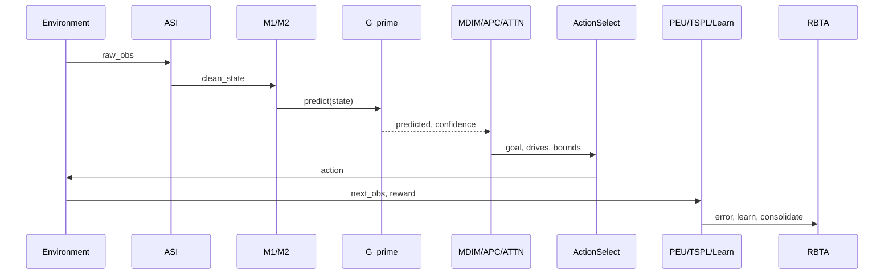

# Action Selection — Discrete vs Continuous

> **⚠️ Default behavior note (post D-156):** This document describes the
> **opt-in blended scorer path** (`--enable-blended-scorer`). In the current
> default configuration (`disable_blended_scorer=True`), discrete GridWorld
> uses **pure BFS/Manhattan geometry** without prediction scoring.
> The original 0.03% collapse that motivated this default (D-156) was later
> found to be an RBTA bound-scaling artifact — after the fix, the ungated
> blended scorer reaches 77.8% (not 0.03%), but pure geometry at 97.1%
> remains the more reliable default for now. See the [footnote in README]
> and [DECISIONS.md D-159](DECISIONS.md#d-159) for details.
>
> The continuous MPC path (MuJoCo) is unaffected by this flag and always
> scores every candidate by G′ prediction.

PHCA uses **two distinct action-selection mechanisms** depending on the
environment's `ActionSpace`. This matters for interpreting **A4 (Prediction as
Primary)** claims.

---

## Temporal Cycle Order

Within one `CognitiveCycle.step()` (simplified temporal view):

**Note:** MDIM/APC/Attention/HPM run **before** action selection (P0-1 fix).
PEU, TSPL, and G′.learn run **after** `env.step()` using the new observation.

Step numbering in diagrams uses 0–19 as sub-step labels; "12 active steps" is
shorthand for the module pipeline above.

---

## Mode Comparison

| Aspect | Discrete **default** (GridWorld) | Discrete **opt-in** blended | Continuous (Pendulum, Reacher) |
|---|---|---|---|
| ActionSpace | `DiscreteSpace(n)` | same | `ContinuousSpace(low, high, dim)` |
| Selector | Pure BFS/Manhattan (`pure_geometry_ablation`) | G′-scored loop + agreement/confidence gating | MPC: sample K, predict each, pick best ŝ′ |
| Primary signal | Geometry / observed_grid / frontier | G′ prediction score + geometry prior | Predicted next state vs goal reference |
| A4 status (D-158) | Geometry as inductive bias (not prediction-primary) | Experimental path toward prediction-guided control | **Prediction-primary** (D-101) |
| How to enable | default (`disable_blended_scorer=True`) | `--enable-blended-scorer` / `disable_blended_scorer=False` | always |

---

## Default Discrete Path (geometry — current production default)

Under `InterventionConfig.disable_blended_scorer=True` (D-156/D-161),
`_select_action()` computes `_select_greedy_grid_action()` and **returns it
immediately** with `selector_mode=pure_geometry_ablation`. G′ still predicts
once per cycle for PEU/MDIM/regulation, but **does not choose the discrete action**.

- size ≥ 10: BFS first step (`bfs_action`)
- smaller grids: one-step Manhattan on `observed_grid`
- Partial-obs (D-160): planning uses `observed_grid` / frontier when goal unseen
- Task lock (goal visible): ε=0 exploration
- D5 energy-stay only when `hasattr(env, 'grid')` (D-135)

Goal-rate / L2 Φ-IQ under this default measure **planner competence**, not G′-control.

---

## Opt-in Blended Discrete Path

When `disable_blended_scorer=False` (after optional warmup cycles):

1. **G′ predicts** next state ŝ′ for each candidate action
2. **Action score** blends prediction score with geometry prior (drive-dependent weights)
3. **Adaptive confidence gating** and **agreement gating** (D-157/D-159) may override
   back to geometry when G′ disagrees persistently with the geometry suggestion
4. `selector_mode` is `prediction_scored` or `adaptive_geometry_fallback`

D-159/D-161: post-RBTA-fix, ungated blended can reach high goal rates at 10×10,
but pure geometry remains the more reliable default; neither mode wins all causal gates.

---

## Shared cycle context (both modes)

Regardless of selector mode:

- MDIM/APC/Attention/HPM run **before** action
- PEU, TSPL, G′.learn run **after** `env.step()`
- RBTA can force STAY (TERMINATE) or limit candidates (INTERRUPT)
- Attention weights modulate MLP gradients during learning (MLP path)

---

## Continuous MPC Path (Pendulum, Reacher)

Implemented in `_select_continuous_action()`:

1. Sample K=8 actions uniformly (A1 caps total forward passes)
2. For each candidate `a`, predict `ŝ′ = G′(s, a)`
3. Score against `env.get_goal_reference()`:
   `0.4·confidence + 0.5·alignment + 0.1·PGA`
4. ε-greedy exploration

No policy gradient or reward shaping in the selector.

**A4 falsification test:** injects over-budget timing and counts `predict()`
calls per candidate — PASS when ≥1 call per candidate.

---

## When to Cite Which Path

| Claim | Cite |
|---|---|
| "Prediction-primary control" | Continuous MPC only (default); or discrete **with** `--enable-blended-scorer` and evidence |
| "Geometry-primary GridWorld" | Default discrete path (`pure_geometry_ablation`, D-156/D-161) |
| "Hybrid / blended navigation" | Opt-in discrete blended path only |
| "Goal-directed navigation under default" | Geometry planner + causal gate (not G′-control) |
| "Memory-driven policy" | **Not supported** on current discrete default |

---

## Related

- [architecture.md](architecture.md) — full module map
- [mujoco_integration.md](mujoco_integration.md) — MuJoCo env details
- [IMPLEMENTATION_STATUS.md](../IMPLEMENTATION_STATUS.md) — A4 status matrix
