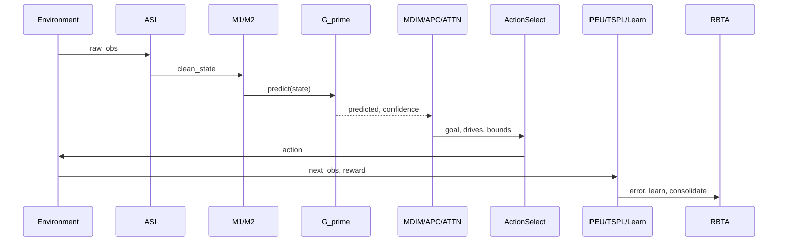

# Action Selection — Discrete vs Continuous

> **⚠️ Default behavior note (post D-156):** This document describes the
> **opt-in blended scorer path** (`--enable-blended-scorer`). In the current
> default configuration (`disable_blended_scorer=True`), discrete GridWorld
> uses **pure BFS/Manhattan geometry** without prediction scoring.
> The original 0.03% collapse that motivated this default (D-156) was later
> found to be an RBTA bound-scaling artifact — after the fix, the ungated
> blended scorer reaches 77.8% (not 0.03%), but pure geometry at 97.1%
> remains the more reliable default for now. See the [footnote in README]
> and [DECISIONS.md D-159](DECISIONS.md#d-159) for details.
>
> The continuous MPC path (MuJoCo) is unaffected by this flag and always
> scores every candidate by G′ prediction.

PHCA uses **two distinct action-selection mechanisms** depending on the
environment's `ActionSpace`. This matters for interpreting **A4 (Prediction as
Primary)** claims.

---

## Temporal Cycle Order

Within one `CognitiveCycle.step()` (simplified temporal view):

**Note:** MDIM/APC/Attention/HPM run **before** action selection (P0-1 fix).
PEU, TSPL, and G′.learn run **after** `env.step()` using the new observation.

Step numbering in diagrams uses 0–19 as sub-step labels; "12 active steps" is
shorthand for the module pipeline above.

---

## Mode Comparison

| Aspect | Discrete (GridWorld, Cartpole) | Continuous (Pendulum, Reacher) |
|---|---|---|
| ActionSpace | `DiscreteSpace(n)` | `ContinuousSpace(low, high, dim)` |
| Selector | Prediction-scored argmax with uncertainty-weighted geometry prior | MPC: sample K, predict each, pick best ŝ′ |
| Primary signal | G′ prediction score + geometry prior (confidence-weighted blend) | Predicted next state vs goal reference |
| A4 measured? | **Prediction-primary** (unified scorer, no task-lock bypass) | **Prediction-primary** (D-101, assumption validation) |
| Reward used? | No (GridWorld); env reward logged | No for selection |

---

## Unified Architecture (both discrete and continuous)

All action selection goes through the same prediction-scored path:

1. **G′ predicts** next state ŝ′ for each candidate action
2. **Prediction confidence** computed from G′ entropy (MC-dropout for MLP, mutual info for discrete)
3. **Action score** = `confidence * prediction_score + (1 - confidence) * geometry_prior`
   - Geometry prior is Manhattan/BFS gain to goal (discrete) or MPC sampling (continuous)
   - At low confidence, action leans on geometry heuristic; at high confidence, prediction dominates
4. **MDIM all 6 drives compete** via softmax (no `task_lock` override; D7 curiosity, D6 empowerment affect scoring)
5. **Attention weights** modulate MLP gradients during learning
6. **RBTA** checks time/memory/energy/entropy bounds on every cycle

This eliminates the old `task_lock` geometry-bypass path. The cognitive model (G′
prediction + MDIM drives + attention) is always engaged.

---

## Discrete Path (GridWorld)

Implemented via the unified scorer in `CognitiveCycle._select_action()`:

- **G′ prediction score** for each action
- **Confidence-weighted blend** with Manhattan/BFS heuristic
- **PGA** (predicted-goal-alignment) ramps cycles 50–150 (D-087)
- **MDIM** goal alignment (drive competition)
- **Partial-observability planning (D-160):** `_select_greedy_grid_action()`,
  `_build_planning_wall_grid()`, and `_compute_distance_gain()` read
  `getattr(env, "observed_grid", env.grid)` rather than `env.grid` directly.
  This ensures BFS/Manhattan routes only through walls that the agent has
  seen within its viewport (`partial_obs_radius`). When the goal has never
  been seen, `env.get_goal_position()` returns `None` and `_compute_distance_gain()`
  falls back to **frontier-based exploration**: `_find_frontier_cell()` finds the
  nearest cell with `_observed_cells == False` (a bool matrix in GridWorld tracking
  all cells ever within the viewport) and uses it as a proxy goal for distance-gain
  computation. This encourages the agent to move toward unexplored areas when the
  goal location is unknown, rather than returning 0.5 (neutral) for all actions.

**D5 energy-stay guard:** In cycle.py, the D5 energy-efficiency action (STAY when
energy is low) fires only when `hasattr(self.env, 'grid')` is true (GridWorld
environments). For non-grid environments (BanditEnv, MuJoCo), the guard falls
through to normal action selection so the stay_action is never returned (D-135).

---

## Continuous MPC Path (Pendulum, Reacher)

Implemented in `_select_continuous_action()`:

1. Sample K=8 actions uniformly (A1 caps total forward passes)
2. For each candidate `a`, predict `ŝ′ = G′(s, a)`
3. Score against `env.get_goal_reference()`:
   `0.4·confidence + 0.5·alignment + 0.1·PGA`
4. ε-greedy exploration

No policy gradient or reward shaping in the selector.

**A4 falsification test:** injects over-budget timing and counts `predict()`
calls per candidate — PASS when ≥1 call per candidate.

---

## When to Cite Which Path

| Claim | Cite |
|---|---|
| "Prediction-primary control" | All envs: unified scorer, task_lock bypass removed |
| "Hybrid cognitive map navigation" | GridWorld: G′ prediction + geometry uncertainty-weighted blend |
| "Goal-directed navigation" | GridWorld L2 Φ-IQ + causal gate |
| "Memory-driven policy" | **Not supported** on current discrete path |

---

## Related

- [architecture.md](architecture.md) — full module map
- [mujoco_integration.md](mujoco_integration.md) — MuJoCo env details
- [IMPLEMENTATION_STATUS.md](../IMPLEMENTATION_STATUS.md) — A4 status matrix
