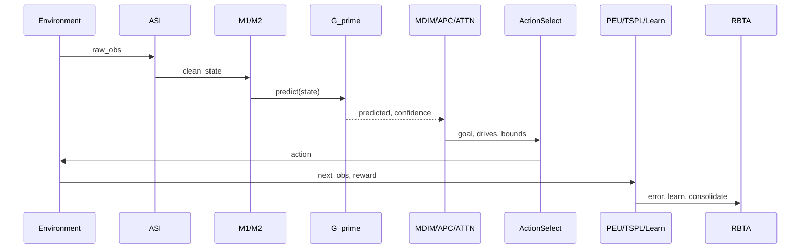

# Action Selection — Discrete vs Continuous

PHCA uses **two distinct action-selection mechanisms** depending on the
environment's `ActionSpace`. This matters for interpreting **A4 (Prediction as
Primary)** claims.

---

## Temporal Cycle Order

Within one `CognitiveCycle.step()` (simplified temporal view):

**Note:** MDIM/APC/Attention/HPM run **before** action selection (P0-1 fix).
PEU, TSPL, and G′.learn run **after** `env.step()` using the new observation.

Step numbering in diagrams uses 0–19 as sub-step labels; "12 active steps" is
shorthand for the module pipeline above.

---

## Mode Comparison

| Aspect | Discrete (GridWorld, Cartpole) | Continuous (Pendulum, Reacher) |
|---|---|---|
| ActionSpace | `DiscreteSpace(n)` | `ContinuousSpace(low, high, dim)` |
| Selector | Blended scorer / argmax | MPC: sample K, predict each, pick best ŝ′ |
| Primary signal | Manhattan gain + confidence + MDIM | Predicted next state vs goal reference |
| A4 measured? | **Partial** (geometry assists) | **Yes** (D-101, assumption validation) |
| Reward used? | No (GridWorld); env reward logged | No for selection |

---

## Discrete Path (GridWorld)

Implemented in `CognitiveCycle` discrete branch:

- **Manhattan distance gain** toward goal
- **Prediction confidence** from G′
- **PGA** (predicted-goal-alignment) ramps cycles 50–150 (D-087)
- **MDIM** goal alignment

The causal GridWorld policy additionally uses **task-lock observed-greedy
navigation** with sparse L3 coverage probes — it does **not** read M3/M4 for
action selection on grid tasks.

See [limitations.md](limitations.md) and [phca_causal_evidence.md](phca_causal_evidence.md).

**D5 energy-stay guard:** In cycle.py, the D5 energy-efficiency action (STAY when
energy is low) fires only when `hasattr(self.env, 'grid')` is true (GridWorld
environments). For non-grid environments (BanditEnv, MuJoCo), the guard falls
through to normal action selection so the stay_action is never returned (D-135).

---

## Continuous MPC Path (Pendulum, Reacher)

Implemented in `_select_continuous_action()`:

1. Sample K=8 actions uniformly (A1 caps total forward passes)
2. For each candidate `a`, predict `ŝ′ = G′(s, a)`
3. Score against `env.get_goal_reference()`:
   `0.4·confidence + 0.5·alignment + 0.1·PGA`
4. ε-greedy exploration

No policy gradient or reward shaping in the selector.

**A4 falsification test:** injects over-budget timing and counts `predict()`
calls per candidate — PASS when ≥1 call per candidate.

---

## When to Cite Which Path

| Claim | Cite |
|---|---|
| "Prediction-primary control" | Pendulum/Reacher MPC only |
| "Goal-directed navigation" | GridWorld L2 Φ-IQ + causal gate |
| "Memory-driven policy" | **Not supported** on current GridWorld discrete path |

---

## Related

- [architecture.md](architecture.md) — full module map
- [mujoco_integration.md](mujoco_integration.md) — MuJoCo env details
- [IMPLEMENTATION_STATUS.md](../IMPLEMENTATION_STATUS.md) — A4 status matrix
