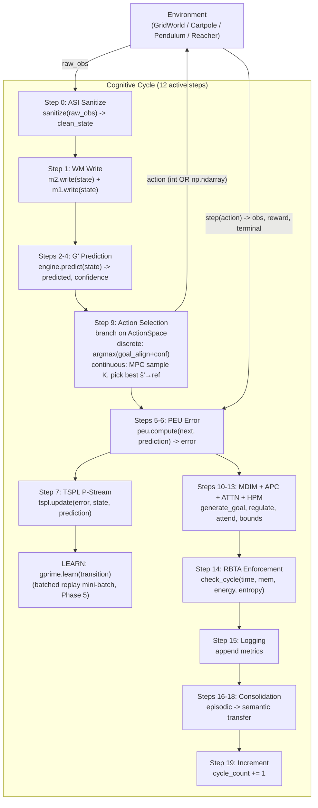

# PHCA v3.0 — Architecture

## Overview

PHCA (Predictive Hierarchical Cognitive Architecture) implements a **12-step cognitive cycle**
that transforms raw sensor input into goal-directed action through a pipeline of specialized
modules. The cycle runs at ~60–95 Hz on consumer hardware (~10–17 ms mean latency, MLP path,
this machine). **743 tests** pass (`make test-python` 707 + `make test-mujoco` 36);
Overall Φ-IQ **0.7323** (re-measured 2026-07-05). Pendulum-v1 (dim 1) and Reacher-v5 (dim 2)
emit true continuous actions via a prediction-driven MPC selector (Phase 6/7).

Formal specification: v3.0 (PHCA-3.1-011). Resource-bounded via the **Resource Bounded
Turing Supervisor (RBTA)** which enforces cycle-time, memory, energy, and entropy budgets
per the v3.0 specification §3.2–§4.

The agent runs in a GridWorld (discrete, 5×5 with walls) or a MuJoCo physics environment
(Cartpole, Pendulum, Reacher), perceives its state, predicts the next state, selects a
goal-directed action, learns from the prediction error, and self-regulates its exploration
and criticality via a PID controller and six homeostatic intrinsic drives (MDIM).

---

## System Diagram



---

## Cognitive Cycle (12 active steps)

| Step | Module | Operation |
| :--: | :--- | :--- |
| 0  | ASI   | `sanitize(raw_obs)` → `clean_state` (NaN/Inf/finite checks) |
| 1  | M1/M2 | `m2.write(state)` + `m1.write(state)` (working + sensory memory) |
| 2-4 | G'   | `engine.predict(state)` → `predicted, confidence` (Gaussian / discrete / MLP) |
| 8-13 | MDIM+APC+ATTN+HPM | query facts, generate goal, regulate, attend ( **before action** — P0-1) |
| 9  | Cycle | discrete: **task_lock observed-greedy** + sparse L3 coverage probe (D-112) when extrinsic goal present; else blended scorer; continuous: MPC (A4 primary) |
| 5-7 | PEU+TSPL+G' | post-step: `peu.compute`, `tspl.update`, `gprime.learn` |
| 14 | RBTA  | `check_cycle(runtime, mem, energy, entropy)`; TERMINATE→STAY, INTERRUPT→limit rollouts (D-113) |
| 15 | Cycle | Logging — append `metrics_history` |
| 16-18 | Consolidation | episodic → semantic transfer + M3 purge (10-cycle timer) |
| 19 | Cycle | `cycle_count += 1` |

The `gprime.learn(transition)` step (between TSPL and Step 9) is the dominant per-cycle
cost; in Phase 5 (D-092) the MLP replay-backward was vectorised from a per-sample Python
loop to batched NumPy matmuls, cutting `gprime_learn` from 35.55 ms → **5.09 ms** (−85.7%)
with no Φ-IQ regression.

---

## Module Map

| Module | File | Function |
| :--- | :--- | :--- |
| **ASI** | `phca/asi/sanitizer.py` | Input sanitization, NaN/Inf detection, finite checks |
| **M1 (Sensory)** | `phca/memory/m1_sensory.py` | Short-term sensory buffer (`capacity = 10 × sensor_dim` samples) |
| **M2 (Working)** | `phca/memory/m2_working.py` | Ring-buffer working memory with salience tracking |
| **G' (Engine)** | `phca/prediction/engine.py` | Prediction engine wrapping Gaussian / discrete / MLP G' |
| **G' (MLP)** | `phca/world_model/mlp.py` | Pure-NumPy MLP world model (38,868 params, hidden_dim=128; batched replay backward, Phase 5) |
| **PEU** | `phca/prediction/error_unit.py` | Precision-weighted prediction error |
| **TSPL** | `phca/learning/tspl.py` | Single-stream predictive learning (P-Stream only) |
| **MDIM** | `phca/motivation/mdim.py` | Multi-drive intrinsic motivation (6 drives) with softmax goal selection |
| **APC** | `phca/regulation/pid_controller.py` | Adaptive parameter control (PID-based modulation of T, η, α) |
| **ATTN** | `phca/attention/attention.py` | Precision-weighted sparse attention with Gumbel noise |
| **HPM** | `phca/hpm/parser.py` | Hierarchical procedure memory: composition operators + `compute_bounds()` |
| **RBTA** | `phca/regulation/rbta_enforcer.py` | Resource-Bounded Turing Supervisor: time/memory/energy/entropy enforcement; **INTERRUPT/TERMINATE alter cycle behavior** (skip feedback/consolidation, limit rollouts — P1-01) |
| **M3 (Episodic)** | `phca/memory/m3_episodic.py` | SQLite-backed episode store with batch commits |
| **Consolidation** | `phca/consolidation/scheduler.py` | Episodic → statistical fact extraction with periodic consolidation |
| **NoiseInjector** | `python/phca/asi/noise_injector.py` | Configurable Gaussian noise for observation stress testing; decay and warmup |
| **FallbackController** | `python/phca/resilience/fallback_controller.py` | Dual-signal fail-closed (entropy-band + FailureDetector notify); safe-action substitution |
| **Cycle** | `phca/core/cycle.py` | 12-step cognitive cycle orchestrator; branches on ActionSpace (discrete argmax / continuous MPC, Phase 6) |
| **GridWorld** | `phca/environments/grid_world.py` | Configurable grid environment (5×5, walls, obstacles, `relocate_goal`) |
| **MuJoCoEnv** | `phca/environments/mujoco_env.py` | MuJoCo wrapper: Cartpole discrete; **Pendulum + Reacher continuous** (Phase 6/7); `get_action_space()` + `get_goal_reference()` |
| **ActionSpace** | `phca/config.py` | `DiscreteSpace(n)` / `ContinuousSpace(low, high, dim)` union + helpers (Phase 6) |
| **Config** | `phca/config.py` | Global constants, resource bounds, `StreamID` (P-Stream only), `ActionSpace` types |

---

## Verified Invariants (A1–A5)

| Invariant | Enforcement |
| :--- | :--- |
| **A1** Resource Boundedness | RBTA time/memory/energy/entropy checks every cycle (composition tree reads energy from `energy_log`). **Measured (Phase 6/B2):** inject over-budget → ≥1 violation. |
| **A2** Temporal Causality | Pipeline ordering in the 12-step cycle; RBTA preflight/post enforcement (P1-01). **Measured (P1-02):** 10-step monitor — zero future-state timestamps at action selection. |
| **A3** Incomplete Knowledge | Belief entropy floor ≥ ε; semantic facts from consolidation wired into MDIM context. **Measured (Phase 6/B2):** 100-cyc min entropy ≥ 0.01. |
| **A4** Prediction as Primary | Every cycle computes sₜ→ŝₜ₊₁; MLP hidden_dim=128 (38,868 params). **Measured (Phase 6/B2):** continuous MPC selector calls predict per candidate. **OOD measured (Phase 6/B1):** blended confidence 0.97→0.26 as σ 0→1.0. |
| **A5** Feedback-Driven Adaptation | PEU error drives TSPL updates; error-modulated learning rate with per-dimension attention weights. **Measured (Phase 6/B2):** no-op learn → frozen weights (Δ 0.0000); active learn → weights update (Δ 0.043). |

Formal definitions and proofs in [research/outputs/07-rigorous-whitepaper.md](../research/outputs/07-rigorous-whitepaper.md).

---

## Φ-IQ Metric

```
Φ-IQ = 0.20·PredictionAccuracy + 0.20·AdaptationSpeed + 0.15·GoalComplexity
     + 0.15·TransferEfficiency + 0.20·ResourceEfficiency - 0.10·FailureRate
```

| Level | Name | What it measures | Result (this machine, 2026-07-03) |
| :--- | :--- | :--- | :--- |
| L0 | Stationary Prediction | Prediction accuracy, static env | 0.7032 |
| L1 | Reactive Control | Prediction under active control + action diversity | 0.7125 |
| L2 | Goal Pursuit | Goal-reaching rate in maze with walls/obstacles | 0.7773 |
| L3 | Self-Motivated Exploration | MDIM drive diversity + autonomy | 0.7683 |
| **Overall** | (MLP, 200 cyc/level) | weighted composite | **0.7323** (gate PASS) |

Gate floor: Overall ≥ 0.5486. Cycle latency < 500 ms (mean ~17 ms, p95 ~31 ms, this machine). Failure rate < 10% (0 violations).

---

## MuJoCo Environments

`MuJoCoSimpleEnv` wraps gymnasium MuJoCo environments into `EnvironmentProtocol` so the
cognitive cycle drives them unchanged. Pendulum-v1 (`ContinuousSpace([-2,2], dim=1)`) and
Reacher-v5 (`ContinuousSpace([-1,1]², dim=2)`) use an MPC-style, prediction-driven sampler;
Cartpole stays discrete. MuJoCo is opt-in (`requirements-mujoco.txt`); run headless with
`MUJOCO_GL=disabled`.

| Env | ID | Action space | State dim | Result (D-107) |
| :--- | :--- | :--- | :--- | :--- |
| Cartpole | `InvertedPendulum-v5` | Discrete (3: L / stay / R) | 4 | PASS — discrete, 0 violations |
| Pendulum | `Pendulum-v1` | **Continuous** (torque ∈ [-2,2], dim 1) | 3 | PASS — 7.1 ms, 0 violations, error 29.6→0.68 |
| Reacher  | `Reacher-v5` | **Continuous** (actuator ∈ [-1,1]², dim 2) | 10 | PASS — 4.4 ms, 0 violations, error 105.7→8.4 |

CI exercises 36 MuJoCo tests with `MUJOCO_GL=disabled`; the `make nightly` MuJoCo gate
(`check_benchmark_gate.py --mujoco`) asserts 0 violations + error↓ per env, with a `--neg-test`
proving the gate catches synthetic violations.

### Dynamic-Goal Curriculum (experimental)

`--dynamic-goals` relocates the L2 goal on a cadence; `--dynamic-goals-every N` controls it
(Phase 5 / D-094).

| Cadence | L2 Φ-IQ | Verdict |
| :--- | :--- | :--- |
| every-100 | 0.4316 | below 0.50 on this machine (D-090's 0.573 was machine-specific) |
| **every-75**  | **0.6444** | **validated** — L2 ≥ 0.50, L0/L1/L3 within noise of static |
| every-50 | 0.4324 | not achievable (consistent with D-087) |

Dynamic mode is experimental and measured separately from the canonical static benchmark.

---

## Key Design Decisions

- **EnvironmentProtocol** (`phca/environments/protocol.py`) decouples `CognitiveCycle` from
  any concrete environment. Any object implementing `get_action_names()`, `get_possible_actions()`,
  `get_goal_position()`, `get_observation()`, `get_action_space()`, `get_action_deltas()`,
  `neutral_action()`, `get_goal_reference()`, `get_state_dim()`, and `reset()` can drive
  the cycle (D-135). Both `GridWorld` and `MuJoCoSimpleEnv` implement it.
- **No terminal-on-goal.** The environment does not return terminal=True when the agent reaches
  the goal (D-070). Unlike RL episodic conventions, the PHCA cognitive architecture sustains
  goal achievement rather than resetting on success. The `goal_reached` flag is still reported
  in the info dict for benchmark metrics.
- **STAY preferred at goal.** When the agent is at the goal position, `_compute_distance_gain()`
  assigns distance_gain=0.0 (best) to STAY and 1.0 (worst) to any move away from the goal
  (D-071). This prevents the agent from leaving the goal immediately after reaching it.
  The D5 energy-efficiency STAY preference is gated behind `hasattr(env, 'grid')` so non-grid
  environments (BanditEnv) fall through to normal action selection instead of hard-returning
  a stay action (D-135).
- **P-Stream only.** E-Stream and S-Stream were removed in Phase 3.3 (D-020). Consolidation
  runs on a fixed 10-cycle timer (Steps 16-18) with batch SQLite commits (D-014).
- **HPM validation layer** stripped. Only `compute_bounds()` (resource additivity per v3.0
  Theorem 2.1/3.1) is used by RBTA.
- **SQLite-backed M3** uses a single backend — an abstraction layer was deferred to Phase 3.4
  (no benefit for a single implementation). Batch commits every 10 cycles reduce fsync overhead 10×.
  Hardened in Phase 4 (D-082): `wal_checkpoint(TRUNCATE)` on close, `integrity_check` on startup,
  and `try/except sqlite3.DatabaseError` fallback to an in-memory DB on corrupt/non-SQLite files.
- **MLP world model** (Phase 4): MC-Dropout mutual information estimates empowerment `I(s';a|s)`
  (D-077, samples=4 per D-091); confidence blends aleatoric `exp(-MSE)` with epistemic
  MC-Dropout variance, dropping on out-of-distribution states (D-080); learning uses a hybrid
  online/replay schedule with unified `lr*0.5` (D-081).
- **Batched MLP replay backward** (Phase 5 / D-092): the per-sample Python loop in `learn()`
  was replaced with `_forward_batch` + `_backward_batch` (matmul sum-of-outers, batch-averaged
  gradient, single clip). `gprime_learn` 35.55 ms → 5.09 ms (−85.7%); static Φ-IQ 0.7328 → 0.7419.
  Zero-trust verification confirmed the dynamic L2 is unchanged (D-090's 0.573 was
  machine-specific; on this machine every-100 L2 ≈ 0.43 for both the original and vectorised code).
- **L2 benchmark metric** (Phase 4): `adaptation_speed` for Goal Pursuit uses
  `max(improvement, maintenance)` aligned with L0/L1 (D-086); the predicted-goal-alignment
  ramp engages over cycles 50–150 so the learned model drives action selection during
  measurement (D-087).
- **Reacher integration** (Phase 5 / D-093): `--env reacher` + 3 smoke tests; 100-cyc benchmark
  passes (4.0 ms mean, 0 RBTA violations, MLP learns dynamics).
- **Dynamic-goal cadence** (Phase 5 / D-094): `--dynamic-goals-every N`; every-75 validated
  (L2 0.6444), every-50 honestly rejected (L2 0.43).
- **Continuous actions** (Phase 6 / D-096–D-098): `ActionSpace` union (`DiscreteSpace` /
  `ContinuousSpace`) in `config.py`; `get_action_space()` on the protocol; the cycle's
  `_select_action()` returns `Union[int, np.ndarray]` and branches to an MPC-style
  `_select_continuous_action()` (sample K=8 candidates, predict each, pick best ŝ'→goal-ref,
  ε-greedy; A1-capped K·dim ≤ 16 forward passes; no reward/value/policy-gradient).
  `MuJoCoSimpleEnv` wires Pendulum-v1 to `ContinuousSpace([-2,2], dim=1)` + upright
  `get_goal_reference()` `[1,0,0]`. Reacher-v5 wired to `ContinuousSpace([-1,1]², dim=2)` +
  fingertip-on-target goal reference (Phase 7 / D-107).
- **OOD calibration** (Phase 6 / D-100): `scripts/ood_calibration.py` σ-sweep; blended
  confidence drops monotonically 0.97→0.26 (σ 0→1.0), aleatoric ↓ / epistemic ↑ / MSE ↑.
- **Assumption validation** (Phase 6 / D-101): `scripts/assumption_validation.py --ci` runs one
  falsifiable experiment per invariant (A1/A3/A4/A5), exit-non-zero on FAIL. Rejected first
  designs documented honestly (D-101).
- **Nightly hardening** (Phase 6 / D-102–D-104): `scripts/nightly_stress.py` (RSS leak detector +
  latency p95/p99 + Φ-IQ at 1k/5k/10k); `check_benchmark_gate.py --mujoco`/`--neg-test`;
  `make nightly` orchestrates the full suite (script+gate, not a cron job). The nightly stress
  test caught a pre-existing M3/M4 retention-growth finding (Phase 7 workstream, D-102).
- **Monitoring system** (`ObservabilityFrame`, `ObservabilityStore`, PyQt Observatory) is
  optional, zero-overhead when unused. See `scripts/phca_observatory.py`, `scripts/phca_replay.py`,
  and `docs/observability.md`.
- **Deferred blueprint items:** dual G′+V ensemble, VSA modules, M5 procedural memory,
  `phca/resilience/` failure matrix, grounding adapter (levels 0/2).

---

## Cognitive Observatory (Phases 7–12)

The Observatory is a **side-channel** observability layer: it never blocks the cognitive hot path.
Each cycle produces an `ObservabilityFrame` snapshot, recorded as JSONL, displayed in a 7-tab PyQt
dashboard, and replayable with seek/scrub (Phases 8–12: schema versioning, report parity, scrub perf, multi-session compare).

| Component | Role |
|-----------|------|
| `ObservabilityFrame` | Per-cycle snapshot (ground truth for UI + JSONL) |
| `ObservabilityStore` | Thread-safe ring buffer |
| `SessionRecorder` | Writes `timeseries.jsonl` |
| `PlaybackClock` | Live/replay transport cursor with seek/scrub |
| `DashboardController` | Distributes frames; rebuilds panel histories on jump |
| `session_report.py` | Offline aggregates from JSONL |

Phases 8–12 headline: PyQt `--qt` replay with rolling-window `rebuild_histories()` across all panels,
schema versioning, report parity, decimated scrub rebuild for 3000+ cycle sessions,
transport bar + keyboard controls, honest replay banners for live-only fields, and `--compare` multi-session reports.

Full detail: [observability.md](observability.md), [PHCA_Cognitive_Observatory_Architecture.md](PHCA_Cognitive_Observatory_Architecture.md).

---

## Phase 6 — Scientific & CI Hardening (measured)

Phase 6 turned the whitepaper's A1–A5 claims and the OOD-confidence story into measured,
falsifiable checks and added a nightly hardening suite.

### OOD Calibration (B1 / D-100)

`scripts/ood_calibration.py` sweeps σ ∈ {0, 0.05, 0.1, 0.25, 0.5, 1.0} and records the MLP
confidence decomposition. Blended confidence is **monotonically non-increasing**
(0.9727 → 0.2598, drop 0.7129): aleatoric 0.99→0.51, epistemic 0.00→0.34, MSE 0.006→0.716.

| σ | blended | aleatoric | epistemic | MSE |
| :--: | :--: | :--: | :--: | :--: |
| 0.00 | 0.9727 | 0.9940 | 0.0428 | 0.0060 |
| 0.10 | 0.9605 | 0.9876 | 0.0458 | 0.0125 |
| 0.25 | 0.9018 | 0.9575 | 0.0607 | 0.0435 |
| 0.50 | 0.7296 | 0.8659 | 0.1157 | 0.1452 |
| 1.00 | 0.2598 | 0.5108 | 0.3398 | 0.7157 |

### Assumption Validation (B2 / D-101)

`scripts/assumption_validation.py --ci` — one falsifiable experiment per invariant, exit-non-zero
on FAIL. All four PASS on this machine:

| Inv | Experiment | Result |
| :--- | :--- | :--- |
| A1 | inject over-budget G' timing → RBTA flags ≥1 violation | PASS (1 violation) |
| A3 | 100-cyc low-noise drive → belief entropy ≥ floor (0.01) | PASS (min 0.50) |
| A4 | continuous MPC selector calls predict per candidate | PASS (8 calls) |
| A5 | no-op learn → frozen weights; active learn → weights update | PASS (frozen Δ 0.0000, active Δ 0.043) |

### CI Hardening (C1–C3 / D-102–D-104)

`make nightly` runs: static Φ-IQ gate → MuJoCo gate (3 envs) + `--neg-test` → assumption
validation `--ci` → OOD calibration (monotonic) → nightly stress. The nightly stress
(`scripts/nightly_stress.py`) samples RSS every 100 cycles (full + late-half slope), latency
p95/p99, Φ-IQ at 1k/5k/10k, RBTA violations. 1000-cyc CI run exits 0 in ~43 s; 10k soak ~3 min.

**Honest finding (D-102, updated D-112/D-113):** nightly stress gates on **late-half** RSS slope
with phase-aware thresholds: ≤5000 B/cyc for runs under 7000 cycles (M3 fill phase) and
≤1600 B/cyc for post-cap soaks. Default `NIGHTLY_CYCLES=10000` **PASS** (~1257 B/cyc late slope,
`logs/nightly_stress_10k.json`, 2026-07-05). M4 has a 1000-fact cap with pruning; M3 episodic cap enforced.

---

## Resource Bounds (RBTA)

The RBTA enforces four budgets every cycle:

| Resource | Default Bound | Scope |
| :--- | :--- | :--- |
| Time | 500 ms | Per cycle (Phase 6 mean: ~17 ms, p95 ~31 ms, this machine) |
| Memory | 1,000,000 units | Per cycle |
| Energy | 100.0 units | Per cycle (from `energy_log`, composition tree) |
| Entropy | 1.0 units | Per cycle |

Violations are counted and reported in `CycleMetrics.violations_count`. The agent continues
running but the violation is logged for analysis.

**Note:** Energy bounds are enforced via the composition tree which reads from `energy_log`
(effective Joules estimated from module runtimes) rather than `runtime_log` (seconds).
This was fixed in gap-closure issue A-001/A-004 (D-036).

---

## Up-to-Date Reference

- See `DECISIONS.md` (D-001 through D-107+) for the complete design decision history.
- See `docs/archive/phase6_completion_report.md` for the Phase 6 sign-off (historical).
- See `docs/archive/phase4_gap_closure_report.md` for the Phase 4 gap-closure summary.
- See `docs/archive/phase5_completion_report.md` for the Phase 5 sign-off (historical).
- See [DOCUMENTATION_MAP.md](../DOCUMENTATION_MAP.md) for living vs archived docs.
- See `STATUS.md` for the audit progress and issue registry.
