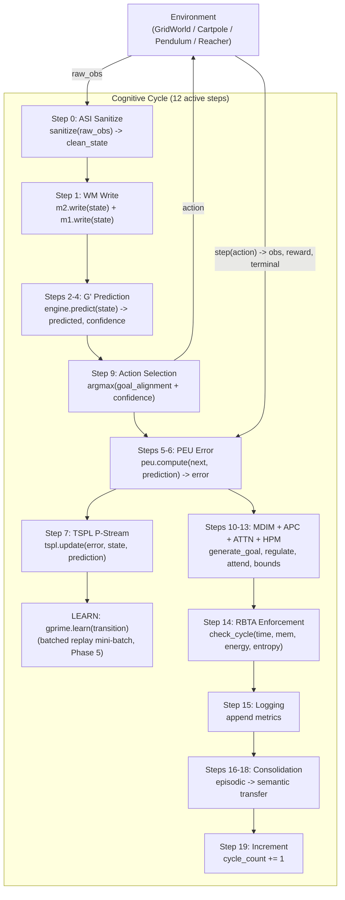

# PHCA v3.0 — Architecture

## Overview

PHCA (Predictive Hierarchical Cognitive Architecture) implements a **12-step cognitive cycle**
that transforms raw sensor input into goal-directed action through a pipeline of specialized
modules. The cycle runs at ~95 Hz on consumer hardware (~10.6 ms mean latency, MLP path,
post-Phase-5). 325 tests pass (299 core + 26 MuJoCo), 0 errors; Overall Φ-IQ **0.7419**.

Formal specification: v3.0 (PHCA-3.1-011). Resource-bounded via the **Resource Bounded
Turing Supervisor (RBTA)** which enforces cycle-time, memory, energy, and entropy budgets
per the v3.0 specification §3.2–§4.

The agent runs in a GridWorld (discrete, 5×5 with walls) or a MuJoCo physics environment
(Cartpole, Pendulum, Reacher), perceives its state, predicts the next state, selects a
goal-directed action, learns from the prediction error, and self-regulates its exploration
and criticality via a PID controller and six homeostatic intrinsic drives (MDIM).

---

## System Diagram



---

## Cognitive Cycle (12 active steps)

| Step | Module | Operation |
| :--: | :--- | :--- |
| 0  | ASI   | `sanitize(raw_obs)` → `clean_state` (NaN/Inf/finite checks) |
| 1  | M1/M2 | `m2.write(state)` + `m1.write(state)` (working + sensory memory) |
| 2-4 | G'   | `engine.predict(state)` → `predicted, confidence` (Gaussian / discrete / MLP) |
| 5-6 | PEU  | `peu.compute(next, prediction)` → precision-weighted error |
| 7  | TSPL  | `tspl.update(error, state, pred)` — P-Stream learning |
| 8  | —     | (reserved) |
| 9  | Cycle | `argmax(goal_alignment + confidence)` → action |
| 10-13 | MDIM+APC+ATTN+HPM | generate goal, regulate, attend, `compute_bounds()` |
| 14 | RBTA  | `check_cycle(runtime, mem, energy, entropy)` |
| 15 | Cycle | Logging — append `metrics_history` |
| 16-18 | Consolidation | episodic → semantic transfer (10-cycle timer) |
| 19 | Cycle | `cycle_count += 1` |

The `gprime.learn(transition)` step (between TSPL and Step 9) is the dominant per-cycle
cost; in Phase 5 (D-092) the MLP replay-backward was vectorised from a per-sample Python
loop to batched NumPy matmuls, cutting `gprime_learn` from 35.55 ms → **5.09 ms** (−85.7%)
with no Φ-IQ regression.

---

## Module Map

| Module | File | Function |
| :--- | :--- | :--- |
| **ASI** | `phca/asi/sanitizer.py` | Input sanitization, NaN/Inf detection, finite checks |
| **M1 (Sensory)** | `phca/memory/m1_sensory.py` | Short-term sensory buffer (50-cycle horizon) |
| **M2 (Working)** | `phca/memory/m2_working.py` | Ring-buffer working memory with salience tracking |
| **G' (Engine)** | `phca/prediction/engine.py` | Prediction engine wrapping Gaussian / discrete / MLP G' |
| **G' (MLP)** | `phca/world_model/mlp.py` | Pure-NumPy MLP world model (38,868 params, hidden_dim=128; batched replay backward, Phase 5) |
| **PEU** | `phca/prediction/error_unit.py` | Precision-weighted prediction error |
| **TSPL** | `phca/learning/tspl.py` | Single-stream predictive learning (P-Stream only) |
| **MDIM** | `phca/motivation/mdim.py` | Multi-drive intrinsic motivation (6 drives) with softmax goal selection |
| **APC** | `phca/regulation/pid_controller.py` | Adaptive parameter control (PID-based modulation of T, η, α) |
| **ATTN** | `phca/attention/attention.py` | Precision-weighted sparse attention with Gumbel noise |
| **HPM** | `phca/hpm/parser.py` | Hierarchical procedure memory: composition operators + `compute_bounds()` |
| **RBTA** | `phca/regulation/rbta_enforcer.py` | Resource-Bounded Turing Supervisor: time/memory/energy/entropy enforcement |
| **M3 (Episodic)** | `phca/memory/m3_episodic.py` | SQLite-backed episode store with batch commits |
| **Consolidation** | `phca/consolidation/scheduler.py` | Episodic → statistical fact extraction with periodic consolidation |
| **Cycle** | `phca/core/cycle.py` | 12-step cognitive cycle orchestrator |
| **GridWorld** | `phca/environments/grid_world.py` | Configurable grid environment (5×5, walls, obstacles, `relocate_goal`) |
| **MuJoCoEnv** | `phca/environments/mujoco_env.py` | MuJoCo wrapper: Cartpole / Pendulum / Reacher (5/3/3 actions) |
| **Config** | `phca/config.py` | Global constants, resource bounds, `StreamID` (P-Stream only) |

---

## Verified Invariants (A1–A5)

| Invariant | Enforcement |
| :--- | :--- |
| **A1** Resource Boundedness | RBTA time/memory/energy/entropy checks every cycle (composition tree reads energy from `energy_log`). |
| **A2** Temporal Causality | Pipeline ordering in the 12-step cycle. |
| **A3** Incomplete Knowledge | Belief entropy floor ≥ ε; semantic facts from consolidation wired into MDIM context. |
| **A4** Prediction as Primary | Every cycle computes sₜ→ŝₜ₊₁; MLP hidden_dim=128 (38,868 params). |
| **A5** Feedback-Driven Adaptation | PEU error drives TSPL updates; error-modulated learning rate with per-dimension attention weights. |

Formal definitions and proofs in [research/outputs/07-rigorous-whitepaper.md](../research/outputs/07-rigorous-whitepaper.md).

---

## Φ-IQ Metric

```
Φ-IQ = 0.20·PredictionAccuracy + 0.20·AdaptationSpeed + 0.15·GoalComplexity
     + 0.15·TransferEfficiency + 0.20·ResourceEfficiency - 0.10·FailureRate
```

| Level | Name | What it measures | Phase 5 result |
| :--- | :--- | :--- | :--- |
| L0 | Stationary Prediction | Prediction accuracy, static env | 0.7073 |
| L1 | Reactive Control | Prediction under active control + action diversity | 0.7138 |
| L2 | Goal Pursuit | Goal-reaching rate in maze with walls/obstacles | 0.7782 (goal_rate 0.95) |
| L3 | Self-Motivated Exploration | MDIM drive diversity + autonomy | 0.7684 |
| **Overall** | (MLP, 200 cyc/level) | weighted composite | **0.7419** (gate PASS) |

Gate floor: Overall ≥ 0.5486. Cycle latency < 500 ms (mean 10.6 ms, p95 ~12 ms). Failure rate < 10% (0 violations).

---

## MuJoCo Environments

`MuJoCoSimpleEnv` wraps gymnasium MuJoCo environments into `EnvironmentProtocol` so the
cognitive cycle drives them unchanged. Continuous action spaces are discretised into ≤5 bins.
MuJoCo is opt-in (`requirements-mujoco.txt`); run headless with `MUJOCO_GL=disabled`.

| Env | ID | Actions | State dim | Phase 5 result (100 cyc) |
| :--- | :--- | :--- | :--- | :--- |
| Cartpole | `InvertedPendulum-v5` | 3 (L / stay / R) | 4 | PASS — 0 violations, error ↓ |
| Pendulum | `Pendulum-v1` | 3 (torque L / stay / R) | 3 | PASS — 0 violations, error ↓ |
| Reacher  | `Reacher-v5` | 5 (2D: SW/NW/stay/NE/SE) | 10 | PASS — 4.0 ms mean, 0 violations, error 512→91.7 |

CI exercises 26 MuJoCo tests with `MUJOCO_GL=disabled` (D-089, D-093).

### Dynamic-Goal Curriculum (experimental)

`--dynamic-goals` relocates the L2 goal on a cadence; `--dynamic-goals-every N` controls it
(Phase 5 / D-094).

| Cadence | L2 Φ-IQ | Verdict |
| :--- | :--- | :--- |
| every-100 | 0.4316 | below 0.50 on this machine (D-090's 0.573 was machine-specific) |
| **every-75**  | **0.6444** | **validated** — L2 ≥ 0.50, L0/L1/L3 within noise of static |
| every-50 | 0.4324 | not achievable (consistent with D-087) |

Dynamic mode is experimental and measured separately from the canonical static benchmark.

---

## Key Design Decisions

- **EnvironmentProtocol** (`phca/environments/protocol.py`) decouples `CognitiveCycle` from
  any concrete environment. Any object implementing `get_action_names()`, `get_possible_actions()`,
  and `get_goal_position()` can drive the cycle. Both `GridWorld` and `MuJoCoSimpleEnv` implement it.
- **No terminal-on-goal.** The environment does not return terminal=True when the agent reaches
  the goal (D-070). Unlike RL episodic conventions, the PHCA cognitive architecture sustains
  goal achievement rather than resetting on success. The `goal_reached` flag is still reported
  in the info dict for benchmark metrics.
- **STAY preferred at goal.** When the agent is at the goal position, `_compute_distance_gain()`
  assigns distance_gain=0.0 (best) to STAY and 1.0 (worst) to any move away from the goal
  (D-071). This prevents the agent from leaving the goal immediately after reaching it.
- **P-Stream only.** E-Stream and S-Stream were removed in Phase 3.3 (D-020). Consolidation
  runs on a fixed 10-cycle timer (Steps 16-18) with batch SQLite commits (D-014).
- **HPM validation layer** stripped. Only `compute_bounds()` (resource additivity per v3.0
  Theorem 2.1/3.1) is used by RBTA.
- **SQLite-backed M3** uses a single backend — an abstraction layer was deferred to Phase 3.4
  (no benefit for a single implementation). Batch commits every 10 cycles reduce fsync overhead 10×.
  Hardened in Phase 4 (D-082): `wal_checkpoint(TRUNCATE)` on close, `integrity_check` on startup,
  and `try/except sqlite3.DatabaseError` fallback to an in-memory DB on corrupt/non-SQLite files.
- **MLP world model** (Phase 4): MC-Dropout mutual information estimates empowerment `I(s';a|s)`
  (D-077, samples=4 per D-091); confidence blends aleatoric `exp(-MSE)` with epistemic
  MC-Dropout variance, dropping on out-of-distribution states (D-080); learning uses a hybrid
  online/replay schedule with unified `lr*0.5` (D-081).
- **Batched MLP replay backward** (Phase 5 / D-092): the per-sample Python loop in `learn()`
  was replaced with `_forward_batch` + `_backward_batch` (matmul sum-of-outers, batch-averaged
  gradient, single clip). `gprime_learn` 35.55 ms → 5.09 ms (−85.7%); static Φ-IQ 0.7328 → 0.7419.
  Zero-trust verification confirmed the dynamic L2 is unchanged (D-090's 0.573 was
  machine-specific; on this machine every-100 L2 ≈ 0.43 for both the original and vectorised code).
- **L2 benchmark metric** (Phase 4): `adaptation_speed` for Goal Pursuit uses
  `max(improvement, maintenance)` aligned with L0/L1 (D-086); the predicted-goal-alignment
  ramp engages over cycles 50–150 so the learned model drives action selection during
  measurement (D-087).
- **Reacher integration** (Phase 5 / D-093): `--env reacher` + 3 smoke tests; 100-cyc benchmark
  passes (4.0 ms mean, 0 RBTA violations, MLP learns dynamics).
- **Dynamic-goal cadence** (Phase 5 / D-094): `--dynamic-goals-every N`; every-75 validated
  (L2 0.6444), every-50 honestly rejected (L2 0.43).
- **Monitoring system** (`MetricsStore`, file logging, curses dashboard) is optional, zero-overhead
  when unused. See `scripts/phca-monitor.py` and `scripts/phca-logs.py`.

---

## Resource Bounds (RBTA)

The RBTA enforces four budgets every cycle:

| Resource | Default Bound | Scope |
| :--- | :--- | :--- |
| Time | 500 ms | Per cycle (Phase 5 mean: 10.6 ms, p95 ~12 ms) |
| Memory | 1,000,000 units | Per cycle |
| Energy | 100.0 units | Per cycle (from `energy_log`, composition tree) |
| Entropy | 1.0 units | Per cycle |

Violations are counted and reported in `CycleMetrics.violations_count`. The agent continues
running but the violation is logged for analysis.

**Note:** Energy bounds are enforced via the composition tree which reads from `energy_log`
(effective Joules estimated from module runtimes) rather than `runtime_log` (seconds).
This was fixed in gap-closure issue A-001/A-004 (D-036).

---

## Up-to-Date Reference

- See `DECISIONS.md` (D-001 through D-094) for the complete design decision history.
- See `docs/phase4_gap_closure_report.md` for the Phase 4 gap-closure execution summary.
- See `docs/phase5_completion_report.md` for the Phase 5 sign-off.
- See `STATUS.md` for the audit progress and issue registry.
