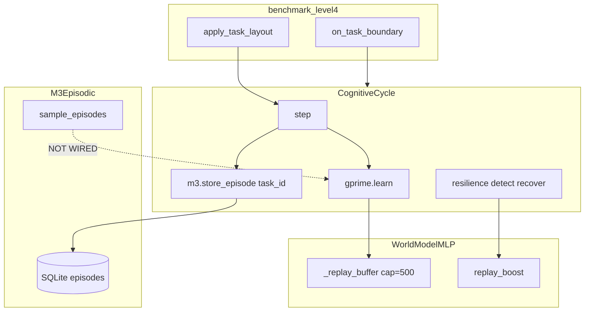

# PHCA Static Architecture Audit — 2026-07-07

Track B deliverable: contract map, unwired hooks (G5), and architectural risks **without** behavior changes.

Companion: [`maturity_audit_2026-07-07.md`](maturity_audit_2026-07-07.md).

---

## 1. Subsystem contract map

---

## 2. Contract verification checklist

| # | Contract | Expected | Result | Evidence |
|---|----------|----------|--------|----------|
| C1 | `on_task_boundary` called on task switch in L4 runner | Yes when mitigation=True | **PASS** | `benchmark_level4.py:59-60` |
| C2 | `task_id` stored in M3 on each episode | Yes | **PASS** | `cycle.py:645` → `m3.store_episode(..., task_id=)` |
| C3 | `sample_episodes(task_id)` feeds G′ `learn()` | Yes for continual replay | **PASS** (2026-07-07) | `cycle._replay_m3_prior_tasks` → `learn_m3_episodes` |
| C4 | `protect_parameters` on task boundary | Yes | **PASS** | `cycle.on_task_boundary` → `tspl.protect_parameters` |
| C5 | `replay_boost` during forgetting mitigation | Flag set on boundary | **PARTIAL** | Sets `_forgetting_mitigation_active`; boosts **internal** buffer only |
| C6 | B4 → `on_forgetting_detected` | During measurable drop | **PARTIAL** | `recovery.py:62`; detector uses `_task_eval_history` populated in eval pass only |
| C7 | `failure_events` in CycleMetrics | Each cycle post-RBTA | **PASS** | `cycle.py:727-728` |
| C8 | `failure_events` in ObservabilityFrame / JSONL | Exported | **PASS** (2026-07-07) | Fields on `ObservabilityFrame` + `from_cycle` |
| C9 | `recovery_active` in JSONL | Exported | **PASS** (2026-07-07) | Same |
| C10 | `task_id` in JSONL | Exported | **PASS** (2026-07-07) | Same |
| C11 | Resilience after RBTA | Step 14+ | **PASS** | `cycle.py:722-728` before metrics push |
| C12 | Eval phase calls `on_task_boundary` | Should reset mitigation context | **FAIL** | Eval sets `_current_task_id` only (`benchmark_level4.py:83`) |
| C13 | G′ replay buffer retains cross-task diversity | Old tasks sampleable | **FAIL** | FIFO 500 slots; 10×80=800 cycles/train phase overwrites |

---

## 3. G5 unwired / silent no-op register

| ID | Hook | Defined | Called from hot path? | Impact |
|----|------|---------|----------------------|--------|
| G5-01 | `M3Episodic.sample_episodes` | `m3_episodic.py:326` | **Wired** (2026-07-07) | `cycle._replay_m3_prior_tasks` |
| G5-02 | `ObservabilityFrame.failure_events` | observability.py | **Wired** | `from_cycle` |
| G5-03 | `ObservabilityFrame.recovery_active` | observability.py | **Wired** | Same |
| G5-04 | `ObservabilityFrame.task_id` | observability.py | **Wired** | Same |
| G5-05 | L4 eval `on_task_boundary` | `cycle.on_task_boundary` | Not called in eval loop | Eval context differs from train |
| G5-06 | B4 during training | `FailureDetector._detect_b4` | Needs `record_task_eval` history | Only accumulates during final eval pass |

**Not G5 (wired):**

- `on_task_boundary` during train — wired
- `on_forgetting_detected` — wired from `RecoveryManager` B4 path
- `tspl.protect_parameters` — wired from `on_task_boundary`
- M3 `task_id` on store — wired

---

## 4. Architectural risks (false confidence)

### 4.1 Dual replay systems (M3 vs G′ internal buffer)

| Store | Capacity | Task-aware | Used in learn |
|-------|----------|------------|---------------|
| G′ `_replay_buffer` | 500 FIFO | No | Yes (only source) |
| M3 SQLite | 10,000 | Yes (`task_id`) | **No** |

**Risk:** Documentation and mitigation hooks imply M3 episodic replay for forgetting; runtime only uses G′ FIFO buffer. Early-task transitions are evicted before final eval.

### 4.2 Baseline measurement weakness (G1)

From `logs/benchmark_level4.json` seed 42 baselines: tasks 1,2,3,5,6,8,9 have baseline **0.0** (last-20 train window goal rate).

`forgetting.py` delta_perf treats baseline=0 specially (binary cur_acc), inflating noise.

**Risk:** L4-smoke 2-task pass with 0% eval on task 1 is not retention proof.

### 4.3 B4 detector timing

`per_task_goal_rate` = mean of `_task_eval_history` last 20 entries.
During training, `record_task_eval` is **not** called — B4 cannot fire while catastrophic overwriting happens.

During final eval, history builds per task sequentially — B4 may fire but only triggers `on_forgetting_detected` **after** collapse is measured.

### 4.4 Injectable recovery vs operational forgetting

`benchmark_recovery.py` at 1.00 does not exercise the L4 forgetting path.
**Risk:** G3 false confidence on WP-5.

### 4.5 A4 split (environments)

| Env | Mechanism | A4-primary |
|-----|-----------|------------|
| Pendulum/Reacher | MPC on G′ | Yes (measured) |
| GridWorld | task_lock τ=0.6 + greedy fallback | Partial |

Causal eval smoke uses Gaussian by default in CI — deployment mode needs `--use-mlp`.

---

## 5. Recommended fix order (Track E/F — not implemented here)

1. **Diagnostic mode** on `benchmark_level4.py` (logging only)
2. **Invalid baseline rule** (exclude or fail tasks with baseline < ε)
3. **Wire M3 → G′** minimal: sample prior-task episodes into learn batch (architectural, not new algorithm)
4. **Export** `failure_events`, `recovery_active`, `task_id` in `ObservabilityFrame`
5. **Eval warmup** cycles (not scored)
6. Re-run L4b ablation R0–R6

If step 3+5 still fail → **Verdict C** (capacity limit under P-Stream + 500 FIFO); document in limitations.

---

## 6. Static test encoding

Automated in [`python/tests/test_static_contracts.py`](../python/tests/test_static_contracts.py):

- Documents G5 failures as `pytest.mark.xfail(strict=False)` so CI stays green while debt is visible
- Passes for wired contracts (C1, C2, C4, C7, C11)

---

## 7. DECISIONS.md spot-check (high-impact)

| Decision | Claim | Code match? |
|----------|-------|-------------|
| D-020 | E/S streams removed | Yes — grep clean |
| D-084 | Rust RBTA removed | Yes — Python enforcer |
| D-108 | M3 VACUUM | Present in m3_episodic |
| D-128 | cross_context_reuse trace flags | emergence.py uses env_goal_relocated |

---

## Changelog

| Date | Change |
|------|--------|
| 2026-07-07 | Initial static audit; G5-01..06 identified; dual replay architecture documented |
