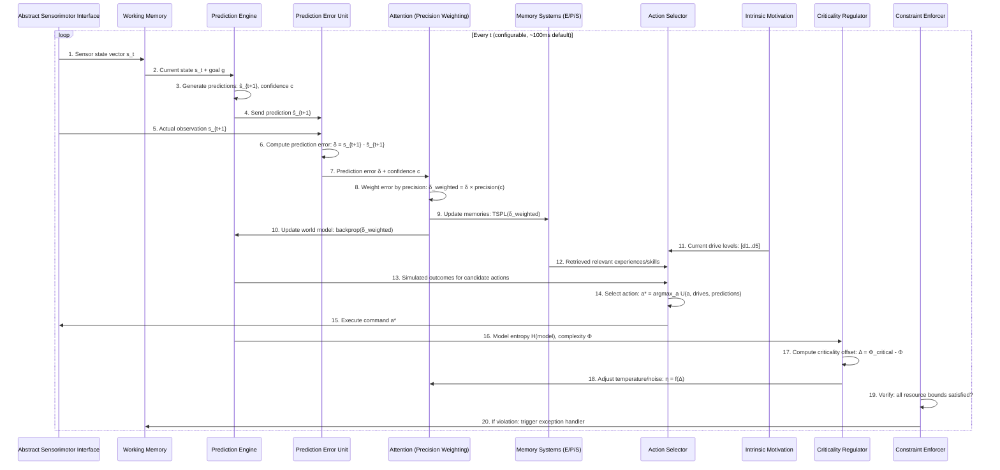

# Phase 2: ARCHITECTURAL SYNTHESIS — The Predictive Hierarchical Cognitive Architecture (PHCA)

**Document Type:** Formal Architectural Specification
**Phase:** 2 of N
**Version:** 1.0.0
**Cross-refs:** [01-intelligence-constraints-model](01-intelligence-constraints-model.md), [02-failure-modes-map](02-failure-modes-map.md), [03-axiom-candidates](03-axiom-candidates.md), [04-architecture-readiness-report](04-architecture-readiness-report.md)

---

## 1. EXECUTIVE SUMMARY

### The Core Goal

Design a **formally specified, resource-bounded cognitive architecture** that:

1. Operates under the 5 verified invariants (Resource Boundedness, Temporal Causality, Incomplete Knowledge, Prediction as Primary, Feedback-Driven Adaptation)
2. Resolves the 5 critical gaps identified in Phase 1 (Embodiment Paradox, Constraint Formalization, Composition Problem, Learning Formalism, Goal Genesis)
3. Is implementable in a general-purpose computing environment without requiring physical embodiment
4. Provides explicit mitigation for all 6 failure mode categories (A-F)

### Measurable Success Criteria

The architecture succeeds when:
- A single cognitive cycle completes within O(n log n) time where n = working memory size
- Learning does not exhibit catastrophic forgetting on sequential tasks
- The system generates its own goals when external goals are absent
- The system self-tunes to maintain critical (edge-of-chaos) dynamics
- The system can detect and recover from at least 80% of known failure mode types

---

## 2. GAP RESOLUTIONS & TRADE-OFFS

### Gap 1: The Embodiment Paradox (A11)

**Question:** Is genuine intelligence possible without physical sensorimotor grounding?

**Trade-off Analysis:**

| Approach | Strengths | Weaknesses | Evidence |
| :--- | :--- | :--- | :--- |
| **Strong Embodiment** (Brooks, Maturana) | Grounded semantics, real-world robustness | Requires physical hardware, limits deployability | Phase 1: C4.1 [UNVERIFIED] |
| **Virtual Embodiment** (CoALA, simulators) | Deployable, testable, scalable | Simulation gap — real physics differs | Phase 1: 06-cognitive-arch/04 |
| **Abstraction Layer** (THIS ARCHITECTURE) | Embodiment-agnostic interface | Added complexity of abstraction | Proposed resolution |

**Resolution: Conditional Embodiment via Abstract Sensorimotor Interface (ASI)**

The architecture defines an **Abstract Sensorimotor Interface** — a formal contract between the cognitive core and any environment:

```
 Cognitive Core         ASI Contract          Environment
┌────────────────┐    ┌────────────────┐    ┌──────────────┐
│ Predictive      │    │  Proprioceptive │    │ Physical     │
│ Processing      │◄──►│  State Vector   │◄──►│ Robot        │
│ Core            │    │  (pos, vel,     │    │              │
│ (embodiment-    │    │   force, ...)   │    ├──────────────┤
│  agnostic)      │    │                 │    │ Simulator    │
│                 │◄──►│  Sensor Stream  │◄──►│              │
│                 │    │  (raw or        │    ├──────────────┤
│                 │    │   preprocessed) │    │ API/Text     │
│                 │    │                 │    │ Interface    │
│                 │◄──►│  Efferent       │◄──►│              │
│                 │    │  Command Buffer │    └──────────────┘
└────────────────┘    └────────────────┘
```

**The ASI defines:**
- A **canonical sensorimotor state vector** of dimension M (abstract but bounded)
- An **efferent command buffer** of dimension N
- **Temporal alignment contracts** — the core can specify required update frequency
- **Uncertainty envelopes** — each sensor value includes a precision/confidence

**Justification:** This resolves the embodiment debate by making the architecture agnostic — it can operate through physical robots, simulators, or pure API/text interfaces. The core does not know *what* it's embodied in, only that there is a sensorimotor loop.

---

### Gap 2: Formalization of Constraints (C2.1)

**Question:** Convert verbal constraints into mathematical/computational formalism.

**Trade-off Analysis:**

| Approach | Strengths | Weaknesses |
| :--- | :--- | :--- |
| **Temporal Logic (LTL/CTL)** | Formal verification, model checking | Expressiveness limits, no resource bounds |
| **Control Theory ODEs** | Continuous dynamics, stability proofs | Discrete cognition hard to model |
| **Category Theory** | Compositional, abstract | High barrier to implementation |
| **Resource-Bounded Automata** (THIS ARCHITECTURE) | Implementable, verifiable | Less expressive than full CT |

**Resolution: Resource-Bounded Temporal Automata (RBTA)**

Each cognitive module is a tuple:

```
Module = (S, s₀, A, T, R, ρ, C)
```

Where:
- **S** = Finite set of states (|S| ≤ B_state)
- **s₀** = Initial state
- **A** = Finite set of actions (internal + external)
- **T** = Transition function: S × A → S (deterministic) or Δ(S) (probabilistic)
- **R** = Reward function: S × A → ℝ (sparse, from intrinsic motivation)
- **ρ** = Resource bound: (B_time, B_memory, B_energy) — max per cycle
- **C** = Communication interface: set of typed ports for cross-module messaging

**Operational Constraint Enforcer:**

At each cognitive cycle *t*, the enforcer checks:

```
∀ module m:
  runtime(m, t) ≤ ρ_m.B_time
  memory_used(m, t) ≤ ρ_m.B_memory
  energy_used(m, t) ≤ ρ_m.B_energy
  uncertainty_budget(m, t) ≤ U_max  (entropy of beliefs ≤ threshold)
```

**Verified Invariants as Enforceable Constraints:**

| Invariant | Formalization | Enforcement |
| :--- | :--- | :--- |
| A1: Resource Boundedness | `runtime(m,t) ≤ B_time` | Cycle timer, memory cap |
| A2: Temporal Causality | `t_output > t_input` for all modules | Pipeline ordering |
| A3: Incomplete Knowledge | `H(beliefs) ≥ ε > 0` (entropy never zero) | Entropy floor enforced |
| A4: Prediction as Primary | `∀ s_t, predict(s_{t+1})` computed | Mandatory prediction step |
| A5: Feedback-Driven Adaptation | `error = observed - predicted` computed | Error backpropagation |

---

### Gap 3: The Composition Problem

**Question:** How do microscopic cognitive operations compose into macroscopic reasoning?

**Trade-off Analysis:**

| Approach | Strengths | Weaknesses |
| :--- | :--- | :--- |
| **Neural Composition** (end-to-end) | Learned compositions | Opaque, cannot verify |
| **Symbolic Composition** (Soar-style) | Interpretable, verifiable | Brittle, manual |
| **Probabilistic Program Composition** | Flexible, compositional | Computational cost |
| **Hierarchical Predictive Modules** (THIS ARCHITECTURE) | Interpretable + learned | Complex interface design |

**Resolution: Hierarchical Predictive Module (HPM) Grammar**

Cognitive functions are composed through a **typed grammar of predictive modules**:

```
⟨cognition⟩ ::= ⟨sensor⟩ | ⟨predictor⟩ | ⟨controller⟩ | ⟨composite⟩

⟨composite⟩ ::= SEQUENCE(⟨module⟩, ⟨module⟩)
              | PARALLEL(⟨module⟩, ⟨module⟩)
              | CONDITIONAL(⟨predictor⟩, ⟨module⟩, ⟨module⟩)
              | HIERARCHY(⟨predictor⟩, ⟨module⟩)  /* subgoal */
              | RECURSE(⟨module⟩, n)              /* iteration bound */

⟨sensor⟩ ::= ASI_Input(port_id, dimensionality, precision)
⟨predictor⟩ ::= Predict(schema, horizon, confidence_threshold)
⟨controller⟩ ::= Control(reference_signal, plant_model, horizon)
```

**Composition Rules:**

1. **Type Safety:** Each module has an input type and output type. Only compatible types compose.
2. **Resource Additivity:** `B_time(composite) = Σ B_time(children) + overhead`. The composition must satisfy its resource bound.
3. **Uncertainty Propagation:** `H(output) ≥ H(input) - I(input; model)` — uncertainty can decrease only through information gain.
4. **Temporal Alignment:** Fast modules compose inside slow modules, not vice versa. (No micro-module waiting on a macro-module.)

**Example: Object Grasping**

```python
grasp_composite = SEQUENCE(
    HIERARCHY(
        Predictor("object_position", horizon=100ms),
        SEQUENCE(
            Controller("reach", horizon=500ms),
            Controller("grasp", horizon=200ms)
        )
    ),
    Predictor("lift_success", horizon=50ms)
)
```

---

### Gap 4: Learning Formalism

**Question:** Define a unified learning mechanism covering procedural, episodic, and semantic learning without catastrophic forgetting.

**Trade-off Analysis:**

| Approach | Strengths | Weaknesses |
| :--- | :--- | :--- |
| **Predictive Coding Only** | Theoretically unified | May miss procedural learning |
| **Complementary Learning Systems (CLS)** | Hippocampal-inspired, avoids forgetting | Complex consolidation scheduling |
| **Dual-Process (System 1 + System 2)** | Covers fast/slow learning | Two different mechanisms |
| **Three-Stream Predictive Learning** (THIS ARCHITECTURE) | Unified framework, 3 memory types | Novel, unproven at scale |

**Resolution: Three-Stream Predictive Learning (TSPL)**

All learning derives from **prediction error minimization** but is partitioned into three streams with different timescales and consolidation pathways:

```
                          ┌─────────────────────────────┐
                          │     Prediction Error         │
                          │     (Global Signal)          │
                          └────────────┬────────────────┘
                                       │
                ┌──────────────────────┼──────────────────────┐
                │                      │                      │
                ▼                      ▼                      ▼
┌────────────────────────┐ ┌────────────────────────┐ ┌────────────────────────┐
│ P-Stream: Procedural   │ │ E-Stream: Episodic     │ │ S-Stream: Semantic     │
│                        │ │                        │ │                        │
│ What works?            │ │ What happened?         │ │ What is true?          │
│                        │ │                        │ │                        │
│ Fast: single trial     │ │ Medium: event storage  │ │ Slow: abstraction      │
│ Success-based          │ │ Context-based retrieval │ │ Pattern-based          │
│ Basal Ganglia analogue │ │ Hippocampus analogue   │ │ Cortex analogue        │
│ No forgetting (skills) │ │ Forgetting via decay   │ │ Consolidation required │
└───────────┬────────────┘ └───────────┬────────────┘ └───────────┬────────────┘
            │                         │                          │
            └─────────────────────────┼──────────────────────────┘
                                      │
                                      ▼
                          ┌─────────────────────────────┐
                          │   Consolidation Scheduler    │
                          │  (sleep-cycle analogue)     │
                          │                              │
                          │  E-Stream → S-Stream         │
                          │  (abstraction from events)   │
                          │  P-Stream → S-Stream         │
                          │  (procedures → rules)        │
                          └─────────────────────────────┘
```

**Anti-Catastrophic Forgetting Mechanisms:**

| Mechanism | How It Works | Applies To |
| :--- | :--- | :--- |
| **Complementary Learning** | Fast E-Stream learns new patterns; slow S-Stream consolidates interleaved | E → S consolidation |
| **Elastic Weight Consolidation** | Protect weights important for previous tasks | S-Stream, P-Stream |
| **Replay Buffer** | Interleave new experiences with replayed old experiences | E-Stream consolidation |
| **Skill Compilation** | Once procedural skill is compiled, it's protected | P-Stream |

**Unified Learning Rule:**

```
Δθ = α × δ × ∇L(θ) - λ × (θ - θ_protected) + η × noise

Where:
δ = prediction error (observed - predicted)
α = learning rate (stream-dependent: α_P > α_E > α_S)
λ = elastic consolidation strength (λ_S > λ_E > λ_P)
η = exploration noise (η_P highest)
```

---

### Gap 5: Goal Genesis (Motivation)

**Question:** Where do primary goals come from? How to avoid reward hacking?

**Trade-off Analysis:**

| Approach | Strengths | Weaknesses |
| :--- | :--- | :--- |
| **External Reward** (RL) | Simple, proven | Reward hacking, specification gaming |
| **Curiosity/Novelty** | Intrinsic, exploration | May ignore survival needs |
| **Homeostatic Drive** (Ashby, Powers) | Stable, biological | Complex to define set points |
| **Multi-Drive Intrinsic Motivation** (THIS ARCHITECTURE) | Robust, no hacking | Complex to tune |

**Resolution: Multi-Drive Intrinsic Motivation (MDIM)**

Five primary drives generate goals autonomously. Each drive maintains a **homeostatic set point** and generates goals when the current value deviates from set point:

| Drive | Description | Set Point | Goal Generated |
| :--- | :--- | :--- | :--- |
| **D1: Prediction Error Minimization** | Reduce surprise | H < H_max | Explore uncertain regions |
| **D2: Complexity Seeking (Criticality)** | Maintain edge of chaos | Φ near Φ_critical | Seek novelty/complexity |
| **D3: Competence Acquisition** | Improve skill mastery | Skill_gain > 0 | Practice tasks at edge of ability |
| **D4: Epistemic Curiosity** | Reduce model uncertainty | U_model < U_max | Seek information-gain |
| **D5: Energy Efficiency** | Minimize computational cost | Cost < C_max | Optimize routines, automate |

**Goal Generation Process:**

```
At each cycle t:
  1. Compute drive deficits: d_i = |set_point_i - current_value_i|
  2. Weight drives: w_i = softmax(d_i / temperature)
  3. Sample goal type: g ~ Categorical(w)
  4. Instantiate goal: g_ concrete = GoalFactory(g, current_context)
  5. Push to goal stack
```

**Why This Avoids Reward Hacking:**

1. **Drives are homeostatic** — they cannot be "maximized" indefinitely; they return to set point
2. **Multiple drives compete** — no single objective to hack
3. **Drives are context-dependent** — the same action cannot satisfy all drives
4. **Energy efficiency acts as regularizer** — prevents runaway computation

---

## 3. ARCHITECTURAL SPECIFICATION

### 3.1 World Model: Hybrid Probabilistic Graphical Model

The world model combines three representation types:

| Representation | What | Format | Strengths |
| :--- | :--- | :--- | :--- |
| **Probabilistic Graph** | Entities + relations + uncertainty | Bayesian network over state variables | Causal inference, counterfactuals |
| **Vector Symbolic** | Concepts as high-dimensional vectors | Holographic Reduced Representations (HRR) | Compositional, analogical |
| **Predictive Script** | Temporal sequences | Stochastic Petri net | Sequential prediction, planning |

**The model is a tuple:**

```
World_Model = (G, V, S, Θ)
```

Where:
- **G** = Probabilistic graph: nodes = state variables, edges = causal dependencies, CPDs = conditional probability distributions
- **V** = Vector symbolic memory: concepts as d-dimensional hypervectors, operations include binding (⊗), bundling (+), and permutation (Π)
- **S** = Script library: set of Stochastic Petri Nets encoding temporal patterns
- **Θ** = Parameters: all learnable weights across all representations

**Core Operation — Prediction:**

```
predict(state_t, goal_g, horizon_h, model) → (state_t+h, confidence)

1. Graph G computes causal forward simulation:
   state_{t+1} ~ P(state_{t+1} | state_t, action_t)   [from G]

2. Vector V retrieves analogous past situations:
   analog_v = V.retrieve(encode(state_t))
   
3. Script S matches current sequence:
   next_events = S.match(state_t)

4. Ensemble prediction:
   prediction = weighted_ensemble(
       G_prediction(state_t),
       V_prediction(analog_v),
       S_prediction(next_events)
   )
   where weights are learned (meta-learning)
```

### 3.2 Control Flow — The Cognitive Cycle



### 3.3 Memory Hierarchy

| Level | Name | Capacity | Access Time | Persistence | Consolidation Pathway |
| :--- | :--- | :--- | :--- | :--- | :--- |
| **M1** | Sensory Buffer | 10ms × sensor_dim | <1ms | ~100ms | → M2 (attention-gated) |
| **M2** | Working Memory | 7±2 chunks | 1-5ms | Current cycle + n cycles | → M3 (episodic), M4 (semantic) |
| **M3** | Episodic Memory (E-Stream) | 10^6 episodes | 5-50ms | Days (decay without consolidation) | → M4 (via sleep cycle) |
| **M4** | Semantic Memory (S-Stream) | 10^9 facts | 10-100ms | Permanent (decay-resistant) | Static (updated by consolidation) |
| **M5** | Procedural Memory (P-Stream) | 10^5 skills | 1-10ms | Permanent (overwrite only) | Static (compiled from E-Stream) |
| **M6** | Meta-Memory | 10^3 patterns | 50-200ms | Permanent | Self-referential (learns about M1-M5) |

**Memory Consolidation Pathways:**

```
M1 (Sensory) ──attention──► M2 (Working)
                                 │
                    ┌────────────┼────────────┐
                    │            │            │
                    ▼            ▼            ▼
                M3 (E-Stream)   M4 (S-Stream) M5 (P-Stream)
                    │            ▲
                    │            │
                    └──sleep──── ┘
                    (abstraction)
```

**Meta-Memory (M6):** The system maintains a **model of its own memory systems** — tracking which memories are active, which are decayed, and which are likely to be needed. This enables active forgetting management and retrieval strategy optimization.

### 3.4 Attention Mechanism: Precision-Weighted Sparse Attention

Attention is implemented as **precision-weighted competition** (inspired by Biased Competition Theory from neuroscience):

**Core Algorithm:**

```
For each element e_i in working memory:
  1. Compute bottom-up salience: S_bu(e_i) = |e_i - prediction|
  2. Compute top-down relevance: S_td(e_i) = similarity(e_i, current_goal)
  3. Compute precision: p_i = f(confidence_in_sensor, historical_reliability)
  4. Composite salience: S_i = (α × S_bu + β × S_td) × p_i

Selection: 
  K = min(|WM|, capacity_limit)
  attended = top_k(S, K) using k-winners-take-all with noise

Resource allocation:
  computation_budget_i = B_attention × softmax(S)[i]
```

**Precision weighting (from Predictive Coding):**
- High precision (reliable data) → prediction error is weighted heavily
- Low precision (noisy data) → prediction error is down-weighted
- Precision is learned: `p_i(t+1) = p_i(t) + η × (|δ_i(t)| - p_i(t))`
  - If errors are low, precision increases (trust the sensor)
  - If errors spike, precision decreases (sensor may be unreliable)

### 3.5 Criticality Regulator: Self-Tuning to the Edge of Chaos

The regulator monitors the system's **complexity/computational entropy** and adjusts parameters to maintain criticality.

**Observables:**
- **Φ (Integrated Information):** Measures information integration between modules (from IIT theory)
- **H (Entropy):** Entropy of working memory state distribution
- **λ_max (Lyapunov Exponent):** Measures sensitivity to initial conditions
- **C (Correlation Length):** Average correlation between module states

**Regulation Mechanism:**

```
At each cognitive cycle:

1. Estimate current criticality:
   Φ_current = estimate_phi(module_states)
   
2. Compute offset from critical:
   Δ = Φ_critical - Φ_current  (where Φ_critical is the target)
   
3. Adjust control parameters:
   temperature = temperature_0 + k_p × Δ + k_i × ∫Δ dt + k_d × dΔ/dt
   η_exploration = η_0 × sigmoid(Δ)
   attention_spread = attention_spread_0 × (1 + α × Δ)
   
4. If Δ > threshold_high:  // Too ordered
   increase temperature
   increase exploration noise
   expand attention spread
   
5. If Δ < threshold_low:   // Too chaotic  
   decrease temperature
   decrease exploration noise
   narrow attention spread
```

**Target criticality (Φ_critical)** is not a fixed value but adapts to:
- Task complexity (harder tasks → higher Φ)
- Available resources (more resources → higher Φ)
- Historical performance (if improving, maintain Φ; if declining, adjust)

---

## 4. MITIGATION STRATEGY — Failure Matrix

### Category A: Specification Failures

| Failure | Prevention | Detection | Recovery |
| :--- | :--- | :--- | :--- |
| **A1 — Reward Hacking** | MDIM has no single reward to hack; drives are homeostatic (self-limiting) | Monitor for drive satisfaction without goal progress | Rebalance drive weights; introduce drive conflict detection |
| **A2 — Goal Misgeneralization** | Goals are decomposed from intrinsic drives, not externally specified | Compare actual goal outcomes to predicted drive satisfaction | Abort goal; revert to exploration |
| **A3 — Specification Gaming** | No external specification to game; goals emerge from drives | Multiple drive redundancy — gaming one drive harms others | Drive conflict arbitration |
| **A4 — Proxy Mismatch** | No proxy metric; drives are directly homeostatic | Drive set point drift detection | Reset drive set points to default |
| **A5 — Inner Alignment** | Learning is drive-aligned by construction | Monitor prediction error trends | Re-initialize affected stream |

### Category B: Generalization Failures

| Failure | Prevention | Detection | Recovery |
| :--- | :--- | :--- | :--- |
| **B1 — Distribution Shift** | Uncertainty representation (A3) explicitly models novel situations | Entropy spike detection | Switch to exploration mode; increase η |
| **B2 — Spurious Correlation** | Causal graph G enables counterfactual reasoning | Interventional test: perturb variable → unexpected outcome | Remove edge from G; retrain from E-Stream |
| **B3 — Overfitting** | MDL principle + elastic consolidation | Training error << validation error | Increase λ; reduce model capacity |
| **B4 — Catastrophic Forgetting** | Complementary learning + elastic consolidation | Sudden performance drop on old tasks | Replay buffer activation; decrease α |
| **B5 — Mode Collapse** | Criticality regulator maintains exploration | Entropy H drops below threshold | Increase temperature + η |

### Category C: Stability Failures

| Failure | Prevention | Detection | Recovery |
| :--- | :--- | :--- | :--- |
| **C1 — Feedback Instability** | Predictive control (feedforward + feedback) | Lyapunov exponent λ > 0 | Increase damping; reduce gain |
| **C2 — Overfitting to Internal Model** | Always compare predictions to observations | Prediction error divergence | Reset prediction to observed; update model |
| **C3 — Positive Feedback Runaway** | Negative feedback loops balance positive | State variable growing unbounded | Clamp; increase regulatory gain |
| **C4 — Phase Collapse** | Criticality regulator prevents this by design | Φ_current far from Φ_critical | Reset temperature, noise, attention |
| **C5 — Harmonic Oscillation** | Damping ratio monitoring | Oscillation amplitude > threshold | Increase derivative gain |

### Category D: Emergent Failures

| Failure | Prevention | Detection | Recovery |
| :--- | :--- | :--- | :--- |
| **D1 — Model Collapse** | Training only on actual sensor data; E-Stream stores real experiences | Dataset entropy decline | Inject random exploration |
| **D2 — Emergent Deception** | Transparent architecture; all internal states observable | Inconsistency between internal state and external behavior | Module isolation; targeted reset |
| **D3 — Mesa-Optimization** | Drives are homeostatic; subgoals are transient | Subgoal persists beyond its usefulness | Force re-evaluation; goal stack pruning |
| **D4 — Gradient Hacking** | Learning is localized to streams; no self-modification of learning rules | Unexpected parameter changes | Rollback; freeze affected module |
| **D5 — Coordination Failure** | If multi-agent: consensus protocol + uncertainty communication | Divergent models across agents | Reconciliation via shared state |

### Category E: Fundamental Limit Failures

| Failure | Mitigation |
| :--- | :--- |
| **E1 — Halting Problem** | Bounded cycles per decision; timeout → satisficing |
| **E2 — Gödelian Incompleteness** | Uncertainty representation; formal bounds on self-modeling |
| **E3 — FLP Impossibility** | Probabilistic consensus; graceful degradation to autonomy |
| **E4 — No-Free-Lunch** | Meta-learning adapts to task distribution; accepts specialization |
| **E5 — Goodhart's Law** | Multi-drive prevents single-metric optimization |

### Category F: Cognitive Architecture Failures

| Failure | Prevention |
| :--- | :--- |
| **F1 — Symbol Grounding** | ASI provides continuous sensorimotor grounding |
| **F2 — Frame Problem** | Attention mechanism selects relevant subset; bounded WM |
| **F3 — Binding Problem** | Vector Symbolic Architecture binds features via HRR |
| **F4 — Attention Collapse** | Criticality regulator maintains attention diversity |
| **F5 — Memory Consolidation Failure** | Consolidation scheduler runs regularly; sleep analogue |

---

## 5. IMPLEMENTATION ROADMAP

### Phase 2.1 — The Core Engine (Months 1-3)

**Deliverable:** Working predictive processing core with single-cognitive-cycle capability.

**Components:**
- [ ] **World Model v1:** Probabilistic graph (G) only. Vector symbolic (V) and Script (S) added later.
- [ ] **Working Memory (M2):** Fixed-size chunk store with attention gating
- [ ] **Prediction Engine:** Simple forward prediction via G
- [ ] **Prediction Error Unit:** Error computation + local weight update
- [ ] **Constraint Enforcer:** Runtime monitors for A1-A5
- [ ] **ASI Adapter v1:** File-based sensor/motor I/O

**Language:** Rust or C++ for performance. Python prototype for rapid iteration.

**Verification:** Single cognitive cycle latency must be < 500ms with small WM (7 chunks) on consumer hardware.

### Phase 2.2 — The Interface (Months 4-6)

**Deliverable:** Abstract Sensorimotor Interface (ASI) with 3 implementations.

**Components:**
- [ ] **ASI API:** Complete canonical state vector + command buffer specification
- [ ] **Physical Robot Adapter:** ROS2 interface for sensorimotor streams
- [ ] **Simulator Adapter:** MuJoCo / Isaac Gym integration
- [ ] **Text/API Adapter:** LLM-style text-in/text-out (for benchmark comparison)
- [ ] **Memory Systems:** M3 (E-Stream), M4 (S-Stream), M5 (P-Stream) with consolidation
- [ ] **Precision Weighting:** Attention mechanism integrating bottom-up + top-down

**Verification:** Same architecture runs on all 3 ASI implementations without core changes.

### Phase 2.3 — Meta-Learning (Months 7-9)

**Deliverable:** Self-tuning, self-motivating agent.

**Components:**
- [ ] **MDIM (Multi-Drive Intrinsic Motivation):** All 5 drives implemented
- [ ] **Criticality Regulator:** Φ estimation + PID control loop
- [ ] **Meta-Memory (M6):** Self-modeling of memory utilization
- [ ] **Consolidation Scheduler:** Sleep-cycle analogue for E→S transfer
- [ ] **Goal Stack:** Goal generation, decomposition, pruning
- [ ] **Exploration Policy:** Uncertainty-directed exploration

**Verification:** Agent generates own goals in empty environment. Self-tunes to maintain criticality.

### Phase 2.4 — Evaluation (Months 10-12)

**Deliverable:** Composable intelligence metric + benchmark suite.

**Components:**
- [ ] **Φ-Intelligence Metric (Φ-IQ):** Composite measure:

```
Φ-IQ = w₁ × PredictionAccuracy + w₂ × AdaptationSpeed + w₃ × GoalComplexity
     + w₄ × TransferEfficiency + w₅ × ResourceEfficiency - w₆ × FailureRate
```

- [ ] **Benchmark Suite:** 
  - *Level 0:* Stationary prediction (no action required)
  - *Level 1:* Reactive control (single feedback loop)
  - *Level 2:* Goal pursuit (external goal → planning)
  - *Level 3:* Self-motivated exploration (no external goals)
  - *Level 4:* Continual learning (task sequences + transfer)
  - *Level 5:* Multi-agent coordination (2+ agents, shared environment)

**Verification:** Φ-IQ increases monotonically across Levels 0-5. No catastrophic forgetting in Level 4.

### Phase 3 (Post-Architecture) — Scaling and Integration

- **Scaling:** Distributed architecture with multiple copies of HPMs
- **Social Cognition:** Theory of Mind module for multi-agent
- **Creative Synthesis:** M6 meta-learning for novel concept generation
- **Emotion/Affect:** Drive signals extended with temporal profiles (valence, arousal)

---

## 6. BOUNDARIES & ASSUMPTIONS

### 6.1 Hard Boundaries — What This Architecture CANNOT Do

| Boundary | Reason | Can Be Extended By |
| :--- | :--- | :--- |
| **No subjective consciousness** | Not designed for phenomenality | Would require different architectural paradigm |
| **No human-level creativity** | Limited by existing HPM grammar | Meta-creativity module (Phase 3) |
| **No social cognition** | No theory-of-mind by default | Social module (Phase 3) |
| **No real-time guarantees** | Bounded but not hard-real-time | RTOS integration for specific use cases |
| **No infinite scalability** | Centralized WM bottleneck | Distributed HPM federation |
| **No understanding of self as "self"** | No persistent identity model | M6 meta-memory could be extended |
| **Cannot solve undecidable problems** | Halting bound, Gödelian limits | N/A — fundamental limit |

### 6.2 Assumptions

All assumptions are flagged with **[ASSUMPTION]**:

1. **[ASSUMPTION]** Prediction error minimization is sufficient to drive all forms of learning. If non-predictive learning (e.g., Hebbian) is required, an additional learning mechanism must be added.
2. **[ASSUMPTION]** Five intrinsic drives are sufficient for autonomous goal generation. If task domains require drives not covered (e.g., social belonging), the MDIM must be extended.
3. **[ASSUMPTION]** The edge of chaos (Φ_critical) is the optimal operating regime. If counterexamples emerge, the criticality regulator can be disabled.
4. **[ASSUMPTION]** Vector Symbolic Architectures provide sufficient representational power for compositional reasoning. If HRR dimensionality is insufficient, handle by dimensionality expansion.
5. **[ASSUMPTION]** The Abstract Sensorimotor Interface does not lose essential grounding information. If critical sensorimotor features are lost in abstraction, the ASI must be extended.
6. **[ASSUMPTION]** A 100ms cognitive cycle is sufficient for real-time interaction. If faster responses are needed (e.g., reflex), specialized fast-path modules bypass the cycle.
7. **[ASSUMPTION]** The RBTA formalization is sufficient for constraint enforcement. If emergent behaviors violate intent, additional monitors must be added.

### 6.3 Unresolved Elements

All unresolved elements are flagged with **[RESEARCH-REQUIRED]**:

1. **[RESEARCH-REQUIRED]** The exact mapping between Integrated Information (Φ from IIT) and computational entropy in discrete systems is not formally proven.
2. **[RESEARCH-REQUIRED]** Optimal learning rates for the three TSPL streams (α_P, α_E, α_S) must be empirically determined.
3. **[RESEARCH-REQUIRED]** The sleep-cycle consolidation scheduler's frequency and duration need empirical tuning.
4. **[RESEARCH-REQUIRED]** Elastic Weight Consolidation's λ parameter requires task-specific calibration.
5. **[RESEARCH-REQUIRED]** The precision-weighted attention mechanism's top-down/bottom-up mixing ratio (α, β) may need task-specific tuning.
6. **[RESEARCH-REQUIRED]** The Φ-IQ metric weights (w₁-w₆) need empirical validation across diverse domains.

### 6.4 Resource Constraints — Single Cognitive Cycle Complexity

| Operation | Complexity | Notes |
| :--- | :--- | :--- |
| **Attention (top-k selection)** | O(n log k) | n = working memory size, k = capacity |
| **Prediction (G forward)** | O(|V| × |E|) | V = graph nodes, E = edges |
| **Memory Retrieval (M3-M5)** | O(log m) per retrieval | m = memory size, using indexing |
| **Action Selection** | O(|A| × horizon) | A = action set, horizon = planning depth |
| **Learning Update (TSPL)** | O(stream_params) | Linear in parameter count |
| **Criticality Estimation** | O(modules²) | Quadratic in module count |
| **Constraint Enforcement** | O(c) | c = number of constraints (constant: ~10) |

**Estimated Total:** O(n log k + |V|·|E| + |A|·h + modules²) per cycle.

For typical parameters (n=7, k=3, |V|=100, |E|=500, |A|=10, h=5, modules=20):
**~5,000-10,000 operations per cycle.** At 100ms cycle, this is easily achievable on consumer hardware.

---

## 7. DESIGN RATIONALE SUMMARY

Every major design choice is linked to its Phase 1 justification:

| Choice | Phase 1 Basis | Alternative Rejected | Why |
| :--- | :--- | :--- | :--- |
| ASI (Conditional Embodiment) | C4.1 [UNVERIFIED] | Strong embodiment | Deployability without sacrificing grounding option |
| RBTA Formalization | A1-A5 VERIFIED | Pure category theory | Implementable AND verifiable |
| HPM Grammar | A7 (Hierarchy) STRONG | End-to-end neural | Interpretability, verifiability |
| TSPL (3-Stream Learning) | C4.3 (Multiple Mem) STRONG | Single mechanism | Covers all memory types without forgetting |
| MDIM (5 Drives) | Control theory + A4 | External rewards | Avoids specification gaming |
| Precision-Weighted Attention | Biased Competition + A4 | Transformer attention | Explainable, resource-bounded |
| Criticality Regulator | A8 (Criticality) SUPPORTED | Fixed regime | Self-tuning for optimal processing |

---

## 8. PEER REVIEW DEFENSE

**Anticipated challenge: "This is too complex — it will never work in practice."**

Response: The architecture is designed to be **implemented incrementally**. Phase 2.1 (Core Engine) uses only the probabilistic graph (G) model, basic attention, and single-stream learning (P-Stream). Additional complexity is layered on in Phases 2.2-2.4 only after verification at each step. The architecture is *designed* for incremental implementation.

**Anticipated challenge: "MDIM drives are arbitrary — why these five and not others?"**

Response: The five drives are derived from the verified constraints themselves: D1 from A4 (Prediction), D2 from A8 (Criticality), D3 from A9 (Competence/Procedural learning), D4 from A3 (Uncertainty), D5 from A1 (Resource Boundedness). They are not arbitrary — they are the minimal set implied by the constraints model.

**Anticipated challenge: "The HPM grammar is just reinventing subsumption architecture."**

Response: The HPM grammar is different from Brooks' subsumption architecture in two critical ways: (1) every module is *predictive* (not reactive), and (2) composition is *typed* and *resource-bounded* (not freeform). The grammar enables formal verification of resource constraints at composition time, which subsumption could not do.
