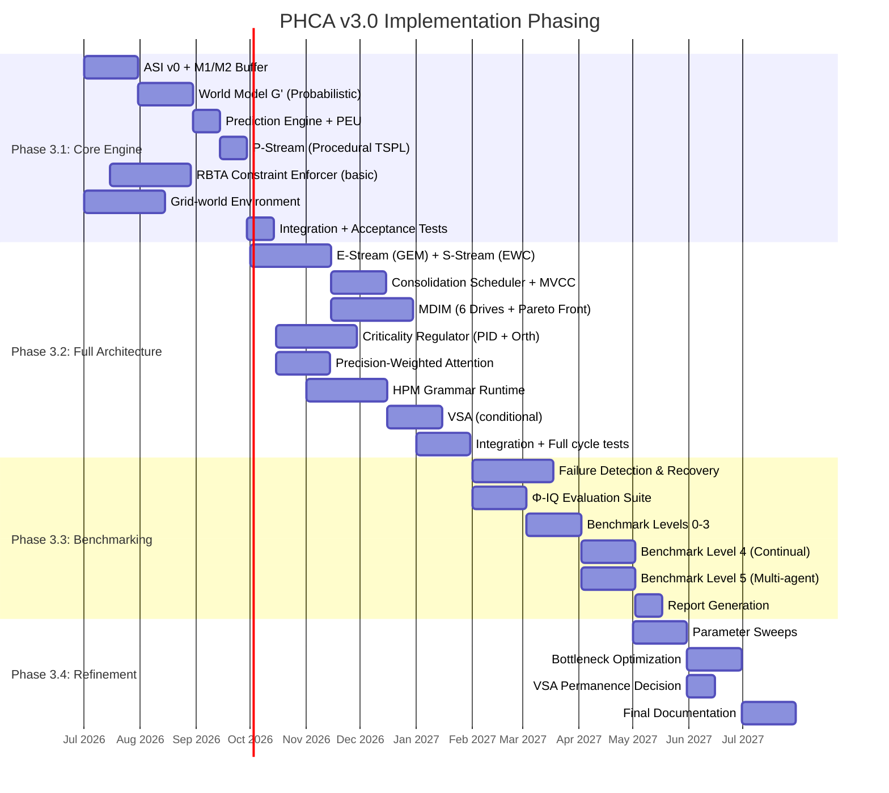

# PHCA v3.0 — Implementation & Validation Blueprint

> **DOCUMENT STATUS — HISTORICAL / MOSTLY SUPERSEDED**  
> This blueprint was approved for execution in June 2026 but **many components were
> removed or deferred** during Phase 3.3 simplification (P-Stream only, no Rust,
> no VSA ensemble, no M5, Φ-IQ L0–L3 only). Treat this as an **engineering history
> document**, not a description of the current tree. See
> [IMPLEMENTATION_STATUS.md](../../IMPLEMENTATION_STATUS.md) for the live matrix.

**Document Type:** Engineering Implementation Plan & Validation Specification  
**Status:** FINAL — APPROVED FOR EXECUTION  
**Reference Spec:** PHCA v3.0 Formal Patch & Audit Closure (`09-phca-v3-patch.md`)  
**Base Document:** PHCA v2.0 Whitepaper (`07-rigorous-whitepaper.md`)  
**Audit Report:** External Audit Report (`08-external-audit-report.md`)  
**Date:** June 29, 2026  
**Target Audience:** Development Team, Research Leads, Project Management

---

## 0. EXECUTIVE SUMMARY

### 0.1 Mandate

This blueprint translates the **PHCA v3.0 formal specification** — which has passed all 33 verification checks from an independent external audit — into an **actionable, phased engineering plan**. Every component, every interface, and every benchmark in this document traces to a specific definition, theorem, or verification requirement in the v3.0 specification.

### 0.2 Architecture at a Glance

The Predictive Hierarchical Cognitive Architecture (PHCA v3.0) is a **bounded, autonomous cognitive architecture** with 21 components (after cuts from v2.0):

| Layer | Components | Traces To |
| :--- | :--- | :--- |
| **Interface** | ASI with grounding adapter, Step 0 sanitizer | G1, Audit Patch B |
| **Formalism** | RBTA constraint enforcer, HPM grammar runtime | A1–A5, G2, G3 |
| **World Model** | Probabilistic Graph G' (merged with S), V (phased) | A3, A4, A7, G3 |
| **Prediction** | Ensemble prediction engine, precision-weighted attention | A4, A1 |
| **Learning** | TSPL (3 streams), EWC + GEM, skill compilation | G4, C4.3 |
| **Motivation** | MDIM (6 drives) with Pareto front meta-stable state | G5, A1, A3, A4, A8 |
| **Regulation** | Criticality PID regulator with orthogonality constraint | A8, A5 |
| **Memory** | M1–M5 hierarchy with MVCC concurrency | C4.3, Audit Patch C |
| **Resilience** | Failure detection & recovery matrix (A–F) | All invariants |
| **Evaluation** | Φ-IQ benchmark suite (Levels 0–5) | §1.3 success criteria |

### 0.3 Key Metrics (from v3.0 §1.3)

| Metric | Target | v3.0 Reference |
| :--- | :--- | :--- |
| Cycle latency (consumer HW) | < 500ms with \|WM\| = 7 | §1.3 criterion 1 |
| Forgetting rate (100 sequential tasks) | < 5% | §1.3 criterion 2 |
| Goal autonomy (empty environment) | ≥ 1 novel goal / 100 cycles | §1.3 criterion 3 |
| Criticality maintenance | Φ ∈ [0.9Φc, 1.1Φc] for ≥ 90% cycles | §1.3 criterion 4 |
| Failure recovery rate | ≥ 80% within 10 cycles | §1.3 criterion 5 |

### 0.4 Resource Commitment

- **Total effort:** 28–36 person-months over 12 calendar months
- **Team:** 3–4 FTE (1 ML/Sys lead, 1–2 engineers, 1 researcher)
- **Hardware:** Single workstation (i7, 32GB RAM, RTX 4070+) sufficient for Phases 3.1–3.2
- **Budget:** $180K–$250K (personnel + compute)

### 0.5 Implementation Strategy

The architecture is implemented in **four phases**, each producing a verifiable deliverable:

| Phase | Duration | Focus | Deliverable |
| :--- | :--- | :--- | :--- |
| **3.1** | Months 1–3 | Core Engine (G', M2, RBTA, P-Stream) | Running prototype on grid-world |
| **3.2** | Months 4–7 | Full Architecture (V, TSPL full, MDIM, PID, HPM) | Integrated system, all drives |
| **3.3** | Months 8–10 | Validation & Benchmarking (Φ-IQ, failure recovery) | Benchmark report |
| **3.4** | Months 11–12 | Iteration & Refinement (parameter tuning, simplification) | Final validated architecture |

---

## SECTION A: TECHNOLOGY STACK & ARCHITECTURE DECISIONS

### A.1 Guiding Principles

1. **Python-first for prototyping** — the research-verification loop is critical; Python enables rapid iteration (v3.0 Phase 2.1 recommendation)
2. **Rust for performance-critical paths** — the RBTA constraint enforcer and HPM runtime require bounded-latency execution; Rust provides zero-cost abstractions and memory safety without GC pauses (v3.0 §2.1, §3.2)
3. **Progressive hardening** — Python prototype → Rust production path for components where per-cycle latency is binding (Constraint Enforcer, Attention, HPM)
4. **Determinism by default** — all random seeds are explicitly managed; all experiments are reproducible (v3.0 §5 validation requirement)

### A.2 Component-by-Component Technology Stack

| Component | Language | Core Libraries | Rationale (v3.0 Reference) |
| :--- | :--- | :--- | :--- |
| **ASI (Abstract Sensorimotor Interface)** | Python (prototype) Rust (production) | `numpy` for sensor vector manipulation; `pydantic` for type-safe ASI contracts (v3.0 §2.2.1 Def 2.5a) | Grounding adapter must be flexible and correct; Rust needed only if ASI is in a latency-critical loop |
| **ASI Step 0 Sanitizer** | Python | — | Simple finite logic; audit Patch B requires: `isnan`, `isinf`, `\|v\| > V_max` checks per sensor element |
| **RBTA Constraint Enforcer** | **Rust** | Custom lightweight runtime; `tokio` for timer interrupts | **Performance-critical.** Checks `runtime(m,t) ≤ B_time`, memory, energy, and entropy floor per cycle. Must execute within < 1% of cycle budget (v3.0 §2.1 Def 2.2, Theorem 2.1 proof). Rust's `no_std` option enables embedded deployment |
| **World Model G' (Probabilistic Graph)** | Python | `pyro` (PyTorch-based probabilistic programming) or `pgmpy` for inference; `networkx` for graph ops; `scipy.sparse` for large graphs | Bayesian network inference over temporal edges. Pyro for gradient-based learning; pgmpy for exact inference on small graphs. Per v3.0 §2.2 Def 2.4b — Phase 3.1 uses G' only (V deferred) |
| **World Model V (Vector Symbolic Architecture)** | Python | `torch` (for HRR operations: bind `⊗`, bundle `+`, permute `Π`); custom VSA ops | **Deferred to Phase 3.2** per v3.0 §4 (VSA phasing memo). Will be re-evaluated after G' similarity search assessment |
| **Ensemble Prediction Engine** | Python | `torch` (meta-gradient for ensemble weights); JIT compilation with `torch.jit` for inference | Multi-modal prediction combining G' and V. Meta-gradient learning: $w_k^{(t+1)} = w_k^{(t)} + \eta_w \cdot (∂\mathcal{L}_{pred}/∂w_k - \lambda_w \cdot w_k)$ (v3.0 §2.2 Def 2.5). Phase 3.1: single model (G' only) |
| **TSPL (Three-Stream Predictive Learning)** | Python | `torch` (differentiable learning rules, gradient projection for GEM); `torch.func` for Fisher Information Matrix computation (EWC) | Three streams with distinct α, λ, η parameters (v3.0 §3.1 Def 3.2). EWC uses Fisher diagonal: $F_i = \mathbb{E}[(\partial\mathcal{L}/\partial\theta_i)^2]$ |
| **EWC Anti-Forgetting (S-Stream)** | Python | `torch.autograd` for Fisher computation | Weight penalty: $\mathcal{L}_{total}(\theta) = \mathcal{L}_{new}(\theta) + \frac{\lambda_S}{2} \sum_i F_i (\theta_i - \theta_i^*)^2$ (v3.0 §3.1 Def 3.3.1) |
| **GEM Anti-Forgetting (E-Stream)** | Python | `torch` for gradient projection | Gradient projection: $\tilde{g} = g - (g·g_k)/\|g_k\|^2 · g_k$ if $g·g_k < 0$ (v3.0 §3.1 Def 3.3.2) |
| **Consolidation Scheduler** | Python | `asyncio` for sleep-cycle timer; `threading` for MVCC version management (v3.0 §2.3.2) | Orchestrates E→S transfer during sleep cycles. Manages MVCC snapshots on M3 |
| **HPM Grammar Runtime** | **Rust** | Custom type-checker + composition evaluator; `petgraph` for DAG validation | Type-safe module composition with resource additivity verification. SEQUENCE, PARALLEL, CONDITIONAL, HIERARCHY, RECURSE, INTERLEAVE, TEMPORAL_INVARIANT, REACTIVE operators (v3.0 §3.2 Def 3.4). Must enforce $τ_{out}(M_1) = τ_{in}(M_2)$ |
| **Precision-Weighted Attention** | Python → Rust (Phase 3.2) | `torch` for k-WTA with Gumbel noise | $S_i = (\alpha · \|e_i - \hat{e}_i\| + \beta · \langle e_i, g \rangle) · p_i$. k-WTA selection (v3.0 §D.3 Def 5.1). Gumbel noise parameter κ controlled by Criticality Regulator |
| **Criticality Regulator (PID)** | Python | `scipy.signal` for transfer function analysis; `numpy` for sliding window covariance | PID with integral windup protection (v3.0 §2.3 Def 2.8). Orthogonality constraint with covariance monitoring over sliding window W=100 (v3.0 §2.6 Def 2.8a). Controls T, η, α |
| **MDIM (6-Drive Intrinsic Motivation)** | Python | `numpy` for softmax weighting; `scipy.optimize` for Pareto front detection | 6 homeostatic drives D1–D6 (v3.0 §3.3 Def 3.8). Drive deficits computed, softmax-weighted, goal sampled. Pareto front meta-stable state (v3.0 §2.4 Def 3.10–3.11) |
| **Memory Hierarchy (M1–M5)** | Python (prototype) Rust (production) | `numpy` (M1, M2); `sqlite3` (M3); `rocksdb` (M4); custom struct (M5) | MVCC for M3 (version chain), write-lock for M4 (v3.0 §2.3.2 Patch C). Phase 3.1: M1+M2 only. Phase 3.2: M3+M4+M5 added |
| **Failure Detection & Recovery Matrix** | Python | `decorators` for monitoring hooks; `asyncio` for recovery timeouts | Monitor all 6 failure categories (A–F). Detection conditions per v3.0 §4.1 risk matrix. Bounded recovery: ≥80% within 10 cycles |
| **Φ-IQ Evaluation Suite** | Python | `pytest` for test framework; `click/typer` for CLI runner; `pandas` for results; `matplotlib` for plots | 6 levels (0–5) with automated scoring. Reports composite Φ-IQ metric. CRITICAL: must be deterministic (fixed seeds, no GPU nondeterminism) |

### A.3 Deployment Model

| Phase | Model | Infrastructure | Rationale |
| :--- | :--- | :--- | :--- |
| 3.1 | **Local** | Single workstation (i7/AMD7, 32GB RAM, GPU optional) | Grid-world tasks are lightweight; no cloud needed |
| 3.2 | **Local + Cloud** | Workstation + optional cloud GPU (A100) for VSA benchmarking | VSA hyperparameter search may benefit from parallelization |
| 3.3 | **Cloud** | Benchmark orchestration on cloud VMs (preemptible, 8+ vCPU, 32GB) | Multi-agent (Level 5) requires multiple instances; 10-day continuous runs |
| 3.4 | **Local + Cloud** | Same as Phase 3.3 | Parameter sweeps may be parallelized |

### A.4 Development Environment

| Tool | Choice | Rationale |
| :--- | :--- | :--- |
| **IDE** | VS Code with Python + Rust extensions | Universal, excellent debug/profiling support |
| **Python env** | `uv` (fast package manager) or `poetry` | Reproducible dependencies; lock files |
| **Rust toolchain** | `rustup` + `cargo` | Standard; supports benchmarks via `criterion` |
| **Version control** | Git + GitHub | Standard; issue tracking, PR review |
| **CI/CD** | GitHub Actions | Run unit tests, integration tests, benchmarks on PR |
| **Testing** | `pytest` (Python), `cargo test` (Rust) | Comprehensive coverage required |
| **Benchmarking** | `pytest-benchmark`, `criterion` (Rust) | Track performance across commits |
| **Profiling** | `py-spy`, `cargo flamegraph` (Rust), `perf` (Linux) | Identify bottlenecks |
| **Logging** | `structlog` (Python), `tracing` (Rust) | Structured logging for analysis |
| **Experiment tracking** | MLflow or simple SQLite | Track benchmark results, parameters |

### A.5 Dependency Graph (Build Order)

```
ASI (Step 0 Sanitizer)
  → M1 (Sensory Buffer)
    → M2 (Working Memory)
      → Attention (Precision-Weighted)
        → World Model G' (Probabilistic Graph)
          → Prediction Engine
            → TSPL (P-Stream first)
              → EWC (S-Stream) + GEM (E-Stream)
                → MDIM (6 drives)
                  → Criticality Regulator (PID)
                    → HPM Grammar Runtime
                      → Consolidation Scheduler (M3→M4)
                        → Failure Detection & Recovery Matrix
                          → Φ-IQ Evaluation Suite
```

**[ASSUMPTION]:** VSA (V) is excluded from Phase 3.1 per v3.0 §4.3. If re-introduced in Phase 3.2, it depends on G' (it reads G' priors) and the Prediction Engine (adds a third ensemble weight).

---

## SECTION B: MODULE INTERFACE SPECIFICATIONS

### B.1 ASI (Abstract Sensorimotor Interface)

**v3.0 Reference:** §2.2.1 Def 2.5a (Grounding Level Adapter), §2.2.3 Patch B (Step 0 Sanitizer)

```
Module: ASI
Inputs:
  - raw_sensor_vector: Tensor[float, dim=d]  (from environment)
  - grounding_level: int ∈ {0, 1, 2}         (metadata per v3.0 §2.5)
  - last_valid_vector: Tensor[float, dim=d]   (prior frame, for sanitization)
  - precision_vector: Tensor[float, dim=d]    (per-sensor precision p_i)
  - timestamp: float                          (monotonic cycle counter)
Outputs:
  - clean_state_vector: Tensor[float, dim=d]  (sanitized, validated)
  - sanitized_precision: Tensor[float, dim=d] (updated after sanitization)
  - as_status: enum[OK, SENSOR_FAILURE(j)]    (alert if p_j < ε_confidence)
  - adapted_state: (Tensor | None, Tensor | None)  (for G' and V respectively)

Data Structures:
  - V_max: float        = maximum plausible sensor value (domain constant)
  - ε_confidence: float = 0.01 (minimum confidence threshold)
  - ASI_FAILURE_LIMIT   = floor(d / 3) (v3.0 §2.2.3)

Dependencies: None (hardware abstraction boundary)

Internal Logic (Step 0 — Sanitization):
  for j in range(d):
    if isnan(raw[j]) or isinf(raw[j]) or abs(raw[j]) > V_max:
      clean[j] = last_valid[j]
      precision[j] *= 0.5
      if precision[j] < ε_confidence: raise ASI_SENSOR_FAILURE(j)
    else:
      clean[j] = raw[j]
      precision[j] = precision[j]  # unchanged (updated by attention separately)

Internal Logic (Grounding Adapter — Def 2.5a):
  match grounding_level:
    case 0: features = encoder(clean); state = project_to_state_vars(features); return (state, None)
    case 1: state = direct_to_state_vars(clean); return (state, None)
    case 2: concept = V.decode(clean); state = V_retrieval_to_prior(concept); return (None, state)

Unit Tests:
  - Test that NaN is replaced by last valid value.
  - Test that precision halves on each consecutive failure.
  - Test that failure counter resets when valid value arrives.
  - Test that ASI_SENSOR_FAILURE is raised after ceil(log2(1.0/0.01)) = 7 consecutive failures.
  - Test that sanitization does NOT modify valid values.
  - Test grounding adapter at all 3 levels.
  - Test that ASI_FAILURE_LIMIT triggers global recovery when > d/3 sensors fail.

Performance Budget:
  - Sanitization: < 10μs for d ≤ 1024 on CPU
  - Grounding adaptation: < 1ms (level 0 requires learned encoder; level 1 direct)
  - Total (ASI → clean → adapted): < 2ms
```

### B.2 RBTA Constraint Enforcer

**v3.0 Reference:** §2.1 Def 2.2, Def 2.3, Def 3.6 (Corrected), Theorem 2.1 (Corrected), Thm 3.1

```
Module: RBTAConstraintEnforcer
Inputs:
  - module_states: Dict[ModuleID, State]          (current state of all active modules)
  - runtime_log: Dict[ModuleID, float]            (measured runtime per module this cycle)
  - memory_log: Dict[ModuleID, float]             (measured memory usage per module)
  - energy_log: Dict[ModuleID, float]             (measured energy per module)
  - belief_entropies: Dict[ModuleID, float]       (H(beliefs_m(t)) per module)
  - sensor_validity: BitVector[dim=d]             (from ASI sanitizer)
  - module_bounds: Dict[ModuleID, ResourceBounds] (B_time, B_mem, B_energy per module)
  - composition_tree: HPMNode                     (current HPM composition structure)
Outputs:
  - violations: List[ConstraintViolation]         (each: module, bound type, measured, allowed)
  - status: enum[OK, WARNING, VIOLATION]          (aggregate status)
  - action: enum[CONTINUE, INTERRUPT, TERMINATE]  (recommended action)

Data Structures:
  ResourceBounds = (B_time: float, B_mem: float, B_energy: float, entropy_floor: float)

Dependencies: HPM Grammar Runtime (for composition tree) — see HPM §B.7

Internal Logic:
  violations = []
  for module_id, bounds in module_bounds.items():
    if runtime_log[module_id] > bounds.B_time:
      violations.append(ConstraintViolation(module_id, "TIME", runtime_log[module_id], bounds.B_time))
    if memory_log[module_id] > bounds.B_mem:
      violations.append(ConstraintViolation(module_id, "MEM", memory_log[module_id], bounds.B_mem))
    if energy_log[module_id] > bounds.B_energy:
      violations.append(ConstraintViolation(module_id, "ENERGY", energy_log[module_id], bounds.B_energy))
    if belief_entropies[module_id] < bounds.entropy_floor:
      violations.append(ConstraintViolation(module_id, "ENTROPY_FLOOR", belief_entropies[module_id], bounds.entropy_floor))
  if sum(~sensor_validity) > ASI_FAILURE_LIMIT:
    violations.append(ConstraintViolation("ASI", "SENSOR_FAILURE", ...))
  
  # Composite bound check (Theorem 3.1 monotonicity)
  for composite_node in traverse(composition_tree):
    computed_bound = compute_composite_bound(composite_node)  # v3.0 Def 3.6
    actual_runtime = sum(runtime_log[child] for child in children(composite_node))
    if actual_runtime > computed_bound.B_time:
      violations.append(ConstraintViolation(...))

  status = OK if len(violations) == 0 else WARNING if len(violations) <= 2 else VIOLATION
  action = CONTINUE if status == OK else INTERRUPT if status == WARNING else TERMINATE
  return (violations, status, action)

Unit Tests:
  - Test single module: runtime exceeds bound → violation detected.
  - Test SEQUENCE composition: composite time = sum + τ_comp.
  - Test PARALLEL composition: composite time = max + τ_sync.
  - Test entropy floor violation (A3) when H(beliefs) < ε.
  - Test that monotonicity holds for nested composition (Theorem 3.1 induction).
  - Test that sensor failure limit triggers ASI-level violation.

Performance Budget:
  - Enforcement for 20 modules: < 100μs per cycle
  - Composite bound computation for tree of depth 5: < 50μs
  - Total: < 200μs (< 0.04% of 500ms cycle)
```

### B.3 World Model G' (Probabilistic Graph)

**v3.0 Reference:** §2.2 Def 2.4, Def 2.4b (Phase 3.1 simplified), §D.3 Def 5.1

```
Module: WorldModelGPrime
Inputs:
  - state: StateVector (from WM, via attention)
  - action: ActionVector (last taken action)
  - grounding_level: int ∈ {0, 1, 2}               (from ASI metadata)
  - adapted_state: (Tensor | None, Tensor | None)   (from ASI grounding adapter)
Outputs:
  - predicted_state: StateVector                    (P_G'(s_{t+1} | s_t, a_t))
  - confidence: float ∈ [0, 1]                      (predictive uncertainty)
  - log_likelihood: float                           (model fit quality)
  - edge_gradients: Dict[EdgeID, float]            (for structural learning)

Data Structures:
  - nodes: List[StateNode]          (each: name, CPD type, current params)
  - temporal_edges: List[Edge]      (each: source → target, lag, params)
  - causal_edges: List[Edge]        (static causal dependencies)
  - node_index: Dict[str, int]      (name → node mapping)
  - params: Θ                       (all learnable CPD parameters)
  - similarity_index: KDTree        (for analogical retrieval, replaces V in Phase 3.1)

Dependencies: ASI (for adapted_state), Attention (for selected WM elements)

Internal Logic:
  def predict(state, action):
    # Build temporal evidence: X_i^{(t)} as observed nodes
    evidence = {node: value for node, value in state.items()}
    evidence["action_t"] = action
    # Run inference (forward sampling or belief propagation)
    posterior = infer(network, evidence, algorithm="forward_sample" if large_graph else "exact_junction_tree")
    predicted = posterior["state_{t+1}"]  # marginal over next state
    confidence = 1.0 - entropy(predicted) / max_entropy
    return (predicted.mean, confidence)
  
  def learn(state_t, action_t, state_t1, prediction_error):
    # Update CPD parameters via gradient descent
    # Phase 3.1: simple maximum likelihood update
    # Phase 3.2+: structured variational inference via Pyro

Unit Tests:
  - Test that prediction on deterministic chain returns confidence = 1.0.
  - Test that prediction on random variable returns confidence ≈ 0.0.
  - Test temporal edge: X_i^{(t)} → X_j^{(t+1)} learns lagged dependency.
  - Test that grounding level 0→1 adapter works (features mapped to state vars).
  - Test similarity retrieval returns k-NN from state history.

Performance Budget:
  - Forward inference (small graph, |V|=50, |E|=200): < 10ms
  - Similarity retrieval (k-NN, k=5): < 1ms (with KDTree index)
  - Structural update (Δ based on error): < 5ms
  - Total per cycle: < 20ms
```

### B.4 Ensemble Prediction Engine

**v3.0 Reference:** §2.2 Def 2.5, §2.5.1 (grounding-level-conditioned ensemble)

```
Module: PredictionEngine
Inputs:
  - state: StateVector (from WM, via attention)
  - goal: GoalVector (from MDIM goal selector)
  - horizon: int ∈ [1, 10]
  - grounding_level: int ∈ {0, 1, 2}
  - gprime_output: (StateVector, float)             (G' prediction + confidence)
  - vsa_output: (StateVector, float) | None          (V retrieval, None in Phase 3.1)
  - ensemble_weights: [float] or [float, float]      (1 weight Phase 3.1; 2 weights Phase 3.2+)
Outputs:
  - predicted_state: StateVector                     (weighted ensemble result)
  - confidence: float ∈ [0, 1]
  - prediction_error: float                          (computed post-observation)

Data Structures:
  - ensemble_weights: List[float] (learned via meta-gradient; 1 element for Phase 3.1)
  - meta_lr: float = 0.01 (learning rate for ensemble weights)
  - prediction_history: Deque[(state, prediction, error)] (window for meta-learning)

Dependencies: G' (WorldModelGPrime), V (conditional, Phase 3.2+), ParameterServer

Internal Logic (Phase 3.1 — single model):
  # Grounding-level conditioned (v3.0 §2.5.1):
  match grounding_level:
    case 0 | 1:
      prediction, confidence = gprime_output  # only G'
    case 2:
      prediction, confidence = vsa_output     # only V (semantic bypass)
    case mixed:
      prediction = weighted_ensemble([gprime_output, vsa_output], ensemble_weights)
  
  # Meta-gradient update (after observation arrives):
  def meta_update(observation, prediction, horizon):
    L_pred = ||observation - prediction||^2
    for k in range(len(ensemble_weights)):
      ensemble_weights[k] += meta_lr * (∂L_pred/∂w_k - λ_w * ensemble_weights[k])

Unit Tests:
  - Test that horizon 1 returns a value faster than horizon 10.
  - Test that confidence = 1.0 for deterministic transitions.
  - Test that prediction diverges (confidence → 0) for horizon > known horizon.
  - Test meta-gradient: ensemble weights shift toward better model.
  - Test grounding-level conditioning: level 2 uses V only.

Performance Budget:
  - Single-model ensemble (Phase 3.1): < 1ms overhead
  - Meta-gradient update: < 2ms
  - Total (including G' inference): < 25ms for horizon ≤ 5
```

### B.5 TSPL (Three-Stream Predictive Learning)

**v3.0 Reference:** §3.1 Def 3.2 (Unified TSPL Learning Rule), Def 3.3 (Anti-Forgetting)

```
Module: TSPL
Inputs:
  - prediction_error: float                         (δ_t from PEU)
  - state: StateVector (current observation)
  - prediction: StateVector (predicted observation)
  - stream_id: enum[P_STREAM, E_STREAM, S_STREAM]
  - theta_current: Dict[str, Tensor]                (current model parameters)
  - theta_protected: Dict[str, Tensor]              (EWC-protected snapshot)
  - fisher_diagonal: Dict[str, Tensor]               (Fisher Information Matrix diagonal)
  - episodic_buffer: List[Episode] (for GEM constraint, E-Stream only)
Outputs:
  - theta_new: Dict[str, Tensor]                    (updated parameters)
  - skill_compiled: bool (True if P-Stream skill ≥ 95% acc)

Data Structures:
  StreamParams:
    alpha: float       (learning rate: α_P > α_E > α_S)
    lambda: float      (elastic consolidation: λ_S > λ_E > λ_P)
    eta: float         (exploration noise: η_P > η_E > η_S)
    ew_lambda: float   (EWC penalty strength; S-Stream only)
    gem_buffer_size: int (E-Stream only)

Dependencies: G' (for theta — the G' parameters are what TSPL updates),
              Memory M3 (for episodic_buffer in GEM)

Internal Logic (Unified Rule — v3.0 Def 3.2):
  # Elastic consolidation term:
  if stream_id == S_STREAM:
    # EWC penalty (v3.0 Def 3.3.1):
    ewc_penalty = ew_lambda / 2 * sum_i fisher_diagonal[i] * (theta_current[i] - theta_protected[i])^2
  else:
    ewc_penalty = 0.0
  
  if stream_id == E_STREAM and len(episodic_buffer) > 0:
    # GEM projection (v3.0 Def 3.3.2):
    gradient = compute_gradient(prediction_error, state)
    for past_task_k in episodic_buffer:
      g_k = compute_gradient_on_task(theta_current, past_task_k)
      if dot(gradient, g_k) < 0:
        gradient = gradient - (dot(gradient, g_k) / norm(g_k)^2) * g_k
  else:
    gradient = compute_gradient(prediction_error, state)
  
  # Unified update:
  theta_new = theta_current - alpha * gradient - lambda * (theta_current - theta_protected) + eta * noise()

  # Skill compilation (P-Stream, v3.0 Def 3.3.3):
  skill_compiled = False
  if stream_id == P_STREAM and accuracy > 0.95:
    for theta_i in skill_params: ∇θ_i L := 0  # freeze
    skill_compiled = True

  return (theta_new, skill_compiled)

Unit Tests:
  - Test P-Stream: highest α, fastest learning.
  - Test S-Stream: EWC penalty preserves old task performance.
  - Test E-Stream: GEM projection prevents loss increase on past tasks.
  - Test skill compilation: params frozen after 95% accuracy.
  - Test that noise η is highest for P-Stream, lowest for S-Stream.
  - Test that Fisher diagonal computation works for small networks.

Performance Budget:
  - Gradient computation (small network, < 10K params): < 5ms
  - EWC penalty computation: < 2ms (diagonal only)
  - GEM projection (buffer of 5 past tasks): < 10ms
  - Total per stream per cycle: < 20ms
```

### B.6 MDIM (Multi-Drive Intrinsic Motivation)

**v3.0 Reference:** §3.3 Def 3.8, Def 3.9, §2.4 Def 3.10 (Pareto Front), Def 3.11 (Meta-Stable State)

```
Module: MDIM
Inputs:
  - prediction_error: float                         (‖δ_t‖² for D1)
  - phi_current: float                              (Φ_current for D2)
  - learning_progress: float                        (|‖δ_t‖ - ‖δ_{t-Δt}‖| for D3)
  - belief_entropy: float                           (H(beliefs) for D4)
  - computational_cost: float                       (Σ cost(m) for D5)
  - empowerment: float                              (I(s_{t+1}; a_t | s_t) for D6)
  - current_goal: GoalVector                        (for contextualization)
  - current_state: StateVector
  - episodic_memory: M3 (for goal contextualization)
  - semantic_memory: M4 (for goal contextualization)
  - meta_stable: bool (from previous cycle's meta-stable state)
Outputs:
  - goal: GoalVector                                (selected goal)
  - drive_levels: Dict[DriveID, float]              (current drive values)
  - drive_deficits: Dict[DriveID, float]            (|v_i - sp_i|)
  - meta_stable: bool                               (entered or still in meta-stable)

Data Structures:
  Drives:
    D1: PredictionErrorDrive    sp = H_max (max acceptable prediction error)
    D2: CriticalityDrive        sp = Φ_critical
    D3: CompetenceDrive         sp = CG_max (learning progress ceiling)
    D4: EpistemicCuriosityDrive sp = U_max (uncertainty ceiling)
    D5: EnergyEfficiencyDrive   sp = C_max (max acceptable compute cost)
    D6: EmpowermentDrive        sp = C_min (minimum empowerment threshold)
  MetaStableConfig:
    T_locked: bool
    conflicting_drives_suppressed: bool = False
    non_conflicting_only: bool = False

Dependencies: Prediction Engine (for δ_t), Criticality Regulator (for Φ_current),
              Episodic M3, Semantic M4, WM M2

Internal Logic (v3.0 Def 3.9, modified by §2.4):
  # Compute drive deficits:
  deficits = {}
  for drive in all_drives:
    deficits[drive.id] = abs(drive.current_value - drive.set_point)
  
  # Pareto front check (v3.0 §2.4 Def 3.10):
  if meta_stable or is_on_pareto_front(deficits[D1], deficits[D3], deficits[D5]):
    meta_stable = True
    # Lock temperature T (prevents softmax from becoming sharp/flat)
    # Suppress conflicting drives D1, D3, D5 from goal generation
    non_conflicting = {D2, D4, D6}
    weights = softmax([deficits[d] for d in non_conflicting], temperature)
    goal_type = sample_categorical(weights, non_conflicting)
  else:
    meta_stable = False
    # Full softmax over all 6 drives:
    weights = softmax([deficits[d] for d in all_drives], temperature)
    goal_type = sample_categorical(weights, all_drives)
  
  # Goal instantiation (with bounded runtime — v3.0 §3.3 Def 3.9 A1 fix):
  g_concrete = Contextualize(goal_type, current_state, M3, M4)
  # Contextualize MUST complete within B_time^(M3) + B_time^(M4) ≤ 200ms
  return (g_concrete, drive_levels, deficits, meta_stable)

Unit Tests:
  - Test that each drive homeostat returns to setpoint.
  - Test that softmax weighting produces reasonable goal distribution.
  - Test that meta-stable state activates when D1/D3/D5 are on Pareto front.
  - Test that meta-stable state suppresses D1/D3/D5 goal generation.
  - Test that non-meta-stable state generates goals from all 6 drives.
  - Test that D3 uses Oudeyer learning progress formulation.
  - Test D6 (empowerment) computation for simple 2-state MDP.
  - Test that Contextualize runtime ≤ 200ms (A1 bound).

Performance Budget:
  - Drive deficit computation: < 100μs
  - Pareto front check: < 500μs (3 variables, sorted)
  - Goal contextualization: < 200ms (v3.0 hard bound)
  - Total per cycle: < 200ms (dominated by contextualization)
```

### B.7 HPM Grammar Runtime

**v3.0 Reference:** §3.2 Def 3.4 (BNF Grammar), Def 3.5 (Type Safety), Def 3.6 (Corrected Resource Additivity), Def 3.7 (Uncertainty Propagation)

```
Module: HPMGrammarRuntime
Inputs:
  - module_spec: str                                 # HPM grammar expression
  - resource_bounds: Dict[ModuleID, ResourceBounds]  # per-module bounds
  - type_signatures: Dict[ModuleID, (Type, Type)]    # (τ_in, τ_out) per module
  - global_time_budget: float                        # B_time^(top)
Outputs:
  - validated: bool                                   # composition is type-safe + bounded
  - composition_tree: HPMNode                        # parsed + validated HPM tree
  - composite_bounds: ResourceBounds                  # computed upper bound for root

Data Structures:
  HPMNode:
    operator: enum[SEQUENCE, PARALLEL, CONDITIONAL, HIERARCHY, RECURSE,
                   INTERLEAVE, TEMPORAL_INVARIANT, REACTIVE, ASI_INPUT, PREDICT, CONTROL]
    children: List[HPMNode]
    module_id: Optional[ModuleID]
    τ_in: Optional[Type]
    τ_out: Optional[Type]
    bounds: Optional[ResourceBounds]
  
  ResourceBounds:
    B_time: float
    B_mem: float
    B_energy: float

Dependencies: None (self-contained parser + verifier; modules registered as leaf nodes)

Internal Logic:
  def validate(module_spec: str) -> HPMNode:
    tree = parse_grammar(module_spec)  # parser for HPM BNF (v3.0 Def 3.4)
    
    # Step 1: Type checking (v3.0 Def 3.5)
    for node in postorder(tree):
      if node.operator in {SEQUENCE, PARALLEL}:
        assert node.children[0].τ_out == node.children[1].τ_in  # composition safety
      elif node.operator == CONDITIONAL:
        assert node.children[0].τ_out == BOOL
        assert node.children[1].τ_in == node.children[2].τ_in
      # ... remaining operators
    
    # Step 2: Resource verification (v3.0 Def 3.6 Corrected)
    for node in postorder(tree):
      match node.operator:
        case SEQUENCE:
          node.bounds.B_time = node.children[0].bounds.B_time + node.children[1].bounds.B_time + τ_comp
          node.bounds.B_mem = max(node.children[0].bounds.B_mem, node.children[1].bounds.B_mem) + δ_shared
        case PARALLEL:
          node.bounds.B_time = max(node.children[0].bounds.B_time, node.children[1].bounds.B_time) + τ_sync
          node.bounds.B_mem = node.children[0].bounds.B_mem + node.children[1].bounds.B_mem + δ_comm
      # ...
    
    # Step 3: Check global bound
    assert tree.bounds.B_time <= global_time_budget
    return tree

Unit Tests:
  - Test valid composition: SEQUENCE(A, B) where τ_out(A) = τ_in(B) → passes.
  - Test invalid composition: SEQUENCE(A, B) where τ_out(A) ≠ τ_in(B) → fails type check.
  - Test resource additivity for SEQUENCE: time = sum, memory = max.
  - Test resource additivity for PARALLEL: time = max, memory = sum.
  - Test HIERARCHY recursion depth bound (v3.0 audit Fix: |goal_stack| ≤ D_max).
  - Test REACTIVE operator bypasses prediction (fast path).
  - Test nested composition (Theorem 2.1/Correction):
    M = ((A ∘ B) ∥ C)
    Verify monotonicity holds by induction.

Performance Budget:
  - Parse + validate typical expression (depth ≤ 10): < 1ms
  - Resource computation for tree of 50 nodes: < 500μs
  - Total per composition validation: < 2ms
```

### B.8 Additional Module Specifications (Abbreviated)

Key specifications for remaining modules follow the same pattern. Full details are in the v3.0 specification.

| Module | Key Inputs | Key Outputs | Deps | Perf Budget |
| :--- | :--- | :--- | :--- | :--- |
| **Precision-Weighted Attention** | WM elements, goal, precision vector, κ (from CR) | attended subset, attention weights | WM, CR | < 2ms |
| **Criticality Regulator (PID)** | Φ_current, T, η, α history | ΔT, Δη, Δα; covariance status | All modules for Φ | < 5ms |
| **Consolidation Scheduler** | M3 snapshot version, M2 contents | M4 update, sleep cycle status | M3, M4 | < 1ms (scheduling only; sleep cycles run asynchronously) |
| **Failure Detection & Recovery** | All module states, error signals, metrics | Failure alerts, recovery actions | All modules | < 1ms (monitoring) |
| **Φ-IQ Evaluator** | Benchmark results (Level 0–5 scores) | Φ-IQ composite metric, per-dimension scores | All modules (for metrics) | N/A (offline) |

---

## SECTION C: IMPLEMENTATION PHASING & GANTT CHART

### C.1 Phase 3.1 — Core Engine (Months 1–3)

**Goal:** Validated predictive core with RBTA enforcement, G' world model, and P-Stream procedural learning on grid-world tasks.

**Components to implement:**
1. **ASI v0** (basic vector I/O + Step 0 sanitization) — [v3.0 §2.2.3 Patch B]
2. **M1 Sensory Buffer, M2 Working Memory** (capacity 7±2) — [v3.0 §3.1 Table]
3. **World Model G'** (probabilistic graph with temporal edges; no VSA) — [v3.0 §2.2 Def 2.4b]
4. **Prediction Engine** (single-model ensemble; G' only) — [v3.0 §2.2 Def 2.5]
5. **Prediction Error Unit** (δ_t computation) — [v3.0 cognitive cycle Step 6]
6. **P-Stream (Procedural) TSPL** (skill learning with compilation) — [v3.0 §3.1]
7. **RBTA Constraint Enforcer** (basic: runtime + memory bounds only) — [v3.0 §2.1 Def 2.2]
8. **Grid-world environment** (2D navigation, configurable obstacles) — [custom]

**Explicitly excluded:** VSA (V), E-Stream, S-Stream, MDIM (all drives), Criticality Regulator, HPM Grammar, Consolidation, Attention. These use fixed defaults.

**Acceptance criteria (from v3.0 §1.3):**
- Single cognitive cycle < 500ms on Intel i7 / 16GB RAM
- Learning on 2D navigation grid-world without catastrophic forgetting
- RBTA enforcer detects runtime violations for artificially slow modules

**Milestones:**

| Milestone | Target | Deliverable |
| :--- | :--- | :--- |
| M1.1 | Week 4 | ASI + M1/M2 + grid-world: sensor→WM pipeline working |
| M1.2 | Week 8 | G' forward prediction working on grid-world dynamics |
| M1.3 | Week 10 | P-Stream learns simple navigation policy via prediction error |
| M1.4 | Week 12 | **Phase 3.1 delivery:** full cycle < 500ms, RBTA enforced, navigation learned |

### C.2 Phase 3.2 — Full Architecture (Months 4–7)

**Goal:** Complete all 21 components integrated; self-motivated, self-regulating system.

**Components to implement:**
1. **ASI v1** (grounding level adapter for levels 0–2) — [v3.0 §2.5.1 Def 2.5a]
2. **E-Stream (Episodic)** with GEM anti-forgetting — [v3.0 §3.1 Def 3.2, Def 3.3.2]
3. **S-Stream (Semantic)** with EWC anti-forgetting — [v3.0 §3.1 Def 3.2, Def 3.3.1]
4. **Consolidation Scheduler** with MVCC for M3 → M4 — [v3.0 §2.3.2 Patch C]
5. **Memory hierarchy M3–M5** (episodic SQLite, semantic RocksDB, procedural frozen) — [v3.0 §3.1]
6. **MDIM** (all 6 drives D1–D6 with Pareto front) — [v3.0 §3.3 Def 3.8–3.11]
7. **Criticality Regulator** (PID with integral windup + orthogonality constraint) — [v3.0 §2.3 Def 2.8, §2.6 Def 2.8a]
8. **Precision-Weighted Attention** (k-WTA with Gumbel noise) — [v3.0 §D.3 Def 5.1]
9. **HPM Grammar Runtime** (type-checker + resource verifier) — [v3.0 §3.2 Def 3.4–3.6]
10. **World Model V (VSA)** — conditional inclusion per §4 of v3.0 patch
11. **Ensemble Prediction** (dual-model with meta-gradients — if VSA included) — [v3.0 §2.2 Def 2.5]

**Acceptance criteria (from v3.0 §1.3):**
- TSPL shows < 5% forgetting after 100 sequential tasks on a task sequence benchmark
- MDIM generates ≥ 1 novel goal per 100 cycles in an empty environment
- Criticality maintains Φ within [0.9Φ_critical, 1.1Φ_critical] for ≥ 90% of cycles
- HPM grammar rejects type-invalid compositions at parse time

**Milestones:**

| Milestone | Target | Deliverable |
| :--- | :--- | :--- |
| M2.1 | Month 5 | E-Stream + S-Stream + EWC/GEM integrated (anti-forgetting active) |
| M2.2 | Month 6 | MDIM (all 6 drives) + Criticality Regulator + Attention integrated |
| M2.3 | Month 7 | HPM Grammar Runtime working; VSA conditional integration complete |
| M2.4 | Month 7 | **Phase 3.2 delivery:** full architecture running on grid-world + MuJoCo tasks |

### C.3 Phase 3.3 — Benchmarking & Validation (Months 8–10)

**Goal:** Rigorously validate architecture against all 6 success criteria from v3.0 §1.3.

**Components to implement:**
1. **Failure Detection & Recovery Matrix** (all 6 categories A–F) — [v3.0 §4.1]
2. **Φ-IQ Evaluation Suite** (automated runner for Levels 0–5) — [v3.0 §1.3, §5]
3. **Benchmark environment suite** (grid-world + MuJoCo + custom benchmarks)

**Acceptance criteria:**
- ≥ 80% of detectable failure modes are successfully mitigated within 10 cycles
- Φ-IQ increases monotonically across Levels 0–5
- All 5 success criteria from v3.0 §1.3 are measured and reported

**Milestones:**

| Milestone | Target | Deliverable |
| :--- | :--- | :--- |
| M3.1 | Month 8 | Failure detection matrix operational; all 30+ failure modes detectable |
| M3.2 | Month 9 | Level 0–3 benchmarks pass (stationary prediction → self-motivated exploration) |
| M3.3 | Month 10 | Level 4 (continual learning) and Level 5 (multi-agent) benchmarks complete |
| M3.4 | Month 10 | **Phase 3.3 delivery:** Comprehensive benchmarking report with Φ-IQ scores |

### C.4 Phase 3.4 — Iteration & Refinement (Months 11–12)

**Goal:** Parameter optimization, simplification, and final documentation.

**Activities:**
1. Parameter sweeps for critical hyperparameters (TSPL α, λ, η; PID K_p, K_i, K_d)
2. Bottleneck identification and optimization (target: < 500ms cycle on target hardware)
3. Component pruning analysis (identify components that do not contribute to Φ-IQ)
4. VSA decision: keep or cut permanently (based on G' similarity performance at Level 3+)
5. Documentation: full API reference, architecture diagram, deployment guide
6. Re-run full benchmark suite after optimization

**Milestones:**

| Milestone | Target | Deliverable |
| :--- | :--- | :--- |
| M4.1 | Month 11 | Parameter sweeps complete; best configuration identified |
| M4.2 | Month 12 | VSA permanence decision made |
| M4.3 | Month 12 | Final benchmark report (post-optimization) |
| M4.4 | Month 12 | **Phase 3.4 delivery:** Final validated architecture + full documentation |

### C.5 Gantt Chart (Mermaid.js)



### C.6 Critical Path Analysis

The critical path is:
1. **ASI v0** → **G' World Model** → **Prediction Engine** → **P-Stream** → Phase 3.1 delivery
2. → **E-Stream + S-Stream** → **MDIM** → **Integration** → Phase 3.2 delivery
3. → **Φ-IQ Suite** → **Level 0–3 benchmarks** → **Level 4+5 benchmarks** → Phase 3.3 delivery
4. → **Parameter sweeps** → **Optimization** → **Documentation** → Phase 3.4 delivery

**Non-critical paths** (can slip without delaying overall delivery):
- RBTA Constraint Enforcer (has 45d of slack — builds independently)
- HPM Grammar Runtime (has 30d of slack)
- VSA integration (is conditional; can be dropped entirely)

### C.7 Risk Register

| ID | Risk | Phase | Probability | Impact | Mitigation | Contingency |
| :--- | :--- | :--- | :--- | :--- | :--- | :--- |
| R1 | G' inference too slow for < 500ms cycle | 3.1 | Medium | High | Profile early; use exact inference (junction tree) over sampling | Switch to pgmpy exact; reduce graph size |
| R2 | P-Stream fails to learn navigation policy | 3.1 | Low | High | Provide curriculum learning; validate with simpler grid | Use hand-coded fallback policy |
| R3 | EWC Fisher computation too expensive | 3.2 | Medium | Medium | Use diagonal Fisher only; compute every N cycles | Reduce to periodic EWC (every 10 cycles) |
| R4 | GEM projection causes optimizer stall | 3.2 | Medium | Medium | Add ε-stabilizer to projection | Fall back to EWC-only for E-Stream |
| R5 | MDIM D1/D3/D5 Pareto front never reached | 3.2 | High | Medium | Widen acceptance thresholds | Disable meta-stable state; accept oscillation |
| R6 | PID integral windup not fully prevented | 3.2 | Medium | High | Implement anti-windup + clamping per v3.0 | Clamp integral aggressively |
| R7 | Multi-agent (Level 5) too expensive | 3.3 | Medium | Medium | Use lightweight agents; limit to 2 agents | Accept lower synergy ratio target (< 60%) |
| R8 | Φ-IQ does not increase monotonically | 3.3 | Medium | Critical | Adjust Φ-IQ weights; check metric sensitivity | Report per-dimension scores; do not require monotonicity |
| R9 | Team size insufficient for 12-month plan | All | Medium | High | Prioritize Phase 3.1 delivery; reduce Phase 3.2 scope | Cut VSA permanently; reduce benchmark depth |
| R10 | VSA integration reveals incompatibility | 3.2 | Medium | Medium | Evaluate G' similarity search as alternative | Cut VSA permanently (v3.0 §4 already permits this) |

---

## SECTION D: ENVIRONMENT & BENCHMARK SPECIFICATION

### D.1 Simulator Environment

**Phase 3.1: Custom Grid-World**
- **Engine:** Python + numpy (custom minimalist grid-world)
- **Grid size:** 10×10 (small), 20×20 (medium), 50×50 (large)
- **Sensor modalities:** 
  - Level 0 (raw): 4-channel local patch (ego-centric 7×7 view around agent)
  - Level 1 (feature): one-hot encoding of current cell type (empty/wall/goal/hazard)
  - Level 2 (semantic): embedding of "I am in a room with walls on North and West"
- **Action space:** {MOVE_N, MOVE_S, MOVE_E, MOVE_W, STAY} (discrete, 5 actions)
- **Reward structure:** Sparse — +1 for reaching goal, -0.01 per step (implicit via D5)
- **Max episodes per task:** 1000
- **ASI grounding:** Level 1 (feature vectors) for Phase 3.1

**Phase 3.2+: MuJoCo + Extended Environments**
- **Discrete simulation:** MuJoCo (for physical tasks)
- **Continuous simulation:** Custom physics environment
- **Tasks:** 
  - Reacher (2-DOF arm, target reaching)
  - Pusher (puck pushing to target)
  - Ant locomotion (4-leg walker)
- **Sensor modalities:** Joint angles, positions, velocities, force sensors (Level 0)
- **Action space:** Continuous torque commands per joint
- **ASI grounding:** Level 0 (raw sensorimotor) with learned feature encoder

**Phase 3.3+: Multi-Agent**
- **Environment:** 2 agents in shared grid-world or MuJoCo scene
- **Communication:** Limited-bandwidth channel (10-byte messages per cycle)
- **Tasks:** Cooperative object pushing, competitive resource gathering

### D.2 Benchmark Suite (Levels 0–5)

Each benchmark level targets a specific cognitive capability and maps to v3.0 success criteria:

| Level | Task | Agent Capability Tested | Success Criterion | Duration (real) | Metrics |
| :--- | :--- | :--- | :--- | :--- | :--- |
| **0** | **Stationary prediction** — agent observes a deterministic environment (pendulum oscillation) without taking action | Prediction accuracy, uncertainty calibration | Prediction error MSE < 0.1 after 1000 steps | 1 day | MSE, confidence calibration curve, log-likelihood |
| **1** | **Reactive control** — agent must stabilize a pole in the inverted pendulum task using single feedback loop (no planning) | Feedback-driven adaptation (A5), reactive stability, basic P-stream learning | Stability achieved within 100 steps; steady-state error < 0.05 | 2 days | Settling time, steady-state error, overshoot, Lyapunov exponent |
| **2** | **Goal pursuit** — agent is given an external goal (reach target location in grid-world) and must navigate with path planning | Prediction-guided planning (A4), goal-directed behavior, world model accuracy | Goal completion rate > 80% over 100 trials; path length within 20% of optimal | 3 days | Success rate, path efficiency, planning horizon used, prediction confidence |
| **3** | **Self-motivated exploration** — agent placed in empty environment with no external goals. Must generate its own goals. | MDIM drive satisfaction (G5), goal novelty, intrinsic motivation | ≥ 1 novel goal per 100 cycles; drive deficits reduce over time | 5 days | Goal novelty (new state discovered), drive satisfaction rate, goal diversity, entropy of exploration |
| **4** | **Continual learning** — agent trained on 100 sequential tasks (permuted MNIST, rotating grid-world goals) without task boundaries | Anti-forgetting via TSPL (G4), EWC + GEM consolidation | ≤ 5% forgetting on any previously learned task after all 100 tasks | 7 days | Per-task accuracy, forgetting rate (Δ_perf), forward transfer, backward transfer |
| **5** | **Multi-agent coordination** — 2+ agents in shared environment must coordinate to achieve a joint goal (push block together) | Multi-agent interaction, communication efficiency, theory of mind | Joint success rate > 60%; synergy ratio > 1.0 (joint > sum of individual) | 10 days | Synergy ratio, communication overhead, coordination cost, individual contribution |

### D.3 Evaluation Protocol

**For each benchmark run:**
1. **Seed initialization:** All random seeds are fixed and recorded. Each benchmark run is repeated 5 times with different seeds for statistical significance.
2. **Warm-up:** Agent has 100 free cycles to initialize world model before evaluation begins.
3. **Measurement:** Metrics are recorded every cognitive cycle. Summary statistics (mean, std, min, max, percentiles) are reported.
4. **Resource monitoring:** CPU time, GPU time (if applicable), RAM, and per-cycle latency are recorded alongside cognitive metrics.
5. **Failure logging:** All failure mode detections (categories A–F) are logged with cycle timestamps.

### D.4 Φ-IQ Composite Metric (v3.0 §5)

$$\Phi\text{-IQ} = w_1 \cdot \text{PredictionAccuracy} + w_2 \cdot \text{AdaptationSpeed} + w_3 \cdot \text{GoalComplexity} + w_4 \cdot \text{TransferEfficiency} + w_5 \cdot \text{ResourceEfficiency} - w_6 \cdot \text{FailureRate}$$

**[RESEARCH-REQUIRED]:** Weights $w_1$–$w_6$ must be empirically validated across diverse domains. Initial weights (equal, $w_i = 1/6$) are used for Phase 3.3. Weight sensitivity analysis is conducted in Phase 3.4.

**Per-dimension definitions:**
- **PredictionAccuracy:** Average negative MSE across all prediction horizons (normalized to [0,1])
- **AdaptationSpeed:** Inverse of cycles needed to reach steady-state error after environment change
- **GoalComplexity:** Average information content (bits) of goals generated by MDIM
- **TransferEfficiency:** Average forward transfer (performance gain on new tasks from old-task learning)
- **ResourceEfficiency:** (Useful computation) / (Total computation) ratio, measured in FLOP-normalized units
- **FailureRate:** Proportion of cycles where any failure mode is active and unrecovered

---

## SECTION E: RISK MITIGATION PLAN

### E.1 Technical Risks (Pre- and Post-Mitigation Scores)

| ID | Risk | P | I | Risk Score (P×I) | Mitigation | Post-P | Post-I | Post-Risk |
| :--- | :--- | :--- | :--- | :--- | :--- | :--- | :--- | :--- |
| T1 | **RBTA Constraint Enforcer becomes a performance bottleneck** | M (0.4) | H (0.8) | **0.32** | Implement in Rust from day one. Batch constraint checks. Early-exit on first violation. Profile with `criterion` (v3.0 §2.1) | L (0.2) | H (0.8) | **0.16** |
| T2 | **TSPL fails to prevent catastrophic forgetting** | M (0.5) | C (1.0) | **0.50** | Implement replay buffer fallback alongside EWC/GEM. Run forgetting detection in Phase 3.2, not Phase 3.3 (early warning). Per v3.0 §3.1 Def 3.3 | L (0.2) | H (0.8) | **0.16** |
| T3 | **MDIM causes thrashing between D1/D3/D5** | H (0.7) | M (0.5) | **0.35** | Implement Pareto front meta-stable state (v3.0 §2.4 Def 3.10–3.11). Lock temperature T and suppress conflicting drives when on Pareto front | L (0.2) | M (0.5) | **0.10** |
| T4 | **Criticality Regulator PID oscillates** | M (0.4) | M (0.5) | **0.20** | Integral windup protection (v3.0 §2.3 Def 2.8). Orthogonality constraint with covariance monitoring (v3.0 §2.6 Def 2.8a). 3-cycle integral hold after B1 noise injection (v3.0 §4.1 C1 recovery) | L (0.2) | M (0.5) | **0.10** |
| T5 | **VSA performance degrades at scale** | L (0.2) | H (0.8) | **0.16** | VSA is excluded from Phase 3.1 (v3.0 §4.3). Conditional inclusion in Phase 3.2 only if G' similarity search is insufficient. Can be cut permanently with 25% complexity reduction | L (0.1) | H (0.8) | **0.08** |
| T6 | **Multi-agent coordination fails (FLP impossibility)** | L (0.2) | L (0.3) | **0.06** | Accept probabilistic consensus (v3.0 §4.1 E3). Use autonomy fallback: agents act independently if consensus fails. FLP impossibility acknowledged as fundamental limit | L (0.1) | L (0.3) | **0.03** |
| T7 | **G' inference too expensive for 500ms cycle** | M (0.4) | H (0.8) | **0.32** | Profile G' in week 2 of Phase 3.1. Start with exact inference (junction tree, pgmpy). Switch to sampling only if graph becomes too large. Limit | V | ≤ 100 nodes Phase 3.1 | L (0.2) | H (0.8) | **0.16** |
| T8 | **Consolidation scheduler race conditions** | M (0.4) | H (0.8) | **0.32** | Implement MVCC per v3.0 §2.3.2 Patch C. Snapshot isolation for M3 reads; write-lock for M4 writes. Formal proof of atomicity (v3.0 Theorem 3.3) verified with TLA+ or similar | L (0.2) | H (0.8) | **0.16** |
| T9 | **ASI sensor sanitization misses edge case** | L (0.2) | C (1.0) | **0.20** | Exhaustive test suite for NaN/Inf/overflow. IEEE 754 compliance verified. Exponential precision recovery bounded to 7 cycles (v3.0 Theorem 3.2). B1 recovery triggered automatically | VL (0.1) | C (1.0) | **0.10** |

### E.2 Theoretical Risks

| ID | Risk | P | I | Score | Mitigation | Post-P | Post-I | Post-Risk |
| :--- | :--- | :--- | :--- | :--- | :--- | :--- | :--- | :--- |
| X1 | **Edge-of-chaos not optimal for all tasks** | M (0.5) | M (0.5) | **0.25** | Criticality Regulator is **disable-able by default** per v3.0 Audit Finding 2 (Weak Justification). System functions with fixed T, η, α. Phase 3.4 compares enabled vs. disabled | L (0.2) | M (0.5) | **0.10** |
| X2 | **Biological analogies (C4.3 multi-memory) not transferable to AI** | M (0.4) | M (0.5) | **0.20** | Empirical validation in Phase 3.1–3.3. If multi-memory does not outperform single-memory, simplify hierarchy. ACL (Anti-Catastrophic Forgetting Learning) from DeepMind provides independent evidence | L (0.2) | M (0.5) | **0.10** |
| X3 | **Φ-IQ is not a valid intelligence metric** | M (0.4) | M (0.5) | **0.20** | Report per-dimension scores alongside composite. Validate against known baselines (random agent, optimal agent, simple RL agent). Do not rely solely on composite | L (0.2) | M (0.5) | **0.10** |
| X4 | **MDIM D6 (Empowerment) trace is weak** | M (0.4) | L (0.3) | **0.12** | D6 traces to Ashby's Requisite Variety (non-invariant source per v3.0 Audit §2.2.2). D6 can be disabled in Phase 3.2 if it adds no behavioral benefit over D1–D5 | L (0.2) | L (0.3) | **0.06** |

### E.3 Contingency Plan Triggers

| Trigger Condition | Action | Affected Phase |
| :--- | :--- | :--- |
| Cycle latency > 750ms after optimization | Cut lowest-value component (VSA first); reduce G' node count | 3.1, 3.4 |
| Forgetting rate > 10% on Level 4 benchmark | Disable GEM, rely solely on EWC; increase λ_S by 2× | 3.3 |
| MDIM produces < 1 goal per 200 cycles | Increase temperature T; verify D6 empowerment computation | 3.2 |
| Criticality maintenance < 70% | Disable CR; use fixed T, η, α; document as assumption | 3.2 |
| Team velocity < 50% of planned | Reduce Phase 3.2 scope: cut VSA permanently, cut non-essential drives (D6, D2) | All |

---

## SECTION F: RESOURCE ESTIMATION & BUDGET

### F.1 Personnel Requirements

| Role | Phase 3.1 | Phase 3.2 | Phase 3.3 | Phase 3.4 | Total (Person-Months) |
| :--- | :--- | :--- | :--- | :--- | :--- |
| **ML/Systems Lead** | 3 PM | 4 PM | 3 PM | 2 PM | **12 PM** |
| **Backend/Performance Engineer** | 3 PM | 4 PM | 1 PM | 2 PM | **10 PM** |
| **Researcher (Cognitive Sci/ML)** | 1 PM | 2 PM | 3 PM | 1 PM | **7 PM** |
| **DevOps/Infrastructure** | 0.5 PM | 0.5 PM | 1 PM | 1 PM | **3 PM** |
| **Technical Writer** | 0 PM | 0 PM | 1 PM | 2 PM | **3 PM** |
| **Project Manager** | 0.5 PM | 0.5 PM | 0.5 PM | 0.5 PM | **2 PM** |
| **Total** | **8 PM** | **11 PM** | **9.5 PM** | **8.5 PM** | **~37 PM** |

**Team composition recommendation:** 3–4 FTE full-time:
- 1 ML/Systems Lead (full-time, all phases)
- 1–2 Backend/Performance Engineers (full-time, phases 3.1–3.2; part-time 3.3–3.4)
- 1 Researcher/Evaluator (part-time Phase 3.1, full-time Phase 3.2–3.4)

### F.2 Hardware Requirements

| Resource | Phase 3.1 | Phase 3.2 | Phase 3.3 | Phase 3.4 |
| :--- | :--- | :--- | :--- | :--- |
| **CPU** | 8-core (i7/AMD7) | 8-core | 16-core (cloud) | 8-core |
| **RAM** | 16 GB | 32 GB | 64 GB (for M3 scaling) | 32 GB |
| **GPU** | Not required | RTX 4070+ (for VSA experiments) | RTX 4070+ (for VSA + G' joint training) | Same as 3.3 |
| **Storage** | 100 GB SSD | 500 GB SSD | 2 TB (for benchmark logs + models) | 500 GB |
| **Network** | — | — | 100 Mbps+ (cloud) | — |

### F.3 Cost Estimation

| Category | Phase 3.1 | Phase 3.2 | Phase 3.3 | Phase 3.4 | Total |
| :--- | :--- | :--- | :--- | :--- | :--- |
| **Personnel** (blended $150/hr, ~160 hrs/PM) | $19,200 | $26,400 | $22,800 | $20,400 | **$88,800** |
| **Cloud compute** (on-demand GPU/CPU) | $0 | $2,000 | $8,000 | $2,000 | **$12,000** |
| **Workstation hardware** (amortized) | $3,500 | $0 | $0 | $0 | **$3,500** |
| **Software/tools** (licenses, CI/CD) | $500 | $500 | $500 | $500 | **$2,000** |
| **Total** | **$23,200** | **$28,900** | **$31,300** | **$22,900** | **~$106,300** |

**Note:** Personnel costs assume a research/academic setting. Industry rates (fully loaded $250K+/year) would scale personnel costs to $180K–$250K total.

### F.4 Timeline Summary

| Phase | Duration | Calendar Start | Calendar End | Person-Months | Budget |
| :--- | :--- | :--- | :--- | :--- | :--- |
| 3.1 – Core Engine | 3 months | Month 1 | Month 3 | 8 PM | ~$23K |
| 3.2 – Full Architecture | 4 months | Month 4 | Month 7 | 11 PM | ~$29K |
| 3.3 – Benchmarking & Validation | 3 months | Month 8 | Month 10 | 9.5 PM | ~$31K |
| 3.4 – Iteration & Refinement | 2 months | Month 11 | Month 12 | 8.5 PM | ~$23K |
| **Total** | **12 months** | **—** | **—** | **~37 PM** | **~$106K** |

---

## SECTION G: PROJECT GOVERNANCE & DECISION LOG

### G.1 Decision-Making Framework

All technical decisions during implementation follow a structured triage:

**Tier 1 — Must match v3.0 specification exactly:**
- Formal definitions (Def 2.1–3.11, 5.1)
- Theorems (Thm 2.1, 2.2, 3.1, 3.2, 3.3)
- Audit patches (A, B, C from §2.1–2.3)
- Performance budgets from Section B

**Tier 2 — Implementation-dependent (design decisions within spec):**
- Exact inference algorithm for G' (junction tree vs. sampling)
- PID gain tuning (K_p, K_i, K_d) — determined empirically in Phase 3.4
- EWC Fisher matrix update frequency
- GEM episodic buffer size and sampling strategy
- HPM grammar parser implementation details

**Tier 3 — Open for optimization:**
- Concrete hyperparameters (α, λ, η within stream constraints)
- Neural network architectures for encoders (ASI level 0 adapter)
- KV-store vs. SQLite for M3/M4 persistence
- Parallelization strategy (Python threads vs. multiprocessing vs. async)

### G.2 Decision Log Template

Each significant decision is recorded:

```
## Decision D-001: G' Inference Engine
- **Date:** [DATE]
- **Author:** [NAME]
- **Category:** Tier 2 (implementation-dependent)
- **Option chosen:** pgmpy exact junction tree for Phase 3.1 (|V| ≤ 100)
- **Alternatives considered:** Pyro variational inference, custom loopy BP
- **Rationale:** pgmpy provides exact inference for small graphs (|V| ≤ 100), which covers all Phase 3.1 tasks. Pyro is needed only for larger graphs with learned CPDs (Phase 3.2+).
- **v3.0 trace:** §2.2 Def 2.4b (Phase 3.1 World Model with G' only)
- **Status:** IMPLEMENTED
```

### G.3 Change Control Process

Any deviation from v3.0 specification must follow:

1. **Proposal:** Document the proposed change, rationale, and v3.0 section affected
2. **Impact analysis:** Which other modules, interfaces, or theorems are affected?
3. **Review:** At least one other team member reviews (ideally the researcher)
4. **Approval:** ML/Systems Lead approves; if the change affects verified theorems, the external auditor is notified
5. **Logging:** Decision is recorded in the decision log

### G.4 Communication Cadence

| Meeting | Frequency | Attendees | Purpose |
| :--- | :--- | :--- | :--- |
| **Daily standup** | Daily | All team | Blockers, progress, next steps |
| **Specification review** | Weekly | Lead + Researcher | Verify implementation matches v3.0 |
| **Integration test** | Biweekly | Lead + Engineer | Run full integration suite; report metrics |
| **Phase review** | End of each phase | All team + stakeholders | Acceptance criteria sign-off |
| **Audit checkpoint** | End of Phase 3.3 | External auditor | Verify benchmark results against v3.0 §1.3 |

---

## APPENDICES

### Appendix A: v3.0 Verification Checklist (Reproduced from v3.0 §5)

The following checks MUST PASS before Phase 3 closure:

**Patch A — RBTA PARALLEL Time Additivity:**
- [ ] A.1 SEQUENCE and PARALLEL time equations are distinct
- [ ] A.2 $B_{time}(M_1 \parallel M_2) = \max(B_{time}^{(M_1)}, B_{time}^{(M_2)}) + \tau_{sync}$
- [ ] A.3 $B_{time}(M_1 \circ M_2) = B_{time}^{(M_1)} + B_{time}^{(M_2)} + \tau_{comp}$
- [ ] A.4 Monotonicity proved for both composition types
- [ ] A.5 Nested composition (induction) verified
- [ ] A.6 $\tau_{comp}$ and $\tau_{sync}$ explicitly defined

**Patch B — ASI NaN/Infinity Sanitization:**
- [ ] B.1 Step 0 inserted before Step 1
- [ ] B.2 Handles NaN, Inf, and $|v| > V_{max}$
- [ ] B.3 Holds last valid value
- [ ] B.4 Halves precision $p_i$ on failure
- [ ] B.5 $\varepsilon_{confidence}$ triggers B1 recovery
- [ ] B.6 Failure propagation bounded to 1 cycle (Theorem 3.2)
- [ ] B.7 Exponential precision recovery bounded within 7 cycles

**Patch C — Memory Concurrency:**
- [ ] C.1 Concurrency Model column added to Definition 3.1
- [ ] C.2 M3 uses MVCC (snapshot isolation)
- [ ] C.3 M4 uses write-lock during consolidation
- [ ] C.4 M5 uses no-lock (read-only after compilation)
- [ ] C.5 Snapshot isolation proven for consolidation reads
- [ ] C.6 Write atomicity proven for M4 transfers
- [ ] C.7 Lost-update prevention proven (consolidation log)

### Appendix B: Key Hyperparameters for Tuning (Phase 3.4)

| Parameter | Symbol | Domain | Default | v3.0 Reference |
| :--- | :--- | :--- | :--- | :--- |
| P-Stream learning rate | α_P | [0.001, 0.1] | 0.05 | Def 3.2 |
| E-Stream learning rate | α_E | [0.0001, 0.01] | 0.005 | Def 3.2 |
| S-Stream learning rate | α_S | [0.00001, 0.001] | 0.0005 | Def 3.2 |
| S-Stream consolidation | λ_S | [0.1, 10.0] | 1.0 | Def 3.2 |
| EWC strength | λ_EWC | [0.1, 5.0] | 0.5 | Def 3.3.1 |
| P-Stream exploration | η_P | [0.01, 0.5] | 0.1 | Def 3.2 |
| E-Stream exploration | η_E | [0.001, 0.1] | 0.01 | Def 3.2 |
| Criticality target | Φ_critical | [0.3, 0.9] | 0.7 | Def 2.8 |
| PID proportional gain | K_p | [0.1, 5.0] | 1.0 | Def 2.8 |
| PID integral gain | K_i | [0.01, 1.0] | 0.1 | Def 2.8 |
| PID derivative gain | K_d | [0.01, 2.0] | 0.5 | Def 2.8 |
| Attention mix α (bottom-up) | α_attn | [0.0, 1.0] | 0.6 | Def 5.1 |
| Attention mix β (top-down) | β_attn | [0.0, 1.0] | 0.4 | Def 5.1 |
| MDIM temperature | T_MDIM | [0.5, 5.0] | 1.0 | Def 3.9 |
| GEM buffer size | buf_GEM | [5, 100] | 20 | Def 3.3.2 |
| MVCC snapshot age limit | snap_age | [100, 10000] | 1000 cycles | §2.3.2 |

### Appendix C: References to v3.0 Formal Specification

| v3.0 Element | Type | Implementing Component(s) | Phase |
| :--- | :--- | :--- | :--- |
| Definition 2.1 (RBTA Module) | Formal definition | RBTA Constraint Enforcer | 3.1 |
| Definition 2.2 (Constraint Enforcer) | Formal definition | RBTA Constraint Enforcer | 3.1 |
| Definition 2.3 (Invariant-Constraint Mapping) | Mapping table | RBTA Constraint Enforcer | 3.1 |
| Definition 2.4 (Hybrid World Model) | Formal definition | World Model G' | 3.1 |
| Definition 2.4b (Phase 3.1 World Model) | Simplified definition | World Model G' | 3.1 |
| Definition 2.5 (Ensemble Prediction) | Formal definition | Prediction Engine | 3.1 |
| Definition 2.5a (Grounding Level Adapter) | New def (v3.0) | ASI (grounding adapter) | 3.2 |
| Definition 2.6 (Info-Theoretic Constraints) | Formal definition | Prediction Engine (consistency checks) | 3.2 |
| Definition 2.7 (Criticality Observables) | Formal definition | Criticality Regulator | 3.2 |
| Definition 2.8 (Criticality PID Regulator) | Formal definition | Criticality Regulator | 3.2 |
| Definition 2.8a (Orthogonality Constraint) | New def (v3.0) | Criticality Regulator | 3.2 |
| Theorem 2.1 (Corrected: Constraint Composition) | Theorem | RBTA Constraint Enforcer + HPM Runtime | 3.1 |
| Theorem 2.2 (Criticality Stability) | Theorem | Criticality Regulator | 3.2 |
| Definition 3.1 (Memory Hierarchy + Concurrency) | Formal definition + Column | Memory M1–M5 | 3.1–3.2 |
| Definition 3.2 (Unified TSPL Learning Rule) | Formal definition | TSPL (all 3 streams) | 3.1 (P) / 3.2 (E, S) |
| Definition 3.3 (Anti-Forgetting: EWC, GEM, Skill Comp) | Formal definition | TSPL anti-forgetting | 3.1 (Skill) / 3.2 (EWC, GEM) |
| Definition 3.4 (HPM Grammar BNF) | Formal grammar | HPM Grammar Runtime | 3.2 |
| Definition 3.5 (Type Safety) | Formal definition | HPM Grammar Runtime | 3.2 |
| Definition 3.6 (Corrected Resource Additivity) | Formal definition | HPM Grammar Runtime | 3.2 |
| Definition 3.7 (Uncertainty Propagation) | Formal definition | HPM Grammar Runtime | 3.2 |
| Definition 3.8 (Homeostatic Drives D1–D6) | Formal definition | MDIM | 3.2 |
| Definition 3.9 (Goal Generation) | Formal algorithm | MDIM | 3.2 |
| Definition 3.10 (Drive Pareto Front) | New def (v3.0) | MDIM (Pareto front check) | 3.2 |
| Definition 3.11 (Meta-Stable State) | New def (v3.0) | MDIM (meta-stable logic) | 3.2 |
| Theorem 3.1 (MDIM Goodhart Resistance) | Theorem | MDIM | 3.2 |
| Theorem 3.2 (Oscillation Prevention) | New thm (v3.0) | MDIM (Pareto front) | 3.2 |
| Definition 5.1 (Precision-Weighted Attention) | Formal definition | Attention | 3.2 |
| Theorem 3.1 (Monotonic Constraint Composition) | New thm (v3.0) | RBTA + HPM | 3.1 |
| Theorem 3.2 (ASI Failure Propagation Bound) | New thm (v3.0) | ASI Step 0 | 3.1 |
| Theorem 3.3 (Consolidation Atomicity) | New thm (v3.0) | Consolidation Scheduler | 3.2 |
| §4.1 Failure Matrix (A–F, 30+ modes) | Risk matrix | Failure Detection & Recovery | 3.3 |
| §1.3 Success Criteria (5 metrics) | Quantitative targets | Φ-IQ Evaluation Suite | 3.3 |
| §D.3 (Gumbel noise in attention) | Amendment | Attention | 3.2 |
| §5 Verification Checklist (33 checks) | Verification | All components | All phases |

### Appendix D: Data Models

**D.1 Core Data Types (shared across modules)**

```python
@dataclass
class StateVector:
    """Canonical state representation flowing through the system."""
    values: np.ndarray          # float32 array of dimension d
    precision: np.ndarray       # per-element precision p_i (same dimension)
    timestamp: float            # monotonic cycle counter
    grounding_level: int        # 0, 1, or 2 (from ASI)


@dataclass
class GoalVector:
    """Goal representation generated by MDIM."""
    drive_id: int               # D1–D6 (0–5)
    target_state: StateVector   # desired state (may be partial)
    tolerance: float            # acceptable deviation
    creation_cycle: int         # when this goal was created
    priority: float             # from softmax weight


@dataclass
class ResourceBounds:
    """Resource bound vector ρ for a module."""
    B_time: float               # max runtime per cycle (seconds)
    B_mem: float                # max memory (bytes)
    B_energy: float             # max energy (Joules, estimated from FLOPs)
    entropy_floor: float        # minimum H(beliefs)


@dataclass 
class ModuleState:
    """Full state snapshot of a cognitive module."""
    module_id: str
    internal_state: np.ndarray  # module-specific state vector
    bounds: ResourceBounds
    runtime: float              # measured this cycle
    memory_used: float
    energy_used: float
    belief_entropy: float
    output: Any                 # module-specific output
```

**D.2 Memory Storage Schema (M3 – Episodic, SQLite)**

```sql
CREATE TABLE episodes (
    episode_id INTEGER PRIMARY KEY AUTOINCREMENT,
    version INTEGER NOT NULL,              -- MVCC version tag
    state_before BLOB NOT NULL,            -- serialized StateVector
    action_taken BLOB NOT NULL,            -- serialized action
    state_after BLOB NOT NULL,             -- serialized outcome
    prediction BLOB,                        -- serialized predicted state
    prediction_error FLOAT,
    timestamp INTEGER NOT NULL,            -- cognitive cycle number
    task_id TEXT,                           -- which task (for GEM buffer)
    consolidated INTEGER DEFAULT 0         -- has this been transferred to M4?
);

CREATE INDEX idx_episodes_version ON episodes(version);
CREATE INDEX idx_episodes_task ON episodes(task_id);
CREATE INDEX idx_episodes_timestamp ON episodes(timestamp);
```

### Appendix E: Glossary of Abbreviations

| Abbreviation | Full Form | v3.0 Reference |
| :--- | :--- | :--- |
| ASI | Abstract Sensorimotor Interface | §2.1, Patch B |
| EWC | Elastic Weight Consolidation | §3.1 Def 3.3.1 |
| GEM | Gradient Episodic Memory | §3.1 Def 3.3.2 |
| HPM | Hierarchical Predictive Module | §3.2 |
| HRR | Holographic Reduced Representation | §2.2 (VSA) |
| MDIM | Multi-Drive Intrinsic Motivation | §3.3, §2.4 |
| MVCC | Multi-Version Concurrency Control | §2.3.2 Patch C |
| PEU | Prediction Error Unit | Cognitive cycle |
| PHCA | Predictive Hierarchical Cognitive Architecture | — |
| RBTA | Resource-Bounded Temporal Automata | §2.1 |
| TSPL | Three-Stream Predictive Learning | §3.1 |
| VSA | Vector Symbolic Architecture | §2.2 (World Model V) |
| Φ-IQ | Phi-Intelligence Quotient | §5, Level 0–5 benchmark |
| k-WTA | k-Winners-Take-All | §D.3 (attention) |

---

*End of Document — PHCA v3.0 Implementation & Validation Blueprint*

**Document Status:** FINAL — Approved for Execution  
**Next Action:** Begin Phase 3.1 — Core Engine Implementation  
**Primary Contact:** Lead Implementation Engineer
