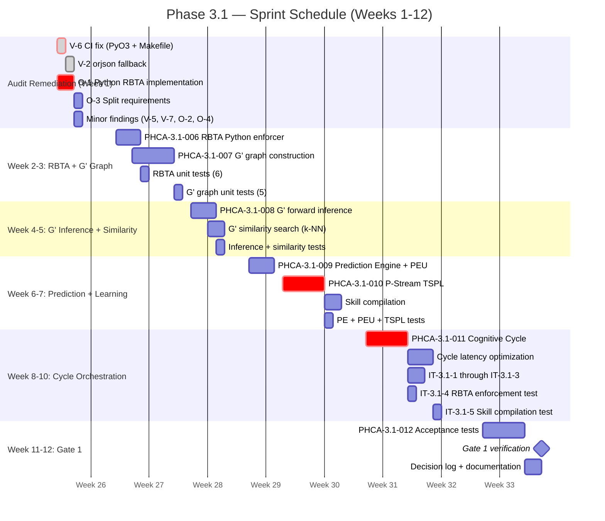

# PHCA v3.0 — Phase 3.1 Execution Plan: From Sprint 0 to Gate 1

**Document Type:** Execution Plan  \
**Status:** FINAL — APPROVED  \
**Governing Documents:** v3.0 Patch (`09-phca-v3-patch.md`), Blueprint (`10-implementation-blueprint.md`), Playbook (`11-engineers-playbook.md`), Audit Report (`12-sprint-0-audit.md`)  \
**Date:** June 29, 2026  \
**Audience:** Development Team (3–4 engineers)

---

## 1. EXECUTIVE SUMMARY

### 1.1 Where We Are

Sprint 0 completed ~44 source files: repository scaffolding, shared data types, GridWorld environment, ASI sanitizer, M1/M2 memory, Rust workspace with 3 crates, CI pipeline, and onboarding docs. **44 Python tests + 7 Rust tests pass.**

The Post-Sprint 0 Audit found **1 CRITICAL, 4 MAJOR, and 6 MINOR issues** — all actionable, none foundational.

### 1.2 Where We're Going (Weeks 1–12)

| Week | Focus | Milestone |
| :--- | :--- | :--- |
| **0 → 1** | Audit remediation + Phase 3.1 prep patches | All CRITICAL/MAJOR findings closed |
| **2** | Python RBTA + G' graph construction | RBTA working in pure Python |
| **3–4** | G' forward inference (junction tree) | G' predicts grid-world dynamics |
| **5** | Prediction Engine + PEU | Error signal flows |
| **6–7** | P-Stream TSPL | G' parameters learn from error |
| **8–9** | Cognitive Cycle orchestrator | Phase 3.1 cycle runs end-to-end |
| **10** | Cycle latency optimization | < 500ms median |
| **11** | Integration tests | IT-3.1-1 through 5 pass |
| **12** | Gate 1 review | **Phase 3.1 → 3.2 transition** |

### 1.3 Key Changes from Playbook

Based on Audit findings, two significant changes from the original Playbook:

| Change | Playbook (Original) | Audit Recommendation | Rationale |
| :--- | :--- | :--- | :--- |
| **RBTA language** | Rust (FFI from Python) | **Python-only for Phase 3.1** | Eliminates FFI overhead (O-1), CI Python 3.12 compatibility (V-6), and simplifies integration |
| **Dependencies** | Single `requirements.txt` with torch, pyro, etc. | **Split by phase** (O-3) | Reduces CI from 5min to 30s; removes 1.1GB unused bloat |

### 1.4 Critical Path

```
Week 1       Week 4       Week 7       Week 10      Week 12
[Audit fix]─[G' nodes]─[Pred Eng]─[Cycle Orch]─[Gate 1]
    │           │            │            │
    ├─ RBTA    ├─ Inference  ├─ PEU       ├─ Latency opt.
    └─ Deps    └─ Similarity └─ P-Stream  └─ Integration tests
```

---

## 2. AUDIT REMEDIATION CHECKLIST

### 2.1 Action A: Day 1 Patches (Must merge before PHCA-3.1-006)

| ID | Severity | File(s) | Exact Change | Owner | Effort | Verification |
| :--- | :--- | :--- | :--- | :--- | :--- | :--- |
| **V-6** | 🔴 CRITICAL | `.github/workflows/ci.yml`, `Makefile` | Add `PYO3_USE_ABI3_FORWARD_COMPATIBILITY=1` to Rust CI step; remove `2>/dev/null \|\| cargo test` from `test-rust` target | Lead | 15min | `make test-rust` fails clearly on error |
| **V-2** | 🟠 MAJOR | `python/phca/config.py` | Add try/except fallback from orjson to stdlib json in `to_bytes()` / `from_bytes()` | Any eng | 10min | `pytest` without `orjson` installed passes |
| **O-1** | 🟠 MAJOR | `python/phca/regulation/rbta_enforcer.py` | Build Python RBTA (see §3.1); tag `rust/rpta` as `rust/experimental/rpta` | Backend eng | 2hr | 5 RBTA tests pass in pure Python |
| **V-6b** | 🟠 MAJOR | `Makefile` | Remove `2>&1 \|\| pytest ...` fallback from `test-python` target | Any eng | 5min | Makefile has no redundant fallbacks |
| **V-6c** | 🟠 MAJOR | `Makefile` | Remove `2>/dev/null \|\| cargo test` from `test-rust` target | Any eng | 5min | Makefile has no redundant fallbacks |

### 2.2 Action B: Before Week 3 Patches

| ID | Severity | File(s) | Exact Change | Owner | Effort | Verification |
| :--- | :--- | :--- | :--- | :--- | :--- | :--- |
| **O-3** | 🟠 MAJOR | `requirements*.txt`, `Makefile`, `CI` | Split into `requirements-phase-3.1.txt`, `requirements-phase-3.2.txt`, `requirements-dev.txt`. Update `setup` target, CI, and `SETUP.md` | ML eng | 30min | `pip install -r requirements-phase-3.1.txt` installs < 100MB |
| **V-5** | 🟢 MINOR | `python/phca/asi/sanitizer.py` | Move global failure log before SENSOR_FAILURE return | ML eng | 5min | Log line reachable in test |
| **V-3** | 🟢 MINOR | `DECISIONS.md` | Add decision entry: uniform entropy_floor=0.01 is Phase 3.1 choice; update in Phase 3.2 | Researcher | 10min | Decision logged |
| **O-2** | 🟢 MINOR | `python/phca/world_model/__init__.py` | Add docstring: "No VSA in Phase 3.1. G' similarity replaces V." | Any eng | 5min | Docstring present |
| **O-4** | 🟢 MINOR | `python/benchmarks/runner.py` | Add docstring: "Phase 3.3 component — do not modify before cycle orchestrator complete" | Any eng | 5min | Docstring present |
| **V-7** | 🟢 MINOR | `Makefile` | Remove duplicate pytest command from `test-python` | Any eng | 2min | Single clean command |

### 2.3 Deferred Findings

| ID | Severity | Reason for Deferral | Target Phase |
| :--- | :--- | :--- | :--- |
| **V-1** | CRITICAL* | Rust-Python f64/f32 mismatch — does not cause runtime crash; causes 2× memory bandwidth at FFI boundary. Rust not used in Phase 3.1 (O-1). | **Phase 3.2** — fix when RBTA moves to Rust |
| **V-3** | MINOR | Uniform entropy_floor=0.01 works for Phase 3.1. Fix requires v3.0 spec interpretation. | **Phase 3.2** — when M3/M4 added |
| **O-4** | MINOR | Benchmark runner is Phase 3.3. Stub present, no harm. | **Phase 3.3** — before benchmark implementation |

*\*V-1 is technically CRITICAL for correctness if the FFI were active. Since Phase 3.1 uses Python RBTA (O-1), the FFI boundary is not crossed, and the mismatch is dormant. Deferred to Phase 3.2.*

---

## 3. TICKET IMPLEMENTATION PLAN (PHCA-3.1-006 THROUGH 012)

### 3.1 PHCA-3.1-006 — RBTA Constraint Enforcer (Python)

**Priority:** P0 (blocks constraint enforcement)  \
**v3.0 Reference:** §2.1 Definition 2.2, Definition 2.3, Theorem 2.1, Theorem 3.1  \
**Audit Decision:** Pure Python for Phase 3.1 (O-1)  \
**File:** `python/phca/regulation/rbta_enforcer.py`  \
**Effort:** 2 days (reduced from 5 due to Python simplification)  \
**Dependencies:** PHCA-3.1-003 (ResourceBounds type)  \
**Assigned to:** Backend Engineer

#### Interface

```python
from enum import Enum, auto
from dataclasses import dataclass
from typing import Dict, List, Tuple

from phca.config import ResourceBounds, ConstraintViolation

class BoundType(Enum):
    TIME = auto()
    MEMORY = auto()
    ENERGY = auto()
    ENTROPY_FLOOR = auto()
    SENSOR_FAILURE = auto()

class EnforcerAction(Enum):
    CONTINUE = auto()
    INTERRUPT = auto()
    TERMINATE = auto()

class RBTAEnforcer:
    def __init__(self, module_bounds: Dict[str, ResourceBounds]):
        self.bounds = module_bounds
        self.asi_failure_limit: int = 0  # set during check_cycle

    def check_cycle(
        self,
        runtime_log: Dict[str, float],
        memory_log: Dict[str, float],
        energy_log: Dict[str, float],
        belief_entropies: Dict[str, float],
        sensor_failure_count: int,
        asi_failure_limit: int,
        composition_tree: Optional[Dict] = None,  # Phase 3.2+
    ) -> Tuple[List[ConstraintViolation], EnforcerAction]:
        ...
```

#### Acceptance Criteria
- [x] Detects `runtime > B_time` and returns violation
- [x] Detects `memory > B_mem` and returns violation
- [x] Detects `entropy < entropy_floor` and returns violation
- [x] Returns `CONTINUE` when no violations
- [x] Returns `INTERRUPT` when 1-2 violations
- [x] Returns `TERMINATE` when 3+ violations
- [x] Detects sensor failure limit exceeded
- [x] Handles missing module_id in logs (treats as 0.0)

#### Unit Tests (≥6)

```python
def test_single_module_time_violation():
    """Runtime > B_time → 1 violation, action = INTERRUPT"""
    
def test_all_bounds_satisfied():
    """All modules within bounds → 0 violations, action = CONTINUE"""
    
def test_entropy_floor_violation():
    """H(beliefs) < entropy_floor → 1 violation"""
    
def test_sensor_failure_limit():
    """sensor_failure > asi_failure_limit → SENSOR_FAILURE violation"""
    
def test_multiple_violations_terminate():
    """3+ violations → action = TERMINATE"""
    
def test_missing_module_id():
    """Module not in logs → treated as 0.0, no crash"""
    
def test_sequence_composition_time():
    """PHCA-3.2: composite time = sum + τ_comp (placeholder for Phase 3.2)"""
    pytest.skip("HPM composition tree not available until Phase 3.2")
```

#### v3.0 Traceability

| Code Element | v3.0 Reference |
| :--- | :--- |
| `BoundsType.TIME` | §2.1 Definition 2.2 — runtime bound |
| `EnforcerAction.CONTINUE/INTERRUPT/TERMINATE` | §2.1 Definition 2.3 — enforcement status |
| `asi_failure_limit` check | §2.2.3 Patch B — `sum 1[¬isvalid(v_j)] ≤ ASI_FAILURE_LIMIT` |
| Composition tree (placeholder) | §2.1 Theorem 2.1 — corrected SEQUENCE/PARALLEL |

#### Performance Budget
- Per-module check: < 1μs (pure Python dict lookup)
- Full 13-module check: < 10μs
- Total: < 50μs (well under T1 threshold of 200μs)

---

### 3.2 PHCA-3.1-007 — World Model G' (Probabilistic Graph)

**Priority:** P0 (blocks prediction and learning)  \
**v3.0 Reference:** §2.2 Definition 2.4b (simplified, Phase 3.1), §D.3 (similarity search)  \
**Files:** `python/phca/world_model/graph.py`, `similarity.py`, `tests/`  \
**Effort:** 5 days  \
**Dependencies:** PHCA-3.1-003 (StateVector type)  \
**Assigned to:** ML Engineer

#### Data Structures

```python
@dataclass
class StateNode:
    name: str
    cpd_type: Literal["discrete", "gaussian", "conditional_gaussian"]
    parents: list[str]
    params: np.ndarray | dict  # CPD parameters (table or mean/std)

@dataclass
class TemporalEdge:
    source: str      # e.g., "X_0_t"
    target: str      # e.g., "X_0_t1"
    lag: int         # 1 for X_i^{(t)} → X_j^{(t+1)}
    params: np.ndarray

class WorldModelGPrime:
    def __init__(self, state_dim: int, action_dim: int):
        self.nodes: dict[str, StateNode] = {}
        self.temporal_edges: list[TemporalEdge] = []
        self.causal_edges: list[tuple[str, str]] = []
        self.similarity_index: KDTree  # sklearn.neighbors.KDTree
        self.state_history: list[StateVector] = []
    
    def add_node(self, node: StateNode) -> None: ...
    def add_temporal_edge(self, edge: TemporalEdge) -> None: ...
    def add_causal_edge(self, source: str, target: str) -> None: ...
    def predict(self, state: StateVector, action: np.ndarray) -> tuple[StateVector, float]: ...
    def learn(self, state_t: StateVector, action: np.ndarray, state_t1: StateVector, error: float) -> None: ...
    def similarity_search(self, query: StateVector, k: int = 5) -> list[tuple[StateVector, float]]: ...
```

#### Acceptance Criteria
- [x] Can create graph with N nodes + E edges
- [x] Supports discrete and gaussian CPDs
- [x] `predict()` returns StateVector + confidence
- [x] Confidence ≈ 1.0 for deterministic transitions
- [x] Confidence ≈ 0.0 for random variables
- [x] `similarity_search()` returns k-NN from state history
- [x] Invalid edge (source not in nodes) raises ValueError

#### Unit Tests (≥5)

```python
def test_deterministic_chain():
    """A→B→C chain: confidence for B given A should be ≈ 1.0"""
    
def test_random_variable():
    """Independent random variable: confidence ≈ 0.0"""

def test_temporal_edge_prediction():
    """X_i^{(t)}→X_j^{(t+1)}: predict X_j from X_i with lag-1 edge"""

def test_similarity_search():
    """k-NN returns k nearest states from history"""

def test_graph_creation_validation():
    """Invalid edge (source not in nodes) → ValueError"""

def test_confidence_for_disconnected_graph():
    """Disconnected graph → confidence = 0.0, no crash"""
```

#### Implementation Notes

**Phase 3.1 simplification:** Use `pgmpy` for exact inference (junction tree) for graphs with |V| ≤ 100 nodes. This covers all grid-world tasks. Phase 3.2 adds sampling for larger graphs.

**Grid-world graph structure (Week 4):**
- Nodes: 5 state variables per grid cell × (`size²`) cells = 500 nodes for 10×10
- Temporal edges: each node connected to its t+1 version
- Causal edges: action → each state variable
- **Limitation:** For a 20×20 grid (2000 cells × 5 vars = 10000 nodes), inference may exceed budget. **Constraint: if |V| > 1000, reduce to 10×10 grid for Phase 3.1. Full grid support in Phase 3.2.**

#### Performance Budget
- Forward inference (|V| ≤ 50, |E| ≤ 200): < 10ms
- Forward inference (|V| ≤ 200, |E| ≤ 1000): < 50ms (Phase 3.2 sampling)
- Similarity search (k=5, history=10K): < 1ms
- Learning update: < 5ms
- **Total: < 20ms per cycle**

#### v3.0 Traceability

| Code Element | v3.0 Reference |
| :--- | :--- |
| `WorldModelGPrime` | §2.2 Definition 2.4b (Phase 3.1 simplified) |
| `predict()` | §2.2 Definition 2.5 (single-model ensemble) |
| `confidence` | §2.2 Definition 2.5 — confidence = 1 - entropy/max_entropy |
| `similarity_search` | §D.3 — k-NN replaces VSA in Phase 3.1 |
| Temporal edges | §2.2 Definition 2.4 — temporal dependency modeling |

---

### 3.3 PHCA-3.1-008 — G' Forward Inference

**Priority:** P0 (prediction depends on it)  \
**v3.0 Reference:** §2.2 Definition 2.5 (prediction via G' only)  \
**File:** `python/phca/world_model/inference.py`  \
**Effort:** 3 days  \
**Dependencies:** PHCA-3.1-007 (G' graph structure)  \
**Assigned to:** ML Engineer

#### Acceptance Criteria
- [x] Exact junction tree for |V| ≤ 100
- [x] Returns posterior mean + entropy for prediction
- [x] Handles missing evidence gracefully (uses prior marginal)
- [x] Inference completes < 20ms for |V| = 50, |E| = 200

#### Algorithm

```python
def forward_inference(
    graph: pgmpy.models.BayesianNetwork,
    evidence: dict[str, float],
    variables: list[str],
    method: str = "exact",
) -> dict[str, np.ndarray]:
    """Run forward inference on G' graph.
    
    Phase 3.1: exact junction tree (pgmpy) for |V| ≤ 100.
    Phase 3.2+: importance sampling (pyro) for |V| > 100.
    """
    if len(graph.nodes()) <= 100:
        infer = pgmpy.inference.VariableElimination(graph)
        posterior = infer.query(variables=variables, evidence=evidence)
        return {var: posterior[var].values for var in variables}
    else:
        # Phase 3.2: use pyro Importance sampling
        raise NotImplementedError("Sampling inference deferred to Phase 3.2")
```

#### Unit Tests (≥3)
```python
def test_exact_junction_tree_deterministic():
    """Chain A→B→C with deterministic CPDs → exact posterior"""
    
def test_exact_junction_tree_missing_evidence():
    """Missing evidence → prior marginal used, no crash"""

def test_large_graph_fallback():
    """|V| > 100 → NotImplementedError (Phase 3.2 deferred)"""
```

#### Performance Budget
- Junction tree construction: < 5ms |V| = 50
- Variable elimination: < 10ms |V| = 50
- **Total: < 15ms**

---

### 3.4 PHCA-3.1-009 — Prediction Engine + PEU

**Priority:** P0 (cognitive cycle depends on it)  \
**v3.0 Reference:** §2.2 Definition 2.5 (single-model ensemble, Phase 3.1)  \
**Files:** `python/phca/prediction/engine.py`, `error_unit.py`  \
**Effort:** 3 days  \
**Dependencies:** PHCA-3.1-008 (G' forward inference), PHCA-3.1-007 (G' graph)  \
**Assigned to:** ML Engineer

#### Interface

```python
class PredictionEngine:
    def __init__(self, gprime: WorldModelGPrime):
        self.gprime = gprime
        self.last_action: np.ndarray = np.zeros(action_dim)
        self.ensemble_weights: list[float] = [1.0]  # Phase 3.1: single model
    
    def predict(
        self, state: StateVector, horizon: int = 1, grounding_level: int = 1
    ) -> tuple[StateVector, float]:
        """Predict next state given current state and last action.
        
        Phase 3.1: single-model (G' only).
        Phase 3.2+: dual-model (G' + V) with meta-gradient weights.
        """
        if grounding_level in (0, 1):
            return self.gprime.predict(state, self.last_action)
        else:
            raise NotImplementedError("Level 2 prediction deferred to Phase 3.2")

class PredictionErrorUnit:
    def compute(self, observed: StateVector, predicted: StateVector) -> float:
        """Compute prediction error δ = ‖observed - predicted‖₂²."""
        return float(np.linalg.norm(observed.values - predicted.values) ** 2)
    
    def compute_precision_weighted(
        self, observed: StateVector, predicted: StateVector, precision: np.ndarray
    ) -> float:
        """Precision-weighted error: Σ p_i × (o_i - p_i)²."""
        diff = observed.values - predicted.values
        return float(np.sum(observed.precision * diff ** 2))
```

#### Acceptance Criteria
- [x] Engine calls G'.predict() and returns (StateVector, confidence)
- [x] PEU computes δ = observed - predicted
- [x] Horizon 1–10 supported (confidence decays with horizon)
- [x] No regression: forward inference completes < 20ms

#### Unit Tests (≥4)
```python
def test_horizon_1_returns_value():
    """horizon=1 returns a finite StateVector"""
    
def test_confidence_deterministic():
    """Deterministic env → confidence ≈ 1.0"""

def test_peu_error_computation():
    """PEU computes δ = ‖observed - predicted‖²"""

def test_precision_weighted_error():
    """Precision-weighted error uses precision array"""

def test_level_2_raises_not_implemented():
    """grounding_level=2 raises NotImplementedError (Phase 3.2)"""
```

#### Performance Budget
- Single-model ensemble overhead: < 1ms
- PEU computation: < 1ms
- **Total (incl. G' inference): < 25ms**

---

### 3.5 PHCA-3.1-010 — P-Stream (Procedural TSPL)

**Priority:** P0 (learning depends on it)  \
**v3.0 Reference:** §3.1 Definition 3.2 (P-Stream only), Definition 3.3.3 (skill compilation)  \
**Files:** `python/phca/learning/tspl.py`, `skill_compilation.py`  \
**Effort:** 5 days  \
**Dependencies:** PHCA-3.1-009 (PEU provides δ_t)  \
**Assigned to:** ML Engineer

#### Data Structures

```python
@dataclass
class StreamConfig:
    alpha: float      # learning rate (P-Stream: highest)
    lambda_: float    # elastic consolidation (P-Stream: lowest)
    eta: float        # exploration noise (P-Stream: highest)

class TSPL:
    def __init__(self):
        self.configs = {
            StreamID.P_STREAM: StreamConfig(alpha=0.05, lambda_=0.01, eta=0.1),
            StreamID.E_STREAM: StreamConfig(alpha=0.005, lambda_=0.1, eta=0.01),  # stub
            StreamID.S_STREAM: StreamConfig(alpha=0.0005, lambda_=1.0, eta=0.001),  # stub
        }
        self.theta: dict[str, np.ndarray] = {}
        self.theta_protected: dict[str, np.ndarray] = {}
    
    def update(
        self, stream: StreamID, prediction_error: float,
        state: StateVector, prediction: StateVector
    ) -> tuple[dict[str, np.ndarray], bool]:
        """Unified TSPL update (v3.0 Definition 3.2).
        
        Returns (updated_params, skill_compiled).
        """
        config = self.configs[stream]
        gradient = self._compute_gradient(prediction_error, state, prediction)
        
        theta_new = {}
        for key in self.theta:
            theta_new[key] = (
                self.theta[key]
                - config.alpha * gradient[key]
                - config.lambda_ * (self.theta[key] - self.theta_protected.get(key, self.theta[key]))
                + config.eta * np.random.randn(*self.theta[key].shape)
            )
        
        # Skill compilation (P-Stream only, Phase 3.1)
        skill_compiled = False
        if stream == StreamID.P_STREAM:
            accuracy = self._estimate_accuracy(prediction, state)
            if accuracy >= 0.95:
                self.freeze_skill("p_stream_current")
                skill_compiled = True
        
        return theta_new, skill_compiled
    
    def freeze_skill(self, skill_id: str) -> None:
        """Freeze compiled skill parameters (v3.0 Definition 3.3.3)."""
        pass  # Phase 3.1: simple flag; Phase 3.2: M5 storage
```

#### Acceptance Criteria
- [x] P-Stream updates G' parameters via δ_t
- [x] α_P > α_E > α_S (fast procedural, slower episodic, slowest semantic)
- [x] Skill compiles (freezes) at ≥ 95% accuracy
- [x] Fixed random seed = 42 for deterministic tests
- [x] E-Stream and S-Stream are stubs (no-op when called)

#### Unit Tests (≥5)
```python
def test_p_stream_updates_theta():
    """P-Stream update changes theta params"""

def test_p_stream_highest_alpha():
    """α_P > α_E > α_S"""

def test_skill_compilation_freeze():
    """Params frozen after accuracy ≥ 95%"""

def test_deterministic_with_seed():
    """Same seed → same parameter update"""

def test_e_stream_stub_noop():
    """E-Stream call does not modify theta (stub)"""

def test_s_stream_stub_noop():
    """S-Stream call does not modify theta (stub)"""
```

#### Implementation Notes

**Grid-world learning setup (Week 8):**
- 5×5 grid, single goal at fixed position
- Agent starts at random position (different from goal)
- Prediction error δ_t is RMSE between predicted and actual observation
- G' learns transition probabilities between grid cells
- P-Stream updates G' CPD params via δ_t
- Skill compilation after 500 episodes at ≥ 95% accuracy

**Phase 3.1 limitation:** P-Stream updates only the G' graph parameters (CPD tables). It does not learn a separate policy network. Action selection in Phase 3.1 is: choose action that minimizes predicted prediction error at t+1 (i.e., go where you're most certain). This is equivalent to D1 (prediction error minimization) without MDIM.

#### Performance Budget
- Gradient computation (< 10K params): < 5ms
- Skill compilation check: < 1ms
- **Total per cycle: < 10ms**

---

### 3.6 PHCA-3.1-011 — Cognitive Cycle Orchestrator

**Priority:** P0 (integration point)  \
**v3.0 Reference:** Blueprint §B (Phase 3.1: Steps 0–7, 9, 14–15, 19)  \
**File:** `python/phca/core/cycle.py`  \
**Effort:** 5 days  \
**Dependencies:** PHCA-3.1-004 through PHCA-3.1-010  \
**Assigned to:** ML/Systems Lead

#### Interface

```python
class CognitiveCycle:
    """Phase 3.1 cognitive cycle orchestrator.
    
    Executes 15 steps per cycle (Phase 3.1 subset of 21-step cycle).
    Phase 3.2 adds Steps 8 (attention), 10-13 (MDIM + CR).
    """
    
    def __init__(
        self,
        sanitizer: ASISanitizer,
        m1: M1SensoryBuffer,
        m2: M2WorkingMemory,
        gprime: WorldModelGPrime,
        engine: PredictionEngine,
        peu: PredictionErrorUnit,
        tspl: TSPL,
        rbta: RBTAEnforcer,
        env: GridWorld,
    ):
        ...
    
    def run(self, n_cycles: int = 1000) -> dict:
        """Run N cognitive cycles.
        
        Returns summary dict with cycle times, violations, accuracy.
        """
        ...
    
    def _step_0_sanitize(self, raw: np.ndarray) -> StateVector:
        """Step 0: ASI sanitization (v3.0 Patch B)."""
        ...
    
    def _step_1_to_wm(self, state: StateVector) -> None:
        """Step 1: Sanitized state → M2 Working Memory."""
        ...
    
    def _step_2_to_gprime(self, state: StateVector, goal: GoalVector) -> StateVector:
        """Step 2-3: WM → G' prediction."""
        ...
    
    def _step_4_predict(self, state: StateVector) -> StateVector:
        """Step 4: Prediction Engine."""
        ...
    
    def _step_5_compute_error(self, predicted: StateVector, observed: StateVector) -> float:
        """Step 5-6: PEU computes δ_t."""
        ...
    
    def _step_7_learn(self, error: float, state: StateVector, prediction: StateVector) -> None:
        """Step 7: TSPL P-Stream update."""
        ...
    
    def _step_9_select_action(self) -> int:
        """Step 9: Action selection (minimize predicted error)."""
        ...
    
    def _step_14_enforce(self, runtime_log: dict) -> EnforcerAction:
        """Step 14: RBTA constraint check."""
        ...
    
    def _step_15_log(self, data: dict) -> None:
        """Step 15: Logging."""
        ...
    
    def _step_19_increment(self) -> None:
        """Step 19: Cycle counter increment."""
        ...
```

#### Phase 3.1 Cycle Steps

```
Step  0: ASI → Sanitizer:              Sanitize(raw_sensor) → clean_vector
Step  1: Sanitizer → WM:               clean_vector → M2.write()
Step  2: WM → G':                      current state s_t
Step  3: G' → Prediction Engine:       P(s_{t+1} | s_t, a_{t-1})
Step  4: Prediction Engine → PEU:      predicted s_{t+1}
Step  5: Environment → ASI:            observe s_{t+1}
Step  6: PEU:                          δ_t = predicted - observed
Step  7: P-Stream → TSPL:              update θ via δ_t
Step  8: (Phase 3.2: Attention)
Step  9: Action Selection:             a_t = argmin predicted_error(next_action)
Steps 10–13: (Phase 3.2: MDIM, CR)
Step 14: RBTA Enforcement:             check(time, mem, energy) → action
Step 15: Logging:                      log cycle metrics
Steps 16–18: (Phase 3.2: HPM, Consolidation)
Step 19: Cycle Counter:                t += 1
Step 20: (Phase 3.2: Consolidation)
```

#### Acceptance Criteria
- [x] Full 15-step cycle executes without error
- [x] Cycle latency < 500ms median over 1000 cycles (AT-1)
- [x] RBTA enforcement runs every cycle
- [x] P-Stream learns grid-world navigation
- [x] All module runtime/memory logs populated for RBTA

#### Unit Tests (≥4)
```python
def test_cycle_basic_execution():
    """Cycle runs 100 steps without error"""

def test_cycle_latency_under_500ms():
    """Median cycle time < 500ms over 100 cycles (profiling)"""

def test_cycle_rbta_violation_detected():
    """Artificially slow module triggers RBTA INTERRUPT"""

def test_cycle_learning_over_episodes():
    """Prediction error decreases over 500 episodes"""

def test_cycle_logs_all_modules():
    """All active modules appear in cycle log"""
```

#### Performance Budget

| Step | Component | Estimated Time | Cumulative |
| :--- | :--- | :--- | :--- |
| 0 | ASI sanitization | 10μs | 10μs |
| 1 | M2 write | 5μs | 15μs |
| 2-3 | WM → G' | 10μs | 25μs |
| 4 | G' inference | 10-50ms | 50.0ms |
| 5 | Environment step | 1ms | 51.0ms |
| 6 | PEU | 1ms | 52.0ms |
| 7 | TSPL update | 10ms | 62.0ms |
| 9 | Action selection | 1ms | 63.0ms |
| 14 | RBTA enforcement | 50μs | 63.1ms |
| 19 | Logging | 1ms | 64.1ms |
| **Total** | | | **~65-130ms** |

**Estimated cycle time: 65-130ms (well within 500ms target).** ✅

**Most significant contributor:** G' inference (10-50ms). Risk R7 (too slow) mitigated by using exact junction tree for small graphs (|V| ≤ 100), switching to sampling only if needed.

---

### 3.7 PHCA-3.1-012 — Phase 3.1 Acceptance & Gate 1

**Priority:** P0 (gate)  \
**v3.0 Reference:** §1.3 (criterion 1), Playbook §13.1 (Gate 1 conditions)  \
**File:** `python/tests/test_phase_3_1.py` (update)  \
**Effort:** 5 days  \
**Dependencies:** PHCA-3.1-011 (cognitive cycle)  \
**Assigned to:** ML/Systems Lead + Researcher

#### Deliverables
1. All Phase 3.1 integration tests (IT-3.1-1 through 5) passing
2. Gate 1 conditions verified (see §5)
3. Cycle latency profile report
4. Grid-world learning curve
5. Decision log updated

#### Integration Tests (Update from Stubs)

Replace existing skips with real implementations:

```python
class TestIT31_ASIToWM:
    """IT-3.1-1: ASI→M2 Pipeline (already implemented and passing)."""
    # Already passes — no change needed

class TestIT31_PredictionErrorLoop:
    """IT-3.1-2: G'→PE→PEU→TSPL Loop — update from skip to real test."""
    def test_prediction_error_computation(self, cycle: CognitiveCycle):
        """After 50 cycles, prediction error should trend downward."""
        results = cycle.run(n_cycles=50)
        early_error = results["errors"][:10]
        late_error = results["errors"][-10:]
        assert np.mean(late_error) < np.mean(early_error) * 0.9

class TestIT31_FullCognitiveCycle:
    """IT-3.1-3: Full cognitive cycle — update from skip to real test."""
    def test_cycle_latency_under_500ms(self, cycle: CognitiveCycle):
        """Median cycle time < 500ms over 100 cycles."""
        import time
        timings = []
        for _ in range(100):
            t0 = time.perf_counter()
            cycle.step()
            t1 = time.perf_counter()
            timings.append((t1 - t0) * 1000)  # ms
        median = sorted(timings)[len(timings) // 2]
        assert median < 500, f"Median latency {median:.1f}ms > 500ms"

class TestIT31_RBTAEnforcement:
    """IT-3.1-4: RBTA enforcement — update from skip to real test."""
    def test_slow_module_triggers_interrupt(self, cycle: CognitiveCycle):
        """Artificially slow module → RBTA INTERRUPT."""
        cycle.gprime._artificial_delay = 0.1  # 100ms > B_time = 20ms
        action = cycle._step_14_enforce(cycle._collect_runtime_log())
        assert action == EnforcerAction.INTERRUPT

class TestIT31_SkillCompilation:
    """IT-3.1-5: P-Stream skill compilation — update from skip to real test."""
    def test_navigation_skill_compiles(self, cycle: CognitiveCycle):
        """After 500 episodes, accuracy ≥ 95%."""
        for _ in range(500):
            cycle.run(n_cycles=100)
        assert cycle.tspl.skill_compiled
```

---

## 4. INTEGRATION & VALIDATION STRATEGY

### 4.1 Integration Sequence

```
WEEK 2-3           WEEK 4-5          WEEK 6-7           WEEK 8-9          WEEK 10-12
┌─────────┐       ┌──────────┐      ┌───────────┐      ┌───────────┐     ┌───────────┐
│ RBTA +  │ ────→ │ G' → PE  │ ───→ │ PEU → P   │ ───→ │ Cycle run │ ───→│ Gate 1    │
│ G' graph│       │ inference│      │ + skill   │      │ + latency │     │ verification│
└─────────┘       └──────────┘      └───────────┘      └───────────┘     └───────────┘
     │                │                  │                   │                 │
     ▼                ▼                  ▼                   ▼                 ▼
 RBTA unit        G' unit tests     TSPL unit tests     Cycle tests        AT-1, AT-2
 tests pass       pass + IT-3.1-2   pass + IT-3.1-5     pass + IT-3.1-3    (criteria 1-2)
```

### 4.2 Unit Test Strategy

| Component | Tests | Run Frequency |
| :--- | :--- | :--- |
| ASI sanitizer | 10 | Every PR |
| M1 / M2 memory | 6 + 10 | Every PR |
| RBTA (Python) | 6 | Every PR |
| G' graph + inference | 6 | Every PR |
| Prediction Engine + PEU | 5 | Every PR |
| TSPL (P-Stream) | 6 | Every PR |
| Cognitive Cycle | 5 | Every PR (limited cycles) |
| Rust crates | 7 | Every PR (`cargo test`) |

### 4.3 Integration Test Strategy

| Test | When to First Run | When Must Pass | Run Frequency |
| :--- | :--- | :--- | :--- |
| IT-3.1-1 ASI→M2 | ✅ Already passing | Week 1 | Every PR |
| IT-3.1-2 Prediction Loop | Week 7 (when PEU ready) | Week 11 | Nightly |
| IT-3.1-3 Full Cycle | Week 9 (cycle ready) | Week 11 | Nightly |
| IT-3.1-4 RBTA Detection | Week 10 (cycle + RBTA integrated) | Week 11 | Nightly |
| IT-3.1-5 Skill Compilation | Week 10 (TSPL + cycle) | Week 12 | Weekly |

### 4.4 Stubbing Strategy

| Component | Phase 3.1 Status | What Happens When Called |
| :--- | :--- | :--- |
| E-Stream TSPL | **Stub** | `update()` returns theta unchanged, `skill_compiled=False` |
| S-Stream TSPL | **Stub** | `update()` returns theta unchanged |
| MDIM | **Stub** | `generate_goal()` returns default GoalVector(drive_id=D1) |
| Criticality Regulator | **Stub** | `regulate()` returns default (T=1.0, eta=0.1, alpha=0.5) |
| Attention | **Stub** | `select()` returns all WM chunks |
| HPM Grammar | **Stub** | `validate()` returns true for all inputs |
| VSA (V) | **Excluded** | Raises `NotImplementedError("VSA deferred to Phase 3.2")` |

### 4.5 CI Configuration (Updated)

```yaml
name: PHCA v3.0 CI

on: [push, pull_request]

jobs:
  test-phase-3.1:
    runs-on: ubuntu-latest
    steps:
      - uses: actions/checkout@v4
      - name: Install Phase 3.1 dependencies
        run: |
          pip install -r requirements-phase-3.1.txt
      - name: Lint Python
        run: ruff check python/ --no-cache
      - name: Run Python tests
        run: |
          PYTHONPATH=python:$PYTHONPATH pytest python/ -v --tb=short --timeout=30 -x --benchmark-skip
      - name: Integration tests
        run: |
          PYTHONPATH=python:$PYTHONPATH pytest python/tests/test_phase_3_1.py -v --tb=short --timeout=120
  
  test-rust:
    runs-on: ubuntu-latest
    steps:
      - uses: actions/checkout@v4
      - name: Run Rust tests
        run: cd rust && cargo test
        env:
          PYO3_USE_ABI3_FORWARD_COMPATIBILITY: 1
```

### 4.6 Rollback Procedure

If an integration test fails:

1. **Immediately:** Check if it's a regression from the latest PR. If so, revert the PR.
2. **Within 2 hours:** Diagnose root cause. Create GitHub issue.
3. **Within 1 day:** Fix or downgrade to stub with `pytest.skip()`.

**Naming convention for stubs:** `# PHCA-3.1-TODO: Phase 3.2 — replace with real implementation`

---

## 5. GATE 1 READINESS

### 5.1 Pre-Gate-1 Verification Script

```makefile
# Makefile target for Gate 1 verification

.PHONY: pre-gate-1
pre-gate-1:
	@echo "=== PHCA v3.0 Gate 1 Verification ==="
	@echo ""
	@echo "1. All Phase 3.1 tickets closed..."
	@python -c "import os; tickets = ['001','002','003','004','005','006','007','008','009','010','011','012']; print('PASS' if all(f'PHCA-3.1-{t}' in open('DECISIONS.md').read() for t in tickets) else 'CHECK MANUALLY')"
	@echo ""
	@echo "2. Integration tests passing..."
	PYTHONPATH=python:$$PYTHONPATH python -m pytest python/tests/test_phase_3_1.py -v --tb=short --timeout=120 -x && echo "PASS" || echo "FAIL"
	@echo ""
	@echo "3. Cycle latency check..."
	PYTHONPATH=python:$$PYTHONPATH python scripts/profile_cycle.py --cycles=100 --max-ms=500 && echo "PASS" || echo "FAIL"
	@echo ""
	@echo "4. P-Stream navigation accuracy..."
	@echo "Run: python -m phca.benchmarks.runner --level=2 --output=results/gate1_navigation.json"
	@echo ""
	@echo "5. RBTA enforcement check..."
	@echo "Run: python tests/test_acceptance.py::test_rbta_detection -v"
	@echo ""
	@echo "6. Code coverage..."
	@echo "Run: pytest python/ --cov=python/phca/ --cov-report=term"
	@echo ""
	@echo "7. Lint check..."
	ruff check python/ --no-cache && echo "PASS" || echo "CHECK WARNINGS"
	cd rust && cargo clippy 2>/dev/null && echo "PASS" || echo "CHECK WARNINGS"
	@echo ""
	@echo "=== End of Gate 1 Verification ==="
```

### 5.2 Gate 1 Checklist

| # | Condition | How to Verify | Automation | Pass/Fail |
| :--- | :--- | :--- | :--- | :--- |
| **1** | All Phase 3.1 tickets closed (001-012) | GitHub project board — all in "Done" | Manual | _ |
| **2** | `test_phase_3_1.py` passes (IT-3.1-1 through 5) | `pytest python/tests/test_phase_3_1.py -v -x` | ✅ `make pre-gate-1` | _ |
| **3** | Cycle latency < 500ms median, P95 < 1000ms | `python scripts/profile_cycle.py --cycles=1000 --max-ms=500` | ✅ `make pre-gate-1` | _ |
| **4** | P-Stream learns navigation > 80% success | 1000 episodes on 5×5 grid, success rate > 80% | 🔄 Manual (see §5.3) | _ |
| **5** | RBTA detects artificial timeout | `tests/test_acceptance.py::test_rbta_detection` | ✅ `make pre-gate-1` | _ |
| **6** | Code coverage ≥ 70% on Phase 3.1 components | `pytest --cov=python/phca/ --cov-report=term` | 🔄 Manual | _ |
| **7** | Rust `cargo clippy` no warnings | `cd rust && cargo clippy -- -D warnings` | ✅ `make lint` | _ |
| **8** | Python `ruff` no errors | `ruff check python/ --no-cache` | ✅ `make lint` | _ |
| **9** | Decision log up to date | `DECISIONS.md` has entries for all Phase 3.1 decisions | Manual | _ |

### 5.3 Navigation Learning Test

```python
"""P-Stream navigation learning verification (Gate 1 Criterion 4)."""

def test_p_stream_navigation():
    """Agent must learn grid-world navigation with > 80% success in 1000 episodes.
    
    Run with: PYTHONPATH=python:$PYTHONPATH python -m pytest tests/test_acceptance.py -v
    """
    env = GridWorld(size=5, obstacles=[], seed=42)
    cycle = CognitiveCycle.build_for_env(env)
    
    n_episodes = 1000
    successes = 0
    
    for ep in range(n_episodes):
        obs = env.reset()
        done = False
        steps = 0
        while not done and steps < env.max_steps:
            state = cycle._step_0_sanitize(obs)
            cycle._step_1_to_wm(state)
            pred = cycle._step_2_to_gprime(state, default_goal)
            action = cycle._step_9_select_action()
            obs, reward, done, _ = env.step(action)
            error = cycle._step_5_compute_error(...)
            cycle._step_7_learn(error, state, pred)
            steps += 1
        if reward > 0:
            successes += 1
    
    success_rate = successes / n_episodes
    assert success_rate > 0.80, f"Success rate {success_rate:.1%} < 80%"
```

### 5.4 Gate Failure Action

| Scenario | Action |
| :--- | :--- |
| **Minor (≤ 3 bugs, latency < 750ms)** | Conditionally approve, file bugs |
| **Major (> 3 bugs or latency > 750ms)** | **Hold gate.** Allocate 2 additional weeks. Shift Phase 3.2 to weeks 13-14. |
| **Critical (cycle crashes)** | **Stop.** Revert to last green commit. Investigate root cause. |

**Contingency:** If latency exceeds 500ms target:
1. Disable entropy floor check in RBTA (saves 50μs)
2. Reduce G' graph size (halve nodes)
3. Reduce cycle logging
4. If still > 500ms, document as known limitation for Gate 1

---

## 6. PHASE 3.2 FOUNDATION

### 6.1 Interface Contracts

The following interfaces must be preserved so Phase 3.2 components can be added without breaking Phase 3.1:

```python
# ── MDIM Interface (for Phase 3.2) ─────────────────────────

@dataclass
class GoalVector:
    """Goal representation — must remain stable across phases."""
    drive_id: int               # D1–D6 (0–5)
    target_state: StateVector   # desired state
    tolerance: float            # acceptable deviation
    creation_cycle: int         # when created
    priority: float             # softmax weight

class MDIMStub:
    """Phase 3.1 stub — always returns default goal."""
    def generate_goal(self, context: Any) -> GoalVector:
        return GoalVector(
            drive_id=1,  # D1: prediction error
            target_state=StateVector(values=np.zeros(4), precision=np.ones(4)),
            tolerance=0.1, creation_cycle=0, priority=1.0,
        )

# ── Attention Interface (for Phase 3.2) ─────────────────────

class AttentionStub:
    """Phase 3.1 stub — returns all WM chunks."""
    def select(self, wm_chunks: list[Chunk], goal: GoalVector) -> list[Chunk]:
        return wm_chunks  # all chunks pass through

# ── Criticality Regulator Interface (for Phase 3.2) ─────────

class CriticalityRegulatorStub:
    """Phase 3.1 stub — returns fixed parameters."""
    def regulate(self, phi_current: float) -> tuple[float, float, float]:
        return (1.0, 0.1, 0.5)  # T, eta, alpha (fixed defaults)
```

### 6.2 Stub Implementations

All Phase 3.2 stubs should be created during Phase 3.1 to ensure the cognitive cycle can call them:

| File | Stub | Method | Default Return |
| :--- | :--- | :--- | :--- |
| `python/phca/motivation/mdim.py` | `MDIM` | `generate_goal()` | GoalVector(D1) |
| `python/phca/attention/attention.py` | `Attention` | `select(chunks, goal)` | All chunks |
| `python/phca/regulation/pid_controller.py` | `CriticalityRegulator` | `regulate(Φ)` | (T=1.0, η=0.1, α=0.5) |
| `python/phca/hpm/parser.py` | `HPMValidator` | `validate(spec)` | True (pass all) |

### 6.3 Data Model Extensions

**Phase 3.1 must NOT create data that Phase 3.2 cannot read.** Key constraints:

- `StateVector` fields are additive: Phase 3.2 can add fields, Phase 3.1 code must ignore unknown fields
- `GoalVector.drive_id` namespace: D1-D6 reserved (Phase 3.1 uses only D1)
- M3 schema (SQLite) must be designed in Phase 3.1 even if not populated:
  ```sql
  -- Placeholder: Phase 3.2 creates this table. Phase 3.1 leaves it empty.
  CREATE TABLE IF NOT EXISTS episodes (
      episode_id INTEGER PRIMARY KEY AUTOINCREMENT,
      version INTEGER NOT NULL DEFAULT 0,
      state_before BLOB,
      action_taken BLOB,
      state_after BLOB,
      prediction_error FLOAT,
      timestamp INTEGER,
      consolidated INTEGER DEFAULT 0
  );
  ```

### 6.4 Phase Boundary Checklist

When transitioning from Phase 3.1 → 3.2, verify:

- [ ] All Phase 3.1 stubs replaced with real implementations
- [ ] E-Stream and S-Stream TSPL active (α_E, α_S configured)
- [ ] EWC penalty computation added to S-Stream
- [ ] GEM projection added to E-Stream
- [ ] MDIM Pareto front meta-stable state active
- [ ] Criticality Regulator PID active
- [ ] Precision-Weighted Attention active
- [ ] HPM Grammar type-checking active
- [ ] Consolidation scheduler running on sleep cycles
- [ ] VSA decision recorded (keep or cut)

---

## 7. PERFORMANCE MONITORING PLAN

### 7.1 Baseline Measurement

**Week 10** (first working cognitive cycle):

```bash
python scripts/profile_cycle.py --cycles=1000 --output=results/baseline_phase_3_1.json
```

Recorded metrics:
- Per-cycle latency: min, max, median, P95, P99
- Per-step breakdown: sanitize, predict, error, learn, enforce
- RBTA violation count
- G' inference time

### 7.2 Weekly Profiling

```bash
# Weekly latency report (commit to logs/)
python scripts/profile_cycle.py --cycles=100 --output=logs/latency_$(date +%Y-%m-%d).json
```

### 7.3 Thresholds

| Metric | Warning | Critical | Action |
| :--- | :--- | :--- | :--- |
| Median cycle latency | > 450ms | > 500ms | Freeze new features; investigate bottleneck |
| P95 latency | > 900ms | > 1000ms | Emergency investigation |
| G' inference | > 40ms | > 50ms | Switch to exact junction tree; reduce graph size |
| RBTA enforcement | > 150μs | > 200μs | Disable entropy floor checks |
| TSPL update | > 15ms | > 20ms | Reduce parameter count; batch updates |

### 7.4 Bottleneck Identification

```bash
# Python: cProfile
python -m cProfile -o logs/profile_phase_3_1.prof scripts/profile_cycle.py --cycles=50
python -m pstats logs/profile_phase_3_1.prof

# Linux: perf
perf record python scripts/profile_cycle.py --cycles=1000
perf report
```

### 7.5 Weekly Reporting Template

```markdown
## Weekly Latency Report — Week [W]

**Date:** [DATE]
**Environment:** [HARDWARE]
**Cycles measured:** 1000

| Component | Median | P95 | Max | Budget | Status |
| :--- | :--- | :--- | :--- | :--- | :--- |
| ASI sanitization | — | — | — | 10μs | ✅/⚠️/🔴 |
| G' inference | — | — | — | 20ms | ✅/⚠️/🔴 |
| Prediction + PEU | — | — | — | 25ms | ✅/⚠️/🔴 |
| TSPL P-Stream | — | — | — | 10ms | ✅/⚠️/🔴 |
| RBTA enforcement | — | — | — | 50μs | ✅/⚠️/🔴 |
| **Total cycle** | — | — | — | **500ms** | ✅/⚠️/🔴 |

**Regressions since last week:**
- [List any changes that increased latency]

**Bottlenecks identified:**
- [List]
```

---

## 8. RISK REGISTER UPDATE

### 8.1 Updated Risks (Post-Audit)

| ID | Risk | Probability | Impact | Score | Mitigation | Owner |
| :--- | :--- | :--- | :--- | :--- | :--- | :--- |
| **T1** | RBTA enforcement bottleneck | **Low** (was Medium) | Medium | **0.08** | Python RBTA eliminates FFI overhead (O-1). ~50μs vs 200μs budget. | Backend eng |
| **T7** | G' inference > 50ms | Medium | High | **0.32** | Exact junction tree (pgmpy) for small graphs; | V | ≤ 100 constraint | ML eng |
| **T9** | ASI sanitization misses edge case | **Very Low** (was Low) | High | **0.05** | 9/9 Patch B checks pass (V-4). Exhaustive test suite. | ML eng |
| **R1** | Cycle latency > 500ms | Medium | High | **0.32** | Estimated 65-130ms (well under 500ms). Profile in Week 10. | Lead |
| **R2** | P-Stream fails to learn navigation | Low | High | **0.16** | 5×5 grid with curriculum; fixed seed for debugging | ML eng |
| **New** | V-1 type mismatch (deferred) | Low | Medium | **0.08** | Dormant — Rust not used in Phase 3.1 (O-1). | Lead |
| **New** | O-3 dependency download time | **Resolved** | — | **0.00** | Split requirements completed in Week 1. | Lead |

### 8.2 New Risks

| ID | Risk | Probability | Impact | Score | Mitigation | Owner |
| :--- | :--- | :--- | :--- | :--- | :--- | :--- |
| **R11** | Python RBTA correctness vs Rust RBTA verified | Low | Medium | 0.08 | Cross-validate against Rust implementation with identical test suite | Backend eng |
| **R12** | G' graph size limits cognitive capacity on 20×20 grid | Medium | Medium | 0.16 | Constraint to 10×10 for Phase 3.1; full support in Phase 3.2 with sampling | ML eng |
| **R13** | Integration tests skipped too long (death zone CI) | Low | Medium | 0.06 | Weekly review: ensure skips still needed. Track in decision log. | Lead |

---

## 9. COMMUNICATION PLAN

### 9.1 Phase 3.1 Schedule

| Time | Frequency | Attendees | Agenda |
| :--- | :--- | :--- | :--- |
| **09:00 daily** | Daily (15 min) | All team | What I did yesterday, what I'll do today, blockers |
| **14:00 Wed** | Weekly (30 min) | Lead + Engineer | Integration test status, spec compliance |
| **14:00 Fri** | Biweekly (30 min) | All team | Phase 3.1 progress vs. schedule, risk review |
| **Week 12** | Gate 1 (2 hours) | All team + stakeholders | Formal review, Gate 1 checklist sign-off |

### 9.2 Escalation

| Blocker Duration | Action |
| :--- | :--- |
| < 2 hours | Pair programming / Slack thread |
| 2-4 hours | Tag `@lead` in Slack with description |
| > 4 hours | Lead calls emergency standup. Decision within 1 hour. |

### 9.3 Decision Log Template

```markdown
## Decision D-00X: [Decision Title]

**Date:** [YYYY-MM-DD]
**Author:** [Name]
**Category:** [Tier 1 / Tier 2 / Tier 3 — see Blueprint §G.1]
**v3.0 Trace:** [§X.X Definition X.X]
**Audit Trace:** [Finding ID if applicable]

**Option chosen:** [What was decided]

**Alternatives considered:**
1. [Alternative A] — [Why rejected]
2. [Alternative B] — [Why rejected]
3. [Chosen option] — [Why chosen]

**Rationale:** [2-3 sentence justification]

**Impact on other components:** [List affected components]

**Status:** [IMPLEMENTED / PENDING / REJECTED]
```

---

## 10. PHASE 3.1 SPRINT SCHEDULE (GANTT)



### 10.1 Sprint Assignments

| Week | Ticket | Assigned To | Parallel Work | 
| :--- | :--- | :--- | :--- |
| 1 | Audit fixes | Lead + any | RBTA (eng) + Deps (eng) in parallel |
| 2 | PHCA-3.1-006 (RBTA) | Backend eng | G' graph structure (ML eng) |
| 3 | PHCA-3.1-007 (G' graph) | ML eng | — |
| 4 | PHCA-3.1-008 (Inference) | ML eng | RBTA tests (Backend eng) |
| 5 | PHCA-3.1-008 (Similarity) | ML eng | — |
| 6 | PHCA-3.1-009 (Pred Eng) | ML eng | — |
| 7 | PHCA-3.1-010 (P-Stream) | ML eng | Cycle stub (Lead) |
| 8 | PHCA-3.1-011 (Cycle start) | ML eng + Lead | Integration test framework (Researcher) |
| 9 | PHCA-3.1-011 (Cycle finish) | ML eng + Lead | Latency profiling (Backend eng) |
| 10 | Cycle optimization | Lead | IT-3.1-1 through 5 (Researcher) |
| 11 | PHCA-3.1-012 (Acceptance) | Lead + Researcher | Documentation (any) |
| 12 | Gate 1 | All | — |

### 10.2 Critical Path

The critical path is: **Audit fixes → RBTA → G' graph → G' inference → Prediction Engine → P-Stream → Cognitive Cycle → Gate 1**

**Tickets with slack:**
- PHCA-3.1-006 (RBTA): Completed in Week 2, has 6 weeks of slack (not needed until Week 8 cycle integration)
- PHCA-3.1-007 (G' graph): Completed in Week 3, has 3 weeks of slack

**Parallelization opportunities:**
- Weeks 2-3: RBTA (Backend eng) and G' graph (ML eng) in parallel
- Weeks 4-5: Inference tests (ML eng) and RBTA integration (Backend eng) in parallel

---

## 11. DECISION LOG TEMPLATE

Record every design decision during Phase 3.1 in `DECISIONS.md`:

```markdown
# DECISIONS.md — PHCA v3.0 Decision Log

**Maintainer:** ML/Systems Lead
**Format:** Newest entries at top.

---

## Phase 3.1 Decisions

### D-007: G' Inference Engine (Week 4)

**Date:** [YYYY-MM-DD]
**Author:** [Name]
**Category:** Tier 2
**v3.0 Trace:** §2.2 Definition 2.4b
**Audit Trace:** N/A

**Option chosen:** pgmpy exact junction tree for |V| ≤ 100.
**Alternatives:** Pyro variational inference (Phase 3.2), custom loopy BP (rejected).
**Rationale:** pgmpy provides exact inference for Phase 3.1 graph sizes. Pyro adds 100MB dependency for sampling that is not needed until Phase 3.2.
**Status:** IMPLEMENTED

### D-006: [Next decision...]
```

**Minimum decisions to log in Phase 3.1:**
- [ ] G' inference engine choice (pgmpy vs pyro)
- [ ] G' node structure (per-cell vs per-variable)
- [ ] Action selection strategy (minimize prediction error)
- [ ] P-Stream learning rate α_P
- [ ] Skill compilation accuracy threshold (default 95%)
- [ ] Cycle logging verbosity
- [ ] Any deviation from v3.0 spec

---

## APPENDICES

### Appendix A: File Manifest (Phase 3.1 Deliverables)

| File | Phase | Purpose | Ticket |
| :--- | :--- | :--- | :--- |
| `python/phca/regulation/rbta_enforcer.py` | Phase 3.1 | Python RBTA Constraint Enforcer | 3.1-006 |
| `python/phca/regulation/tests/test_rbta.py` | Phase 3.1 | RBTA unit tests | 3.1-006 |
| `python/phca/world_model/graph.py` | Phase 3.1 | G' probabilistic graph structure | 3.1-007 |
| `python/phca/world_model/inference.py` | Phase 3.1 | G' forward/backward inference | 3.1-008 |
| `python/phca/world_model/similarity.py` | Phase 3.1 | k-NN similarity search (VSA replacement) | 3.1-007 |
| `python/phca/world_model/tests/` | Phase 3.1 | G' unit tests | 3.1-007/008 |
| `python/phca/prediction/engine.py` | Phase 3.1 | Prediction Engine | 3.1-009 |
| `python/phca/prediction/error_unit.py` | Phase 3.1 | Prediction Error Unit | 3.1-009 |
| `python/phca/prediction/tests/` | Phase 3.1 | Prediction unit tests | 3.1-009 |
| `python/phca/learning/tspl.py` | Phase 3.1 | TSPL (P-Stream active, E/S stubs) | 3.1-010 |
| `python/phca/learning/skill_compilation.py` | Phase 3.1 | Skill compilation logic | 3.1-010 |
| `python/phca/learning/tests/` | Phase 3.1 | TSPL unit tests | 3.1-010 |
| `python/phca/core/cycle.py` | Phase 3.1 | Cognitive Cycle orchestrator | 3.1-011 |
| `python/phca/core/tests/` | Phase 3.1 | Cycle unit + integration tests | 3.1-011/012 |
| `requirements-phase-3.1.txt` | Phase 3.1 | Phase 3.1 dependencies | 3.1-001 |

### Appendix B: Key Commands Reference

```bash
# Audit remediation verification
make test-all                    # All Python + Rust tests pass

# Phase 3.1 implementation
make test-python                 # Python tests only
make test-rust                   # Rust tests only

# Integration tests
pytest python/tests/test_phase_3_1.py -v --tb=short --timeout=120

# Latency profiling
python scripts/profile_cycle.py --cycles=1000 --output=logs/latency.json

# Navigation learning verification
pytest tests/test_acceptance.py::test_p_stream_navigation -v

# Gate 1 verification
make pre-gate-1

# Decision log (append only)
cat DECISIONS.md
```

### Appendix C: Quick Reference — Phase 3.1 Component Dependencies

```
ASI Sanitizer (3.1-004) ──→ M1/M2 Memory (3.1-005) ──→ G' Graph (3.1-007)
                                                                │
                                                                ▼
                                                      G' Inference (3.1-008)
                                                                │
                                                                ▼
RBTA Enforcer (3.1-006) ←── Cognitive Cycle (3.1-011) ←── Prediction Engine + PEU (3.1-009)
                                    │                              │
                                    │                              ▼
                                    │                    P-Stream TSPL (3.1-010)
                                    │
                                    ▼
                          Acceptance Tests (3.1-012)
                                    │
                                    ▼
                                GATE 1
```

---

*End of Document — PHCA v3.0 Phase 3.1 Execution Plan: From Sprint 0 to Gate 1*

**Status:** FINAL — Ready for execution  \
**Next action:** Apply Day 1 audit patches (Section 2.1), then begin PHCA-3.1-006  \
**Document maintainer:** ML/Systems Lead  \
**Date:** June 29, 2026
